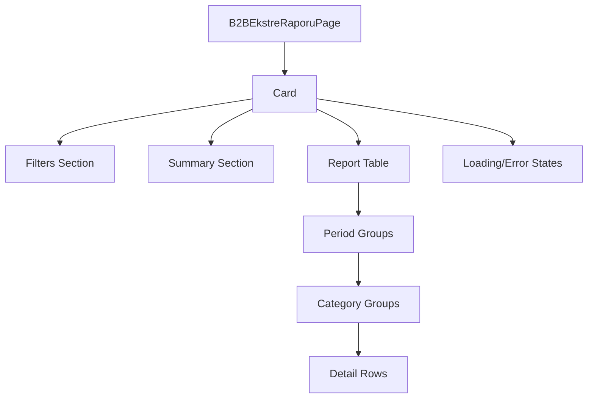

# B2B Ekstre Rapor Design Document

## 1. Overview

The B2B Ekstre Rapor (B2B Statement Report) is a new reporting feature that will be added to the SilverCloud system under the "Rapor" (Report) menu. This report will follow the same design, filters, methods, and format as the existing "Fatura Rapor" (Invoice Report) screen, providing users with a comprehensive view of B2B statement transactions grouped by period and category.

### 1.1 Purpose
The purpose of this document is to outline the design and implementation approach for the B2B Ekstre Rapor feature, ensuring consistency with existing reporting patterns in the system.

### 1.2 Scope
This document covers:
- Frontend component design and implementation
- Backend API endpoint design
- Data model structure
- Integration with existing reporting architecture
- UI/UX consistency with existing reports

### 1.3 Key Features
- Multi-period filtering with dynamic period calculation
- Category-based grouping with expandable sections
- Summary information display
- PDF and Excel export functionality
- Responsive design following existing patterns
- Permission-based access control

## 2. Architecture

### 2.1 System Context
The B2B Ekstre Rapor will be integrated into the existing SilverCloud system architecture, following the same patterns as other reports in the system.

### 2.2 Component Architecture
```
┌─────────────────────────────────────────────────────────────┐
│                    Frontend (React/TypeScript)             │
├─────────────────────────────────────────────────────────────┤
│  B2BEkstreRaporuPage Component                              │
│  ├── Filters (Period, Category)                            │
│  ├── Summary Section                                       │
│  ├── Expandable Period Groups                              │
│  ├── Expandable Category Groups                            │
│  └── Detail Rows                                           │
├─────────────────────────────────────────────────────────────┤
│  API Client                                                │
│  └── /api/v1/b2b-ekstre-rapor/                            │
└─────────────────────────────────────────────────────────────┘
                                │
┌─────────────────────────────────────────────────────────────┐
│                    Backend (Python/FastAPI)                │
├─────────────────────────────────────────────────────────────┤
│  b2b_ekstre_rapor Endpoint                                 │
│  ├── Request Validation                                    │
│  ├── Data Retrieval (CRUD)                                 │
│  ├── Data Processing & Grouping                           │
│  └── Response Formatting                                   │
├─────────────────────────────────────────────────────────────┤
│  Database Layer                                            │
│  └── B2B_Ekstre Table                                      │
└─────────────────────────────────────────────────────────────┘
```

## 3. Frontend Design

### 3.1 Component Structure
The B2B Ekstre Rapor will follow the same component structure as the Fatura RaporuPage:
- Main page component: `B2BEkstreRaporuPage`
- Filter section with multi-select components
- Summary section showing key metrics
- Expandable table structure with period and category grouping
- Detail rows for individual transactions

### 3.2 Component Hierarchy


### 3.2 UI Components

#### 3.2.1 Filters
The report will include the same filter components as the Fatura Rapor:
- Period multi-select filter (4-column responsive grid)
- Category multi-select filter
- Filter action buttons (Apply, Clear)

Filters will dynamically calculate available periods from actual data rather than using static options, following the established pattern in the system.

#### 3.2.2 Summary Section
A summary section will display:
- Total record count
- Period count
- Grand total amount

#### 3.2.3 Report Table
The main report table will have an expandable structure:
- Period groups (expandable)
- Category groups within periods (expandable)
- Detail rows for individual B2B statements

### 3.3 State Management
The component will manage the following state:
- Report data
- Loading state
- Error state
- Filter selections
- Expanded groups (periods and categories)

The state management will follow the same pattern as `FaturaRaporuPage`:
```typescript
const [reportData, setReportData] = useState<B2BEkstreRaporResponse | null>(null);
const [loading, setLoading] = useState<boolean>(false);
const [error, setError] = useState<string | null>(null);
const [selectedDonemler, setSelectedDonemler] = useState<number[]>([]);
const [selectedKategoriler, setSelectedKategoriler] = useState<number[]>([]);
const [availableKategoriler, setAvailableKategoriler] = useState<Kategori[]>([]);
const [expandedDonemler, setExpandedDonemler] = useState<Set<number>>(new Set());
const [expandedKategoriler, setExpandedKategoriler] = useState<Set<string>>(new Set());
```

### 3.4 Data Flow
1. User selects filters and clicks "Filtrele"
2. Component makes API request with filter parameters
3. Backend processes and returns grouped report data
4. Component displays data in expandable table format
5. User can export to PDF or Excel

### 3.5 Export Functionality
The report will include the same export functionality as other reports:
- PDF export using `html2canvas` and `jsPDF`
- Excel export using `xlsx` library

Export functions will follow the same pattern as in `FaturaRaporuPage`:
- `generateB2BEkstreRaporuPdf` for PDF generation
- `handleExportToExcel` for Excel export

## 4. Backend Design

### 4.1 API Endpoint
A new endpoint will be created for the B2B Ekstre Rapor:
```
GET /api/v1/b2b-ekstre-rapor/
Query Parameters:
- donem: Optional[List[int]] (periods in YYMM format)
- kategori: Optional[List[int]] (category IDs)
- sube_id: Optional[int] (branch ID)
```

This endpoint will follow the same pattern as existing report endpoints in `report.py`.

### 4.2 Response Schema
The response will follow the same structure as other reports, similar to the existing `FaturaRaporResponse`:
```typescript
interface B2BEkstreRaporResponse {
  data: B2BEkstreDonemGroup[];
  totals: B2BEkstreRaporTotals;
  filters_applied: B2BEkstreRaporRequest;
  total_records: number;
}

interface B2BEkstreDonemGroup {
  donem: number;
  donem_total: number;
  record_count: number;
  kategoriler: B2BEkstreKategoriGroup[];
}

interface B2BEkstreKategoriGroup {
  kategori_id: number | null;
  kategori_adi: string;
  kategori_total: number;
  record_count: number;
  kayitlar: B2BEkstreDetail[];
}

interface B2BEkstreDetail {
  ekstre_id: number;
  tarih: string;
  fis_no: string;
  aciklama: string;
  borc: number;
  alacak: number;
  // Tutar will be calculated as (Alacak - Borc) for display purposes
  tutar: number;
  fis_turu?: string;
  fatura_no?: string;
}

interface B2BEkstreRaporTotals {
  donem_totals: { [donem: number]: number };
  kategori_totals: { [kategori_id: string]: number };
  grand_total: number;
}

interface B2BEkstreRaporRequest {
  donem?: number[];
  kategori?: number[];
  sube_id?: number;
}
```

### 4.3 Data Processing
The backend will follow the same pattern as existing report CRUD functions:
1. Retrieve B2B Ekstre records based on filters
2. Group records by period and category
3. Calculate totals for each group
4. Format data according to the response schema
5. Handle period format conversion (YYMM to YYYYMM if needed)
6. Join with Kategori table to get category names
7. Order results by period and category

The CRUD function will be implemented in `backend/db/crud.py` following the pattern of `get_fatura_rapor` and `get_odeme_rapor` functions.

## 5. Data Model

### 5.1 B2B Ekstre Table
The report will use data from the existing `B2B_Ekstre` table:
```sql
CREATE TABLE B2B_Ekstre (
  Ekstre_ID INTEGER PRIMARY KEY,
  Tarih DATE NOT NULL,
  Fis_No VARCHAR(50) NOT NULL,
  Fis_Turu VARCHAR(50),
  Aciklama TEXT,
  Borc DECIMAL(15,2) DEFAULT 0.00,
  Alacak DECIMAL(15,2) DEFAULT 0.00,
  Toplam_Bakiye DECIMAL(15,2),
  Fatura_No VARCHAR(50),
  Fatura_Metni TEXT,
  Donem INTEGER NOT NULL,
  Kategori_ID INTEGER,
  Sube_ID INTEGER NOT NULL,
  Kayit_Tarihi DATETIME DEFAULT CURRENT_TIMESTAMP
);
```

### 5.2 B2B Ekstre Data Model (TypeScript)
Based on the existing `B2BEkstre` interface in `types.ts`:
```typescript
interface B2BEkstre {
  Ekstre_ID: number;
  Tarih: string; // DATE
  Fis_No: string; // VARCHAR(50)
  Fis_Turu?: string; // VARCHAR(50)
  Aciklama?: string; // TEXT
  Borc: number; // DECIMAL(15,2), DEFAULT 0
  Alacak: number; // DECIMAL(15,2), DEFAULT 0
  Toplam_Bakiye: number; // DECIMAL(15,2)
  Fatura_No?: string; // VARCHAR(50)
  Fatura_Metni?: string; // TEXT
  Donem: string; // INT(4) -> YYAA
  Kategori_ID: number | null;
  Sube_ID: number;
  Kayit_Tarihi: string; // TIMESTAMP
}
```

### 5.3 Related Tables
- `Kategori` table for category information
- `Sube` table for branch information

## 6. Integration Points

### 6.1 Menu Integration
The new report will be added to the "Rapor" menu group in `constants.tsx`:
```typescript
{
  title: 'Rapor',
  items: [
    // ... existing items
    { label: 'B2B Ekstre Raporu', path: '/b2b-ekstre-raporu', icon: Icons.Report, permission: B2B_EKSTRE_RAPOR_YETKI_ADI },
  ]
}
```

### 6.2 Permission System
A new permission constant will be added in `constants.tsx`:
```typescript
export const B2B_EKSTRE_RAPOR_YETKI_ADI = 'B2B Ekstre Rapor Görüntüleme';
```

This follows the naming pattern of existing report permissions like `FATURA_RAPOR_YETKI_ADI` and `ODEME_RAPOR_YETKI_ADI`.

### 6.3 Routing
A new route will be added in `App.tsx`:
```typescript
<Route path="/b2b-ekstre-raporu" element={<B2BEkstreRaporuPage />} />
```

The route will be imported similarly to other report pages:
```typescript
import { B2BEkstreRaporuPage } from './pages/B2BEkstreRaporu';
```

### 6.4 Type Definitions
New type definitions will be added to `types.ts`:
```typescript
interface B2BEkstreRaporRequest {
  donem?: number[];
  kategori?: number[];
  sube_id?: number;
}

interface B2BEkstreDetail {
  ekstre_id: number;
  tarih: string;
  fis_no: string;
  aciklama: string;
  borc: number;
  alacak: number;
  tutar: number;
  fis_turu?: string;
  fatura_no?: string;
}

interface B2BEkstreKategoriGroup {
  kategori_id: number | null;
  kategori_adi: string;
  kategori_total: number;
  record_count: number;
  kayitlar: B2BEkstreDetail[];
}

interface B2BEkstreDonemGroup {
  donem: number;
  donem_total: number;
  record_count: number;
  kategoriler: B2BEkstreKategoriGroup[];
}

interface B2BEkstreRaporTotals {
  donem_totals: { [donem: number]: number };
  kategori_totals: { [kategori_id: string]: number };
  grand_total: number;
}

interface B2BEkstreRaporResponse {
  data: B2BEkstreDonemGroup[];
  totals: B2BEkstreRaporTotals;
  filters_applied: B2BEkstreRaporRequest;
  total_records: number;
}
```

## 7. Implementation Plan

### 7.1 Backend Implementation
1. Create B2B Ekstre Rapor response schemas in `backend/schemas/b2b_ekstre_rapor.py` based on the existing `fatura_rapor.py` schema structure
2. Implement CRUD function for B2B Ekstre Rapor data processing in `backend/db/crud.py` following the pattern of `get_fatura_rapor` function
3. Create API endpoint in `backend/api/v1/endpoints/report.py` following the pattern of existing report endpoints
4. Add permission constant in `CopyCat/constants.tsx`
5. Register the new endpoint in `backend/main.py` if needed (might be automatically included)

The implementation will reuse existing patterns for:
- Period handling and validation
- Category grouping logic
- Data aggregation and totals calculation
- Error handling and logging

### 7.2 Frontend Implementation
1. Create `B2BEkstreRaporuPage` component based on `FaturaRaporuPage` in `CopyCat/pages/B2BEkstreRaporu.tsx`
2. Add route in `App.tsx`
3. Add menu item in `constants.tsx`
4. Add permission constant
5. Implement PDF and Excel export functionality following the existing patterns in `FaturaRaporuPage`
6. Add type definitions in `CopyCat/types.ts`
7. Export the new page component in `CopyCat/pages.tsx`

The implementation will reuse existing components and patterns for:
- Multi-select filter components
- Expandable row components
- Summary section display
- Loading and error states
- Export functionality
- Responsive grid layout

### 7.3 Testing
1. Unit tests for backend data processing functions in `crud.py`
2. UI component tests for `B2BEkstreRaporuPage` component
3. Integration tests for API endpoints
4. End-to-end tests for user workflows
5. Export functionality tests (PDF and Excel)
6. Permission-based access control tests
7. Filter and grouping functionality tests

Testing will follow the same patterns as existing report tests, such as those found in `test_odeme_rapor_api_integration.py` and other test files in the project.

## 8. Security Considerations
- Access control through existing permission system
- Data filtering by branch ID (user context)
- Input validation for all API parameters
- Proper error handling without exposing sensitive information

## 9. Error Handling and Validation

### 9.1 Input Validation
- Validate period format (YYMM or YYYYMM)
- Validate category IDs
- Validate branch ID
- Handle missing or invalid parameters gracefully

### 9.2 Error Responses
- Return appropriate HTTP status codes (400 for bad requests, 500 for server errors)
- Provide meaningful error messages for debugging
- Log errors for monitoring and troubleshooting

### 9.3 Frontend Error Handling
- Display user-friendly error messages
- Provide retry functionality
- Handle network errors gracefully
- Maintain UI state during errors

## 10. Performance Considerations
- Efficient database queries with proper indexing
- Pagination for large datasets
- Caching of frequently accessed data
- Optimized data processing algorithms
- Lazy loading for expandable sections
- Efficient grouping and aggregation algorithms