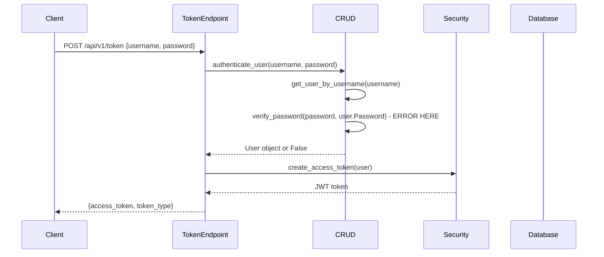
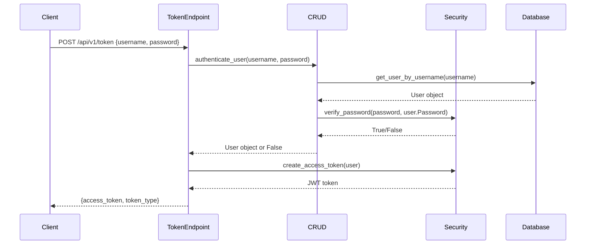

# Backend Authentication Error Fix

## 1. Overview

This document outlines the fix for a critical backend authentication error in the SilverCloud System. The error occurs when users attempt to authenticate via the `/api/v1/token` endpoint, resulting in a 500 Internal Server Error due to an undefined `verify_password` function.

### Problem Statement
```
NameError: name 'verify_password' is not defined
```

This error occurs in the `authenticate_user` function in `backend/db/crud.py` at line 13, where the function attempts to call `verify_password` without importing it.

### Root Cause
The `verify_password` and `get_password_hash` functions are defined in `backend/core/security.py` but are not imported in `backend/db/crud.py`. The CRUD module incorrectly assumes these functions are available in its scope.

## 2. Architecture

### Current Authentication Flow


### Fixed Authentication Flow


## 3. Solution Details

### 3.1 Fix Import Statement
The primary fix involves adding the proper import statement to `backend/db/crud.py` to import the required functions from the security module.

Current imports:
```python
from sqlalchemy.orm import Session
from passlib.context import CryptContext
from typing import List

from db import models
from schemas import sube, user, role, permission, kullanici_rol, rol_yetki, e_fatura, b2b_ekstre, diger_harcama, gelir, gelir_ekstra, stok, stok_fiyat, stok_sayim, calisan, puantaj_secimi, puantaj, avans_istek, ust_kategori, kategori, deger, e_fatura_referans, nakit, odeme, odeme_referans, pos_hareketleri
```

Required changes:
1. Add import statement for security functions:
   ```python
   from core.security import verify_password, get_password_hash
   ```
2. Remove unused `CryptContext` import and initialization since these functions are already provided by the security module:
   ```python
   # Remove these lines:
   from passlib.context import CryptContext
   pwd_context = CryptContext(schemes=["bcrypt"], deprecated="auto")
   ```

### 3.2 Update Import Section
The complete import section in `backend/db/crud.py` should look like this after the fix:

```python
from sqlalchemy.orm import Session
from typing import List

from db import models
from schemas import sube, user, role, permission, kullanici_rol, rol_yetki, e_fatura, b2b_ekstre, diger_harcama, gelir, gelir_ekstra, stok, stok_fiyat, stok_sayim, calisan, puantaj_secimi, puantaj, avans_istek, ust_kategori, kategori, deger, e_fatura_referans, nakit, odeme, odeme_referans, pos_hareketleri
from core.security import verify_password, get_password_hash
```

## 4. Implementation Plan

### 4.1 Modify backend/db/crud.py
1. Add import statement for security functions:
   ```python
   from core.security import verify_password, get_password_hash
   ```
2. Remove unused imports and initialization:
   ```python
   # Remove these lines:
   from passlib.context import CryptContext
   pwd_context = CryptContext(schemes=["bcrypt"], deprecated="auto")
   ```

### 4.2 Test the Fix
1. Verify that the import resolves the NameError
2. Test authentication flow with valid credentials
3. Test authentication flow with invalid credentials
4. Verify that password hashing still works for new user creation

## 5. Data Models & ORM Mapping

No changes required to data models. The fix is purely in the authentication logic layer.

## 6. Business Logic Layer

### 6.1 Authentication Function
The `authenticate_user` function in `db/crud.py` will now properly reference the `verify_password` function from the security module.

Current implementation:
```python
def authenticate_user(db: Session, username: str, password: str):
    user = get_user_by_username(db, username)
    if not user:
        return False
    if not verify_password(password, user.Password):  # This line causes NameError
        return False
    return user
```

This implementation will work correctly after adding the import statement.

### 6.2 Password Hashing
The `create_user` and `update_user` functions in `db/crud.py` use `get_password_hash` which also needs to be imported from the security module.

## 7. Testing

### 7.1 Unit Tests
1. Test `authenticate_user` with valid credentials
2. Test `authenticate_user` with invalid credentials
3. Test `create_user` to ensure password hashing still works
4. Test `update_user` with password change

### 7.2 Integration Tests
1. Test complete authentication flow via `/api/v1/token` endpoint
2. Test token usage for protected endpoints

## 8. Security Considerations

This fix does not introduce any new security concerns. It simply resolves a broken reference to existing security functions. The authentication mechanism remains unchanged:
- Passwords are still properly hashed using bcrypt
- JWT tokens are still used for session management
- All existing security measures remain intact

## 9. Deployment

### 9.1 Changes Summary
1. Add import statement to `backend/db/crud.py`:
   ```python
   from core.security import verify_password, get_password_hash
   ```
2. Remove unused imports and initialization:
   ```python
   # Remove these lines:
   from passlib.context import CryptContext
   pwd_context = CryptContext(schemes=["bcrypt"], deprecated="auto")
   ```

### 9.2 Rollback Plan
If issues occur after deployment:
1. Revert the changes to `backend/db/crud.py`
2. Restore the original import statements
3. Restore the `CryptContext` import and initialization if needed

### 9.3 Verification
After deployment, verify that:
1. Users can authenticate successfully via `/api/v1/token`
2. Invalid credentials are properly rejected
3. New user creation still works correctly
4. Password updates function as expected