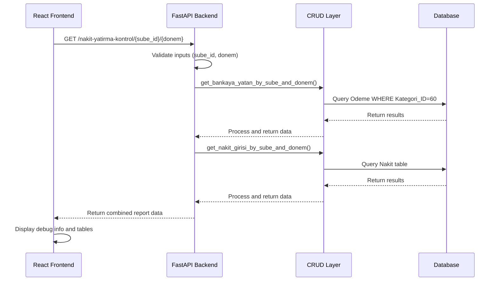
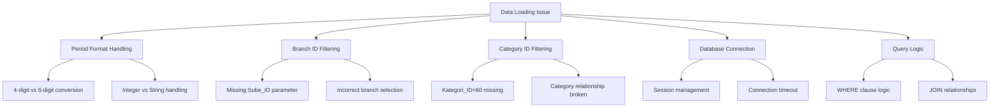
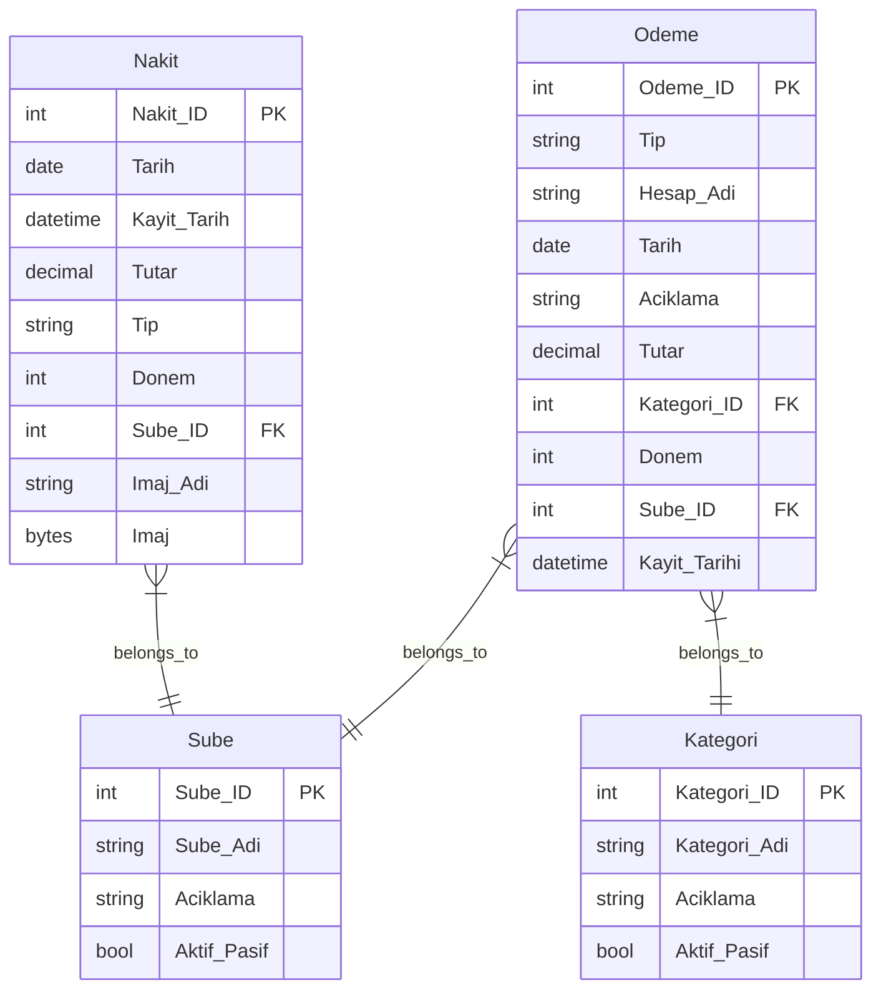
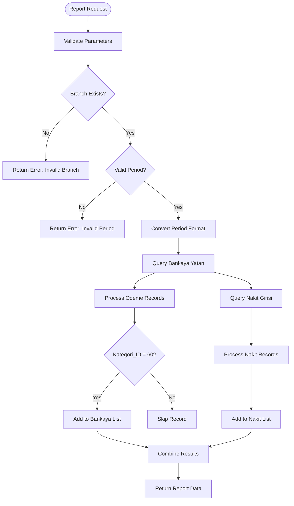
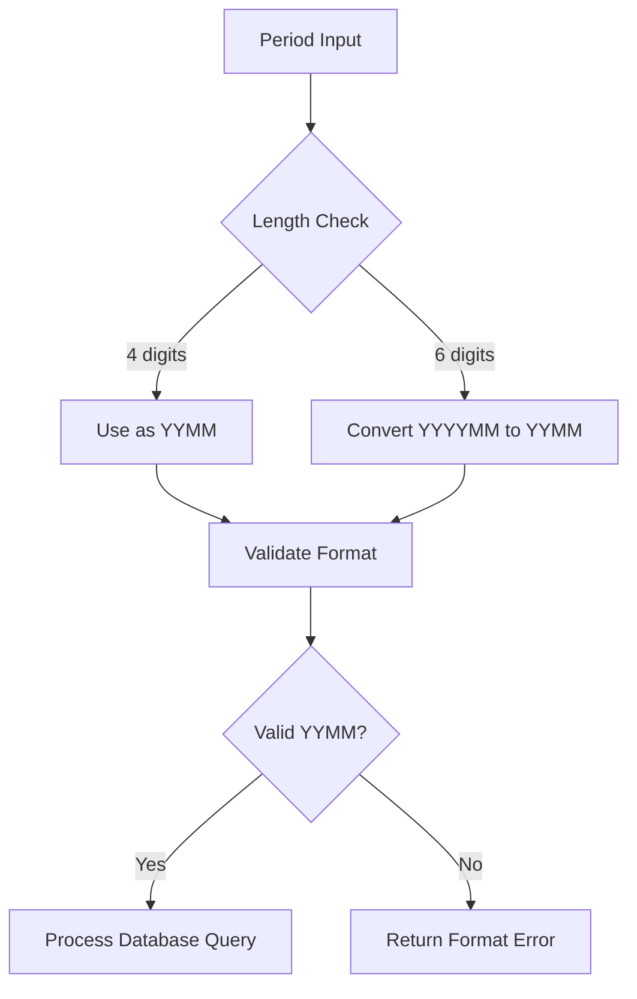
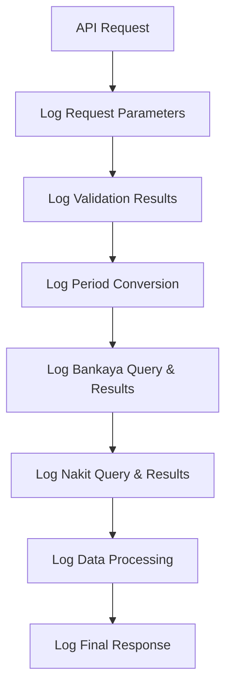
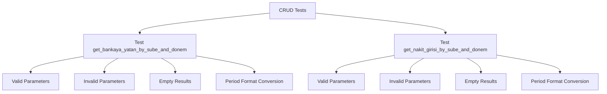
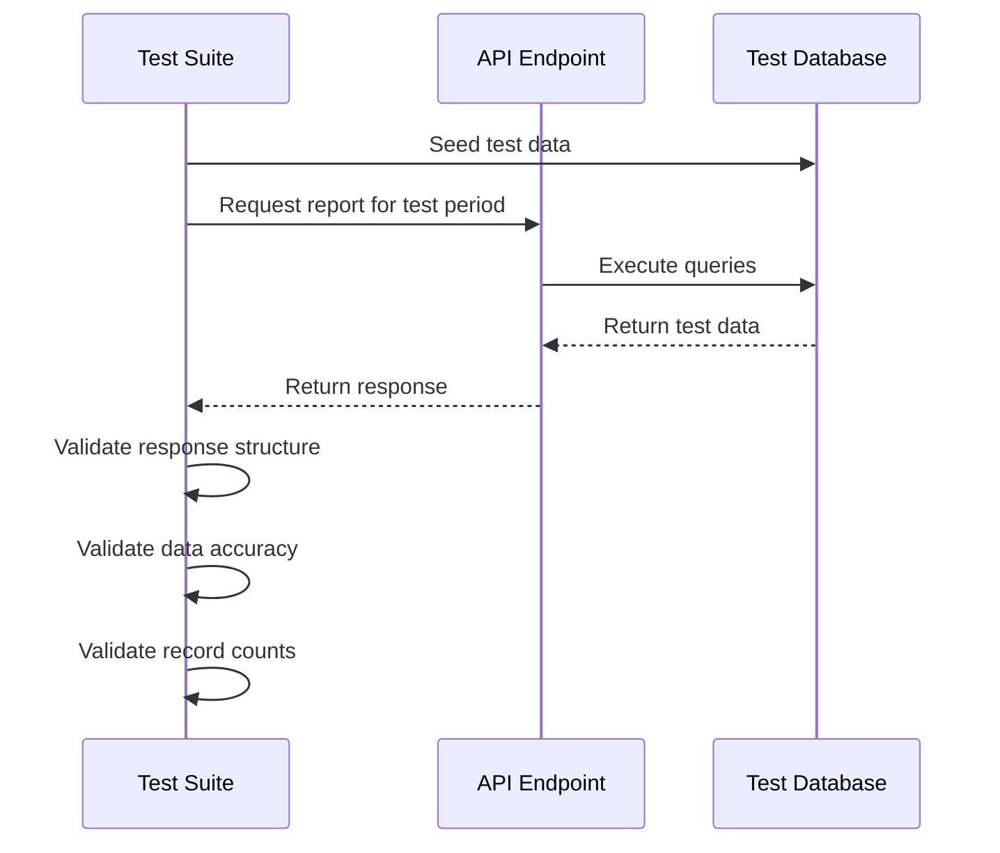
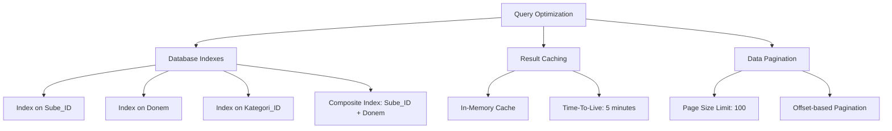
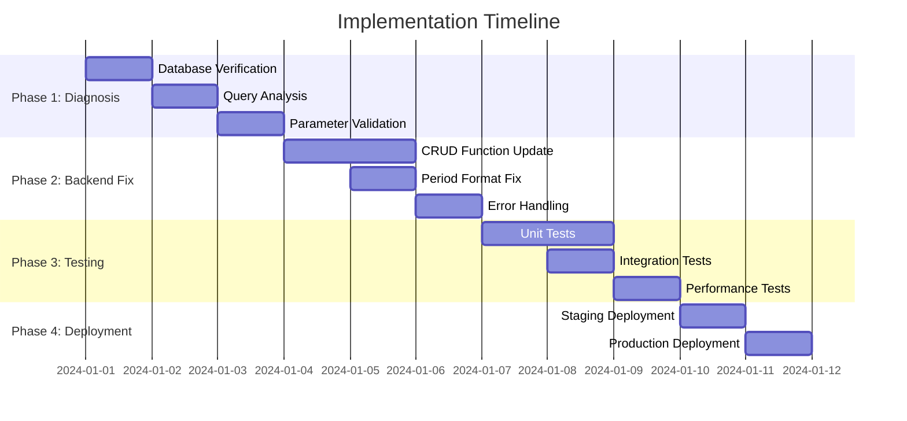

# Cash Deposit Control Report Data Loading Fix

## Overview

The "Nakit Yatırma Kontrol Raporu" (Cash Deposit Control Report) is currently displaying incorrect data counts, showing "Debug: Data loaded - Bankaya Yatan: 0 records, Nakit Girişi: 0 records" despite the database containing actual records. Manual SQL queries confirm the existence of 10 records in the Nakit table and 20 records in the Odeme table for period 2508, but the application's API endpoints are returning empty results.

**Current Problem:**
- Frontend displays: "Bankaya Yatan: 0 records, Nakit Girişi: 0 records"
- Database reality: `SELECT * FROM SilverCloud.Nakit WHERE Donem=2508` returns 10 records
- Database reality: `SELECT * FROM SilverCloud.Odeme WHERE Donem=2508` returns 20 records

**Root Cause:**
The data loading issue stems from potential inconsistencies in period format handling, missing foreign key relationships, incorrect filtering criteria, or database connection problems in the backend CRUD operations.

## Architecture

### Current Data Flow


### Problem Areas Identified


## Data Models & Database Schema

### Current Database Structure


### Data Validation Requirements
- **Donem Format**: Both tables store period as INTEGER in YYMM format (e.g., 2508)
- **Sube_ID**: Must be valid foreign key reference to Sube table
- **Kategori_ID**: For "Bankaya Yatan" records, must equal 60
- **Tutar**: Must be positive decimal values

## Business Logic Layer

### Report Generation Logic


### Period Format Conversion Logic


## API Endpoints Reference

### Cash Deposit Control Report Endpoint

#### GET /api/v1/nakit-yatirma-kontrol/{sube_id}/{donem}

**Description**: Retrieves cash deposit control report data for specific branch and period

**Path Parameters:**
- `sube_id` (integer): Branch identifier (must be > 0)
- `donem` (integer): Period in YYMM or YYYYMM format

**Response Schema:**
```json
{
  "bankaya_yatan": [
    {
      "Tarih": "2025-08-15",
      "Donem": 2508,
      "Tutar": 1500.00
    }
  ],
  "nakit_girisi": [
    {
      "Tarih": "2025-08-15", 
      "Donem": 2508,
      "Tutar": 1500.00
    }
  ]
}
```

**Error Responses:**
- `400 Bad Request`: Invalid sube_id or donem format
- `404 Not Found`: No data found for specified criteria
- `500 Internal Server Error`: Database or processing error

### Debugging and Diagnostics

#### Enhanced Logging Strategy


## Testing Strategy

### Unit Testing Requirements

#### Backend CRUD Function Tests


#### Test Data Requirements
- **Sube Records**: At least 2 test branches with different IDs
- **Kategori Records**: Ensure Kategori_ID=60 exists for "Bankaya Yatan"
- **Period Data**: Test data for periods 2508, 2507, 202508
- **Nakit Records**: 5-10 test records per period/branch combination
- **Odeme Records**: 10-15 test records with mixed Kategori_ID values

### Integration Testing


## Performance Considerations

### Database Query Optimization


### Response Time Targets
- **API Response Time**: < 2 seconds for standard queries
- **Database Query Time**: < 500ms per CRUD operation
- **Frontend Rendering**: < 1 second for data display

## Implementation Plan

### Phase 1: Diagnosis and Debugging


### Verification Steps
1. **Database Connectivity**: Verify database connection and table existence
2. **Data Existence**: Confirm test data exists for period 2508
3. **Query Execution**: Test raw SQL queries independently
4. **Parameter Passing**: Verify sube_id and donem parameters reach CRUD functions
5. **Period Conversion**: Test 4-digit vs 6-digit period format handling
6. **Category Filtering**: Ensure Kategori_ID=60 filter works correctly
7. **Data Processing**: Verify ReportDataItem object creation
8. **Response Formation**: Check final API response structure

### Success Criteria
- **Data Retrieval**: API returns actual record counts matching database
- **Frontend Display**: Report shows non-zero record counts in debug info
- **Data Accuracy**: Retrieved data matches database content exactly
- **Error Handling**: Appropriate error messages for invalid inputs
- **Performance**: Response time under 2 seconds for typical queries
- **Logging**: Comprehensive logs for debugging and monitoring

This design document provides a comprehensive approach to diagnosing and fixing the cash deposit control report data loading issue, ensuring reliable data retrieval and display in the application.