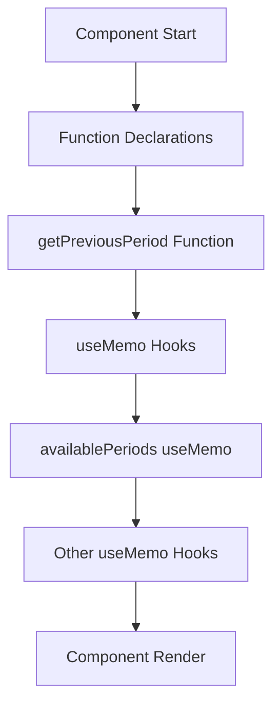

# Cash Deposit Report Fix Design

## Overview

This design document addresses the JavaScript Temporal Dead Zone (TDZ) error occurring in the Nakit Yatırma Raporu (Cash Deposit Report) screen of the SilverCloud System. The error prevents the report page from loading and displays a blank screen with a console error.

## Problem Analysis

### Current Issue
The application throws a runtime error: `Cannot access 'getPreviousPeriod' before initialization` in `NakitYatirmaRaporu.tsx` at line 56. This occurs because:

1. The `getPreviousPeriod` function is called inside the `availablePeriods` useMemo hook (line 51)
2. The function is defined later in the component (line 56)
3. JavaScript's Temporal Dead Zone prevents accessing variables/functions before their declaration

### Root Cause
```typescript
// Line 47-56: useMemo is calling getPreviousPeriod
const availablePeriods = useMemo(() => {
    const periods = new Set<string>();
    periods.add(currentPeriod);
    let tempPeriod = currentPeriod;
    for (let i = 0; i < 12; i++) {
        const prevPeriod = getPreviousPeriod(tempPeriod); // ❌ Called before declaration
        periods.add(prevPeriod);
        tempPeriod = prevPeriod;
    }
    return Array.from(periods).sort((a,b) => b.localeCompare(a));
}, [currentPeriod]);

// Line 56-67: Function definition comes after usage
const getPreviousPeriod = (periodYYAA: string): string => {
    // Function implementation
};
```

## Solution Architecture

### Approach 1: Function Hoisting (Recommended)
Move the `getPreviousPeriod` function declaration before its usage in the `availablePeriods` useMemo.

### Approach 2: Import from Utility Module
Export the `getPreviousPeriod` function from `components.tsx` and import it into `NakitYatirmaRaporu.tsx`.

### Approach 3: Inline Implementation
Define the function directly within the useMemo callback.

## Implementation Design

### Selected Solution: Function Hoisting



### Code Structure Changes

1. **Move Function Declaration Before Usage**
   - Relocate `getPreviousPeriod` function to line 27 (after initial state declarations)
   - Ensure it's declared before the `availablePeriods` useMemo

2. **Maintain Function Signature**
   - Keep the same function signature and implementation
   - No changes to function logic required

3. **Preserve Existing Logic**
   - All existing functionality remains intact
   - No changes to period calculation algorithm

### Modified Component Structure

```typescript
export const NakitYatirmaRaporuPage: React.FC = () => {
    // State declarations
    const { selectedBranch, currentPeriod } = useAppContext();
    const [reportData, setReportData] = useState<NakitYatirmaRaporuData | null>(null);
    const [loading, setLoading] = useState<boolean>(true);
    const [selectedPeriod, setSelectedPeriod] = useState(currentPeriod);

    // ✅ Function declaration moved here (before usage)
    const getPreviousPeriod = (periodYYAA: string): string => {
        if (!periodYYAA || periodYYAA.length !== 4) return periodYYAA;
        let year = 2000 + parseInt(periodYYAA.substring(0, 2));
        let month = parseInt(periodYYAA.substring(2, 4));

        month--;
        if (month === 0) {
            month = 12;
            year--;
        }
        return `${(year % 100).toString().padStart(2, '0')}${month.toString().padStart(2, '0')}`;
    };

    // Effects and hooks
    useEffect(() => {
        // Existing fetch logic
    }, [selectedBranch, selectedPeriod]);

    // ✅ Now availablePeriods can safely call getPreviousPeriod
    const availablePeriods = useMemo(() => {
        const periods = new Set<string>();
        periods.add(currentPeriod);
        let tempPeriod = currentPeriod;
        for (let i = 0; i < 12; i++) {
            const prevPeriod = getPreviousPeriod(tempPeriod);
            periods.add(prevPeriod);
            tempPeriod = prevPeriod;
        }
        return Array.from(periods).sort((a,b) => b.localeCompare(a));
    }, [currentPeriod]);

    // Other useMemo hooks...
    // Component render logic...
};
```

## Testing Strategy

### Unit Testing
1. **Function Declaration Order Test**
   - Verify `getPreviousPeriod` is accessible when `availablePeriods` is computed
   - Test period calculation accuracy

2. **Component Mounting Test**
   - Ensure component mounts without errors
   - Verify initial state is properly set

3. **Period Generation Test**
   - Test `availablePeriods` generates correct period list
   - Verify 12 months of periods are created

### Integration Testing
1. **Page Load Test**
   - Navigate to `/nakit-yatirma-raporu` route
   - Verify page loads without console errors
   - Check that period dropdown is populated

2. **Data Fetching Test**
   - Mock API response for report data
   - Verify data is properly displayed in tables
   - Test period selection functionality

### Browser Compatibility
- Test in Chrome, Firefox, Safari, Edge
- Verify no JavaScript errors in any browser
- Confirm consistent behavior across browsers

## Risk Assessment

### Low Risk
- **Code Change Scope**: Minimal - only moving function declaration
- **Functionality Impact**: None - no logic changes
- **Backward Compatibility**: Maintained

### Risk Mitigation
- **Thorough Testing**: Test all period-related functionality
- **Code Review**: Verify function order in all similar components
- **Monitoring**: Watch for console errors post-deployment

## Deployment Strategy

### Development
1. Apply function reordering fix
2. Test locally with different period selections
3. Verify console is error-free

### Staging
1. Deploy to staging environment
2. Perform end-to-end testing
3. Validate report generation for multiple branches

### Production
1. Deploy during low-traffic period
2. Monitor error logs and user feedback
3. Have rollback plan ready if issues arise

## Alternative Solutions Considered

### Option 1: Export from Components (Not Selected)
**Pros**: Centralizes utility functions
**Cons**: Requires additional import changes, increases coupling

### Option 2: useCallback Hook (Not Selected)
**Pros**: Optimizes re-renders
**Cons**: Unnecessary complexity for this scenario

### Option 3: Inline Function (Not Selected)
**Pros**: Keeps logic close to usage
**Cons**: Reduces code readability and reusability

## Future Improvements

### Code Organization
1. **Utility Module**: Create dedicated utility module for date/period functions
2. **Type Safety**: Add stricter TypeScript types for period format validation
3. **Error Handling**: Add comprehensive error handling for invalid periods

### Performance Optimization
1. **Memoization**: Consider memoizing period calculations for frequently accessed periods
2. **Lazy Loading**: Implement lazy loading for large period datasets

## Implementation Checklist

- [ ] Move `getPreviousPeriod` function before `availablePeriods` useMemo
- [ ] Test component mounting without errors
- [ ] Verify period dropdown functionality
- [ ] Test report data fetching and display
- [ ] Validate period selection changes
- [ ] Check browser console for any remaining errors
- [ ] Perform cross-browser testing
- [ ] Update unit tests if necessary
- [ ] Document the fix in code comments