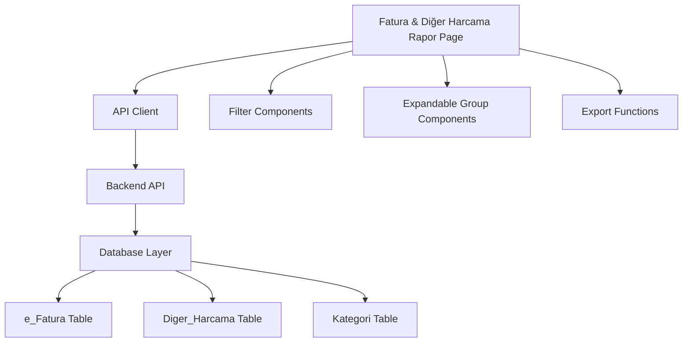
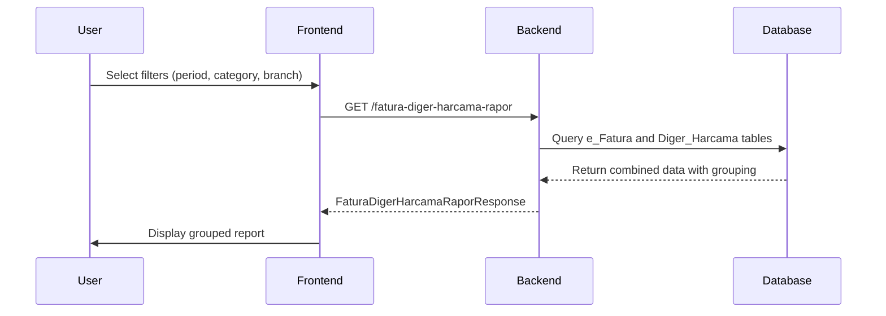
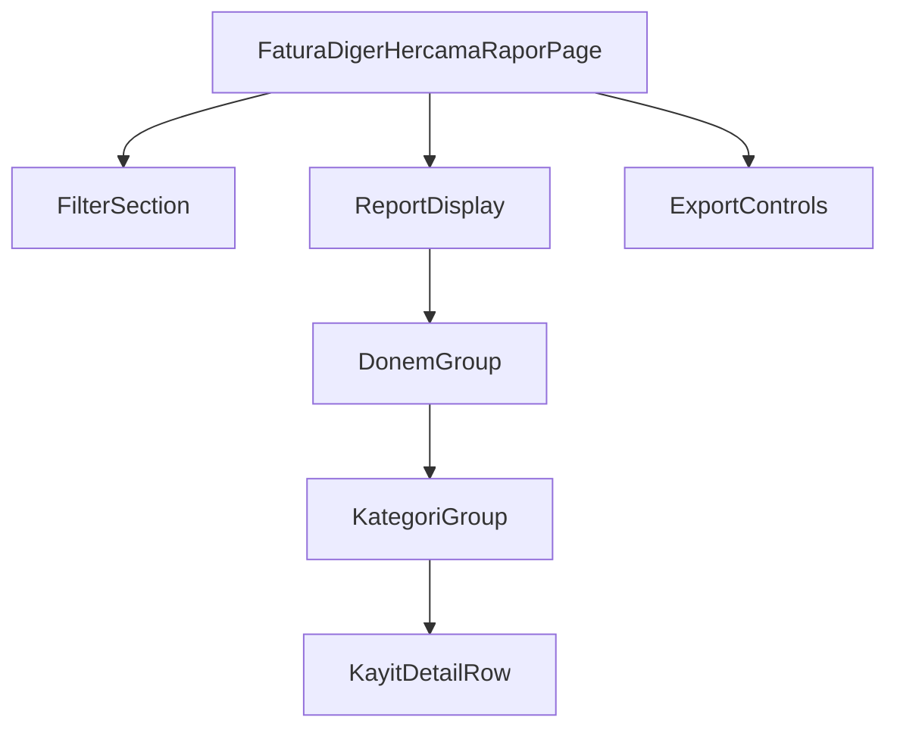

# Fatura & Diğer Harcama Raporu Design Document

## 1. Overview

This document outlines the design for a new report feature called "Fatura & Diğer Harcama Raporu" which combines the existing "Fatura Raporu" with records from the "Diger_Harcama" table. The new report will display both e-Fatura records and other expense records in the same format and grouping structure, with appropriate tagging to distinguish between the two types of records.

### 1.1 Purpose
- Create a unified report that displays both e-Fatura and Diger_Harcama records
- Maintain the same UI structure and functionality as the existing Fatura Raporu
- Tag records appropriately: "Gelen Fatura", "Giden Fatura" for invoices and "Diğer Harcama" for expense records

### 1.2 Scope
- Backend: New API endpoint to fetch combined data
- Frontend: New page component based on existing FaturaRaporu.tsx
- Database: No schema changes required, utilizing existing tables

## 2. Architecture

### 2.1 Component Architecture



### 2.2 Data Flow



## 3. API Endpoints Reference

### 3.1 New Endpoint

**GET** `/api/v1/report/fatura-diger-harcama-rapor/`

#### Request Parameters
| Parameter | Type | Required | Description |
|-----------|------|----------|-------------|
| donem | array of integers | No | Periods to filter (e.g., [2508, 2509]) |
| kategori | array of integers | No | Category IDs to filter |
| sube_id | integer | Yes | Branch ID |

#### Response Schema
```json
{
  "data": [
    {
      "donem": 2508,
      "donem_total": 15000.00,
      "record_count": 25,
      "kategoriler": [
        {
          "kategori_id": 1,
          "kategori_adi": "Genel Giderler",
          "kategori_total": 7500.00,
          "record_count": 12,
          "kayitlar": [
            {
              "id": 101,
              "tarih": "2025-08-15",
              "belge_numarasi": "FAT202508001",
              "karsi_taraf_adi": "ABC Ltd. Şti.",
              "tutar": 1500.00,
              "aciklama": "Ofis kirası",
              "etiket": "Gelen Fatura",
              "gunluk_harcama": false,
              "ozel": false
            },
            {
              "id": 201,
              "tarih": "2025-08-16",
              "belge_numarasi": "DH202508001",
              "karsi_taraf_adi": "XYZ Market",
              "tutar": 250.00,
              "aciklama": "Temizlik malzemesi",
              "etiket": "Diğer Harcama",
              "gunluk_harcama": true,
              "ozel": false
            }
          ]
        }
      ]
    }
  ],
  "totals": {
    "donem_totals": {
      "2508": 15000.00
    },
    "kategori_totals": {
      "1": 7500.00
    },
    "grand_total": 15000.00
  },
  "filters_applied": {
    "donem": [2508],
    "kategori": [1],
    "sube_id": 5
  },
  "total_records": 25
}
```

### 3.2 Backend Implementation

The new endpoint will be added to the existing report router in `backend/api/v1/endpoints/report.py`:

```python
@router.get("/fatura-diger-harcama-rapor/", response_model=FaturaDigerHarcamaRaporResponse)
def get_fatura_diger_harcama_rapor(
    donem: Optional[List[int]] = Query(None),
    kategori: Optional[List[int]] = Query(None),
    sube_id: Optional[int] = None,
    db: Session = Depends(get_db)
):
    """
    Fatura & Diğer Harcama Rapor endpoint - comprehensive report combining e-Fatura and Diger_Harcama
    
    Args:
        donem: Optional list of periods (e.g., [2508, 2509])
        kategori: Optional list of category IDs
        sube_id: Branch ID filter
        
    Returns:
        FaturaDigerHarcamaRaporResponse: Grouped report data with totals
    """
    logger.info(f"Getting Fatura & Diğer Harcama Rapor for Sube_ID: {sube_id}, Donem: {donem}, Kategori: {kategori}")
    
    try:
        # Validate inputs
        if sube_id and sube_id <= 0:
            raise HTTPException(status_code=400, detail="Invalid sube_id")
        
        # Validate period format if provided
        if donem:
            for d in donem:
                donem_str = str(d)
                if d <= 0 or len(donem_str) not in [4, 6]:
                    raise HTTPException(
                        status_code=400, 
                        detail=f"Invalid donem format. Expected YYMM (4-digit) or YYYYMM (6-digit) format, got: {d}"
                    )
        
        # Get report data using the new comprehensive CRUD function
        report_data = crud.get_fatura_diger_harcama_rapor(
            db=db,
            donem_list=donem,
            kategori_list=kategori,
            sube_id=sube_id
        )
        
        logger.info(f"Successfully generated Fatura & Diğer Harcama report with {len(report_data.data)} period groups, {report_data.total_records} total records")
        return report_data
        
    except HTTPException:
        raise
    except Exception as e:
        logger.error(f"Error in get_fatura_diger_harcama_rapor: {e}")
        raise HTTPException(status_code=500, detail=f"Internal server error: {str(e)}")
```

## 4. Data Models

### 4.1 Backend Models

#### 4.1.1 Combined Report Schema
```python
class KayitDetail(BaseModel):
    """Unified record details for both EFatura and DigerHarcama"""
    id: int
    tarih: date
    belge_numarasi: str
    karsi_taraf_adi: str
    tutar: Decimal
    aciklama: Optional[str] = None
    etiket: str  # "Gelen Fatura", "Giden Fatura", or "Diğer Harcama"
    gunluk_harcama: Optional[bool] = None
    ozel: Optional[bool] = None
    
    class Config:
        from_attributes = True

class KategoriGroup(BaseModel):
    """Category group within a period"""
    kategori_id: Optional[int]
    kategori_adi: str
    kategori_total: Decimal
    record_count: int
    kayitlar: List[KayitDetail]

class DonemGroup(BaseModel):
    """Period group containing categories"""
    donem: int
    donem_total: Decimal
    record_count: int
    kategoriler: List[KategoriGroup]

class FaturaDigerHarcamaRaporTotals(BaseModel):
    """Summary totals for the combined report"""
    donem_totals: Dict[int, Decimal]
    kategori_totals: Dict[str, Decimal]
    grand_total: Decimal

class FaturaDigerHarcamaRaporResponse(BaseModel):
    """Complete response schema for combined report"""
    data: List[DonemGroup]
    totals: FaturaDigerHarcamaRaporTotals
    filters_applied: FaturaRaporRequest
    total_records: int
    
    class Config:
        from_attributes = True
```

### 4.2 New Schema File

A new schema file `backend/schemas/fatura_diger_harcama_rapor.py` will be created:

```python
from pydantic import BaseModel
from typing import List, Optional, Dict
from datetime import date
from decimal import Decimal

# Reuse existing FaturaRaporRequest for consistency
from schemas.fatura_rapor import FaturaRaporRequest

class KayitDetail(BaseModel):
    """Unified record details for both EFatura and DigerHarcama"""
    id: int
    tarih: date
    belge_numarasi: str
    karsi_taraf_adi: str
    tutar: Decimal
    aciklama: Optional[str] = None
    etiket: str  # "Gelen Fatura", "Giden Fatura", or "Diğer Harcama"
    gunluk_harcama: Optional[bool] = None
    ozel: Optional[bool] = None
    
    class Config:
        from_attributes = True

class KategoriGroup(BaseModel):
    """Category group within a period"""
    kategori_id: Optional[int]
    kategori_adi: str
    kategori_total: Decimal
    record_count: int
    kayitlar: List[KayitDetail]

class DonemGroup(BaseModel):
    """Period group containing categories"""
    donem: int
    donem_total: Decimal
    record_count: int
    kategoriler: List[KategoriGroup]

class FaturaDigerHarcamaRaporTotals(BaseModel):
    """Summary totals for the combined report"""
    donem_totals: Dict[int, Decimal]
    kategori_totals: Dict[str, Decimal]
    grand_total: Decimal

class FaturaDigerHarcamaRaporResponse(BaseModel):
    """Complete response schema for combined report"""
    data: List[DonemGroup]
    totals: FaturaDigerHarcamaRaporTotals
    filters_applied: FaturaRaporRequest
    total_records: int
    
    class Config:
        from_attributes = True
```

### 4.3 Database Models Mapping

| EFatura Field | DigerHarcama Field | KayitDetail Field | Notes |
|---------------|-------------------|-------------------|-------|
| Fatura_ID | Harcama_ID | id | Primary key |
| Fatura_Tarihi | Belge_Tarihi | tarih | Record date |
| Fatura_Numarasi | Belge_Numarasi | belge_numarasi | Document number |
| Alici_Unvani | Alici_Adi | karsi_taraf_adi | Counterparty name |
| Tutar | Tutar | tutar | Amount |
| Aciklama | Açıklama | aciklama | Description |
| Giden_Fatura | N/A | etiket | "Gelen Fatura" or "Giden Fatura" |
| Gunluk_Harcama | Gunluk_Harcama | gunluk_harcama | Daily expense flag |
| Ozel | N/A | ozel | Special/private flag |

## 5. Business Logic Layer

### 5.1 Data Aggregation Logic

The new report will combine data from both the `e_Fatura` and `Diger_Harcama` tables:

1. **Data Retrieval**:
   - Fetch EFatura records with filters applied
   - Fetch DigerHarcama records with same filters
   - Join with Kategori table for category names

2. **Record Transformation**:
   - Transform EFatura records:
     - Set `etiket` as "Gelen Fatura" or "Giden Fatura" based on `Giden_Fatura` field
   - Transform DigerHarcama records:
     - Set `etiket` as "Diğer Harcama"
     - Map fields appropriately

3. **Grouping**:
   - Group by Donem (period)
   - Within each period, group by Kategori_ID
   - Sort by date descending within each category

4. **Totals Calculation**:
   - Calculate category totals
   - Calculate period totals
   - Calculate grand total

### 5.2 New CRUD Function Implementation

```python
def get_fatura_diger_harcama_rapor(
    db: Session, 
    donem_list: Optional[List[int]] = None, 
    kategori_list: Optional[List[int]] = None, 
    sube_id: Optional[int] = None
):
    """
    Get comprehensive report combining EFatura and DigerHarcama records with grouping
    """
    import logging
    from collections import defaultdict
    from decimal import Decimal
    from sqlalchemy import or_
    from schemas.fatura_diger_harcama_rapor import (
        FaturaDigerHarcamaRaporResponse, 
        DonemGroup, 
        KategoriGroup, 
        KayitDetail, 
        FaturaDigerHarcamaRaporTotals, 
        FaturaRaporRequest
    )
    
    logger = logging.getLogger(__name__)
    
    try:
        # Build EFatura query
        efatura_query = db.query(models.EFatura)
        
        # Build DigerHarcama query
        diger_harcama_query = db.query(models.DigerHarcama)
        
        # Apply common filters
        if sube_id:
            efatura_query = efatura_query.filter(models.EFatura.Sube_ID == sube_id)
            diger_harcama_query = diger_harcama_query.filter(models.DigerHarcama.Sube_ID == sube_id)
            
        if donem_list:
            # Handle period format conversion if needed
            converted_donem_list = []
            for donem in donem_list:
                if len(str(donem)) == 6:
                    converted_donem_list.append(donem - 200000)  # Convert 202508 to 2508
                else:
                    converted_donem_list.append(donem)
            efatura_query = efatura_query.filter(models.EFatura.Donem.in_(converted_donem_list))
            diger_harcama_query = diger_harcama_query.filter(models.DigerHarcama.Donem.in_(converted_donem_list))
            
        if kategori_list:
            # Include specified categories or uncategorized if requested
            if -1 in kategori_list:  # -1 represents uncategorized
                kategori_list_clean = [k for k in kategori_list if k != -1]
                if kategori_list_clean:
                    efatura_query = efatura_query.filter(
                        or_(
                            models.EFatura.Kategori_ID.in_(kategori_list_clean),
                            models.EFatura.Kategori_ID.is_(None)
                        )
                    )
                    diger_harcama_query = diger_harcama_query.filter(
                        or_(
                            models.DigerHarcama.Kategori_ID.in_(kategori_list_clean),
                            models.DigerHarcama.Kategori_ID.is_(None)
                        )
                    )
                else:
                    efatura_query = efatura_query.filter(models.EFatura.Kategori_ID.is_(None))
                    diger_harcama_query = diger_harcama_query.filter(models.DigerHarcama.Kategori_ID.is_(None))
            else:
                efatura_query = efatura_query.filter(models.EFatura.Kategori_ID.in_(kategori_list))
                diger_harcama_query = diger_harcama_query.filter(models.DigerHarcama.Kategori_ID.in_(kategori_list))
        
        # Join with Kategori to get category names
        efatura_query = efatura_query.outerjoin(models.Kategori, models.EFatura.Kategori_ID == models.Kategori.Kategori_ID)
        diger_harcama_query = diger_harcama_query.outerjoin(models.Kategori, models.DigerHarcama.Kategori_ID == models.Kategori.Kategori_ID)
        
        # Order queries
        efatura_query = efatura_query.order_by(models.EFatura.Donem.desc(), models.EFatura.Kategori_ID, models.EFatura.Fatura_Tarihi.desc())
        diger_harcama_query = diger_harcama_query.order_by(models.DigerHarcama.Donem.desc(), models.DigerHarcama.Kategori_ID, models.DigerHarcama.Belge_Tarihi.desc())
        
        # Execute queries
        efatura_records = efatura_query.all()
        diger_harcama_records = diger_harcama_query.all()
        
        logger.info(f"Found {len(efatura_records)} EFatura and {len(diger_harcama_records)} DigerHarcama records for report")
        
        # Group data by Donem and Kategori
        donem_groups = defaultdict(lambda: {
            'donem_total': Decimal('0'),
            'record_count': 0,
            'kategoriler': defaultdict(lambda: {
                'kategori_adi': 'Kategorilendirilmemiş',
                'kategori_total': Decimal('0'),
                'record_count': 0,
                'kayitlar': []
            })
        })
        
        # Process EFatura records
        for record in efatura_records:
            donem = record.Donem
            kategori_id = record.Kategori_ID or 'uncategorized'
            kategori_adi = 'Kategorilendirilmemiş'
            
            # Get category name
            if record.Kategori_ID and hasattr(record, 'kategori') and record.kategori:
                kategori_adi = record.kategori.Kategori_Adi
            
            # Set category name
            donem_groups[donem]['kategoriler'][kategori_id]['kategori_adi'] = kategori_adi
            
            # Create detail record
            detail = KayitDetail(
                id=record.Fatura_ID,
                tarih=record.Fatura_Tarihi,
                belge_numarasi=record.Fatura_Numarasi,
                karsi_taraf_adi=record.Alici_Unvani,
                tutar=record.Tutar,
                aciklama=record.Aciklama,
                etiket="Giden Fatura" if record.Giden_Fatura else "Gelen Fatura",
                gunluk_harcama=record.Gunluk_Harcama,
                ozel=record.Ozel
            )
            
            # Add to collections
            donem_groups[donem]['kategoriler'][kategori_id]['kayitlar'].append(detail)
            donem_groups[donem]['kategoriler'][kategori_id]['kategori_total'] += record.Tutar
            donem_groups[donem]['kategoriler'][kategori_id]['record_count'] += 1
            donem_groups[donem]['donem_total'] += record.Tutar
            donem_groups[donem]['record_count'] += 1
        
        # Process DigerHarcama records
        for record in diger_harcama_records:
            donem = record.Donem
            kategori_id = record.Kategori_ID or 'uncategorized'
            kategori_adi = 'Kategorilendirilmemiş'
            
            # Get category name
            if record.Kategori_ID and hasattr(record, 'kategori') and record.kategori:
                kategori_adi = record.kategori.Kategori_Adi
            
            # Set category name
            donem_groups[donem]['kategoriler'][kategori_id]['kategori_adi'] = kategori_adi
            
            # Create detail record
            detail = KayitDetail(
                id=record.Harcama_ID,
                tarih=record.Belge_Tarihi,
                belge_numarasi=record.Belge_Numarasi or "",
                karsi_taraf_adi=record.Alici_Adi,
                tutar=record.Tutar,
                aciklama=record.Açıklama,
                etiket="Diğer Harcama",
                gunluk_harcama=record.Gunluk_Harcama,
                ozel=False  # DigerHarcama doesn't have this field
            )
            
            # Add to collections
            donem_groups[donem]['kategoriler'][kategori_id]['kayitlar'].append(detail)
            donem_groups[donem]['kategoriler'][kategori_id]['kategori_total'] += record.Tutar
            donem_groups[donem]['kategoriler'][kategori_id]['record_count'] += 1
            donem_groups[donem]['donem_total'] += record.Tutar
            donem_groups[donem]['record_count'] += 1
        
        # Convert to response format
        result_data = []
        for donem in sorted(donem_groups.keys(), reverse=True):
            donem_data = donem_groups[donem]
            
            kategori_groups = []
            for kategori_id in sorted(donem_data['kategoriler'].keys(), 
                                    key=lambda x: (x == 'uncategorized', x)):
                kategori_data = donem_data['kategoriler'][kategori_id]
                
                # Sort kayitlar by date
                sorted_kayitlar = sorted(kategori_data['kayitlar'], key=lambda x: x.tarih, reverse=True)
                
                kategori_group = KategoriGroup(
                    kategori_id=None if kategori_id == 'uncategorized' else kategori_id,
                    kategori_adi=kategori_data['kategori_adi'],
                    kategori_total=kategori_data['kategori_total'],
                    record_count=kategori_data['record_count'],
                    kayitlar=sorted_kayitlar
                )
                kategori_groups.append(kategori_group)
            
            donem_group = DonemGroup(
                donem=donem,
                donem_total=donem_data['donem_total'],
                record_count=donem_data['record_count'],
                kategoriler=kategori_groups
            )
            result_data.append(donem_group)
        
        # Calculate totals
        total_records = sum(donem_groups[donem]['record_count'] for donem in donem_groups)
        grand_total = sum(donem_groups[donem]['donem_total'] for donem in donem_groups)
        
        donem_totals = {donem: donem_groups[donem]['donem_total'] for donem in donem_groups}
        kategori_totals = {}
        for donem in donem_groups:
            for kategori_id in donem_groups[donem]['kategoriler']:
                key = str(kategori_id)
                if key not in kategori_totals:
                    kategori_totals[key] = Decimal('0')
                kategori_totals[key] += donem_groups[donem]['kategoriler'][kategori_id]['kategori_total']
        
        # Create totals
        totals = FaturaDigerHarcamaRaporTotals(
            donem_totals=donem_totals,
            kategori_totals=kategori_totals,
            grand_total=grand_total
        )
        
        # Create filters applied
        filters_applied = FaturaRaporRequest(
            donem=donem_list,
            kategori=kategori_list,
            sube_id=sube_id
        )
        
        # Create final response
        response = FaturaDigerHarcamaRaporResponse(
            data=result_data,
            totals=totals,
            filters_applied=filters_applied,
            total_records=total_records
        )
        
        logger.info(f"Successfully generated combined Fatura & Diger Harcama report with {len(result_data)} period groups, {total_records} total records")
        return response
        
    except Exception as e:
        logger.error(f"Error in get_fatura_diger_harcama_rapor: {e}")
        # Return empty response on error
        empty_response = FaturaDigerHarcamaRaporResponse(
            data=[],
            totals=FaturaDigerHarcamaRaporTotals(
                donem_totals={},
                kategori_totals={},
                grand_total=Decimal('0')
            ),
            filters_applied=FaturaRaporRequest(
                donem=donem_list,
                kategori=kategori_list,
                sube_id=sube_id
            ),
            total_records=0
        )
        return empty_response

### 5.2 CRUD Operations

#### 5.2.1 New Function: get_fatura_diger_harcama_rapor
```python
def get_fatura_diger_harcama_rapor(
    db: Session, 
    donem_list: Optional[List[int]] = None, 
    kategori_list: Optional[List[int]] = None, 
    sube_id: Optional[int] = None
):
    """
    Get comprehensive report combining EFatura and DigerHarcama records
    """
    # Implementation will combine data from both tables
    # and group by Donem and Kategori as in existing fatura report
    pass
```

## 6. Frontend Implementation

### 6.1 Component Structure



### 6.2 UI Components

#### 6.2.1 Page Component
- Based on existing `FaturaRaporuPage`
- Same filter structure (period and category multi-select)
- Same expand/collapse functionality
- Updated data handling for combined records
- New API endpoint: `/api/v1/report/fatura-diger-harcama-rapor/`

#### 6.2.2 Record Display
- Single line display for each record as in Fatura Raporu
- Visual distinction of record types:
  - "Gelen Fatura" and "Giden Fatura" tagged as currently implemented
  - "Diğer Harcama" tagged for DigerHarcama records
- Same conditional display of "Gizli" and "Günlük" badges
- Updated detail row component to handle the new `etiket` field

#### 6.2.3 Export Functionality
- PDF export using existing `generateFaturaRaporuPdf` logic with modifications for new data structure
- Excel export with combined data
- New export function `generateFaturaDigerHarcamaRaporuPdf` based on existing PDF generator

### 6.3 New Component Implementation

#### 6.3.1 Main Page Component Structure
```typescript
const FaturaDigerHarcamaRaporPage: React.FC = () => {
  // State management similar to FaturaRaporuPage
  const [reportData, setReportData] = useState<FaturaDigerHarcamaRaporResponse | null>(null);
  const [loading, setLoading] = useState<boolean>(false);
  const [error, setError] = useState<string | null>(null);
  
  // Filter states
  const [selectedDonemler, setSelectedDonemler] = useState<number[]>([]);
  const [selectedKategoriler, setSelectedKategoriler] = useState<number[]>([]);
  
  // Expanded states
  const [expandedDonemler, setExpandedDonemler] = useState<Set<number>>(new Set());
  const [expandedKategoriler, setExpandedKategoriler] = useState<Set<string>>(new Set());
  
  // Fetch report data from new endpoint
  const fetchReportData = async () => {
    // Implementation similar to existing FaturaRaporuPage
    // but calling /api/v1/report/fatura-diger-harcama-rapor/ endpoint
  };
  
  // Rest of implementation follows FaturaRaporuPage pattern
}
```

#### 6.3.2 Record Detail Component
```typescript
interface KayitDetailRowProps {
  kayit: KayitDetail;
  hasGizliKategoriPermission: boolean;
}

const KayitDetailRow: React.FC<KayitDetailRowProps> = ({
  kayit,
  hasGizliKategoriPermission
}) => {
  // Check if the user has permission to see gizli (special) records
  const isGizliKayit = kayit.ozel === true;
  const showKayit = hasGizliKategoriPermission || !isGizliKayit;
  
  if (!showKayit) return null;
  
  return (
    <tr className="bg-white border-l-4 border-gray-200 hover:bg-gray-50">
      <td colSpan={3} className="px-8 py-2">
        <div className="flex flex-wrap items-center justify-between">
          <div className="flex items-center space-x-3">
            <Icons.Invoice className="w-4 h-4 text-gray-500 flex-shrink-0" />
            <div className="flex flex-wrap items-center gap-2">
              <span className="font-medium text-sm">{kayit.belge_numarasi}</span>
              <span className="text-xs text-gray-500">{kayit.karsi_taraf_adi}</span>
              <span className="text-xs text-gray-400">
                ({kayit.etiket})
              </span>
            </div>
          </div>
          <div className="flex items-center space-x-2">
            {hasGizliKategoriPermission && kayit.ozel && (
              <span className="inline-flex items-center px-2 py-1 rounded-full text-xs font-medium bg-red-100 text-red-800">
                Gizli
              </span>
            )}
            {kayit.gunluk_harcama && (
              <span className="inline-flex items-center px-2 py-1 rounded-full text-xs font-medium bg-green-100 text-green-800">
                Günlük
              </span>
            )}
            <span className="text-sm text-gray-500 ml-2">
              {new Date(kayit.tarih).toLocaleDateString('tr-TR')}
            </span>
            <span className="font-medium">
              {safeFormatNumber(kayit.tutar)}
            </span>
          </div>
        </div>
      </td>
    </tr>
  );
};
```

### 6.3 State Management
- Same state management pattern as FaturaRaporuPage:
  - Filter states (selectedDonemler, selectedKategoriler)
  - Expanded states (expandedDonemler, expandedKategoriler)
  - Loading and error states

## 7. Testing

### 7.1 Backend Testing
- Unit tests for `get_fatura_diger_harcama_rapor` function
- Test data aggregation from both tables
- Test filtering functionality
- Test edge cases (no data, missing categories, etc.)
- Test period format handling (YYMM vs YYYYMM)

#### 7.1.1 Example Test Cases
```python
def test_get_fatura_diger_harcama_rapor_combined_data():
    """Test that report correctly combines EFatura and DigerHarcama records"""
    # Setup test data with both EFatura and DigerHarcama records
    # Verify that both types are included in the response
    # Verify correct tagging ("Gelen Fatura", "Giden Fatura", "Diğer Harcama")
    pass

def test_get_fatura_diger_harcama_rapor_filtering():
    """Test filtering functionality works for both record types"""
    # Test period filtering
    # Test category filtering
    # Test branch filtering
    pass

def test_get_fatura_diger_harcama_rapor_grouping():
    """Test that records are properly grouped by period and category"""
    # Verify correct grouping logic
    # Verify totals calculation
    pass
```

### 7.2 Frontend Testing
- Component rendering tests
- Filter interaction tests
- Expand/collapse functionality tests
- Export functionality tests
- Permission-based rendering tests (Gizli, Günlük badges)

#### 7.2.1 Example Test Cases
```typescript
// Test that the component renders correctly with combined data
describe("FaturaDigerHarcamaRaporPage", () => {
  it("should render both EFatura and DigerHarcama records", () => {
    // Render component with test data containing both record types
    // Verify both "Gelen Fatura", "Giden Fatura", and "Diğer Harcama" records are displayed
  });

  it("should correctly tag record types", () => {
    // Verify EFatura records are tagged as "Gelen Fatura" or "Giden Fatura"
    // Verify DigerHarcama records are tagged as "Diğer Harcama"
  });

  it("should handle filtering correctly", () => {
    // Test period filtering
    // Test category filtering
  });

  it("should handle expand/collapse functionality", () => {
    // Test period group expand/collapse
    // Test category group expand/collapse
  });
});
```

## 8. Deployment Considerations

### 8.1 Backend Deployment
- Add new endpoint to existing report router
- Create new schema file for combined report
- Implement new CRUD function in database layer
- Update API documentation

### 8.2 Frontend Deployment
- Create new page component `FaturaDigerHarcamaRaporu.tsx`
- Add new route to application routing
- Update navigation menu to include new report
- Implement new PDF export function

### 8.3 Database Considerations
- No schema changes required
- Existing indexes on Donem and Kategori_ID fields will be utilized
- Performance testing recommended for large datasets

## 9. Conclusion

The "Fatura & Diğer Harcama Raporu" feature will provide users with a unified view of both e-Fatura and other expense records in a single report. This design maintains consistency with the existing Fatura Raporu while extending functionality to include Diger_Harcama records. The implementation approach leverages existing patterns and components to minimize development effort and ensure consistency with the rest of the application.

Key benefits of this approach include:
- Unified reporting view for financial records
- Consistent user experience with existing reports
- Proper tagging of record types for clarity
- Reuse of existing filtering and export functionality
- Minimal database impact with no schema changes required