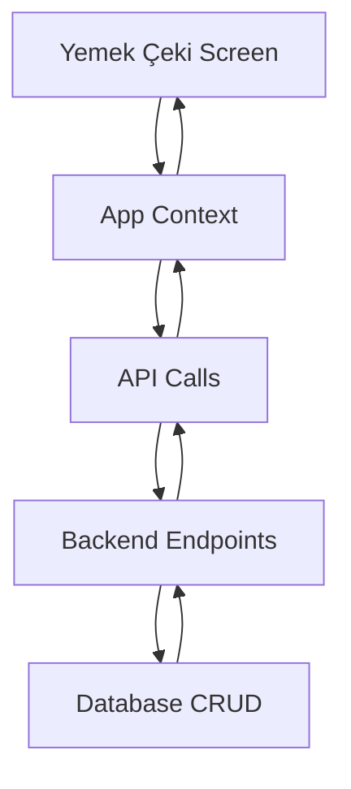

# Yemek Çeki Menu Item and Screen Design Document

## 1. Overview

This document outlines the design for implementing a new "Yemek Çeki" menu item under the "Fatura/Harcama" section and its corresponding screen for viewing, creating, updating, and deleting records in the Yemek_Ceki database table.

The implementation will follow the existing patterns established by the "Diğer Harcamalar" feature, ensuring consistency with the current codebase architecture and user experience.

## 2. Architecture

The Yemek Çeki feature will follow the existing frontend-backend architecture pattern used throughout the SilverCloud system:

- **Frontend**: React with TypeScript, built using Vite, styled with Tailwind CSS
- **Backend**: Python-based FastAPI with SQLAlchemy ORM
- **Database**: Relational database (MySQL or PostgreSQL)
- **Communication**: RESTful API endpoints for frontend-backend interaction

## 3. API Endpoints Reference

### 3.1 Yemek Çeki Management API

Create new API endpoints in `backend/api/v1/endpoints/yemek_ceki.py`:

- `POST /api/v1/yemek-ceki/` - Create new Yemek Çeki record
- `GET /api/v1/yemek-ceki/` - Get all Yemek Çeki records with pagination
- `GET /api/v1/yemek-ceki/{id}` - Get specific Yemek Çeki record
- `PUT /api/v1/yemek-ceki/{id}` - Update Yemek Çeki record
- `DELETE /api/v1/yemek-ceki/{id}` - Delete Yemek Çeki record

### 3.2 Request/Response Schema

Create new schema definitions in `backend/schemas/yemek_ceki.py`:

- `YemekCekiBase` - Base model with common fields
- `YemekCekiCreate` - Model for creating records
- `YemekCekiUpdate` - Model for updating records
- `YemekCekiInDB` - Model for database responses

### 3.3 Authentication Requirements

All endpoints will require JWT-based authentication and role-based access control, consistent with existing API endpoints.

## 4. Data Models & ORM Mapping

### 4.1 Database Schema

The Yemek_Ceki table has the following structure:

```sql
CREATE TABLE Yemek_Ceki (
    ID INT AUTO_INCREMENT PRIMARY KEY,
    Kategori_ID INT NOT NULL,
    Tarih DATE NOT NULL,
    Tutar DECIMAL(15,2) NOT NULL,
    Odeme_Tarih DATE NOT NULL,
    Ilk_Tarih DATE NOT NULL,
    Son_Tarih DATE NOT NULL,
    Sube_ID INT NOT NULL DEFAULT 1,
    Kayit_Tarihi DATETIME DEFAULT NOW(),
    CONSTRAINT fk_YEF_sube 
        FOREIGN KEY (Sube_ID) REFERENCES Sube(Sube_ID),
    CONSTRAINT fk_YEF_Kategori 
        FOREIGN KEY (Kategori_ID) REFERENCES Kategori(Kategori_ID),
    CONSTRAINT chk_YEF_Tarih CHECK (Ilk_Tarih <= Son_Tarih)
);
```

### 4.2 ORM Model

Update `backend/db/models.py` to include the YemekCeki model:

```python
class YemekCeki(Base):
    __tablename__ = "Yemek_Ceki"
    
    ID = Column(Integer, primary_key=True, index=True, autoincrement=True)
    Kategori_ID = Column(Integer, ForeignKey("Kategori.Kategori_ID"), nullable=False)
    Tarih = Column(Date, nullable=False)
    Tutar = Column(DECIMAL(15, 2), nullable=False)
    Odeme_Tarih = Column(Date, nullable=False)
    Ilk_Tarih = Column(Date, nullable=False)
    Son_Tarih = Column(Date, nullable=False)
    Sube_ID = Column(Integer, ForeignKey("Sube.Sube_ID"), nullable=False, default=1)
    Kayit_Tarihi = Column(DateTime, default=func.now())
    
    # Relationships
    kategori = relationship("Kategori", back_populates="yemekcekiler")
    sube = relationship("Sube", back_populates="yemekcekiler")
```

### 4.3 Frontend Data Model

Create a new TypeScript interface in `types.ts`:

```typescript
export interface YemekCeki {
  ID: number;
  Kategori_ID: number | null;
  Tarih: string; // DATE
  Tutar: number;
  Odeme_Tarih: string; // DATE
  Ilk_Tarih: string; // DATE
  Son_Tarih: string; // DATE
  Sube_ID: number;
  Kayit_Tarihi: string; // DATETIME
}

export type YemekCekiFormData = Omit<YemekCeki, 'ID' | 'Sube_ID' | 'Kayit_Tarihi'> & { 
  ID?: number;
};
```

## 5. Business Logic Layer

### 5.1 CRUD Operations

Add CRUD functions in `backend/db/crud.py`:

- `get_yemek_ceki(db: Session, yemek_ceki_id: int)`
- `get_yemek_cekiler(db: Session, skip: int = 0, limit: int = 100)`
- `create_yemek_ceki(db: Session, yemek_ceki: yemek_ceki.YemekCekiCreate)`
- `update_yemek_ceki(db: Session, yemek_ceki_id: int, yemek_ceki: yemek_ceki.YemekCekiUpdate)`
- `delete_yemek_ceki(db: Session, yemek_ceki_id: int)`

### 5.2 Frontend Business Logic

Update `App.tsx` to include:

- New state variables for YemekCeki data
- API functions for CRUD operations
- Update `fetchAllData` to include YemekCeki records

## 6. Frontend Implementation

### 6.1 Menu Item

Add a new menu item in `constants.tsx` under the "Fatura/Harcama" group:

```typescript
{
  label: 'Yemek Çeki',
  path: '/yemek-ceki',
  icon: Icons.Money, // Reuse existing money icon or create new one
  permission: 'Yemek Çeki Ekranı Görüntüleme' // New permission name
}
```

### 6.2 New Page Component

Create a new page component `YemekCekiPage.tsx` following the pattern of `DigerHarcamalarPage`:

#### Component Structure

- State management for CRUD operations
- Filtering capabilities (by period, category, search term)
- Modal forms for create/update operations
- Table display of records with action buttons
- Export to Excel and Print functionality

### 6.3 Form Component

Create a new form component `YemekCekiForm.tsx` following the pattern of `DigerHarcamaForm`:

- Fields for all required Yemek_Ceki table columns
- Validation for required fields
- Date pickers for date fields
- Category selection dropdown
- Proper handling of form submission

### 6.4 Routing

Add a new route in `App.tsx`:

```tsx
<Route path="/yemek-ceki" element={<YemekCekiPage />} />
```

## 7. Permissions

### 7.1 New Permission

Add a new permission constant in `constants.tsx`:

```typescript
export const YEMEK_CEKI_EKRANI_YETKI_ADI = 'Yemek Çeki Ekranı Görüntüleme';
```

### 7.2 Backend Permission

Ensure the new permission is added to the database and properly mapped in the roles/permissions system.

## 8. UI/UX Design

### 8.1 Page Layout

The YemekCekiPage will follow the same layout pattern as other financial screens:

1. Header with title and action buttons
2. Filter section with:
   - Period selection
   - Category filter
   - Search input
3. Action buttons:
   - Add new record
   - Export to Excel
   - Print
4. Data table with:
   - All Yemek_Ceki fields as columns
   - Edit/Delete action buttons
   - Inline editing capabilities where appropriate

### 8.2 Form Design

The form will include fields for all required database columns:

- Date picker for Tarih
- Numeric input for Tutar
- Date picker for Odeme_Tarih
- Date range pickers for Ilk_Tarih and Son_Tarih
- Category selection dropdown
- All fields with appropriate validation

## 9. Data Flow



## 10. Testing

### 10.1 Unit Tests

- Frontend component tests for YemekCekiPage and YemekCekiForm
- Backend unit tests for CRUD operations
- API endpoint tests

### 10.2 Integration Tests

- End-to-end tests for CRUD operations through the UI
- Data validation tests
- Permission tests

## 11. Security Considerations

- Implement proper role-based access control using existing RBAC patterns
- Validate all user inputs on both frontend and backend
- Sanitize data before database operations to prevent injection attacks
- Follow existing authentication patterns with JWT tokens
- Ensure sensitive data is not exposed in API responses

## 12. Performance Considerations

- Implement pagination for large datasets (following existing pattern with skip/limit parameters)
- Use memoization for expensive calculations in frontend components
- Optimize database queries with proper indexing on frequently queried columns
- Follow existing performance patterns in the codebase such as efficient data fetching and caching
- Implement proper error handling to prevent performance degradation from unhandled exceptions