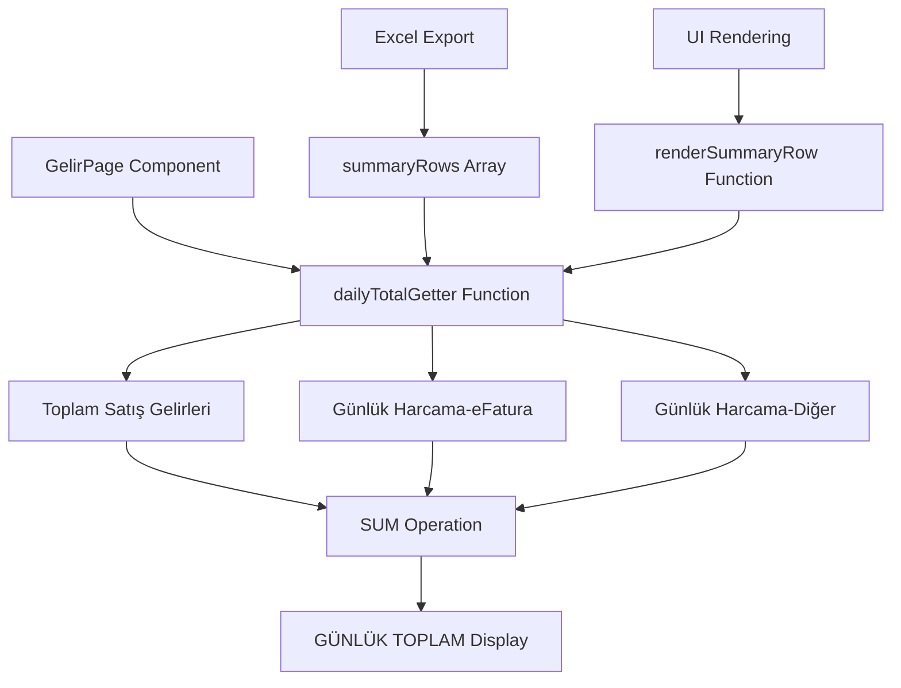
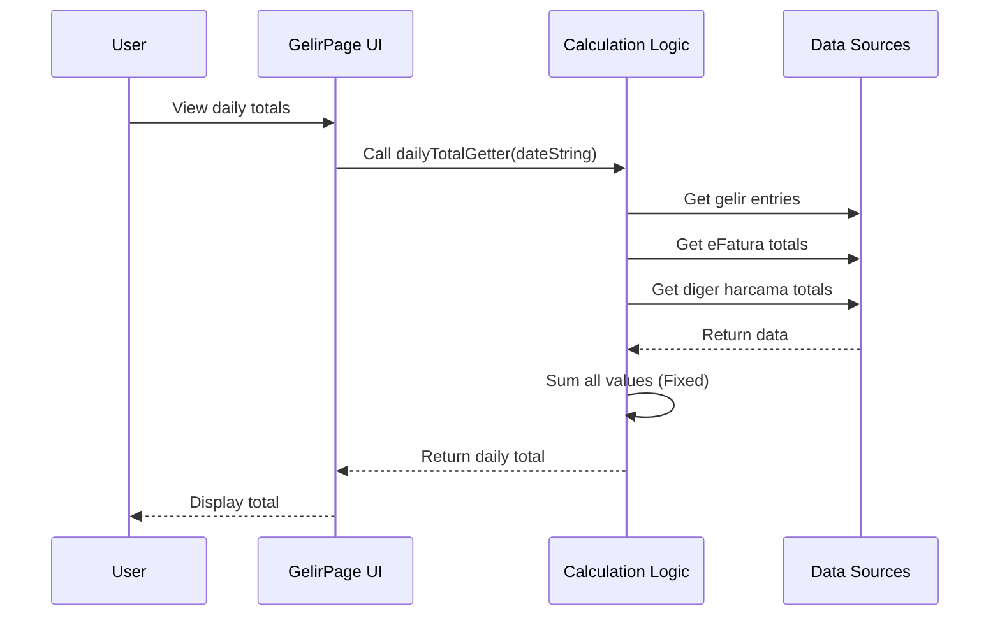

# Daily Total Calculation Fix - Gelir Girişi Screen

## Overview

This design document addresses a calculation error in the "GÜNLÜK TOPLAM" (Daily Total) calculation on the Gelir Girişi (Income Entry) screen. Currently, the daily total is calculated by subtracting expenses from income, but according to the business requirement, it should be the sum of "Toplam Satış Gelirleri" (Total Sales Revenue), "Günlük Harcama-eFatura" (Daily e-Invoice Expenses), and "Günlük Harcama-Diğer" (Daily Other Expenses).

## Problem Analysis

### Current Implementation

The current calculation logic in the GelirPage component performs:

```typescript
const dailyTotalGetter = (dateString: string) => {
    const gelir = kategoriList.filter(k => k.Tip === 'Gelir' && k.Aktif_Pasif)
        .reduce((sum, cat) => sum + (getGelirEntry(cat.Kategori_ID, dateString, selectedBranch.Sube_ID)?.Tutar || 0), 0);
    const harcamaEFatura = getDailyTotal(dailyEFaturaTotals, dateString);
    const harcamaDiger = getDailyTotal(dailyDigerHarcamaTotals, dateString);
    return gelir - harcamaEFatura - harcamaDiger; // ❌ SUBTRACTION
}
```

### Expected Implementation

The correct calculation should be:

```typescript
const dailyTotalGetter = (dateString: string) => {
    const gelir = kategoriList.filter(k => k.Tip === 'Gelir' && k.Aktif_Pasif)
        .reduce((sum, cat) => sum + (getGelirEntry(cat.Kategori_ID, dateString, selectedBranch.Sube_ID)?.Tutar || 0), 0);
    const harcamaEFatura = getDailyTotal(dailyEFaturaTotals, dateString);
    const harcamaDiger = getDailyTotal(dailyDigerHarcamaTotals, dateString);
    return gelir + harcamaEFatura + harcamaDiger; // ✅ ADDITION
}
```

## Architecture Overview



## Affected Components

### 1. GelirPage Component (pages.tsx)

The main component that requires modification contains:

- **Summary Rows Definition**: Used for Excel export functionality
- **UI Rendering Logic**: Used for displaying daily totals in the table
- **Data Processing**: Used for PDF generation and report calculations

### 2. Impact Areas

#### A. Excel Export Functionality
Located around line 3203-3225 in `summaryRows` array definition

#### B. UI Display Logic
Located around line 3595-3616 in `renderSummaryRow` function call

#### C. Internal Calculation Logic
Both locations use the same `dailyTotalGetter` function logic

## Data Flow



## Implementation Strategy

### Change Locations

Two identical calculation blocks need to be updated:

1. **Excel Export Logic** (Line 3203-3225)
2. **UI Rendering Logic** (Line 3595-3616)

### Calculation Formula Change

**Before:**
```typescript
return gelir - harcamaEFatura - harcamaDiger;
```

**After:**
```typescript
return gelir + harcamaEFatura + harcamaDiger;
```

### Code Modification Details

#### Location 1: Excel Export Summary Rows
```typescript
// In summaryRows array definition
{
    label: 'GÜNLÜK TOPLAM',
    dailyTotalGetter: (dateString: string) => {
        const gelir = kategoriList.filter(k => k.Tip === 'Gelir' && k.Aktif_Pasif)
            .reduce((sum, cat) => sum + (getGelirEntry(cat.Kategori_ID, dateString, selectedBranch.Sube_ID)?.Tutar || 0), 0);
        const harcamaEFatura = getDailyTotal(dailyEFaturaTotals, dateString);
        const harcamaDiger = getDailyTotal(dailyDigerHarcamaTotals, dateString);
        return gelir + harcamaEFatura + harcamaDiger; // Changed from subtraction to addition
    },
}
```

#### Location 2: UI Rendering Logic
```typescript
// In renderSummaryRow function call
{renderSummaryRow(
    'gunluk-toplam-kategoriler',
    'GÜNLÜK TOPLAM ',
     (dateString) => {
        const gelir = kategoriList.filter(k => k.Tip === 'Gelir' && k.Aktif_Pasif)
            .reduce((sum, cat) => sum + (getGelirEntry(cat.Kategori_ID, dateString, selectedBranch.Sube_ID)?.Tutar || 0), 0);
        const harcamaEFatura = getDailyTotal(dailyEFaturaTotals, dateString);
        const harcamaDiger = getDailyTotal(dailyDigerHarcamaTotals, dateString);
        return gelir + harcamaEFatura + harcamaDiger; // Changed from subtraction to addition
     },
    'bg-purple-200 text-purple-900 font-bold'
)}
```

## Validation and Testing

### Test Scenarios

1. **Basic Calculation Test**
   - Input: Gelir = 1000, eFatura = 200, Diğer = 100
   - Expected Output: 1300 (1000 + 200 + 100)
   - Previous Output: 700 (1000 - 200 - 100)

2. **Zero Values Test**
   - Input: Gelir = 500, eFatura = 0, Diğer = 0
   - Expected Output: 500
   - Previous Output: 500 (no change in this case)

3. **All Zero Test**
   - Input: Gelir = 0, eFatura = 0, Diğer = 0
   - Expected Output: 0
   - Previous Output: 0 (no change in this case)

4. **Excel Export Consistency**
   - Verify exported Excel data matches UI display
   - Ensure monthly totals are correctly calculated

### Quality Assurance

- **UI Display**: Verify daily totals show correct values
- **Excel Export**: Confirm exported data reflects the corrected calculation
- **PDF Export**: Ensure PDF generation includes correct totals
- **Cross-validation**: Compare with manual calculations

## Risk Assessment

### Low Risk
- **Change Scope**: Isolated to calculation logic only
- **No Database Changes**: No schema or data modifications required
- **Backward Compatibility**: No breaking changes to existing data

### Considerations
- **User Training**: Users may need to be informed about the calculation change
- **Historical Data**: Previous exports may have incorrect totals
- **Documentation**: Update any business documentation referencing the calculation

## Dependencies

### Data Sources
- **kategoriList**: Income categories (Gelir type)
- **dailyEFaturaTotals**: Daily e-invoice totals map
- **dailyDigerHarcamaTotals**: Daily other expenses totals map
- **selectedBranch**: Current branch context
- **getGelirEntry**: Function to retrieve income entries

### UI Components
- **renderSummaryRow**: Function for rendering summary rows
- **formatNumberForDisplay**: Number formatting utility
- **Excel export functionality**: XLSX library integration

## Implementation Steps

1. **Locate Target Code Sections**
   - Identify both calculation locations in pages.tsx
   - Review current logic implementation

2. **Apply Formula Change**
   - Change subtraction to addition in both locations
   - Ensure identical logic in both places

3. **Test Functionality**
   - Verify UI display updates correctly
   - Test Excel export functionality
   - Validate PDF generation

4. **User Acceptance Testing**
   - Confirm business logic matches expectations
   - Validate against real-world scenarios

## Compliance Requirements

### Business Logic Compliance
- **Calculation Formula**: Must sum all three components as specified
- **Display Consistency**: UI and exports must show identical values
- **Number Formatting**: Maintain existing format (₺XX,XXX.XX)

### System Integration
- **Data Context**: No changes to data fetching logic required
- **Permission System**: Existing permission controls remain unchanged
- **Branch Filtering**: Current branch-based filtering maintained