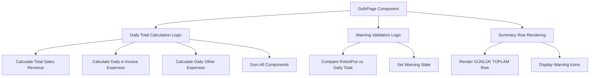
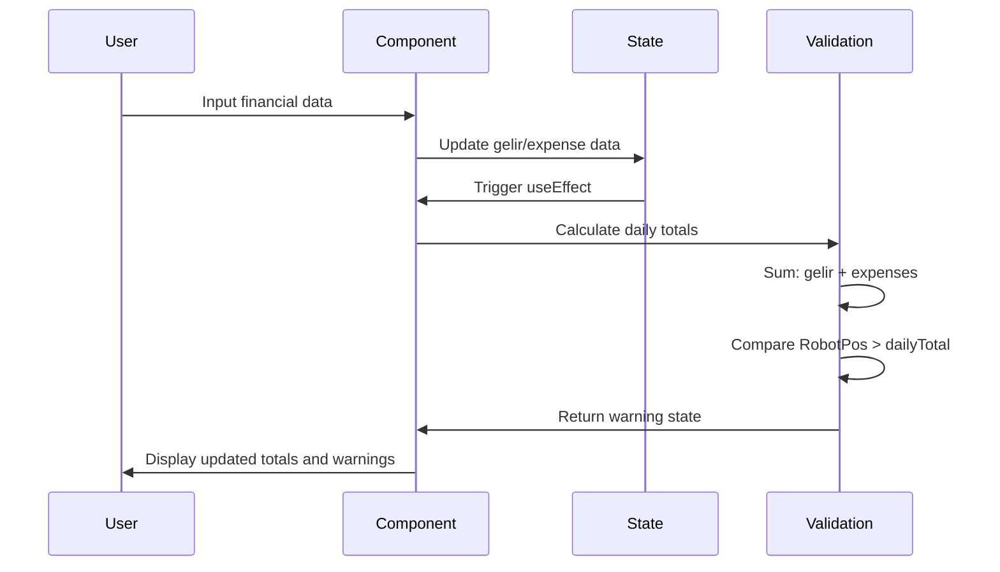

# Daily Total Calculation Fix - Gelir Girişi Screen

## Overview

The Gelir Girişi (Income Entry) screen currently has an incorrect calculation for the "GÜNLÜK TOPLAM" (Daily Total) and inappropriate warning display logic. This design document addresses the following issues:

1. **Incorrect Daily Total Calculation**: Currently calculated as `gelir - harcamaEFatura - harcamaDiger`, but should be `gelir + harcamaEFatura + harcamaDiger`
2. **Incorrect Warning Logic**: Warning should display when RobotPos Tutar is greater than GÜNLÜK TOPLAM, not when they don't match exactly

## Problem Analysis

### Current Implementation Issues

#### Daily Total Calculation Problem
```typescript
// Current (Incorrect) calculation in lines 3608-3612
const gelir = kategoriList.filter(k => k.Tip === 'Gelir' && k.Aktif_Pasif).reduce((sum, cat) => sum + (getGelirEntry(cat.Kategori_ID, dateString, selectedBranch.Sube_ID)?.Tutar || 0), 0);
const harcamaEFatura = getDailyTotal(dailyEFaturaTotals, dateString);
const harcamaDiger = getDailyTotal(dailyDigerHarcamaTotals, dateString);
return gelir - harcamaEFatura - harcamaDiger; // INCORRECT: Subtracting expenses
```

#### Warning Logic Problem
```typescript
// Current (Incorrect) warning logic in lines 3348-3352
if (Math.abs(robotPosTutar - toplamSatisGelirleri) > 0.01) {
    newErrors[dateString] = `Uyuşmazlık: RobotPos (${formatNumberForDisplay(robotPosTutar,2)}) ≠ Toplam Satış (${formatNumberForDisplay(toplamSatisGelirleri,2)})`;
} // INCORRECT: Warning when not equal instead of when RobotPos > Daily Total
```

### Expected Behavior

1. **GÜNLÜK TOPLAM** should be the sum of:
   - Toplam Satış Gelirleri (Total Sales Revenue)
   - Günlük Harcama-eFatura (Daily Expenses - e-Invoice)
   - Günlük Harcama-Diğer (Daily Expenses - Other)

2. **Warning Display** should show when:
   - RobotPos Tutar > GÜNLÜK TOPLAM

## Architecture

### Component Structure


### Data Flow


## Detailed Implementation

### 1. Daily Total Calculation Fix

#### Current Implementation (Multiple Locations)
The incorrect calculation appears in several places:
- Line 3608-3612: Summary row rendering
- Line 3208-3216: Excel export calculation
- Line 3196-3219: Summary rows array

#### Required Changes

**Summary Row Calculation** (Line 3608-3612):
```typescript
// BEFORE (Incorrect)
(dateString) => {
    const gelir = kategoriList.filter(k => k.Tip === 'Gelir' && k.Aktif_Pasif).reduce((sum, cat) => sum + (getGelirEntry(cat.Kategori_ID, dateString, selectedBranch.Sube_ID)?.Tutar || 0), 0);
    const harcamaEFatura = getDailyTotal(dailyEFaturaTotals, dateString);
    const harcamaDiger = getDailyTotal(dailyDigerHarcamaTotals, dateString);
    return gelir - harcamaEFatura - harcamaDiger; // SUBTRACT
}

// AFTER (Correct)
(dateString) => {
    const gelir = kategoriList.filter(k => k.Tip === 'Gelir' && k.Aktif_Pasif).reduce((sum, cat) => sum + (getGelirEntry(cat.Kategori_ID, dateString, selectedBranch.Sube_ID)?.Tutar || 0), 0);
    const harcamaEFatura = getDailyTotal(dailyEFaturaTotals, dateString);
    const harcamaDiger = getDailyTotal(dailyDigerHarcamaTotals, dateString);
    return gelir + harcamaEFatura + harcamaDiger; // ADD
}
```

**Excel Export Calculation** (Line 3208-3216):
```typescript
// BEFORE (Incorrect)
dailyTotalGetter: (dateString: string) => {
    const gelir = kategoriList.filter(k => k.Tip === 'Gelir' && k.Aktif_Pasif).reduce((sum, cat) => sum + (getGelirEntry(cat.Kategori_ID, dateString, selectedBranch.Sube_ID)?.Tutar || 0), 0);
    const harcamaEFatura = getDailyTotal(dailyEFaturaTotals, dateString);
    const harcamaDiger = getDailyTotal(dailyDigerHarcamaTotals, dateString);
    return gelir - harcamaEFatura - harcamaDiger; // SUBTRACT
}

// AFTER (Correct)
dailyTotalGetter: (dateString: string) => {
    const gelir = kategoriList.filter(k => k.Tip === 'Gelir' && k.Aktif_Pasif).reduce((sum, cat) => sum + (getGelirEntry(cat.Kategori_ID, dateString, selectedBranch.Sube_ID)?.Tutar || 0), 0);
    const harcamaEFatura = getDailyTotal(dailyEFaturaTotals, dateString);
    const harcamaDiger = getDailyTotal(dailyDigerHarcamaTotals, dateString);
    return gelir + harcamaEFatura + harcamaDiger; // ADD
}
```

### 2. Warning Logic Fix

#### Current Implementation Analysis
The warning validation logic in lines 3340-3355 compares RobotPos against only "Toplam Satış Gelirleri" and shows warning when they don't match exactly.

#### Required Changes

**New Warning Logic**:
```typescript
// Create a helper function to calculate daily total
const calculateDailyTotal = (dateString: string) => {
    const gelir = allGelirKategoriler.reduce((sum, cat) => {
        return sum + (getGelirEntry(cat.Kategori_ID, dateString, selectedBranch.Sube_ID)?.Tutar || 0);
    }, 0);
    const harcamaEFatura = getDailyTotal(dailyEFaturaTotals, dateString);
    const harcamaDiger = getDailyTotal(dailyDigerHarcamaTotals, dateString);
    return gelir + harcamaEFatura + harcamaDiger;
};

// Updated validation logic
daysInViewedMonth.forEach(({ dateString }) => {
    const robotPosTutar = getGelirEkstraEntry(dateString, selectedBranch.Sube_ID)?.RobotPos_Tutar || 0;
    const gunlukToplam = calculateDailyTotal(dateString);

    // Warning when RobotPos is greater than Daily Total
    if (robotPosTutar > gunlukToplam) {
        newErrors[dateString] = `Uyarı: RobotPos (${formatNumberForDisplay(robotPosTutar, 2)}) Günlük Toplam'dan (${formatNumberForDisplay(gunlukToplam, 2)}) büyük`;
    } else {
        newErrors[dateString] = null;
    }
});
```

### 3. UI Updates

#### Warning Display Enhancement
```typescript
// Update warning display in day headers (line 3517-3526)
{daysInViewedMonth.map(d => {
    const error = dailyErrors[d.dateString];
    return (
        <th 
            scope="col" 
            key={d.day} 
            className={`border border-gray-300 px-2 py-2 text-center text-sm font-medium text-gray-600 transition-colors ${error ? 'bg-yellow-100' : ''}`}
        >
            <div className="flex items-center justify-center space-x-1">
                <span>{d.day}</span>
                {error && (
                    <div title={error}>
                        <Icons.ExclamationTriangle className="w-4 h-4 text-amber-600" />
                    </div>
                )}
            </div>
        </th>
    );
})}
```

#### RobotPos Row Warning Update
```typescript
// Update RobotPos row to show warning (line 3538-3545)
{renderDataRow(
    'robotpos-tutar',
    'RobotPos Tutar',
    (dateString) => getGelirEkstraEntry(dateString, selectedBranch.Sube_ID)?.RobotPos_Tutar,
    (dateString, value) => handleEkstraChange(dateString, 'RobotPos_Tutar', value),
    'bg-blue-100',
    true // Enable warning display for RobotPos row
)}
```

## Implementation Steps

### Phase 1: Core Calculation Fix
1. **Update Daily Total Calculation** in summary row rendering (line 3608-3612)
2. **Update Excel Export Calculation** in summaryRows array (line 3208-3216)
3. **Update Summary Rows Array** in export function (line 3196-3219)

### Phase 2: Warning Logic Update
1. **Create Helper Function** for daily total calculation
2. **Update Warning Validation Logic** in useEffect (line 3340-3355)
3. **Update Warning Message** format and logic

### Phase 3: UI Enhancement
1. **Update Warning Display** styling (yellow instead of red)
2. **Enable Warning Icons** for RobotPos row
3. **Test Warning Display** functionality

## Testing Strategy

### Unit Testing Requirements
```typescript
// Test cases for daily total calculation
describe('Daily Total Calculation', () => {
    it('should correctly sum gelir + eFatura + digerHarcama', () => {
        const gelir = 1000;
        const eFatura = 200;
        const digerHarcama = 300;
        const expected = 1500; // Sum, not subtraction
        expect(calculateDailyTotal(testDate)).toBe(expected);
    });
});

// Test cases for warning logic
describe('Warning Logic', () => {
    it('should show warning when RobotPos > Daily Total', () => {
        const robotPos = 2000;
        const dailyTotal = 1500;
        expect(shouldShowWarning(robotPos, dailyTotal)).toBe(true);
    });

    it('should not show warning when RobotPos <= Daily Total', () => {
        const robotPos = 1500;
        const dailyTotal = 1500;
        expect(shouldShowWarning(robotPos, dailyTotal)).toBe(false);
    });
});
```

### Integration Testing
1. **Data Entry Testing**: Verify calculations update correctly when entering data
2. **Excel Export Testing**: Ensure exported data reflects correct calculations
3. **Warning Display Testing**: Verify warnings appear/disappear correctly
4. **Cross-browser Testing**: Test on different browsers for consistency

## Risk Assessment

### Low Risk Changes
- **Calculation Logic Update**: Direct arithmetic change
- **Warning Message Update**: UI text change

### Medium Risk Changes
- **Warning Validation Logic**: Logic change affecting user experience
- **Excel Export Calculation**: Affects external reports

### Mitigation Strategies
1. **Backup Current Implementation**: Save current logic before changes
2. **Progressive Testing**: Test each phase independently
3. **User Acceptance Testing**: Validate with business users
4. **Rollback Plan**: Keep ability to revert changes quickly

## Performance Considerations

### Current Performance Impact
- **Minimal**: Changes only affect calculation logic, not data fetching
- **Memory Usage**: No additional memory requirements
- **Rendering**: No impact on rendering performance

### Optimization Opportunities
- **Memoization**: Consider memoizing daily total calculations if performance issues arise
- **Batch Updates**: Ensure state updates are batched appropriately

## Validation and Testing

### Business Logic Validation
1. **Mathematical Accuracy**: Verify sum calculation is correct
2. **Edge Cases**: Test with zero values, negative values
3. **Data Consistency**: Ensure calculations match across all display areas

### User Experience Validation
1. **Warning Clarity**: Ensure warning messages are clear and actionable
2. **Visual Indicators**: Verify warning icons and colors are appropriate
3. **Responsiveness**: Test on different screen sizes

## Dependencies

### Internal Dependencies
- **getDailyTotal function**: Used for expense calculations
- **formatNumberForDisplay function**: Used for number formatting
- **Icons.ExclamationTriangle**: Used for warning display

### External Dependencies
- **React hooks**: useState, useEffect, useMemo
- **Data context**: gelirList, eFaturaList, digerHarcamaList

## Deployment Strategy

### Development Environment Testing
1. **Local Testing**: Comprehensive testing in development environment
2. **Code Review**: Peer review of calculation changes
3. **Unit Test Coverage**: Ensure all calculation paths are tested

### Production Deployment
1. **Staging Deployment**: Deploy to staging environment first
2. **User Training**: Brief users on new warning behavior
3. **Monitoring**: Monitor for any calculation discrepancies post-deployment
4. **Quick Rollback**: Maintain ability to quickly revert if issues arise