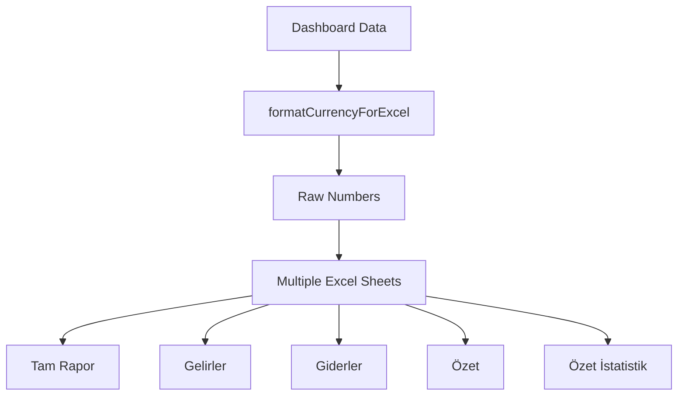
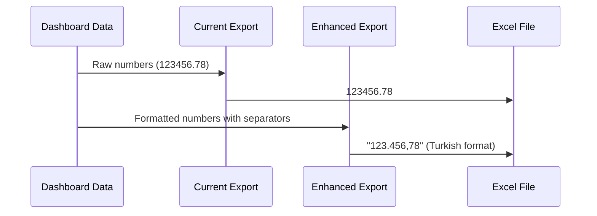
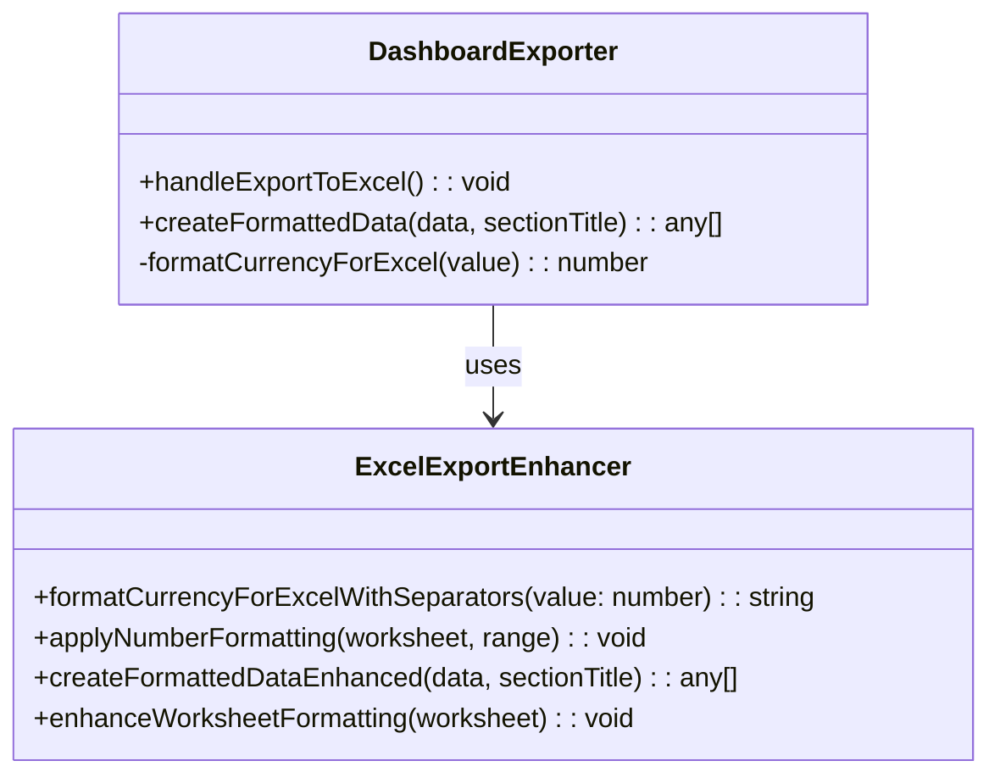
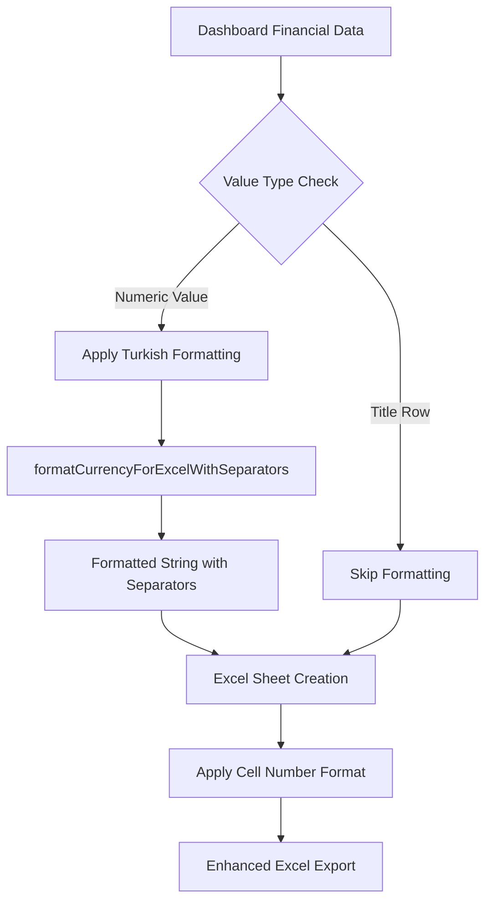
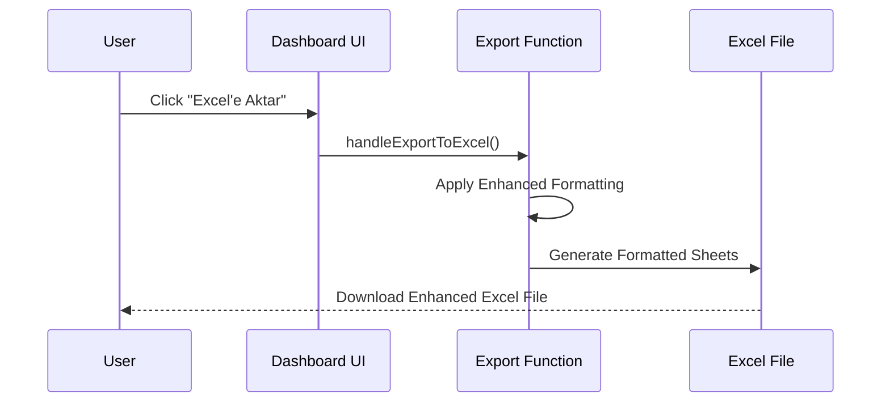

# Dashboard Raporu Excel Export Formatting Enhancement

## Overview

This design document outlines the enhancement to the Dashboard Raporu Excel export functionality to include thousand separators in the exported financial data, improving readability and professional presentation while maintaining Excel's calculation capabilities.

## Current State Analysis

### Existing Implementation
- **Display Formatting**: The Dashboard currently uses `formatTrCurrencyAdvanced()` function which applies Turkish locale formatting with thousand separators (`useGrouping: true`)
- **Excel Export**: Raw numeric values are exported without formatting to preserve Excel's calculation capabilities
- **Function Location**: `handleExportToExcel()` in `pages.tsx` (lines 577-713)

### Current Excel Export Structure


## Requirements

### Functional Requirements
1. **Thousand Separator Formatting**: Apply Turkish locale number formatting with thousand separators to all financial values in Excel export
2. **Maintain Calculation Capability**: Ensure Excel can still perform calculations on formatted numbers
3. **Consistent Formatting**: Apply formatting across all sheets (Tam Rapor, Gelirler, Giderler, Özet, Özet İstatistik)
4. **Turkish Locale Compliance**: Use Turkish number formatting standards (dot as thousand separator)

### Non-Functional Requirements
1. **Performance**: Maintain current export performance
2. **Compatibility**: Ensure compatibility with Excel versions that support Turkish locale
3. **User Experience**: Improve readability without breaking existing functionality

## Technical Design

### Enhanced Number Formatting Strategy

#### Current vs Enhanced Approach


#### Implementation Components

1. **Enhanced Formatting Function**
```typescript
const formatCurrencyForExcelWithSeparators = (value: number): string => {
  if (value === undefined || value === null || isNaN(value)) {
    return '';
  }
  // Use Turkish locale formatting with thousand separators
  return value.toLocaleString('tr-TR', {
    minimumFractionDigits: 2,
    maximumFractionDigits: 2,
    useGrouping: true,
  });
};
```

2. **Excel Cell Formatting Enhancement**
```typescript
// Apply number format to Excel cells
const applyNumberFormatting = (worksheet: XLSX.WorkSheet, range: string) => {
  if (!worksheet['!ref']) return;
  
  // Apply Turkish number format to currency columns
  const cells = XLSX.utils.decode_range(range);
  for (let row = cells.s.r; row <= cells.e.r; row++) {
    for (let col = cells.s.c; col <= cells.e.c; col++) {
      const cellAddress = XLSX.utils.encode_cell({ r: row, c: col });
      if (worksheet[cellAddress] && typeof worksheet[cellAddress].v === 'number') {
        worksheet[cellAddress].z = '#,##0.00'; // Excel number format
      }
    }
  }
};
```

### Component Architecture



### Data Flow Enhancement



## Implementation Details

### File Modifications

#### 1. Enhanced Export Function (`pages.tsx`)

**Location**: Lines 577-713 in `handleExportToExcel` function

**Changes Required**:
- Replace `formatCurrencyForExcel` with enhanced formatting function
- Add Excel cell formatting for better presentation
- Maintain backward compatibility

```typescript
// Enhanced helper function
const formatCurrencyForExcelWithSeparators = (value: number): string => {
  if (value === undefined || value === null || isNaN(value)) {
    return '';
  }
  return value.toLocaleString('tr-TR', {
    minimumFractionDigits: 2,
    maximumFractionDigits: 2,
    useGrouping: true,
  });
};

// Enhanced data creation function
const createFormattedDataEnhanced = (data: DashboardRowData[], sectionTitle: string) => {
  const formattedData: any[] = [];
  
  // Section header (unchanged)
  formattedData.push({
    'Kategori': sectionTitle.toUpperCase(),
    'Kalem Adı': '',
    'Tutar (₺)': '',
    'Durum': ''
  });
  
  // Empty row (unchanged)
  formattedData.push({
    'Kategori': '',
    'Kalem Adı': '',
    'Tutar (₺)': '',
    'Durum': ''
  });
  
  data.forEach(row => {
    // Existing categorization logic (unchanged)
    let category = '';
    let itemName = row.label;
    let status = '';
    
    if (row.isTitle) {
      category = 'BAŞLIK';
      status = 'Kategori Başlığı';
    } else if (row.isSubItem) {
      category = 'Alt Kalem';
      status = row.isFromPreviousPeriod ? 'Önceki Dönem' : 'Mevcut Dönem';
    } else if (row.isSubSubItem) {
      category = 'Detay';
      status = row.isFromPreviousPeriod ? 'Önceki Dönem' : 'Mevcut Dönem';
    } else {
      category = 'Ana Kalem';
      status = row.isFromPreviousPeriod ? 'Önceki Dönem' : 'Mevcut Dönem';
    }
    
    if (row.isFromPreviousPeriod) {
      itemName = `${itemName} (Önceki Dönem Verisi)`;
    }
    
    formattedData.push({
      'Kategori': category,
      'Kalem Adı': itemName,
      'Tutar (₺)': row.isTitle ? '' : formatCurrencyForExcelWithSeparators(row.value),
      'Durum': status
    });
  });
  
  return formattedData;
};
```

#### 2. Summary Statistics Enhancement

**Enhanced Summary Data Formatting**:
```typescript
// In summary statistics section
summaryData.push(
  { 'Açıklama': 'Rapor Özeti', 'Değer': '' },
  { 'Açıklama': '', 'Değer': '' },
  { 'Açıklama': 'Şube', 'Değer': selectedBranch?.Sube_Adi || '' },
  { 'Açıklama': 'Dönem', 'Değer': selectedPeriodForDashboard },
  { 'Açıklama': 'Rapor Tarihi', 'Değer': new Date().toLocaleDateString('tr-TR') },
  { 'Açıklama': '', 'Değer': '' },
  { 'Açıklama': 'Toplam Gelir', 'Değer': formatCurrencyForExcelWithSeparators(gelirTotal) },
  { 'Açıklama': 'Toplam Gider', 'Değer': formatCurrencyForExcelWithSeparators(giderTotal) },
  { 'Açıklama': 'Net Fark (Gelir - Gider)', 'Değer': formatCurrencyForExcelWithSeparators(gelirTotal - giderTotal) }
);
```

### User Interface Impact

#### Button and Icon
- **Existing Button**: "Excel'e Aktar" button with download icon
- **Functionality Enhancement**: Same button, improved export output
- **User Feedback**: No additional UI changes required

#### Export Process Flow


## Expected Benefits

### User Experience Improvements
1. **Enhanced Readability**: Financial values display with proper thousand separators
2. **Professional Presentation**: Excel files appear more polished and business-ready
3. **Consistency**: Excel export formatting matches on-screen display formatting
4. **Turkish Compliance**: Proper Turkish locale number formatting

### Technical Advantages
1. **Minimal Code Changes**: Leverages existing formatting infrastructure
2. **Backward Compatibility**: Maintains existing functionality
3. **Performance**: No significant performance impact
4. **Maintainability**: Uses established formatting patterns

## Risk Assessment

### Low Risk Factors
- **Non-Breaking Change**: Enhancement only, no removal of existing functionality
- **Proven Technology**: Uses established JavaScript `toLocaleString()` method
- **Existing Pattern**: Follows current formatting approach used in display

### Mitigation Strategies
- **Testing**: Verify Excel compatibility across different versions
- **Fallback**: Maintain ability to export raw numbers if needed
- **Documentation**: Update user documentation to reflect formatting changes

## Technical Dependencies

### Required Technologies
- **JavaScript `toLocaleString()`**: For number formatting
- **XLSX Library**: Current Excel generation library (already in use)
- **Turkish Locale Support**: Browser/system support for 'tr-TR' locale

### System Requirements
- **Browser Compatibility**: Modern browsers with Intl.NumberFormat support
- **Excel Compatibility**: Excel versions supporting formatted number cells
- **No Additional Dependencies**: Uses existing technology stack