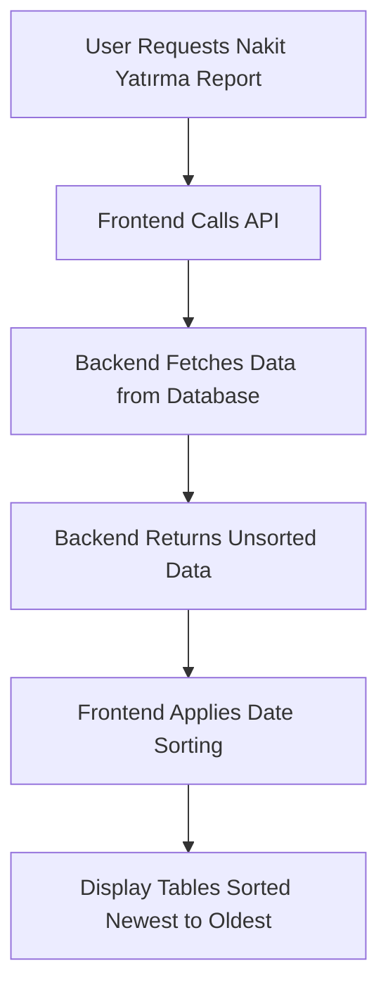

# Data Sorting Feature Design Document

## 1. Overview

This document outlines the implementation of a feature to sort data by date (Tarih) from newest to oldest on the "Nakit Girişleri" screen. Currently, the data is sorted from oldest to newest, and this change will reverse the sorting order to display the most recent entries first.

## 2. Current Implementation

### 2.1 Frontend Sorting Logic

The current implementation in `NakitYatirmaRaporu.tsx` uses JavaScript's `Array.sort()` method with a custom comparator function to sort records by date in ascending order (oldest to newest):

```typescript
// Date sorting for Bankaya Yatan records
const sortedBankayaYatan = useMemo(() => {
    if (!reportData?.bankaya_yatan) return [];
    return [...reportData.bankaya_yatan].sort((a, b) => 
        new Date(a.Tarih).getTime() - new Date(b.Tarih).getTime()
    );
}, [reportData?.bankaya_yatan]);

// Date sorting for Nakit Giriş records
const sortedNakitGiris = useMemo(() => {
    if (!reportData?.nakit_girisi) return [];
    return [...reportData.nakit_girisi].sort((a, b) => 
        new Date(a.Tarih).getTime() - new Date(b.Tarih).getTime()
    );
}, [reportData?.nakit_girisi]);
```

### 2.2 Backend Data Retrieval

Data is fetched from two database tables:
1. `Odeme` table (where Kategori_ID=60) for "Bankaya Yatan" records
2. `Nakit` table for "Nakit Girişi" records

The backend API endpoint `/nakit-yatirma-kontrol/{sube_id}/{donem}` retrieves data without any specific sorting, relying on the frontend to handle sorting.

## 3. Proposed Changes

### 3.1 Frontend Implementation

To sort data from newest to oldest, we need to reverse the comparison in the sorting functions:

```typescript
// Updated sorting for Bankaya Yatan records (newest to oldest)
const sortedBankayaYatan = useMemo(() => {
    if (!reportData?.bankaya_yatan) return [];
    return [...reportData.bankaya_yatan].sort((a, b) => 
        new Date(b.Tarih).getTime() - new Date(a.Tarih).getTime()
    );
}, [reportData?.bankaya_yatan]);

// Updated sorting for Nakit Giriş records (newest to oldest)
const sortedNakitGiris = useMemo(() => {
    if (!reportData?.nakit_girisi) return [];
    return [...reportData.nakit_girisi].sort((a, b) => 
        new Date(b.Tarih).getTime() - new Date(a.Tarih).getTime()
    );
}, [reportData?.nakit_girisi]);
```

### 3.2 Change Details

The modification involves swapping the positions of `a` and `b` in the date comparison:
- From: `new Date(a.Tarih).getTime() - new Date(b.Tarih).getTime()`
- To: `new Date(b.Tarih).getTime() - new Date(a.Tarih).getTime()`

This simple change will reverse the sort order from ascending (oldest first) to descending (newest first).

## 4. Implementation Steps

### 4.1 Frontend Changes

1. Locate the sorting functions in `NakitYatirmaRaporu.tsx` (lines 265-278)
2. Modify both `sortedBankayaYatan` and `sortedNakitGiris` functions to reverse the sort order
3. Test the changes to ensure data is displayed from newest to oldest

### 4.2 Testing

1. Verify that both "Bankaya Yatan" and "Nakit Girişi" tables display data sorted from newest to oldest
2. Confirm that the matching logic between records continues to work correctly
3. Check that the visual indicators for matched/unmatched records remain accurate

## 5. Data Flow Architecture



## 6. Impact Analysis

### 6.1 Positive Impacts

1. Improved user experience by showing the most recent data first
2. Consistency with common UI patterns where newest items appear at the top
3. Minimal code changes required

### 6.2 Potential Issues

1. Users accustomed to the old sorting order may need adjustment
2. No backend changes required, so performance remains unchanged

## 7. Testing Strategy

### 7.1 Unit Testing

- Verify that the sorting functions correctly order dates from newest to oldest
- Test with various date formats to ensure compatibility
- Confirm that records with identical dates maintain stable sorting

### 7.2 Integration Testing

- Test the complete data flow from API call to UI display
- Verify that matching logic continues to work with the new sorting
- Check that all UI elements display correctly with the new sort order

### 7.3 User Acceptance Testing

- Confirm that users can easily find recent entries at the top of the tables
- Validate that the feature meets the original requirements

## 8. Rollback Plan

If issues are discovered after deployment:

1. Revert the sorting function changes in `NakitYatirmaRaporu.tsx`
2. Restore the original comparison logic:
   ```typescript
   new Date(a.Tarih).getTime() - new Date(b.Tarih).getTime()
   ```
3. Deploy the reverted code to restore the previous behavior