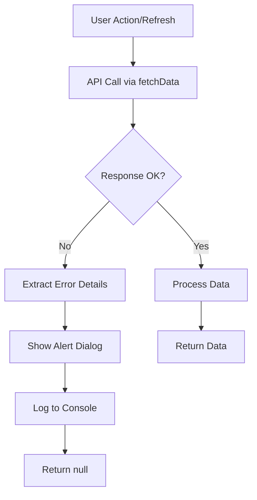
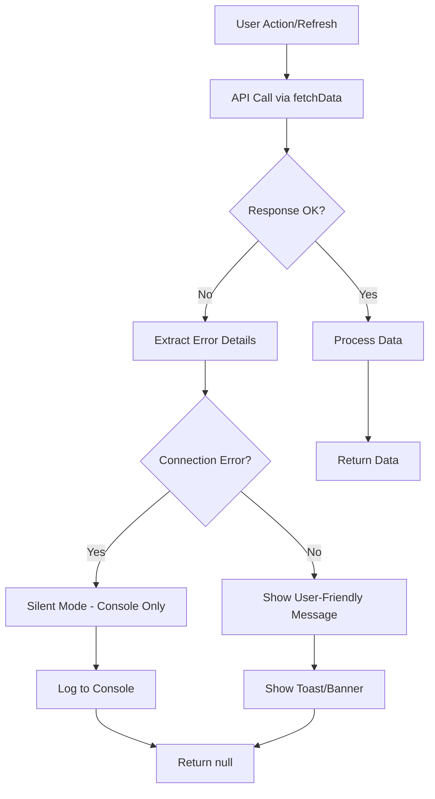

# Connection Error Message Suppression Design

## Overview

This design document outlines the implementation for suppressing connection error messages that appear on the user interface when database connections are refreshed or reset. The goal is to provide a cleaner user experience by preventing disruptive error alerts while maintaining error logging in the console for debugging purposes.

## Problem Statement

Currently, when users refresh the application and database connections are reset, multiple connection error messages appear as browser alerts (`alert()` calls), which creates a poor user experience. These errors include:

- API connection failures during initial data loading
- Database timeout errors
- Network connectivity issues
- Authentication token expiration errors

## Technology Stack & Dependencies

- **Frontend Framework**: React with TypeScript
- **Build Tool**: Vite
- **Styling**: Tailwind CSS
- **State Management**: React Context API
- **API Communication**: Fetch API
- **Error Handling**: Custom error boundaries and try-catch blocks

## Architecture

### Current Error Handling Flow



### Proposed Error Handling Flow



## Component Architecture

### Error Handling Components

#### 1. Enhanced Error Boundary Component
```typescript
interface ErrorBoundaryState {
  hasError: boolean;
  errorType: 'connection' | 'validation' | 'general';
}

class ErrorBoundary extends React.Component<Props, ErrorBoundaryState>
```

#### 2. Toast Notification System
```typescript
interface ToastProps {
  message: string;
  type: 'error' | 'warning' | 'info' | 'success';
  duration?: number;
  onClose: () => void;
}
```

#### 3. Connection Status Indicator
```typescript
interface ConnectionStatusProps {
  isOnline: boolean;
  isConnecting: boolean;
  lastError?: Date;
}
```

### Modified fetchData Function

The core `fetchData` function will be enhanced with intelligent error categorization:

```typescript
interface ErrorHandlingOptions {
  suppressConnectionErrors?: boolean;
  showUserFriendlyMessages?: boolean;
  retryAttempts?: number;
}

const fetchData = async <T,>(
  url: string, 
  options: RequestInit = {}, 
  errorOptions: ErrorHandlingOptions = {}
): Promise<T | null>
```

## Error Classification System

### Connection Error Types (Suppressed from UI)
- **Network Timeout**: Status codes 408, 504
- **Connection Reset**: Network errors with "reset" or "aborted"
- **DNS Resolution Failures**: Network errors with "DNS" or "ENOTFOUND"
- **Server Unavailable**: Status codes 502, 503
- **Database Connection**: Errors containing "database", "connection", "pool"

### User-Visible Error Types
- **Authentication Errors**: Status code 401
- **Permission Errors**: Status code 403
- **Validation Errors**: Status code 422
- **Resource Not Found**: Status code 404
- **Rate Limiting**: Status code 429

## State Management for Error Handling

### Error Context Provider
```typescript
interface ErrorContextType {
  connectionErrors: ConnectionError[];
  userErrors: UserError[];
  addError: (error: AppError) => void;
  clearErrors: (type?: 'connection' | 'user') => void;
  suppressConnectionErrors: boolean;
  toggleConnectionErrorSuppression: () => void;
}
```

### Error State Structure
```typescript
interface AppError {
  id: string;
  type: 'connection' | 'validation' | 'permission' | 'general';
  severity: 'low' | 'medium' | 'high' | 'critical';
  message: string;
  timestamp: Date;
  url?: string;
  statusCode?: number;
  shouldDisplay: boolean;
}
```

## UI Components

### 1. Silent Connection Status Banner
- Minimal, non-intrusive indicator
- Shows connection status without blocking user actions
- Automatically dismisses when connection is restored

### 2. Toast Notification System
- Replaces browser `alert()` dialogs
- Non-blocking notifications
- Automatic dismissal with configurable duration
- Different styles for different error types

### 3. Error Suppression Toggle (Development Mode)
- Admin/developer option to toggle error visibility
- Useful for debugging in development environment
- Stored in localStorage for persistence

## Configuration Management

### Error Suppression Settings
```typescript
interface ErrorSuppressionConfig {
  suppressConnectionErrors: boolean;
  connectionErrorKeywords: string[];
  connectionErrorStatusCodes: number[];
  retryAttempts: number;
  retryDelay: number;
  showConnectionStatusBanner: boolean;
  toastDuration: number;
}
```

### Environment-Based Configuration
- **Development**: Show all errors for debugging
- **Production**: Suppress connection errors, show user-friendly messages
- **Testing**: Configurable error visibility for test scenarios

## Implementation Strategy

### Phase 1: Core Error Handling Enhancement
1. Replace `alert()` calls with toast notifications
2. Implement error classification system
3. Add connection status monitoring
4. Create error context provider

### Phase 2: UI Component Integration
1. Implement toast notification system
2. Add connection status banner
3. Update all error display components
4. Add error suppression toggle for development

### Phase 3: Advanced Features
1. Implement retry mechanisms
2. Add offline detection and handling
3. Create error analytics and reporting
4. Add user preference settings

## Error Message Localization

### Turkish Error Messages (User-Facing)
- **Connection Issues**: "Bağlantı sorunu yaşanıyor, otomatik olarak yeniden denenecek"
- **Temporary Unavailable**: "Sistem geçici olarak kullanılamıyor, lütfen birkaç dakika sonra tekrar deneyin"
- **Data Loading**: "Veriler yüklenirken bir sorun oluştu"

### Console Messages (Development)
- Detailed error information with stack traces
- API endpoint URLs and request details
- Response status codes and error bodies

## Testing Strategy

### Unit Tests
- Error classification logic
- Toast notification component behavior
- Error context state management
- fetchData function with different error scenarios

### Integration Tests
- End-to-end error handling flow
- Connection status banner functionality
- Error suppression toggle behavior
- Multi-component error propagation

### User Experience Tests
- Error message visibility during connection issues
- Non-blocking notification behavior
- Connection restoration handling
- Error message readability and clarity

## Performance Considerations

### Memory Management
- Limit error history to prevent memory leaks
- Automatic cleanup of old error entries
- Efficient error classification algorithms

### Network Efficiency
- Prevent excessive retry attempts
- Implement exponential backoff for retries
- Cache error responses to avoid duplicate requests

## Monitoring and Analytics

### Error Tracking
- Console-based error logging for development
- Error frequency and pattern analysis
- Connection stability metrics
- User experience impact assessment

### Dashboard Metrics
- Connection error rates
- Error suppression effectiveness
- User interaction with error messages
- System availability indicators

## Security Considerations

### Error Information Exposure
- Sanitize error messages for production
- Prevent sensitive information leakage
- Maintain detailed logs for administrators only
- Implement proper error message filtering

### Authentication Error Handling
- Special handling for token expiration
- Secure error message display
- Proper logout flow on authentication failures
- Session management during connection issues

## Deployment and Configuration

### Environment Variables
```env
VITE_SUPPRESS_CONNECTION_ERRORS=true
VITE_ERROR_RETRY_ATTEMPTS=3
VITE_TOAST_DURATION=5000
VITE_CONNECTION_STATUS_BANNER=true
```

### Build-Time Configuration
- Different error handling strategies per environment
- Conditional error suppression based on build target
- Development-only debugging features

## Migration Strategy

### Gradual Implementation
1. **Week 1**: Implement core error classification
2. **Week 2**: Replace alert() calls with toast system
3. **Week 3**: Add connection status monitoring
4. **Week 4**: Testing and refinement

### Backward Compatibility
- Maintain existing error handling as fallback
- Gradual migration of components
- Feature flags for enabling new error system
- Rollback capability if issues arise

## User Experience Enhancement

### Loading States
- Improved loading indicators during connection issues
- Progress indicators for retry attempts
- Clear feedback when operations succeed after errors

### Accessibility
- Screen reader compatible error announcements
- Keyboard navigation for error messages
- High contrast error indicators
- Proper ARIA labels for error states

## Future Enhancements

### Advanced Error Recovery
- Automatic retry with exponential backoff
- Offline mode with data synchronization
- Smart error prediction and prevention
- Adaptive timeout based on connection quality

### User Customization
- User preference for error message verbosity
- Customizable notification settings
- Personal error suppression preferences
- Accessibility-focused error display options