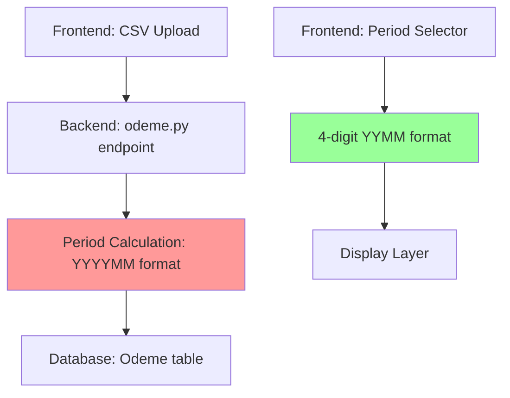
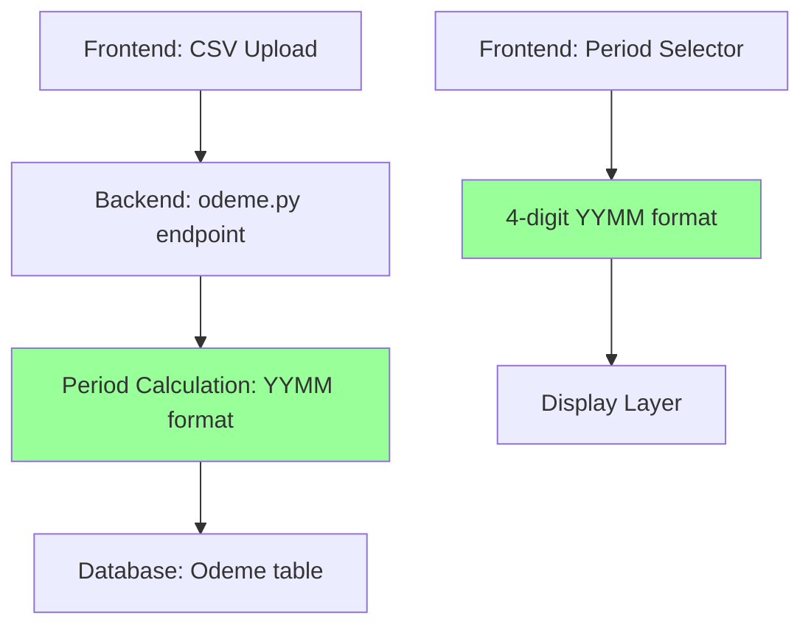
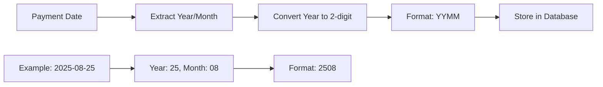
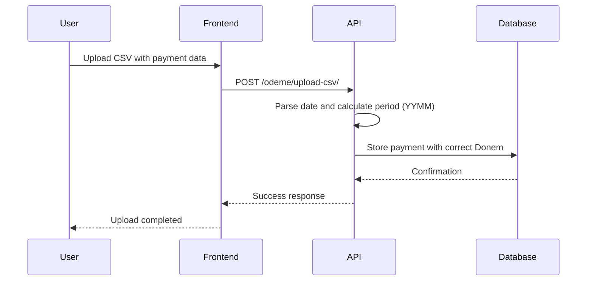
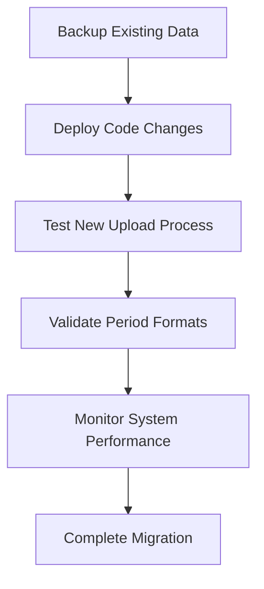

# Period Format Correction for Payment Upload

## Overview

The SilverCloud System's payment upload functionality (Ödeme Yükleme) currently has an inconsistency in period (Donem) format handling. The system should maintain a consistent 4-digit YYMM format (e.g., 2508 for August 2025) throughout all modules, but the payment upload process incorrectly generates 6-digit YYYYMM format (e.g., 202508).

## Problem Statement

When uploading invoices through the "Ödeme Yükleme (Şube: Brandium)" page, the Donem field is being stored in an incorrect format:

**Current Behavior:**
- Payment date: 25 August 2025 → Donem: 202508 (6-digit YYYYMM)
- Payment date: 12 January 2021 → Donem: 202101 (6-digit YYYYMM)

**Expected Behavior:**
- Payment date: 25 August 2025 → Donem: 2508 (4-digit YYMM)
- Payment date: 12 January 2021 → Donem: 2101 (4-digit YYMM)

## Architecture

### Current System Architecture



### Target Architecture



## Data Model

### Odeme Entity
The Odeme table structure remains unchanged:

| Field | Type | Description |
|-------|------|-------------|
| Odeme_ID | Integer | Primary Key |
| Tip | String(50) | Payment type |
| Hesap_Adi | String(50) | Account name |
| Tarih | Date | Payment date |
| Aciklama | String(200) | Description |
| Tutar | DECIMAL(15,2) | Payment amount |
| Kategori_ID | Integer | Category FK |
| **Donem** | **Integer** | **Period (4-digit YYMM format)** |
| Sube_ID | Integer | Branch FK |
| Kayit_Tarihi | DateTime | Record creation date |

## Backend Architecture

### API Endpoints Reference

#### Current Implementation Issue
**File:** `/backend/api/v1/endpoints/odeme.py`
**Line:** 57

```python
# CURRENT (INCORRECT) - Generates 6-digit format
donem = int(f"{tarih_dt.year}{tarih_dt.month:02d}")
```

#### Required Fix
**File:** `/backend/api/v1/endpoints/odeme.py`
**Line:** 57

```python
# CORRECTED - Generates 4-digit YYMM format
donem = int(f"{tarih_dt.year % 100:02d}{tarih_dt.month:02d}")
```

### Period Conversion Utility

The system already has period conversion logic in CRUD operations:

**File:** `/backend/db/crud.py`
**Lines:** 1098-1100, 1155-1157

```python
# Convert 4-digit donem (2508) to 6-digit (202508) if needed
if len(str(donem)) == 4:
    donem = 2000 + donem  # Convert 2508 to 202508
```

This conversion should remain for backward compatibility with existing 6-digit period data.

## Business Logic Layer

### Period Format Standardization

| Module | Current Format | Required Format | Status |
|--------|---------------|-----------------|---------|
| Frontend Period Selector | YYMM (4-digit) | YYMM (4-digit) | ✅ Correct |
| e-Fatura Upload | YYMM (4-digit) | YYMM (4-digit) | ✅ Correct |
| Nakit Management | YYMM (4-digit) | YYMM (4-digit) | ✅ Correct |
| **Payment Upload** | **YYYYMM (6-digit)** | **YYMM (4-digit)** | ❌ **Needs Fix** |
| Report Generation | Mixed (handles both) | YYMM (4-digit) | 🔄 Conversion Logic |

### Period Calculation Logic



## Testing Strategy

### Test Cases

| Test Case | Input Date | Expected Donem | Current Donem | Status |
|-----------|------------|----------------|---------------|---------|
| TC001 | 2025-08-25 | 2508 | 202508 | ❌ Failed |
| TC002 | 2021-01-12 | 2101 | 202101 | ❌ Failed |
| TC003 | 2024-12-31 | 2412 | 202412 | ❌ Failed |
| TC004 | 2030-02-15 | 3002 | 203002 | ❌ Failed |

### Integration Testing



## Implementation Details

### Code Changes Required

#### 1. Fix Period Calculation in Payment Upload
**File:** `/backend/api/v1/endpoints/odeme.py`
**Function:** `upload_odeme_csv`
**Line:** 57

**Current Code:**
```python
donem = int(f"{tarih_dt.year}{tarih_dt.month:02d}")
```

**Fixed Code:**
```python
donem = int(f"{tarih_dt.year % 100:02d}{tarih_dt.month:02d}")
```

#### 2. Data Validation
Add validation to ensure period format consistency:

```python
def validate_donem_format(donem: int) -> int:
    """
    Validate and normalize donem format to 4-digit YYMM
    """
    donem_str = str(donem)
    
    if len(donem_str) == 4:
        # Already in YYMM format
        return donem
    elif len(donem_str) == 6:
        # Convert YYYYMM to YYMM
        year = int(donem_str[:4]) % 100
        month = int(donem_str[4:6])
        return int(f"{year:02d}{month:02d}")
    else:
        raise ValueError(f"Invalid donem format: {donem}")
```

#### 3. Update Schema Validation
**File:** `/backend/schemas/odeme.py`

Add period format validation to ensure consistency:

```python
from pydantic import BaseModel, Field, validator

class OdemeBase(BaseModel):
    # ... existing fields ...
    Donem: Optional[int] = None
    
    @validator('Donem')
    def validate_donem(cls, v):
        if v is not None:
            donem_str = str(v)
            if len(donem_str) not in [4, 6]:
                raise ValueError('Donem must be 4-digit YYMM or 6-digit YYYYMM format')
            # Convert to 4-digit format if needed
            if len(donem_str) == 6:
                year = int(donem_str[:4]) % 100
                month = int(donem_str[4:6])
                return int(f"{year:02d}{month:02d}")
        return v
```

## Configuration Management

### Environment Considerations

The period format correction affects:

1. **Development Environment**: Test with sample CSV files
2. **Staging Environment**: Validate against historical data
3. **Production Environment**: Ensure no data corruption during deployment

### Migration Strategy



### Rollback Plan

If issues occur:
1. Revert code changes to previous version
2. Restore database backup if necessary
3. Re-test upload functionality
4. Communicate status to users

## Error Handling

### Validation Errors

| Error Type | Description | User Message |
|------------|-------------|--------------|
| Invalid Date Format | Date cannot be parsed | "Tarih formatı geçersiz. GG/AA/YYYY formatında olmalı." |
| Invalid Period | Generated period is invalid | "Dönem hesaplama hatası. Tarih kontrolü yapın." |
| File Format Error | CSV structure is incorrect | "CSV dosya formatı hatalı. Şablon dosyasını kontrol edin." |

### Logging Strategy

```python
import logging

logger = logging.getLogger(__name__)

# Log period calculation
logger.info(f"Calculated period for date {tarih_dt}: {donem}")

# Log validation results
logger.debug(f"Period validation successful: {donem}")
```

## Security Considerations

### Data Integrity

- Validate all input dates before period calculation
- Ensure period values are within reasonable ranges (e.g., 2000-3099)
- Log all period format conversions for audit trails

### Access Control

- Maintain existing role-based permissions for payment upload
- No changes required to authentication mechanisms
- Preserve branch-specific data isolation

## Performance Implications

### Expected Impact

| Metric | Before | After | Change |
|--------|--------|-------|---------|
| Upload Processing Time | ~X seconds | ~X seconds | No change |
| Database Query Performance | Current | Current | No change |
| Memory Usage | Current | Current | No change |

The fix involves only a mathematical operation change and should have minimal performance impact.

## Monitoring and Observability

### Key Metrics to Monitor

1. **Upload Success Rate**: Percentage of successful CSV uploads
2. **Period Format Accuracy**: Validation of 4-digit format compliance
3. **Error Rate**: Number of period-related validation errors
4. **Processing Time**: Upload processing duration

### Health Checks

```python
def health_check_period_format():
    """
    Verify that new payment records have correct period format
    """
    recent_payments = get_recent_payments(limit=10)
    for payment in recent_payments:
        donem_str = str(payment.Donem)
        assert len(donem_str) == 4, f"Invalid period format: {payment.Donem}"
    return True
```

## Backward Compatibility

### Database Compatibility

The system will continue to handle existing 6-digit period data through the conversion logic in CRUD operations:

```python
# Existing conversion logic (preserved)
if len(str(donem)) == 4:
    donem = 2000 + donem  # Convert 2508 to 202508
```

### API Compatibility

All existing API endpoints remain unchanged. The fix only affects the internal period calculation logic during CSV upload processing.

## Deployment Strategy

### Phase 1: Code Deployment
- Deploy updated `odeme.py` with corrected period calculation
- Deploy enhanced schema validation
- Update error handling and logging

### Phase 2: Validation
- Test CSV upload with various date formats
- Verify period format consistency
- Monitor error logs for any issues

### Phase 3: Documentation
- Update API documentation
- Provide user guidance on expected formats
- Update system monitoring dashboards