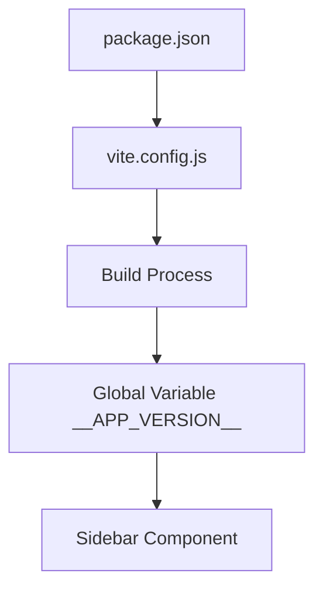

# Dynamic Version Display Implementation

## Overview
This document outlines the design for implementing a dynamic version display in the SilverCloud System application that automatically synchronizes with the version specified in the `package.json` file. Currently, the application displays a hardcoded version "4.0.0" in the sidebar, which does not reflect the actual version "4.0.4" defined in the `package.json`.

## Problem Statement
The application's UI displays an outdated version number (4.0.0) in the sidebar, while the actual project version in `package.json` is 4.0.4. This inconsistency can lead to confusion for users and developers regarding which version of the application is currently running.

## Current State Analysis
- Current UI version display (hardcoded): 4.0.0
- Actual package.json version: 4.0.4
- Location of version display: Sidebar component in `CopyCat/App.tsx` (line ~155)
- Build system: Vite
- Package manager: npm

## Solution Approach
The recommended approach is to use Vite's built-in `define` configuration to inject the version from `package.json` as a global constant at build time. This approach is:

1. Simple to implement
2. Has no runtime performance impact
3. Automatically updates with each build
4. Works consistently in both development and production environments

## Implementation Design

### 1. Modify vite.config.ts
Update the Vite configuration to read the version from `package.json` and define it as a global constant:

```javascript
import path from 'path';
import { defineConfig, loadEnv } from 'vite';
import packageJson from './package.json';

export default defineConfig(({ mode }) => {
    const env = loadEnv(mode, '.', '');
    return {
      base: '/GumusBulut/',
      define: {
        'process.env.API_KEY': JSON.stringify(env.GEMINI_API_KEY),
        'process.env.GEMINI_API_KEY': JSON.stringify(env.GEMINI_API_KEY),
        '__APP_VERSION__': JSON.stringify(packageJson.version)
      },
      resolve: {
        alias: {
          '@': path.resolve(__dirname, '.'),
        }
      }
    };
});
```

### Error Handling
Add error handling to ensure the build process doesn't fail if package.json is malformed or version is missing:

```javascript
import path from 'path';
import { defineConfig, loadEnv } from 'vite';

// Safe import of package.json with error handling
let appVersion = 'unknown';
try {
  const packageJson = require('./package.json');
  appVersion = packageJson.version || 'unknown';
} catch (error) {
  console.warn('Failed to read version from package.json:', error.message);
}

export default defineConfig(({ mode }) => {
    const env = loadEnv(mode, '.', '');
    return {
      base: '/GumusBulut/',
      define: {
        'process.env.API_KEY': JSON.stringify(env.GEMINI_API_KEY),
        'process.env.GEMINI_API_KEY': JSON.stringify(env.GEMINI_API_KEY),
        '__APP_VERSION__': JSON.stringify(appVersion)
      },
      resolve: {
        alias: {
          '@': path.resolve(__dirname, '.'),
        }
      }
    };
});
```

### 2. Update Sidebar Component
Modify the Sidebar component in `App.tsx` to use the dynamically injected version instead of the hardcoded value:

```tsx
// In the Sidebar component's footer section (around line 155):
<div className="p-2 text-center text-xs text-slate-400">
  Version: {__APP_VERSION__}
</div>
```

## Architecture Considerations
1. **Build-time vs Runtime**: The version information is determined at build time, which is appropriate for application versions
2. **Performance**: No runtime performance impact as the version is injected at build time
3. **Maintenance**: The solution automatically keeps the UI version in sync with package.json

## Data Flow


## Implementation Steps
1. Update `vite.config.ts` to read version from package.json and define global variable with error handling
2. Modify the Sidebar component in `App.tsx` to use the dynamic version
3. Test the implementation in both development and production builds
4. Verify that version updates in package.json are reflected in the UI
5. Document the implementation for future maintenance

## Testing Plan
1. Verify that the current version (4.0.4) is displayed correctly in the sidebar
2. Update the version in package.json to a test value (e.g., 4.0.5)
3. Rebuild the application and verify the new version is displayed
4. Test both development and production builds

## Benefits
1. Automatic synchronization between package.json and UI version display
2. Eliminates manual updates and reduces human error
3. Maintains consistency across different environments
4. Simple implementation with minimal code changes
5. Robust error handling ensures build process stability

## Risks and Mitigations
1. **Risk**: Build process failure if package.json is malformed
   **Mitigation**: Add error handling in vite.config.ts (included in implementation)
2. **Risk**: Version not updating in production
   **Mitigation**: Implement proper CI/CD pipeline that rebuilds on version changes
3. **Risk**: Development and production version mismatch
   **Mitigation**: Always rebuild application when package.json version changes