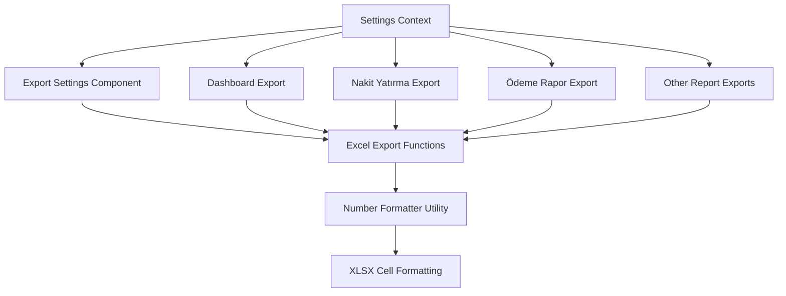
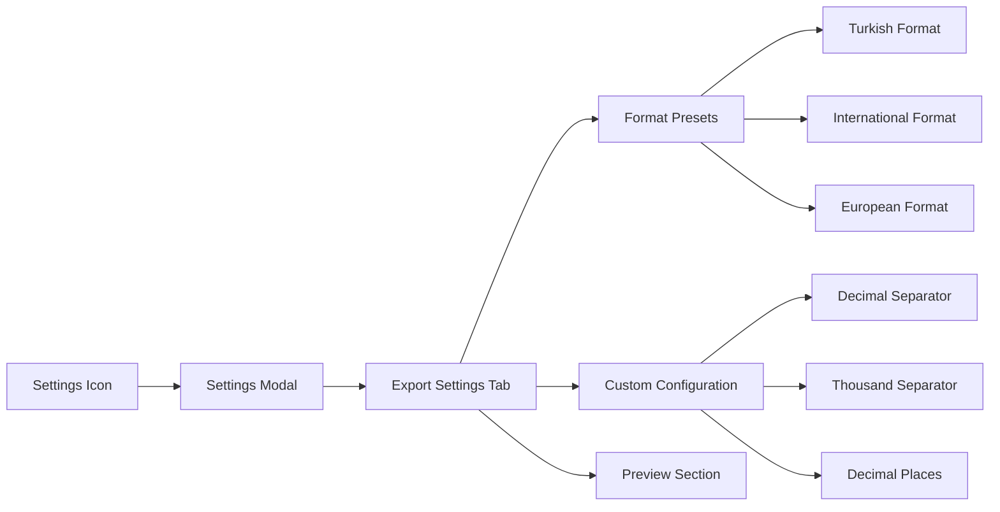
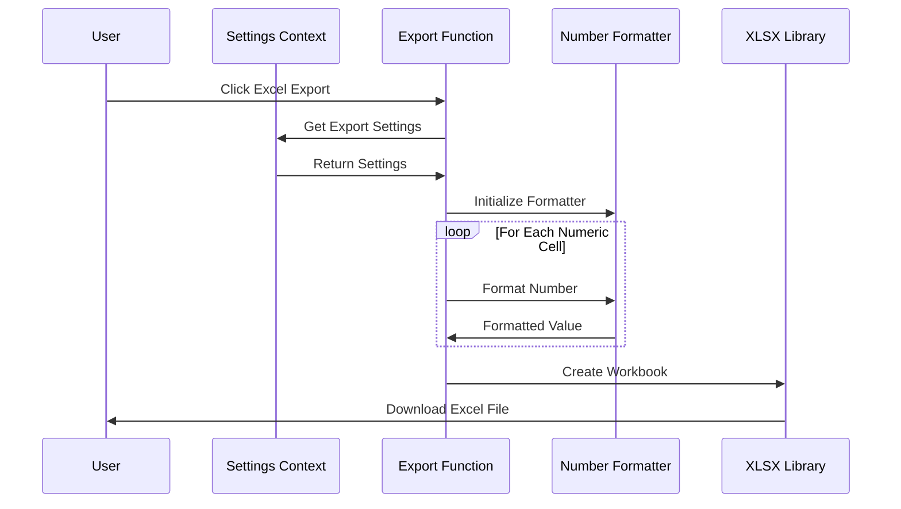
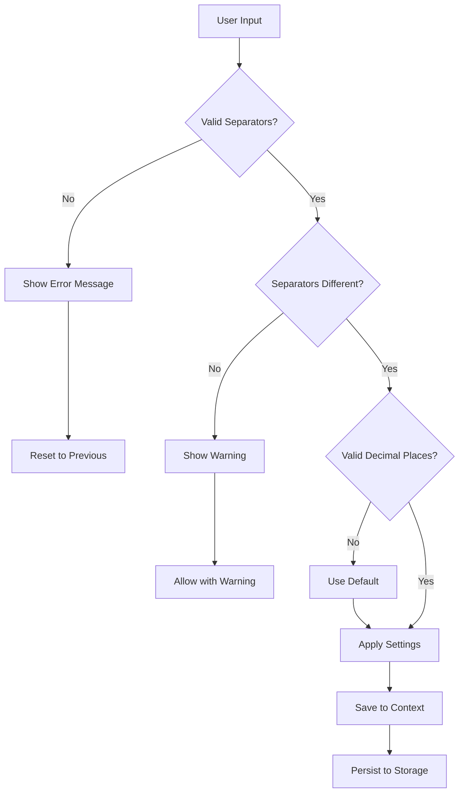

# Excel Export Settings Design Document

## Overview

This document outlines the design for implementing configurable decimal and thousand separator settings for the "Excel'e Aktar" (Export to Excel) functionality in the SilverCloud System. The enhancement will allow users to customize number formatting in Excel exports according to their regional preferences and business requirements.

## Technology Stack & Dependencies

### Current Implementation
- **XLSX Library**: Version 0.18.5 for Excel file generation
- **Frontend**: React with TypeScript
- **Styling**: Tailwind CSS
- **Number Formatting**: JavaScript Intl.NumberFormat API with Turkish locale ('tr-TR')

### Additional Dependencies
- **React Context API**: For global settings management
- **Local Storage API**: For persisting user preferences

## Architecture

### Component Architecture



### Data Models & Configuration

#### Export Settings Interface

```typescript
interface ExcelExportSettings {
  decimalSeparator: ',' | '.';
  thousandSeparator: '.' | ',' | ' ' | '';
  decimalPlaces: number;
  useGrouping: boolean;
  locale: string;
  customFormat?: string;
}

interface NumberFormatPreset {
  id: string;
  name: string;
  description: string;
  settings: ExcelExportSettings;
}
```

#### Default Configuration Presets

| Preset | Decimal Separator | Thousand Separator | Example |
|--------|------------------|-------------------|---------|
| Turkish (Default) | , | . | 1.234.567,89 |
| International | . | , | 1,234,567.89 |
| European | , | (space) | 1 234 567,89 |
| Simple | , | (none) | 1234567,89 |
| Custom | User Defined | User Defined | Variable |

## Feature Specifications

### Settings Management Component

#### User Interface Design



#### Settings Component Features

1. **Format Preset Selection**
   - Dropdown with predefined format options
   - Real-time preview of number formatting
   - Description of each format style

2. **Custom Configuration**
   - Decimal separator selection (comma/period)
   - Thousand separator selection (period/comma/space/none)
   - Decimal places configuration (0-4 digits)
   - Grouping toggle (enable/disable thousand separators)

3. **Preview Section**
   - Live preview showing sample numbers in selected format
   - Example values: 1234567.89, 1000, 0.5, 999.99

### Number Formatting Utility

#### Enhanced Number Formatter

```typescript
class NumberFormatter {
  private settings: ExcelExportSettings;
  
  constructor(settings: ExcelExportSettings) {
    this.settings = settings;
  }
  
  formatForExcel(value: number): string | number {
    // Returns formatted string for display or raw number for calculations
  }
  
  formatForDisplay(value: number): string {
    // Returns formatted string for UI display
  }
  
  getIntlOptions(): Intl.NumberFormatOptions {
    // Returns Intl.NumberFormat configuration
  }
}
```

### Excel Export Enhancement

#### XLSX Integration



#### Export Function Modifications

1. **Centralized Formatting**
   - Single formatter instance per export operation
   - Consistent formatting across all sheets
   - Support for both display strings and raw numbers

2. **Cell Type Management**
   - Numeric cells maintain calculation capability
   - Formatted display preserves Excel formula functionality
   - Custom number format application in Excel cells

3. **Multi-Sheet Consistency**
   - Same formatting applied across all worksheets
   - Header and summary sections maintain formatting
   - Legend and metadata sections adapt to settings

## Implementation Strategy

### Phase 1: Core Infrastructure (Week 1)

1. **Settings Context Implementation**
   - Create ExcelSettingsContext
   - Implement settings state management
   - Add localStorage persistence

2. **Number Formatter Utility**
   - Develop NumberFormatter class
   - Implement preset configurations
   - Add validation and error handling

### Phase 2: UI Components (Week 2)

1. **Settings Modal Component**
   - Design responsive settings interface
   - Implement preset selection
   - Add custom configuration controls

2. **Preview Functionality**
   - Real-time format preview
   - Sample number display
   - Format validation feedback

### Phase 3: Export Integration (Week 3)

1. **Excel Export Updates**
   - Modify existing export functions
   - Integrate NumberFormatter
   - Test cross-component compatibility

2. **Multi-Report Support**
   - Update Dashboard export
   - Enhance Nakit Yatırma Raporu export
   - Modify Ödeme Rapor export
   - Update other financial report exports

### Phase 4: Testing & Optimization (Week 4)

1. **Comprehensive Testing**
   - Unit tests for NumberFormatter
   - Integration tests for export functions
   - User acceptance testing

2. **Performance Optimization**
   - Large dataset handling
   - Memory efficiency improvements
   - Export speed optimization

## Business Logic Layer

### Settings Validation



### Export Processing Logic

1. **Number Detection**
   - Identify numeric columns in data
   - Preserve calculation columns
   - Handle mixed data types

2. **Format Application**
   - Apply formatting to display values
   - Maintain raw values for calculations
   - Handle special cases (percentages, currencies)

3. **Excel Cell Configuration**
   - Set appropriate cell formats
   - Configure column widths
   - Apply conditional formatting where needed

## User Experience Enhancements

### Accessibility Features

1. **Keyboard Navigation**
   - Tab order through settings controls
   - Enter/Space key activation
   - Escape key to close modal

2. **Screen Reader Support**
   - ARIA labels for all controls
   - Descriptive text for format options
   - Status announcements for changes

3. **Visual Indicators**
   - Clear format preview
   - Validation feedback
   - Loading states during export

### User Guidance

1. **Tooltips and Help Text**
   - Format explanation tooltips
   - Usage examples
   - Best practice recommendations

2. **Format Examples**
   - Side-by-side comparison
   - Multiple sample values
   - Regional context explanation

## Testing Strategy

### Unit Testing

1. **NumberFormatter Tests**
   - Format accuracy validation
   - Edge case handling
   - Performance benchmarks

2. **Settings Component Tests**
   - User interaction testing
   - State management validation
   - Local storage persistence

### Integration Testing

1. **Export Function Tests**
   - Multi-format export validation
   - Large dataset handling
   - Cross-browser compatibility

2. **End-to-End Tests**
   - Complete user workflow
   - Settings persistence
   - Export file validation

### Performance Testing

1. **Large Dataset Exports**
   - Memory usage monitoring
   - Processing time measurement
   - Browser performance impact

2. **Concurrent Export Operations**
   - Multi-user scenario testing
   - Resource contention handling
   - Error recovery testing