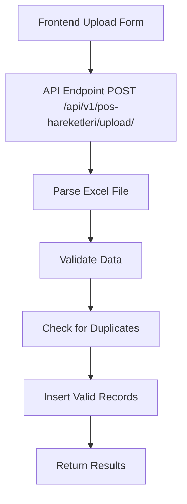
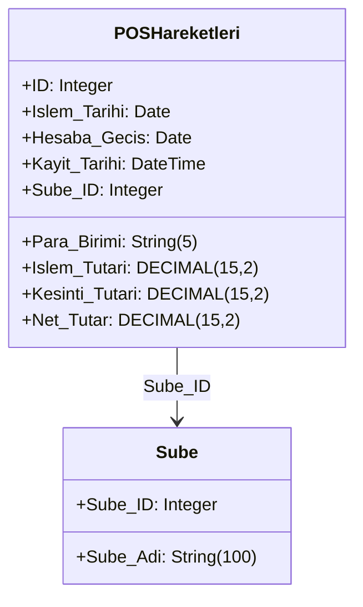
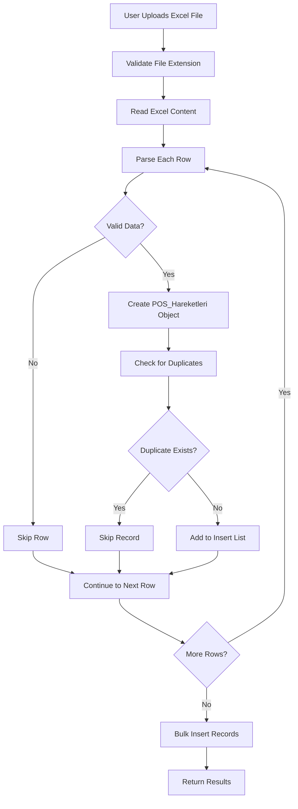

# Excel Upload Feature for POS_Hareketleri Table

## 1. Overview

This document outlines the design for implementing an Excel file upload feature for the POS_Hareketleri table. The feature will allow users to upload Excel files containing POS transaction data, which will then be parsed and inserted into the database. The implementation will follow the existing "e-Fatura Yükleme" implementation as a reference.

### Key Requirements:
- Create a menu item for this screen before "Diğer Harcamalar" under "Fatura/Harcama" menu item
- Accept Excel file uploads (.xls format), please see the sample file attached
- Parse Excel data and convert to POS_Hareketleri records
- Use current branch ID (default = 1) for Sube_ID field
- Prevent duplicate rows from being uploaded multiple times
- Follow the existing "e-Fatura Yükleme" implementation as reference

## 2. Architecture

### 2.1 Backend Architecture

The backend implementation follows the existing pattern used for other Excel upload features in the system:



### 2.2 Frontend Architecture

The frontend will follow the existing pattern for upload screens:
- File selection component
- Branch selection dropdown
- Upload button
- Results display

## 3. API Endpoints Reference

### 3.1 Upload Endpoint

**Endpoint**: `POST /api/v1/pos-hareketleri/upload/`

**Description**: Uploads POS transaction data from an Excel file

**Headers**:
```
Content-Type: multipart/form-data
Authorization: Bearer <JWT Token>
```

**Form Data**:
| Field | Type | Required | Description |
|-------|------|----------|-------------|
| sube_id | integer | Yes | The branch ID to associate with the uploaded records |
| file | file | Yes | The Excel file containing POS transaction data |

**Response**:
```json
{
  "message": "POS transactions file processed successfully.",
  "added": 0,
  "skipped": 0
}
```

### 3.2 Authentication Requirements

This endpoint requires authentication with a valid JWT token and the `pos_import` permission.

## 4. Data Models & ORM Mapping

### 4.1 POSHareketleri Model

The POSHareketleri model is already defined in the system:



### 4.2 Excel File Format

The Excel file should contain the following columns:

| Column Name | Required | Data Type | Description |
|-------------|----------|-----------|-------------|
| Islem_Tarihi | Yes | Date | Transaction date (format: DD.MM.YYYY) |
| Hesaba_Gecis | Yes | Date | Account transfer date (format: DD.MM.YYYY) |
| Para_Birimi | Yes | String (5 chars max) | Currency code (e.g., "TRY", "USD") |
| Islem_Tutari | Yes | Decimal | Transaction amount |
| Kesinti_Tutari | No | Decimal | Deduction amount (default: 0.00) |
| Net_Tutar | No | Decimal | Net amount |

## 5. Business Logic Layer

### 5.1 File Processing Flow



### 5.2 Duplicate Detection

The system prevents duplicate uploads by checking for existing records with the same:
- Islem_Tarihi
- Hesaba_Gecis
- Para_Birimi
- Islem_Tutari
- Sube_ID

This is implemented in the database layer using the CRUD functions.

### 5.3 Error Handling

The system handles the following error cases:
1. Invalid file types (only .xls and .xlsx accepted)
2. Corrupted Excel files
3. Missing required columns
4. Invalid data formats
5. Database insertion errors

## 6. Frontend Implementation

### 6.1 Menu Structure

A new menu item will be added to the "Fatura/Harcama" section before "Diğer Harcamalar":

```typescript
{
    title: 'Fatura/Harcama',
    items: [
        // ... existing items
        { label: 'POS Hareketleri Yükleme', path: '/pos-hareketleri-upload', icon: Icons.Upload, permission: 'pos_import' },
        { label: 'Diğer Harcamalar', path: '/other-expenses', icon: Icons.CreditCard, permission: DIGER_HARCAMALAR_EKRANI_YETKI_ADI },
        // ... other items
    ]
}
```

### 6.2 Component Structure

The upload screen will include:
1. File selection component
2. Branch selection dropdown (defaulting to current user's branch)
3. Upload button
4. Results display showing number of records added/skipped

### 6.3 State Management

The component will manage the following state:
- Selected file
- Selected branch ID
- Upload progress
- Results (added/skipped counts)
- Error messages

## 7. Testing

### 7.1 Unit Tests

Unit tests will be implemented for:
1. Excel file parsing functions
2. Data validation functions
3. Duplicate detection logic
4. CRUD operations for POS_Hareketleri

### 7.2 Integration Tests

Integration tests will cover:
1. End-to-end file upload process
2. Authentication and permission checks
3. Error handling scenarios
4. Duplicate record handling

### 7.3 Test Cases

| Test Case | Description | Expected Result |
|-----------|-------------|-----------------|
| Valid Excel Upload | Upload a valid Excel file with correct format | Records are inserted, correct counts returned |
| Invalid File Type | Upload a non-Excel file | Error response with appropriate message |
| Duplicate Records | Upload file with records that already exist | Records are skipped, correct counts returned |
| Missing Columns | Upload Excel file missing required columns | Error response with appropriate message |
| Invalid Data Format | Upload Excel file with incorrectly formatted data | Invalid rows are skipped |