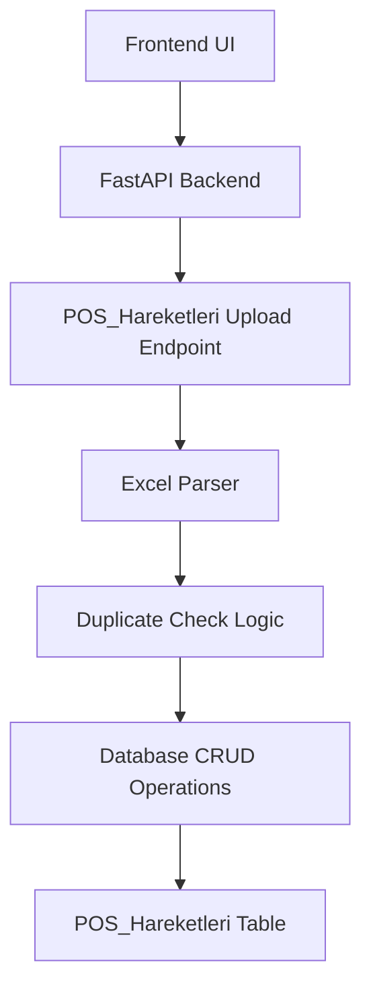
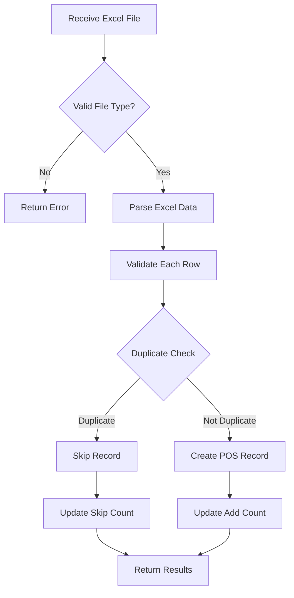

# Excel Upload Feature for POS_Hareketleri Table

## 1. Overview

This document outlines the design for implementing an Excel file upload feature for the POS_Hareketleri table. The feature will allow users to upload Excel files containing POS transaction data, which will then be parsed and inserted into the database. The implementation will follow the existing pattern established by the B2B Ekstre upload functionality.

### Key Requirements:
- Accept Excel file uploads (.xls format)
- Parse Excel data and convert to POS_Hareketleri records
- Use current branch ID (default = 1) for Sube_ID field
- Prevent duplicate rows from being uploaded multiple times
- Follow the existing "e-Fatura Yükleme" implementation as reference

## 2. Architecture

### 2.1 System Context
The POS_Hareketleri upload feature will be integrated into the existing FastAPI backend and will follow the same architectural patterns as other upload features in the system.



### 2.2 Component Interaction
1. Frontend sends Excel file and branch ID via multipart form data
2. Backend endpoint receives the file and processes it
3. Excel file is parsed using openpyxl library
4. Each row is validated and checked for duplicates
5. Valid, non-duplicate records are inserted into the database
6. Response with upload statistics is returned to frontend

## 3. API Endpoints Reference

### 3.1 New Endpoint
```
POST /api/v1/pos-hareketleri/upload/
```

**Parameters:**
- `sube_id` (Form Data): Integer - Branch ID for the records
- `file` (Form Data): File - Excel file containing POS transaction data

**Response:**
```json
{
  "message": "POS transactions file processed successfully.",
  "added": 0,
  "skipped": 0
}
```

**Implementation Example:**
```python
@router.post("/pos-hareketleri/upload/")
async def upload_pos_hareketleri(
    sube_id: int = Form(...),
    file: UploadFile = File(...), 
    db: Session = Depends(database.get_db)
):
    # Implementation follows B2B Ekstre pattern
    pass
```

### 3.2 Request/Response Schema

**Request Format:**
- Content-Type: multipart/form-data
- Form fields:
  - sube_id: integer
  - file: Excel file (.xls or .xlsx)

**Response Format:**
- Success (201 Created):
  ```json
  {
    "message": "POS transactions file processed successfully.",
    "added": <number_of_records_added>,
    "skipped": <number_of_records_skipped>
  }
  ```

**Error Responses:**
- 400 Bad Request: Invalid file type or missing parameters
- 500 Internal Server Error: Processing error

### 3.3 Authentication Requirements
The endpoint will require the same authentication as other POS_Hareketleri endpoints, using JWT tokens.

## 4. Data Models & ORM Mapping

### 4.1 POS_Hareketleri Model
The existing POS_Hareketleri model will be used:

| Column | Type | Required | Description |
|--------|------|----------|-------------|
| ID | Integer | Auto | Primary key |
| Islem_Tarihi | Date | Yes | Transaction date |
| Hesaba_Gecis | Date | Yes | Account transfer date |
| Para_Birimi | String(5) | Yes | Currency code |
| Islem_Tutari | DECIMAL(15,2) | Yes | Transaction amount |
| Kesinti_Tutari | DECIMAL(15,2) | No | Deduction amount |
| Net_Tutar | DECIMAL(15,2) | No | Net amount |
| Sube_ID | Integer | Yes | Branch ID (Foreign Key) |
| Kayit_Tarihi | DateTime | No | Record creation timestamp |

### 4.2 Excel Data Mapping
The Excel file should contain columns that map to the POS_Hareketleri fields:

| Excel Column | Database Field | Required | Format |
|--------------|----------------|----------|--------|
| Islem_Tarihi | Islem_Tarihi | Yes | DD.MM.YYYY |
| Hesaba_Gecis | Hesaba_Gecis | Yes | DD.MM.YYYY |
| Para_Birimi | Para_Birimi | Yes | String (e.g., "TRY") |
| Islem_Tutari | Islem_Tutari | Yes | Numeric |
| Kesinti_Tutari | Kesinti_Tutari | No | Numeric |
| Net_Tutar | Net_Tutar | No | Numeric |

## 5. Business Logic Layer

### 5.1 Excel Processing Flow


### 5.2 Duplicate Detection Logic
To prevent duplicate uploads, the system will check for existing records with the same:
- Islem_Tarihi
- Hesaba_Gecis
- Para_Birimi
- Islem_Tutari
- Sube_ID

**Implementation Example:**
```python
def is_duplicate_pos_hareket(db: Session, pos_hareket: POSHareketleriCreate):
    existing = db.query(models.POSHareketleri).filter(
        models.POSHareketleri.Islem_Tarihi == pos_hareket.Islem_Tarihi,
        models.POSHareketleri.Hesaba_Gecis == pos_hareket.Hesaba_Gecis,
        models.POSHareketleri.Para_Birimi == pos_hareket.Para_Birimi,
        models.POSHareketleri.Islem_Tutari == pos_hareket.Islem_Tutari,
        models.POSHareketleri.Sube_ID == pos_hareket.Sube_ID
    ).first()
    return existing is not None
```

### 5.3 Data Validation
Each row will be validated for:
- Required fields presence
- Date format compliance
- Numeric value validity
- Field length restrictions

## 6. Implementation Details

### 6.1 Backend Implementation
The implementation will follow the pattern established in `backend/api/v1/endpoints/b2b_ekstre.py`:

1. Create a new endpoint in `backend/api/v1/endpoints/pos_hareketleri.py`
2. Add Excel parsing logic using openpyxl or xlrd for .xls files
3. Implement duplicate detection in CRUD operations
4. Update database schema if needed

**Required Dependencies:**
- Add `openpyxl` to requirements.txt for Excel processing

**Implementation Steps:**
1. Import required modules:
   ```python
   from fastapi import APIRouter, Depends, HTTPException, status, UploadFile, File, Form
   import pandas as pd
   from io import BytesIO
   ```
2. Create upload endpoint following B2B Ekstre pattern
3. Implement Excel parsing with proper error handling
4. Add duplicate detection logic using existing POS_Hareketleri fields

### 6.2 Frontend Integration
The frontend will need to:
1. Provide a file upload interface similar to B2B Ekstre upload
2. Convert Excel files to a format that can be processed by the backend
3. Display upload results to the user

### 6.3 Error Handling
- Invalid file types will be rejected with appropriate error messages
- Malformed data in Excel files will be skipped with logging
- Database errors will be handled gracefully with rollback mechanisms

## 7. Testing Strategy

### 7.1 Unit Tests
- Test Excel file parsing with various formats
- Test duplicate detection logic
- Test data validation functions
- Test CRUD operations for POS_Hareketleri records

### 7.2 Integration Tests
- Test complete upload flow with sample Excel files
- Test error conditions and edge cases
- Test authentication requirements

### 7.3 Test Data
Sample Excel files with valid and invalid data will be created for testing purposes.

## 8. Security Considerations

### 8.1 File Type Validation
- Only .xls and .xlsx files will be accepted
- File content will be validated to ensure it's a valid Excel file

### 8.2 Data Sanitization
- All data from Excel files will be sanitized before database insertion
- Input validation will prevent SQL injection and other attacks

### 8.3 Authentication
- The upload endpoint will require the same authentication as other POS_Hareketleri endpoints
- Role-based access control will be enforced

## 9. Performance Considerations

### 9.1 Large File Handling
- Large Excel files will be processed in chunks to prevent memory issues
- Progress feedback will be provided for long-running operations

### 9.2 Database Performance
- Bulk insert operations will be used for better performance
- Proper indexing on duplicate detection fields will be ensured