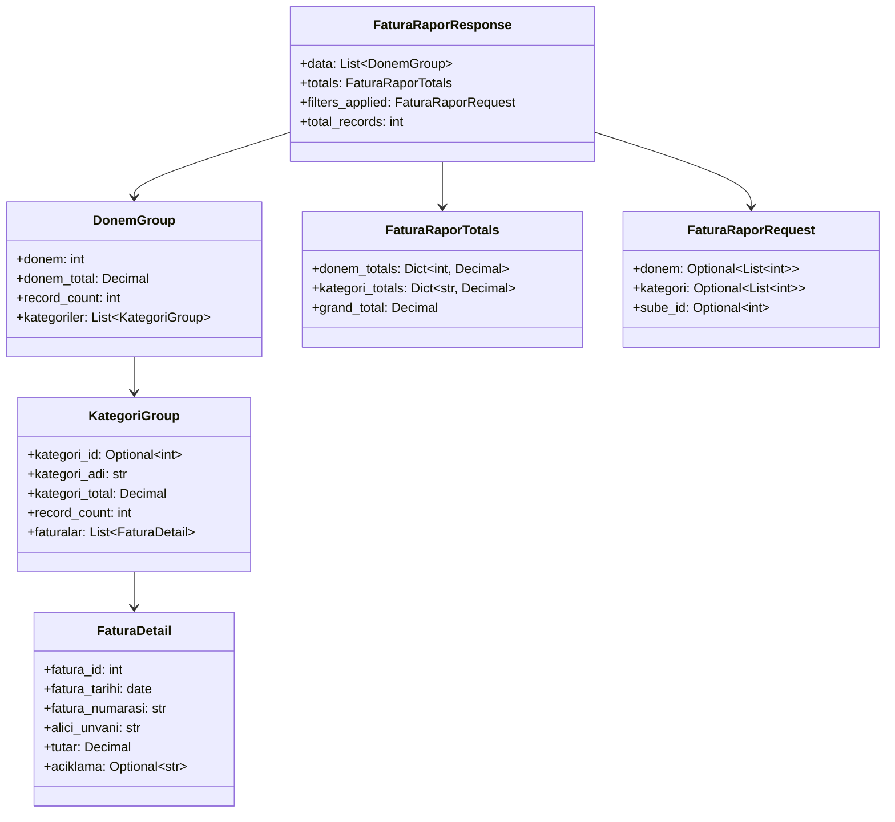
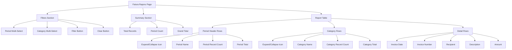

# Fatura Raporu Feature Design Document

## 1. Overview

This document outlines the design for implementing a "Fatura Raporu" (Invoice Report) feature under the "Rapor" (Report) menu in the SilverCloud system. The feature will display detailed information from the e-Fatura (e-Invoice) table with expandable data breakdowns by "Donem" (Period) and "Kategori" (Category), similar to the existing "Ödeme Rapor" (Payment Report).

## 2. Requirements

### 2.1 Functional Requirements
- Display a new "Fatura Raporu" menu item under the "Rapor" menu
- Show e-Fatura data grouped by period and category
- Provide expandable/collapsible sections for period and category breakdowns
- Allow filtering by period and category
- Display summary information including total records and amounts
- Support PDF and Excel export functionality

### 2.2 Non-Functional Requirements
- Follow existing UI patterns and styling conventions
- Maintain consistency with the "Ödeme Rapor" implementation
- Use Turkish locale number formatting (dot for thousands, comma for decimals)
- Implement proper error handling and loading states

## 3. Architecture

### 3.1 Frontend Architecture
The frontend implementation will follow the same pattern as the existing "Ödeme Rapor" page:
- React component using TypeScript
- Context API for state management
- Custom hooks for data fetching
- Tailwind CSS for styling
- Multi-select components for filters

### 3.2 Backend Architecture
The backend will require:
- New CRUD function to fetch and group e-Fatura data
- New API endpoint for the report
- New Pydantic schemas for request/response data

## 4. API Design

### 4.1 Endpoint
```
GET /api/v1/fatura-rapor/
```

### 4.2 Query Parameters
- `donem` (Optional[List[int]]): List of periods to filter by
- `kategori` (Optional[List[int]]): List of category IDs to filter by
- `sube_id` (Optional[int]): Branch ID filter

### 4.3 Response Schema


## 5. Data Model

### 5.1 Database Schema
The report will use the existing `e_Fatura` table with the following relevant columns:
- `Fatura_ID` (Primary Key)
- `Fatura_Tarihi` (Date)
- `Fatura_Numarasi` (String)
- `Alici_Unvani` (String)
- `Tutar` (Decimal)
- `Kategori_ID` (Foreign Key)
- `Donem` (Integer)
- `Sube_ID` (Foreign Key)

### 5.2 Data Grouping Logic
1. Group e-Fatura records by `Donem` (Period)
2. Within each period, group by `Kategori_ID`
3. Calculate totals at each level (period total, category total)
4. Count records at each level

## 6. UI Design

### 6.1 Page Structure


### 6.2 Component Hierarchy
```
FaturaRaporPage
├── MultiSelect (Period filter)
├── MultiSelect (Category filter)
├── SummarySection
│   ├── TotalRecordsCard
│   ├── PeriodCountCard
│   └── GrandTotalCard
└── ReportTable
    ├── PeriodRow
    │   ├── ExpandableCategoryRow
    │   │   └── FaturaDetailRow
    │   └── ...
    └── ...
```

### 6.3 Filter Implementation
- Use 4-column responsive grid layout (consistent with Fatura Kategori Atama page)
- Multi-select components for period and category filters
- Default to current period when page loads
- Dynamic calculation of available periods from actual data

## 7. Business Logic

### 7.1 Data Fetching
1. Fetch available periods (last 12 months)
2. Fetch available categories
3. Load report data based on selected filters
4. Group data by period and category

### 7.2 Data Processing
1. Convert period format if needed (handle both YYMM and YYYYMM formats)
2. Calculate totals at each grouping level
3. Handle uncategorized records appropriately
4. Sort periods in descending order

### 7.3 Export Functionality
- PDF export using existing pdfGenerator utility
- Excel export with two sheets:
  - Summary data
  - Detailed report data

## 8. Security Considerations

### 8.1 Authentication
- Endpoint will require valid JWT token
- User must have appropriate permissions to access report data

### 8.2 Authorization
- Users can only view data for their assigned branch
- Category visibility will respect existing category permissions

## 9. Error Handling

### 9.1 Error States
- Network errors during data fetching
- Invalid filter parameters
- Database connection issues
- Empty result sets

### 9.2 Loading States
- Show loading spinner during data fetch
- Disable filter controls during loading
- Provide clear feedback to users

## 10. Testing Strategy

### 10.1 Unit Tests
- Test CRUD function for data grouping logic
- Test API endpoint with various filter combinations
- Test edge cases (empty data, invalid parameters)

### 10.2 Integration Tests
- Test complete data flow from database to UI
- Test export functionality
- Test filter interactions

### 10.3 UI Tests
- Test expand/collapse functionality
- Test filter behavior
- Test responsive design

## 11. Implementation Plan

### 11.1 Backend Implementation
1. Create new Pydantic schemas for Fatura report
2. Implement CRUD function for data grouping
3. Add new API endpoint to report router
4. Write unit tests for backend functionality

### 11.2 Frontend Implementation
1. Create new FaturaRaporu.tsx page component
2. Implement filter components and logic
3. Create expandable row components
4. Implement data fetching and state management
5. Add export functionality
6. Write unit tests for frontend components

### 11.3 Integration
1. Add menu item to constants.tsx
2. Update routing configuration
3. Test end-to-end functionality
4. Perform user acceptance testing

## 12. Dependencies

### 12.1 Existing Components
- MultiSelect component (from Ödeme Rapor)
- Expandable row patterns (from Ödeme Rapor)
- PDF and Excel export utilities
- Format number utility for Turkish locale

### 12.2 New Components
- FaturaRaporu.tsx page component
- Fatura report specific schemas
- Backend CRUD function and API endpoint

## 13. Performance Considerations

### 13.1 Data Optimization
- Efficient database queries with proper indexing
- Pagination for large datasets (if needed)
- Caching of frequently accessed data

### 13.2 UI Optimization
- Virtual scrolling for large tables (if needed)
- Lazy loading of expandable sections
- Proper memoization of computed values