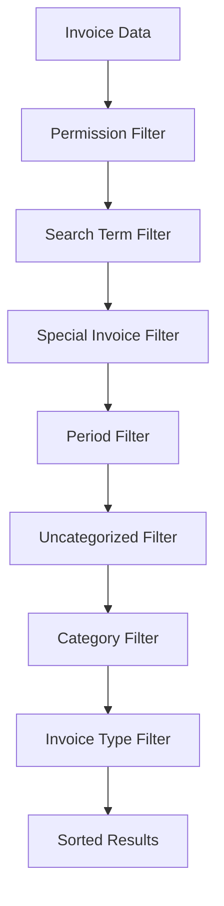
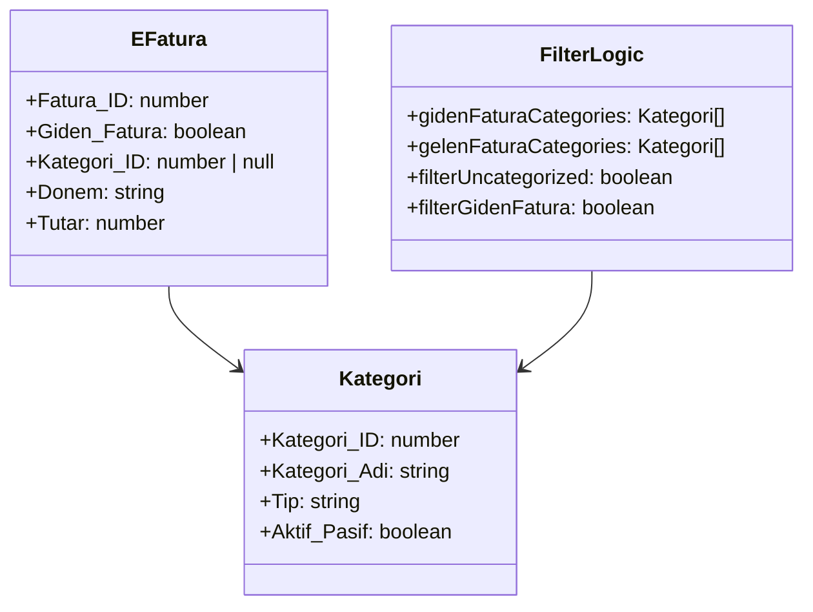
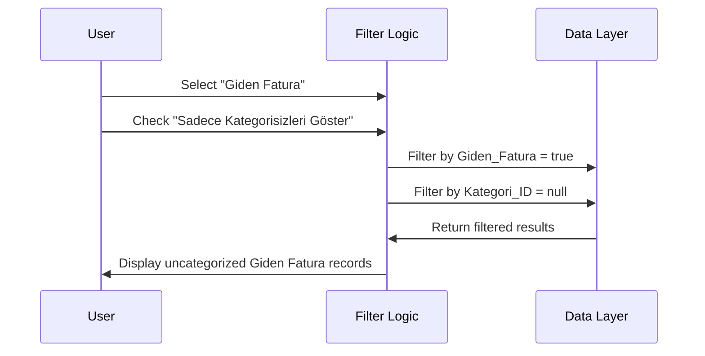
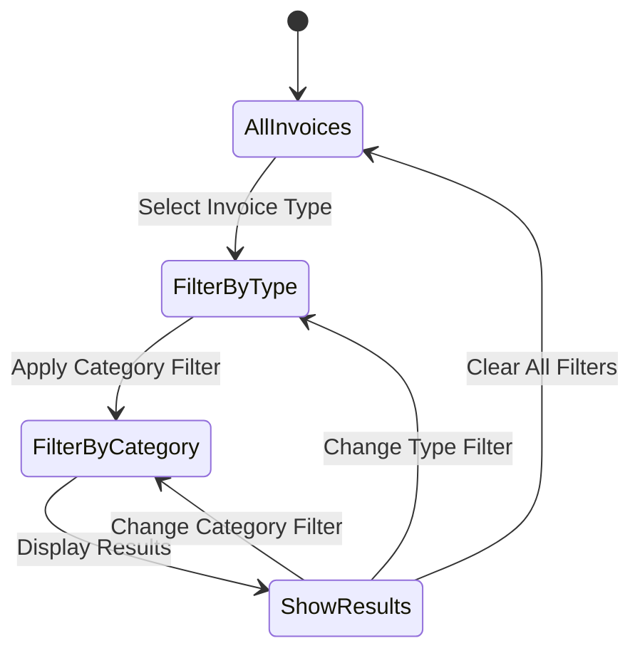

# Fix Category Filter Logic - Fatura Kategori Atama Screen

## Overview

The Fatura Kategori Atama (Invoice Category Assignment) screen has a filtering issue where the "Sadece Kategorisizleri Göster" (Show Only Uncategorized) checkbox doesn't properly display Giden Fatura (Outgoing Invoice) records that don't have any category assigned when "Giden Fatura" is selected in the invoice type filter.

## Problem Analysis

### Current Filter Logic Sequence
The filtering logic in `filteredFaturas` useMemo processes filters in this order:

1. **Permission-based filters**: Special invoice visibility
2. **Search term filter**: Filters by invoice number, recipient, description
3. **Special invoice filter**: Filters by Özel (Special) status
4. **Period filter**: Filters by Donem (Period)
5. **Uncategorized filter**: Filters records where `Kategori_ID === null`
6. **Category filter**: Filters by selected category ID
7. **Invoice type filter**: Filters by `Giden_Fatura` boolean field

### Root Cause Analysis

The filtering logic itself is working correctly. However, there's a logical issue in the user workflow:

1. When "Giden Fatura" is selected, the system correctly filters to show only outgoing invoices
2. When "Sadece Kategorisizleri Göster" is checked, it correctly shows only records where `Kategori_ID === null`
3. **The issue**: Both filters work independently and correctly

The problem appears to be related to understanding what constitutes an "uncategorized" record for different invoice types:

- **Gelen Fatura** (Incoming): Can be assigned categories of type 'Bilgi' or 'Gider'
- **Giden Fatura** (Outgoing): Can be assigned categories of type 'Bilgi' or 'Giden Fatura'

## Current Implementation Details

### Filter Components Architecture



### Category Assignment Logic



### Category Type Mapping

| Invoice Type | Allowed Category Types |
|-------------|----------------------|
| Gelen Fatura | 'Bilgi', 'Gider' |
| Giden Fatura | 'Bilgi', 'Giden Fatura' |

## Solution Architecture

### Enhanced Filter Logic

The solution involves improving the filter logic to ensure proper handling of uncategorized records based on invoice type context.



### Filter State Management



## Implementation Strategy

### 1. Filter Logic Verification

The current filtering implementation should work correctly. The issue might be:

- **Data Issue**: No Giden Fatura records exist without categories
- **UI Issue**: User expectation vs. actual data state
- **Logic Issue**: Filter interaction causing unexpected behavior

### 2. Debugging Enhancement

Add debugging capabilities to understand the data flow:

```typescript
// Debug information to add to component
const debugInfo = useMemo(() => {
  const totalRecords = eFaturaList.filter(f => f.Sube_ID === selectedBranch?.Sube_ID).length;
  const gidenFaturaRecords = eFaturaList.filter(f => 
    f.Sube_ID === selectedBranch?.Sube_ID && f.Giden_Fatura
  ).length;
  const uncategorizedGidenRecords = eFaturaList.filter(f => 
    f.Sube_ID === selectedBranch?.Sube_ID && 
    f.Giden_Fatura && 
    f.Kategori_ID === null
  ).length;
  
  return {
    totalRecords,
    gidenFaturaRecords,
    uncategorizedGidenRecords
  };
}, [eFaturaList, selectedBranch]);
```

### 3. UI Enhancement

Improve user feedback by showing filter result counts:

```typescript
// Filter result indicator
const filterResultInfo = useMemo(() => {
  if (filterGidenFatura !== undefined && filterUncategorized) {
    const type = filterGidenFatura ? 'Giden' : 'Gelen';
    return `${filteredFaturas.length} kategorisiz ${type} fatura bulundu`;
  }
  return `${filteredFaturas.length} fatura gösteriliyor`;
}, [filteredFaturas, filterGidenFatura, filterUncategorized]);
```

### 4. Data Validation

Ensure data integrity by validating invoice records:

- Verify Giden_Fatura field values
- Check for null vs undefined in Kategori_ID
- Validate category type assignments

## Technical Specifications

### Component Updates

1. **Enhanced Debugging**: Add debug information panel (removable in production)
2. **Filter Result Indicator**: Show count of filtered records
3. **Data Validation**: Add client-side data validation warnings

### Code Modifications

The primary modifications will be in the `InvoiceCategoryAssignmentPage` component:

1. Add debug information calculation
2. Enhance filter result messaging
3. Add data validation checks
4. Improve user feedback

### Testing Strategy

1. **Unit Tests**: Test filter combinations
2. **Integration Tests**: Test with different data scenarios
3. **User Acceptance Tests**: Verify expected behavior matches user requirements

## Data Flow Validation

### Filter Combination Matrix

| Giden Fatura | Kategorisiz | Expected Result |
|-------------|-------------|-----------------|
| true | true | Only uncategorized outgoing invoices |
| true | false | All outgoing invoices |
| false | true | Only uncategorized incoming invoices |
| false | false | All incoming invoices |
| undefined | true | All uncategorized invoices |
| undefined | false | All invoices |

### Expected Behavior Verification

The system should correctly handle all filter combinations and provide clear feedback when no records match the selected criteria.