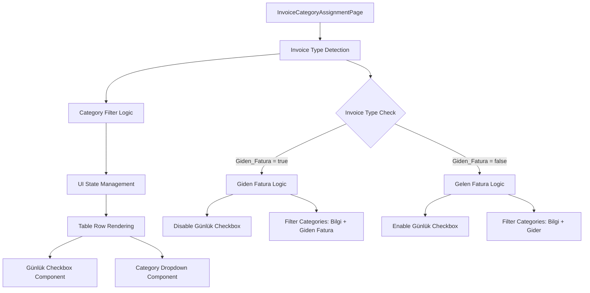
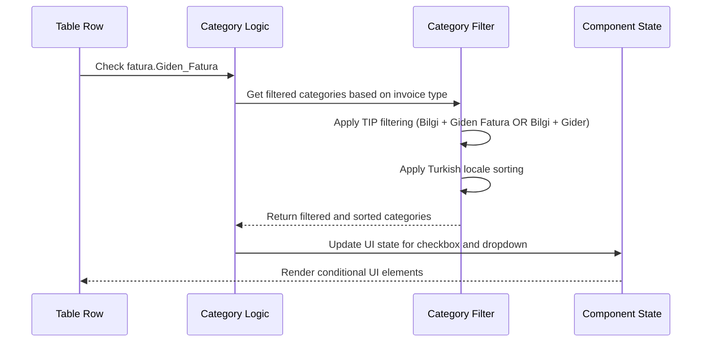

# Invoice Category Assignment Enhancement Design

## Overview

This design outlines the enhancement of the Fatura Kategori Atama (Invoice Category Assignment) screen to implement conditional behavior based on invoice types. The enhancement will dynamically adjust the UI elements and category filtering based on whether the record is "Giden Fatura" (Outgoing Invoice) or "Gelen Fatura" (Incoming Invoice).

## Current System Context

The SilverCloud system currently has a Fatura Kategori Atama screen that allows users to assign categories to invoices. The system supports different invoice types through the `Giden_Fatura` boolean field in the EFatura model, and categories have a `Tip` field that can contain values like 'Gelir', 'Gider', 'Bilgi', 'Ödeme', and 'Giden Fatura'.

## Requirements Analysis

### Functional Requirements

1. **Giden Fatura (Outgoing Invoice) Behavior:**
   - Disable the "Günlük" (Daily) checkbox
   - Display "Giden" text in place of the checkbox
   - Filter kategori dropdown to show only categories with TIP values: "Bilgi" and "Giden Fatura"

2. **Gelen Fatura (Incoming Invoice) Behavior:**
   - Keep the "Günlük" (Daily) checkbox enabled and functional
   - Filter kategori dropdown to show only categories with TIP values: "Bilgi" and "Gider"

3. **Dynamic Category Filtering:**
   - Categories must be filtered based on the invoice type
   - Maintain Turkish locale-aware sorting
   - Respect existing visibility permissions (Gizli categories)

## Architecture Design

### Component Architecture



### Data Flow Architecture



## Implementation Design

### Frontend Component Modifications

#### 1. Enhanced Category Filtering Logic

```typescript
// New function to get categories based on invoice type
const getCategoriesForInvoiceType = useMemo(() => {
  return (isGidenFatura: boolean) => {
    const allowedTips = isGidenFatura 
      ? ['Bilgi', 'Giden Fatura'] 
      : ['Bilgi', 'Gider'];
    
    return kategoriList.filter(k => 
      k.Aktif_Pasif &&
      allowedTips.includes(k.Tip) &&
      (canViewGizliKategoriler || !k.Gizli)
    ).sort((a, b) => a.Kategori_Adi.localeCompare(b.Kategori_Adi, 'tr', { sensitivity: 'base' }));
  };
}, [kategoriList, canViewGizliKategoriler]);
```

#### 2. Table Row Component Enhancement

```mermaid
graph LR
    A[Table Row] --> B{Check Giden_Fatura}
    B -->|true| C[Render "Giden" Text]
    B -->|false| D[Render Günlük Checkbox]
    
    B --> E[Get Filtered Categories]
    E -->|Giden Fatura| F[Categories: Bilgi + Giden Fatura]
    E -->|Gelen Fatura| G[Categories: Bilgi + Gider]
    
    F --> H[Render Category Dropdown]
    G --> H
```

#### 3. UI State Management

The enhancement will modify the existing table row rendering logic:

- **Conditional Günlük Field Rendering:**
  - For Giden Fatura: Display static text "Giden"
  - For Gelen Fatura: Display functional checkbox

- **Dynamic Category Dropdown:**
  - Each row will have its own filtered category list
  - Categories filtered based on the specific invoice's type

### Performance Considerations

#### 1. Memoization Strategy

```typescript
// Memoize category filtering per invoice type
const gidenFaturaCategories = useMemo(() => 
  getCategoriesForInvoiceType(true), [getCategoriesForInvoiceType]);

const gelenFaturaCategories = useMemo(() => 
  getCategoriesForInvoiceType(false), [getCategoriesForInvoiceType]);
```

#### 2. Rendering Optimization

- Pre-compute category lists for both invoice types
- Avoid recalculating category filters on each row render
- Use React.memo for category dropdown components if needed

## Technical Specifications

### Category TIP Value Mappings

| Invoice Type | Allowed Category TIP Values |
|--------------|----------------------------|
| Giden Fatura | "Bilgi", "Giden Fatura"   |
| Gelen Fatura | "Bilgi", "Gider"          |

### UI Component Specifications

#### Günlük Field Specification

| Invoice Type | Display | Functionality |
|--------------|---------|---------------|
| Giden Fatura | Static text "Giden" | Non-interactive |
| Gelen Fatura | Checkbox | Interactive, updates Gunluk_Harcama |

#### Category Dropdown Specification

- **Filtering:** Based on invoice type and category TIP values
- **Sorting:** Turkish locale-aware alphabetical sorting
- **Permissions:** Respect Gizli category visibility permissions
- **Selection:** Maintain existing category assignment functionality

### Data Model Impact

No changes required to existing data models. The enhancement uses existing fields:
- `EFatura.Giden_Fatura` (boolean)
- `EFatura.Gunluk_Harcama` (boolean)
- `Kategori.Tip` (string enum)
- `Kategori.Gizli` (boolean)
- `Kategori.Aktif_Pasif` (boolean)

## Testing Strategy

### Unit Testing Requirements

1. **Category Filtering Tests:**
   - Verify correct categories returned for Giden Fatura
   - Verify correct categories returned for Gelen Fatura
   - Test Turkish locale sorting functionality
   - Test permission-based filtering (Gizli categories)

2. **UI Component Tests:**
   - Test Günlük checkbox disabled for Giden Fatura
   - Test "Giden" text display for Giden Fatura
   - Test Günlük checkbox enabled for Gelen Fatura
   - Test category dropdown population based on invoice type

### Integration Testing Requirements

1. **End-to-End Scenarios:**
   - Test category assignment for Giden Fatura records
   - Test category assignment for Gelen Fatura records
   - Test Günlük checkbox functionality for Gelen Fatura
   - Verify UI updates when switching between invoice types

## Implementation Guidelines

### Code Quality Standards

1. **Performance:**
   - Use React.useMemo() for category filtering operations
   - Avoid unnecessary re-renders with proper memoization
   - Pre-compute category lists rather than filtering per row

2. **Maintainability:**
   - Extract category filtering logic into reusable utilities
   - Follow existing TypeScript interface patterns
   - Maintain consistent naming conventions

3. **Accessibility:**
   - Ensure proper ARIA labels for conditional UI elements
   - Maintain keyboard navigation functionality
   - Provide clear visual indicators for disabled elements

### Error Handling

1. **Data Validation:**
   - Handle cases where category TIP values might be unexpected
   - Graceful fallback if no categories match filtering criteria
   - Validate invoice type before applying conditional logic

2. **User Experience:**
   - Clear visual feedback for disabled Günlük checkbox
   - Intuitive display of "Giden" text as replacement
   - Consistent category dropdown behavior across invoice types