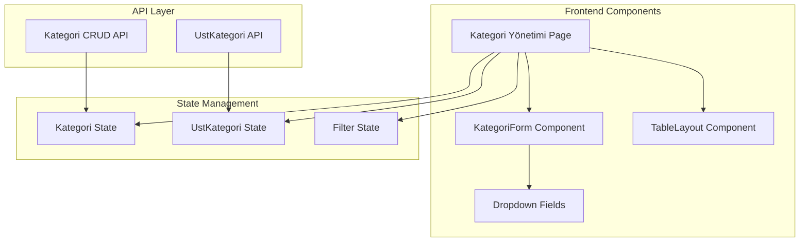
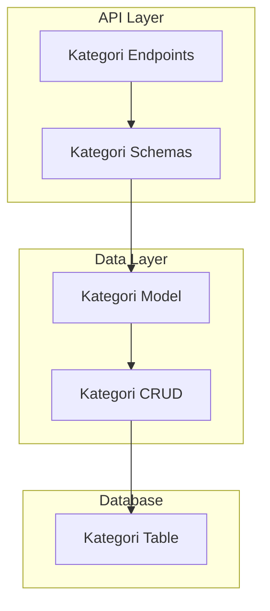
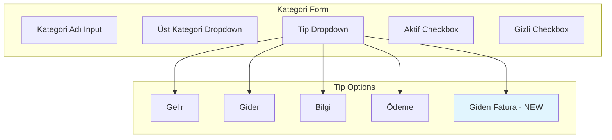
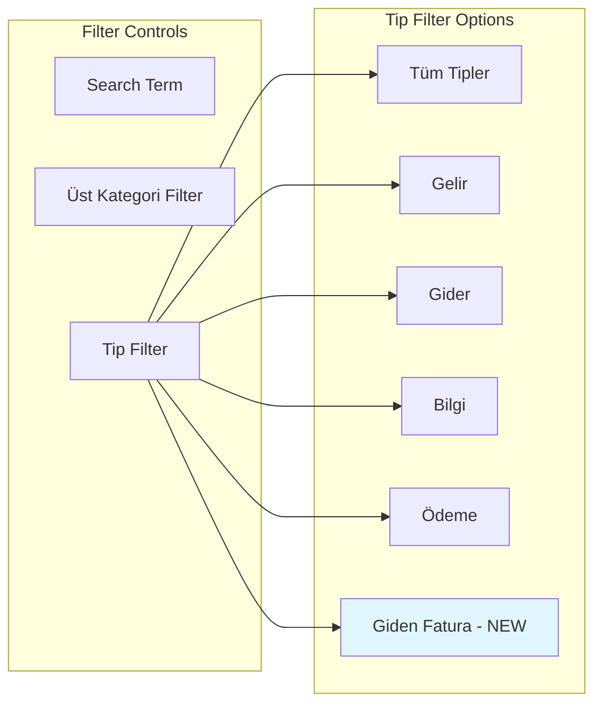

# Kategori Management Enhancement - "Giden Fatura" Addition

## Overview

This design document outlines the enhancement of the Kategori Yönetimi (Category Management) screen by adding "Giden Fatura" as a new option to the existing Tip (Type) dropdown field. Currently, the system supports four category types: 'Gelir', 'Gider', 'Bilgi', and 'Ödeme'. This enhancement will extend the system to include 'Giden Fatura' as a fifth category type.

## Current System Architecture

### Frontend Architecture
The category management system is implemented using React with TypeScript, featuring a clean component-based architecture:



### Backend Architecture
The backend uses FastAPI with SQLAlchemy ORM for data management:



### Current Data Model
The Kategori entity currently supports the following structure:

| Field | Type | Constraints | Description |
|-------|------|-------------|-------------|
| Kategori_ID | Integer | Primary Key | Auto-incrementing identifier |
| Kategori_Adi | String(100) | Not Null | Category name |
| Ust_Kategori_ID | Integer | Foreign Key, Nullable | Reference to parent category |
| Tip | Enum | Not Null | Category type (current: 'Gelir', 'Gider', 'Bilgi', 'Ödeme') |
| Aktif_Pasif | Boolean | Default: True | Active/inactive status |
| Gizli | Boolean | Default: False | Hidden status flag |

## Enhancement Requirements

### Functional Requirements
1. **Add "Giden Fatura" Option**: Extend the Tip field to include "Giden Fatura" as a valid category type
2. **Update Frontend Dropdowns**: Modify all dropdown components that display category types to include the new option
3. **Maintain Data Integrity**: Ensure existing data and functionality remain unaffected
4. **Consistent UI/UX**: Apply the new option consistently across all category management interfaces

### Non-Functional Requirements
1. **Backward Compatibility**: Existing categories and their relationships must remain functional
2. **Performance**: No impact on current system performance
3. **Validation**: Proper validation for the new category type in both frontend and backend
4. **Sorting**: Maintain Turkish locale-based alphabetical sorting for all category types

## Technical Implementation

### Database Schema Changes

#### Model Update (backend/db/models.py)
```python
# Current enum constraint
Tip = Column(Enum('Gelir', 'Gider', 'Bilgi', 'Ödeme'), nullable=False)

# Updated enum constraint
Tip = Column(Enum('Gelir', 'Gider', 'Bilgi', 'Ödeme', 'Giden Fatura'), nullable=False)
```

### Backend Schema Updates

#### Pydantic Schema Update (backend/schemas/kategori.py)
```python
# Current Literal type constraint
Tip: Literal["Gelir", "Gider", "Bilgi", "Ödeme"]

# Updated Literal type constraint
Tip: Literal["Gelir", "Gider", "Bilgi", "Ödeme", "Giden Fatura"]
```

### Frontend Type Updates

#### TypeScript Type Definition (CopyCat/types.ts)
```typescript
// Current type definition
export type KategoriTip = 'Gelir' | 'Gider' | 'Bilgi';

// Updated type definition
export type KategoriTip = 'Gelir' | 'Gider' | 'Bilgi' | 'Ödeme' | 'Giden Fatura';
```

Note: The current frontend type definition is incomplete as it's missing 'Ödeme', which should also be added along with 'Giden Fatura'.

### Component Updates

#### KategoriForm Component (CopyCat/components.tsx)
The dropdown selection in the KategoriForm component needs to include the new option:

```jsx
<Select label="Tip" name="Tip" value={formData.Tip} onChange={handleChange} required>
  <option value="Gelir">Gelir</option>
  <option value="Gider">Gider</option>
  <option value="Bilgi">Bilgi</option>
  <option value="Ödeme">Ödeme</option>
  <option value="Giden Fatura">Giden Fatura</option>
</Select>
```

#### Filter Dropdown (CopyCat/pages.tsx)
The category management page filter dropdown also requires updating:

```jsx
<Select 
  value={selectedTipFilter} 
  onChange={e => setSelectedTipFilter(e.target.value)}
  className="flex-auto min-w-[150px] max-w-xs text-sm py-2"
>
  <option value="">Tüm Tipler</option>
  <option value="Gelir">Gelir</option>
  <option value="Gider">Gider</option>
  <option value="Bilgi">Bilgi</option>
  <option value="Ödeme">Ödeme</option>
  <option value="Giden Fatura">Giden Fatura</option>
</Select>
```

### Category Utility Functions

#### Update CategoryUtils (CopyCat/utils/categoryUtils.ts)
Ensure all utility functions properly handle the new category type:

```typescript
export const sortKategorilerByType = (
  kategoriler: Kategori[], 
  tip: string, 
  canViewGizli: boolean = true
): Kategori[] => {
  return kategoriler
    .filter(k => 
      k.Aktif_Pasif &&
      k.Tip === tip &&
      (canViewGizli || !k.Gizli)
    )
    .sort((a, b) => a.Kategori_Adi.localeCompare(b.Kategori_Adi, 'tr', { 
      sensitivity: 'base' 
    }));
};
```

## User Interface Updates

### Form Enhancement
The category creation and editing form will display the new option in the Tip dropdown:



### Filter Enhancement
The category management page filters will include the new category type for refined data viewing:



## Data Migration Considerations

### Backward Compatibility
- Existing categories with types 'Gelir', 'Gider', 'Bilgi', and 'Ödeme' will continue to function normally
- No data migration is required as this is an additive change
- All existing relationships and foreign key constraints remain intact

### Validation Updates
- Frontend validation will accept the new category type
- Backend API validation will include 'Giden Fatura' in the allowed values
- Database constraints will be updated to include the new enum value

## Testing Strategy

### Unit Testing
1. **Frontend Component Tests**: Verify dropdown options include "Giden Fatura"
2. **Backend Schema Tests**: Validate that new category type is accepted in API endpoints
3. **Category Utils Tests**: Ensure sorting and filtering functions work with the new type

### Integration Testing
1. **Category Creation**: Test creating categories with "Giden Fatura" type
2. **Category Filtering**: Verify filtering by "Giden Fatura" type works correctly
3. **Category Editing**: Test updating existing categories to "Giden Fatura" type

### User Acceptance Testing
1. **UI Verification**: Confirm "Giden Fatura" appears in all relevant dropdowns
2. **Workflow Testing**: Validate complete category management workflow with new type
3. **Data Integrity**: Ensure existing categories remain unaffected

## Implementation Scope

### Files to Modify

#### Backend Files
1. `backend/db/models.py` - Update Kategori model enum constraint
2. `backend/schemas/kategori.py` - Update Pydantic schema Literal type

#### Frontend Files
1. `CopyCat/types.ts` - Update KategoriTip type definition
2. `CopyCat/components.tsx` - Update KategoriForm dropdown options
3. `CopyCat/pages.tsx` - Update filter dropdown options
4. `CopyCat/utils/categoryUtils.ts` - Verify compatibility with new type

### Database Migration
A database migration script will be needed to update the enum constraint:

```sql
-- Add new enum value to Tip column
ALTER TABLE Kategori MODIFY COLUMN Tip ENUM('Gelir', 'Gider', 'Bilgi', 'Ödeme', 'Giden Fatura') NOT NULL;
```

## Impact Analysis

### System Components Affected
1. **Category Management Screen**: Primary interface for managing categories
2. **Category Assignment Screens**: Any screen that allows category selection
3. **Reporting Systems**: Reports that filter or group by category type
4. **API Endpoints**: Category CRUD operations

### Dependencies
1. **UstKategori System**: Parent category relationships remain unchanged
2. **Related Entities**: EFatura, B2BEkstre, DigerHarcama, Gelir, Odeme tables maintain their foreign key relationships
3. **Permission System**: No changes to user permissions or access control

## Risk Assessment

### Low Risk
- This is an additive change that doesn't modify existing functionality
- No breaking changes to existing API contracts
- Minimal code changes required

### Mitigation Strategies
1. **Testing**: Comprehensive testing of all affected components
2. **Rollback Plan**: Database migration can be reversed if needed
3. **Gradual Deployment**: Changes can be deployed incrementally

## Success Criteria

### Functional Success
1. "Giden Fatura" appears in all category type dropdowns
2. Users can successfully create categories with "Giden Fatura" type
3. Filtering by "Giden Fatura" type works correctly
4. Existing categories and functionality remain unaffected

### Technical Success
1. All unit tests pass
2. No performance degradation
3. Database constraints are properly updated
4. API validation works correctly

### User Experience Success
1. Intuitive interface with the new option clearly visible
2. Consistent behavior across all category management screens
3. Proper sorting and filtering functionality
4. No confusion or errors in user workflows