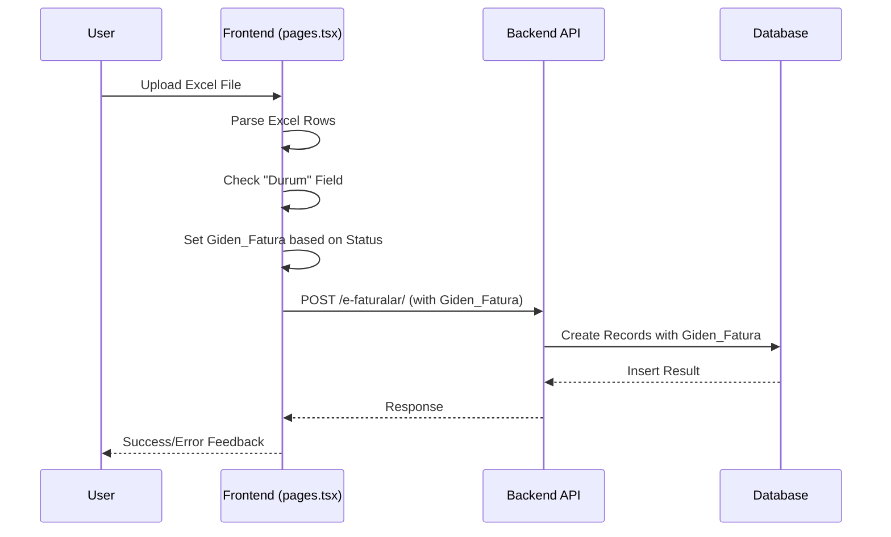
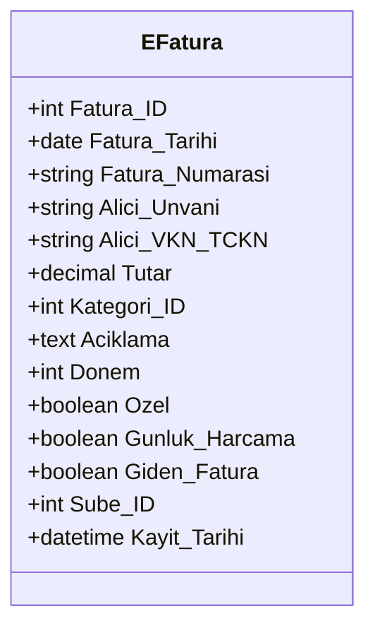
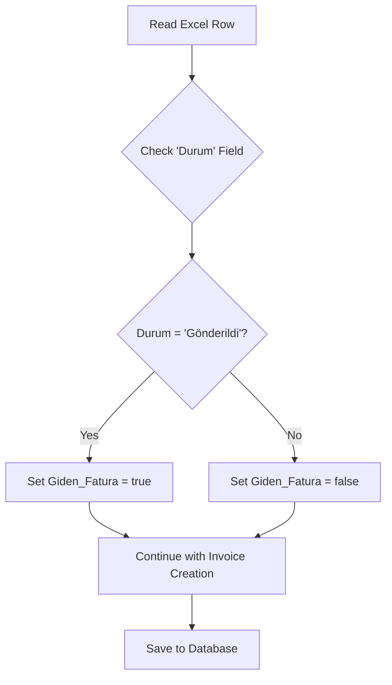

# Mark Outgoing Invoice Feature Design

## Overview

This feature enables automatic marking of outgoing invoices during the e-Fatura upload process. When an invoice has the status "Gönderildi" (Sent) in the uploaded Excel file, the system will automatically set the `Giden_Fatura` field to `1` in the database, indicating it is an outgoing invoice.

## Architecture

The implementation follows the existing e-Fatura processing pattern with minimal modifications to the current data flow:



## Database Model Updates

### EFatura Table Enhancement

The `Giden_Fatura` field has been added to the `e_Fatura` table:

| Field Name | Data Type | Constraints | Description |
|------------|-----------|-------------|-------------|
| Giden_Fatura | TINYINT(1) | DEFAULT 0 | Indicates outgoing invoice status (0=No, 1=Yes) |

### Updated EFatura Model Structure



## Backend Schema Updates

### Pydantic Schema Modifications

The following schema classes need to be updated:

1. **EFaturaBase**: Add `Giden_Fatura: bool = False`
2. **EFaturaCreate**: Inherits from EFaturaBase (automatic inclusion)
3. **EFaturaUpdate**: Add `Giden_Fatura: Optional[bool] = None`
4. **EFaturaInDB**: Inherits from EFaturaBase (automatic inclusion)

### Database Model Updates

Update the SQLAlchemy model in `models.py`:

```python
class EFatura(Base):
    # ... existing fields ...
    Giden_Fatura = Column(Boolean, default=False)
    # ... rest of the model ...
```

## Frontend Implementation

### TypeScript Interface Updates

#### EFatura Interface
Add the new field to the existing interface:

```typescript
export interface EFatura {
  // ... existing fields ...
  Giden_Fatura: boolean; // TINYINT(1) -> boolean
  // ... rest of the interface ...
}
```

#### EFaturaExcelRow Interface
The interface already includes the "Durum" field, which will be used for processing.

### Processing Logic Enhancement

#### Status Mapping Logic
Implement status-based mapping in the Excel processing function:

```typescript
const determineGidenFatura = (durum: string): boolean => {
  const status = (durum || '').toLowerCase().trim();
  return status === 'gönderildi';
};
```

#### Updated Invoice Processing
Modify the existing processing logic in `pages.tsx`:

```typescript
const newInvoices: EFatura[] = jsonData
  .map((row, index) => {
    try {
      // ... existing processing logic ...
      
      const durumValue = String(row["Durum"] || '');
      const gidenFatura = determineGidenFatura(durumValue);
      
      return {
        // ... existing fields ...
        Giden_Fatura: gidenFatura,
        // ... rest of the object ...
      };
    } catch (e: any) {
      // ... existing error handling ...
    }
  })
  .filter((invoice): invoice is EFatura => invoice !== null);
```

## Business Logic Flow

### Status Processing Rules



### Processing Logic Details

1. **Case Insensitive Matching**: Status comparison ignores case sensitivity
2. **Trim Whitespace**: Remove leading/trailing spaces from status values
3. **Default Behavior**: If "Durum" field is missing or empty, default to `false`
4. **Exact Match**: Only "Gönderildi" status triggers outgoing invoice marking

## API Integration

### Request/Response Flow

The existing API endpoints (`/e-faturalar/`) will handle the new field automatically through the updated schema. No additional endpoints are required.

### Bulk Processing Enhancement

The bulk creation endpoint will process the `Giden_Fatura` field for each invoice in the batch, maintaining the existing performance characteristics.

## Data Validation

### Frontend Validation
- Validate "Durum" field exists in Excel data
- Handle missing or malformed status values gracefully
- Provide clear error messages for processing failures

### Backend Validation
- Ensure `Giden_Fatura` field is boolean type
- Apply default value `false` if not provided
- Maintain existing validation for other fields

## Error Handling

### Excel Processing Errors
- Log warnings for unrecognized status values
- Continue processing with default `Giden_Fatura = false`
- Include status processing information in bulk response

### Database Errors
- Maintain existing error handling for database operations
- Include `Giden_Fatura` field in error reporting for troubleshooting

## Testing Strategy

### Unit Testing Requirements
1. **Status Mapping Tests**
   - Test "Gönderildi" → `true` mapping
   - Test other statuses → `false` mapping
   - Test case insensitivity
   - Test whitespace handling

2. **Integration Tests**
   - Excel file processing with various status values
   - Database insertion with `Giden_Fatura` field
   - API endpoint response validation

3. **Edge Case Testing**
   - Missing "Durum" column
   - Empty status values
   - Unicode characters in status
   - Large batch processing

### Test Data Examples

| Durum Value | Expected Giden_Fatura |
|-------------|----------------------|
| "Gönderildi" | true |
| "gönderildi" | true |
| " Gönderildi " | true |
| "Onaylandı" | false |
| "Reddedildi" | false |
| "" | false |
| null | false |

## Implementation Priority

### Phase 1: Core Implementation
1. Update database model (`models.py`)
2. Update Pydantic schemas (`e_fatura.py`)
3. Update TypeScript interfaces (`types.ts`)
4. Implement frontend processing logic (`pages.tsx`)

### Phase 2: Enhanced Features
1. Add filtering by outgoing invoice status
2. Display outgoing invoice indicator in UI
3. Add reporting capabilities for outgoing invoices
4. Implement bulk status updates

## Performance Considerations

### Processing Efficiency
- No additional database queries required
- Minimal performance impact on existing upload process
- Efficient boolean field storage and indexing

### Memory Usage
- Single boolean field addition per invoice record
- No significant memory overhead
- Maintains existing batch processing capabilities

## Security Considerations

### Data Integrity
- Validate status values before processing
- Maintain audit trail for status changes
- Prevent unauthorized modification of outgoing invoice status

### Access Control
- Utilize existing permission system
- No additional security layers required
- Maintain existing user role restrictions

## Migration Strategy

### Database Migration
```sql
ALTER TABLE e_Fatura 
ADD COLUMN Giden_Fatura TINYINT(1) DEFAULT 0;
```

### Backward Compatibility
- Existing invoices default to `Giden_Fatura = false`
- No impact on current system functionality
- Gradual adoption through new uploads

## User Interface Enhancements

### Upload Process Indicators
- Display processing status for outgoing invoice detection
- Show summary of detected outgoing invoices
- Provide clear feedback on status-based processing

### Future UI Considerations
- Add visual indicators for outgoing invoices in list views
- Implement filtering by outgoing invoice status
- Include outgoing invoice information in reports