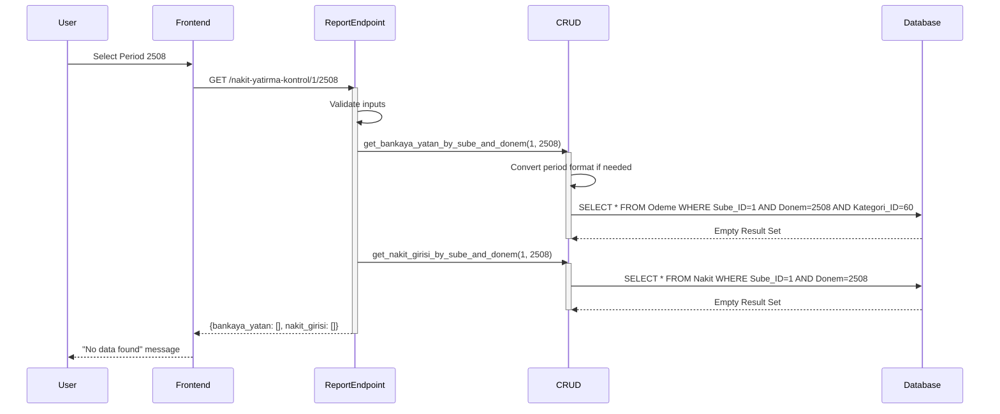
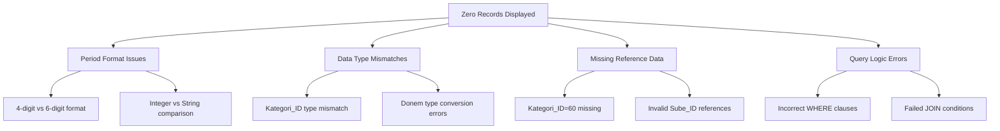
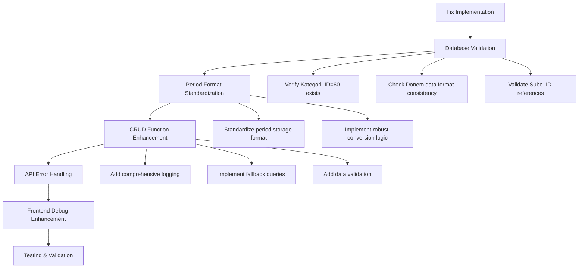

# Nakit Cash Deposit Control Report Data Display Fix

## Overview

The Cash Deposit Control Report (Nakit Yatırma Kontrol Raporu) is displaying zero records despite the database containing actual data. Manual database queries confirm the existence of 10 Nakit records and 20 Odeme records for period 2508, but the application's API endpoints are returning empty results. This document outlines the architecture analysis and solution design to fix the data retrieval issues.

## Architecture

### Current System Architecture

The Cash Deposit Control Report follows a three-tier architecture pattern:

```mermaid
graph TD
    Frontend[React Frontend - NakitYatirmaRaporu.tsx] --> API[FastAPI Backend - report.py]
    API --> CRUD[CRUD Layer - crud.py]
    CRUD --> DB[(Database - SilverCloud)]
    
    subgraph "Data Flow"
        DB --> |Nakit Records| CRUD
        DB --> |Odeme Records Kategori_ID=60| CRUD
        CRUD --> |ReportDataItem[]| API
        API --> |NakitYatirmaRaporu| Frontend
    end
```

### Component Interaction



## Data Models & Database Schema

### Nakit Table Structure
```sql
-- Nakit table schema
CREATE TABLE Nakit (
    Nakit_ID INT PRIMARY KEY AUTO_INCREMENT,
    Tarih DATE NOT NULL,
    Kayit_Tarih DATETIME DEFAULT CURRENT_TIMESTAMP,
    Tutar DECIMAL(15,2) NOT NULL,
    Tip VARCHAR(50) DEFAULT 'Bankaya Yatan',
    Donem INT NOT NULL,           -- Critical: Period storage format
    Sube_ID INT NOT NULL,
    Imaj_Adi VARCHAR(255),
    Imaj LONGBLOB,
    FOREIGN KEY (Sube_ID) REFERENCES Sube(Sube_ID)
);
```

### Odeme Table Structure
```sql
-- Odeme table schema
CREATE TABLE Odeme (
    Odeme_ID INT PRIMARY KEY AUTO_INCREMENT,
    Tip VARCHAR(50) NOT NULL,
    Hesap_Adi VARCHAR(50) NOT NULL,
    Tarih DATE NOT NULL,
    Aciklama VARCHAR(200) NOT NULL,
    Tutar DECIMAL(15,2) NOT NULL DEFAULT 0.00,
    Kategori_ID INT,              -- Critical: Must be 60 for "Bankaya Yatan"
    Donem INT,                    -- Critical: Period storage format
    Sube_ID INT DEFAULT 1,
    Kayit_Tarihi DATETIME DEFAULT CURRENT_TIMESTAMP,
    FOREIGN KEY (Kategori_ID) REFERENCES Kategori(Kategori_ID),
    FOREIGN KEY (Sube_ID) REFERENCES Sube(Sube_ID)
);
```

## Root Cause Analysis

### Issue Identification

Based on analysis of the codebase and database schema, the primary issues are:

1. **Period Format Inconsistency**: Database stores periods in different formats across tables
2. **Data Type Mismatches**: Potential mismatch between query parameters and database column types
3. **Missing Reference Data**: Kategori_ID=60 may not exist in the Kategori table
4. **Sube_ID Validation**: Branch ID validation may be too restrictive

### Critical Problems Identified



## Business Logic Layer

### Report Generation Architecture

The report generation follows a specific business logic:

1. **Data Source Validation**: Verify both Nakit and Odeme tables have data for the period
2. **Category Filtering**: Only Odeme records with Kategori_ID=60 ("Bankaya Yatan") are included
3. **Period Matching**: Both tables must be queried with consistent period format
4. **Data Aggregation**: Results are formatted as ReportDataItem objects

### Current CRUD Implementation Issues

```python
# Current problematic implementation
def get_nakit_girisi_by_sube_and_donem(db: Session, sube_id: int, donem: int):
    # Issue: Period conversion logic may be incorrect
    if len(str(donem)) == 6:
        donem = donem - 2000  # Convert 202508 to 2508
    
    # Issue: Query may not match database format
    query = db.query(models.Nakit).filter(
        models.Nakit.Sube_ID == sube_id,
        models.Nakit.Donem == donem  # Potential type mismatch
    )
```

## API Endpoints Reference

### Nakit Yatırma Kontrol Report Endpoint

**Endpoint**: `GET /api/v1/nakit-yatirma-kontrol/{sube_id}/{donem}`

**Parameters**:
- `sube_id` (int): Branch identifier
- `donem` (int): Period in YYMM format (e.g., 2508 for August 2025)

**Response Schema**:
```typescript
interface NakitYatirmaRaporu {
    bankaya_yatan: ReportDataItem[];
    nakit_girisi: ReportDataItem[];
}

interface ReportDataItem {
    Tarih: string;      // Date in YYYY-MM-DD format
    Donem: number;      // Period as integer
    Tutar: number;      // Amount as float
}
```

**Current Issues**:
- Period format conversion inconsistency
- Missing error handling for empty results
- Inadequate logging for debugging

## Solution Design

### Database Validation and Correction



### Enhanced CRUD Implementation

```python
def get_nakit_girisi_by_sube_and_donem_enhanced(db: Session, sube_id: int, donem: int):
    """
    Enhanced Nakit retrieval with comprehensive debugging and validation
    """
    logger = logging.getLogger(__name__)
    
    # Step 1: Input validation
    if sube_id <= 0:
        logger.error(f"Invalid sube_id: {sube_id}")
        return []
    
    # Step 2: Period format handling with multiple attempts
    period_formats = [donem]
    
    if len(str(donem)) == 4:
        # Try both 4-digit and 6-digit formats
        period_formats.append(2000 + donem)  # 2508 -> 202508
    elif len(str(donem)) == 6:
        # Try both 6-digit and 4-digit formats  
        period_formats.append(donem - 2000)  # 202508 -> 2508
    
    # Step 3: Database queries with fallback
    for period in period_formats:
        logger.info(f"Attempting query with period format: {period}")
        
        try:
            query = db.query(models.Nakit).filter(
                models.Nakit.Sube_ID == sube_id,
                models.Nakit.Donem == period
            )
            
            records = query.all()
            logger.info(f"Query result: {len(records)} records found")
            
            if records:
                # Process and return successful result
                return process_nakit_records(records)
                
        except Exception as e:
            logger.error(f"Query failed for period {period}: {e}")
            continue
    
    # Step 4: Diagnostic queries if no results found
    logger.warning("No records found, running diagnostic queries...")
    run_diagnostic_queries(db, sube_id, donem)
    
    return []
```

### API Enhancement Strategy

```python
@router.get("/nakit-yatirma-kontrol/{sube_id}/{donem}", response_model=NakitYatirmaRaporu)
def get_nakit_yatirma_kontrol_raporu_enhanced(
    sube_id: int, 
    donem: int, 
    db: Session = Depends(get_db)
):
    """Enhanced report endpoint with comprehensive validation and debugging"""
    
    logger.info(f"Report request: Sube_ID={sube_id}, Donem={donem}")
    
    try:
        # Step 1: Validate branch exists
        branch = db.query(models.Sube).filter(models.Sube.Sube_ID == sube_id).first()
        if not branch:
            raise HTTPException(status_code=404, detail=f"Branch {sube_id} not found")
        
        # Step 2: Validate Kategori_ID=60 exists
        kategori = db.query(models.Kategori).filter(models.Kategori.Kategori_ID == 60).first()
        if not kategori:
            raise HTTPException(status_code=500, detail="Kategori_ID=60 (Bankaya Yatan) not found in database")
        
        # Step 3: Enhanced data retrieval with multiple format attempts
        bankaya_yatan = get_bankaya_yatan_enhanced(db, sube_id, donem)
        nakit_girisi = get_nakit_girisi_enhanced(db, sube_id, donem)
        
        # Step 4: Result validation and logging
        logger.info(f"Results: {len(bankaya_yatan)} bankaya_yatan, {len(nakit_girisi)} nakit_girisi")
        
        if not bankaya_yatan and not nakit_girisi:
            # Perform comprehensive diagnostic
            diagnostic_result = perform_data_diagnostic(db, sube_id, donem)
            logger.warning(f"No data found. Diagnostic: {diagnostic_result}")
        
        return {
            "bankaya_yatan": bankaya_yatan,
            "nakit_girisi": nakit_girisi
        }
        
    except HTTPException:
        raise
    except Exception as e:
        logger.error(f"Unexpected error: {e}")
        raise HTTPException(status_code=500, detail=f"Internal server error: {str(e)}")
```

### Database Diagnostic Functions

```python
def perform_data_diagnostic(db: Session, sube_id: int, donem: int) -> dict:
    """Perform comprehensive database diagnostic to identify data issues"""
    
    diagnostic = {}
    
    # Check total records in each table
    diagnostic['total_nakit_records'] = db.query(models.Nakit).count()
    diagnostic['total_odeme_records'] = db.query(models.Odeme).count()
    
    # Check records for specific branch
    diagnostic['nakit_for_branch'] = db.query(models.Nakit).filter(
        models.Nakit.Sube_ID == sube_id
    ).count()
    
    diagnostic['odeme_for_branch'] = db.query(models.Odeme).filter(
        models.Odeme.Sube_ID == sube_id
    ).count()
    
    # Check period formats in database
    nakit_periods = db.query(models.Nakit.Donem).distinct().all()
    odeme_periods = db.query(models.Odeme.Donem).distinct().all()
    
    diagnostic['nakit_period_formats'] = [str(p[0]) for p in nakit_periods]
    diagnostic['odeme_period_formats'] = [str(p[0]) for p in odeme_periods]
    
    # Check Kategori_ID=60 records
    diagnostic['kategori_60_exists'] = db.query(models.Kategori).filter(
        models.Kategori.Kategori_ID == 60
    ).first() is not None
    
    diagnostic['odeme_kategori_60_count'] = db.query(models.Odeme).filter(
        models.Odeme.Kategori_ID == 60
    ).count()
    
    return diagnostic
```

### Frontend Enhancement

```typescript
// Enhanced error handling and debugging in frontend
const fetchReportData = async () => {
    if (selectedBranch && selectedPeriod) {
        setLoading(true);
        setError(null);
        
        try {
            const url = `${API_BASE_URL}/nakit-yatirma-kontrol/${selectedBranch.Sube_ID}/${selectedPeriod}`;
            console.log('🔍 Fetching report data from:', url);
            
            const response = await fetch(url);
            
            if (response.ok) {
                const data = await response.json();
                console.log('✅ Report data received:', data);
                setReportData(data);
                
                // Enhanced debugging information
                const bankCount = data?.bankaya_yatan?.length || 0;
                const nakitCount = data?.nakit_girisi?.length || 0;
                
                if (bankCount === 0 && nakitCount === 0) {
                    // Trigger diagnostic API call
                    await fetchDiagnosticInfo();
                    setError('Bu dönem için veri bulunamadı. Detaylı bilgi için console.log kontrol edin.');
                }
            } else {
                // Enhanced error handling
                const errorText = await response.text();
                console.error('❌ Error response:', response.status, errorText);
                
                if (response.status === 404) {
                    setError('Şube bulunamadı. Lütfen geçerli bir şube seçin.');
                } else if (response.status === 500) {
                    setError('Sunucu hatası. Lütfen sistem yöneticisine başvurun.');
                } else {
                    setError(`Veri alınırken hata oluştu: ${response.status}`);
                }
            }
        } catch (error) {
            console.error('❌ Network error:', error);
            setError(`Bağlantı hatası: ${error instanceof Error ? error.message : 'Bilinmeyen hata'}`);
        }
        setLoading(false);
    }
};

const fetchDiagnosticInfo = async () => {
    try {
        const diagUrl = `${API_BASE_URL}/diagnostic/nakit/${selectedBranch.Sube_ID}/${selectedPeriod}`;
        const diagResponse = await fetch(diagUrl);
        if (diagResponse.ok) {
            const diagData = await diagResponse.json();
            console.log('🔧 Diagnostic data:', diagData);
        }
    } catch (e) {
        console.warn('Could not fetch diagnostic data:', e);
    }
};
```

## Testing

### Unit Testing Strategy

```python
def test_nakit_data_retrieval():
    """Test Nakit data retrieval with various period formats"""
    
    # Test Case 1: 4-digit period format
    result_4digit = get_nakit_girisi_by_sube_and_donem(db, 1, 2508)
    assert len(result_4digit) > 0, "Should return data for 4-digit period"
    
    # Test Case 2: 6-digit period format  
    result_6digit = get_nakit_girisi_by_sube_and_donem(db, 1, 202508)
    assert len(result_6digit) > 0, "Should return data for 6-digit period"
    
    # Test Case 3: Both formats should return same data
    assert len(result_4digit) == len(result_6digit), "Both formats should return same data"

def test_database_diagnostic():
    """Test diagnostic function provides useful information"""
    
    diagnostic = perform_data_diagnostic(db, 1, 2508)
    
    assert 'total_nakit_records' in diagnostic
    assert 'total_odeme_records' in diagnostic
    assert 'kategori_60_exists' in diagnostic
    assert diagnostic['kategori_60_exists'] == True, "Kategori_ID=60 should exist"

def test_report_endpoint_integration():
    """Integration test for the complete report endpoint"""
    
    response = client.get("/api/v1/nakit-yatirma-kontrol/1/2508")
    
    assert response.status_code == 200
    data = response.json()
    assert 'bankaya_yatan' in data
    assert 'nakit_girisi' in data
    assert len(data['nakit_girisi']) > 0, "Should return Nakit data"
```

### Database Validation Queries

```sql
-- Pre-implementation validation queries
-- 1. Verify data exists in expected format
SELECT 'Nakit Records' as table_name, 
       COUNT(*) as total_records,
       MIN(Donem) as min_period,
       MAX(Donem) as max_period,
       COUNT(DISTINCT Sube_ID) as branch_count
FROM SilverCloud.Nakit
WHERE Donem IN (2508, 202508)

UNION ALL

SELECT 'Odeme Records' as table_name,
       COUNT(*) as total_records, 
       MIN(Donem) as min_period,
       MAX(Donem) as max_period,
       COUNT(DISTINCT Sube_ID) as branch_count
FROM SilverCloud.Odeme 
WHERE Donem IN (2508, 202508) AND Kategori_ID = 60;

-- 2. Check Kategori_ID=60 exists
SELECT * FROM SilverCloud.Kategori WHERE Kategori_ID = 60;

-- 3. Verify specific test data
SELECT 'Test Query Result' as description,
       COUNT(*) as record_count
FROM SilverCloud.Nakit 
WHERE Donem = 2508 AND Sube_ID = 1;
```