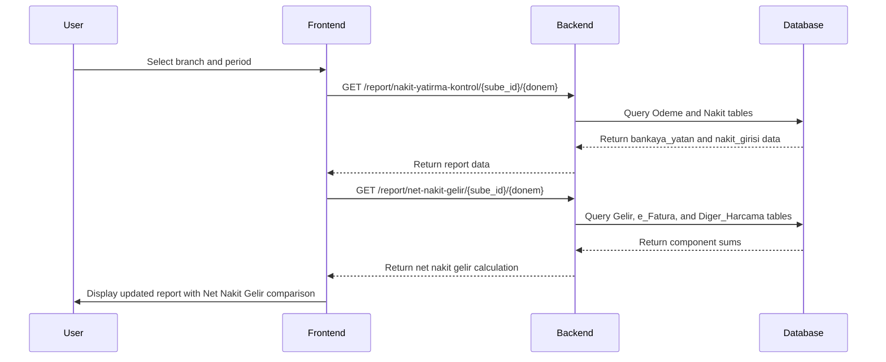
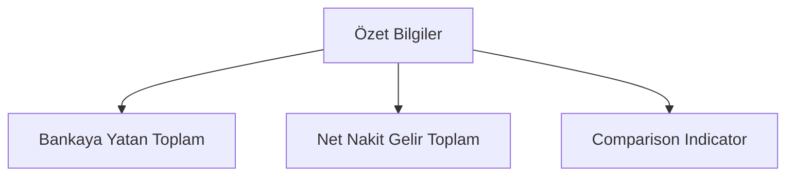

# Nakit Yatırma Kontrol Raporu Enhancement - Net Nakit Gelir Toplam Calculation

## Overview

This document outlines the implementation plan for adding a "Net Nakit Gelir Toplam" calculation to the "Nakit Yatırma Kontrol Raporu". The feature will calculate the net cash income by subtracting daily expenses from total income and compare it with the "Bankaya Yatan Toplam" in the summary section.

## Requirements

1. Calculate "Net Nakit Gelir" using the following formula:
   ```
   Net Nakit Gelir = 
   (SELECT SUM(Tutar) FROM SilverCloud.Gelir WHERE Kategori_ID = 11 AND DATE_FORMAT(Tarih, '%y%m') = Selected Donem)  
   - (SELECT SUM(Tutar) FROM SilverCloud.e_Fatura WHERE Gunluk_Harcama = 1 AND Donem = Selected Donem)
   - SELECT sum(Tutar) FROM SilverCloud.Diger_Harcama where Harcama_Tipi ='Nakit' and Gunluk_Harcama = 1 and Donem= Selected Donem
   ```

2. Display "Net Nakit Gelir Toplam" alongside "Bankaya Yatan Toplam" in the "Özet Bilgiler" box on the "Nakit Yatırma Kontrol Raporu" page.

## Architecture

### Frontend Implementation

The enhancement will be implemented in the `NakitYatirmaRaporu.tsx` file:

1. Add a new API endpoint call to fetch the Net Nakit Gelir data
2. Update the "Özet Bilgiler" section to display the new metric
3. Add comparison visualization between "Net Nakit Gelir Toplam" and "Bankaya Yatan Toplam"

### Backend Implementation

1. Add a new API endpoint in `report.py` to calculate the Net Nakit Gelir
2. Create a new CRUD function to perform the database queries
3. Update the response schema to include the Net Nakit Gelir data

## Repository Type

This is a Full-Stack Application with:
- Frontend: React with TypeScript
- Backend: FastAPI with SQLAlchemy ORM
- Database: MySQL

## Technology Stack

- Frontend: React, TypeScript, Tailwind CSS
- Backend: Python, FastAPI, SQLAlchemy
- Database: MySQL
- Testing: Jest (frontend), Pytest (backend)

## API Endpoints

### New Endpoint: Get Net Nakit Gelir
```
GET /report/net-nakit-gelir/{sube_id}/{donem}
```

**Response:**
```json
{
  "gelir_toplam": 10000.00,
  "efatura_harcama_toplam": 2000.00,
  "diger_harcama_toplam": 1000.00,
  "net_nakit_gelir": 7000.00
}
```

## Data Models

### Backend Schema (schemas/report.py)
```python
class NetNakitGelirResponse(BaseModel):
    gelir_toplam: float
    efatura_harcama_toplam: float
    diger_harcama_toplam: float
    net_nakit_gelir: float
```

## Implementation Details

### Backend Changes

1. **Add new endpoint in `backend/api/v1/endpoints/report.py`:**
   ```python
   @router.get("/net-nakit-gelir/{sube_id}/{donem}", response_model=NetNakitGelirResponse)
   def get_net_nakit_gelir(sube_id: int, donem: int, db: Session = Depends(get_db)):
       """
       Calculate Net Nakit Gelir for specific sube and donem
       """
       logger.info(f"Calculating Net Nakit Gelir for Sube_ID: {sube_id}, Donem: {donem}")
       
       try:
           # Validate inputs
           if sube_id <= 0:
               raise HTTPException(status_code=400, detail="Invalid sube_id")
           
           donem_str = str(donem)
           if donem <= 0 or len(donem_str) not in [4, 6]:
               raise HTTPException(status_code=400, detail=f"Invalid donem format. Expected YYMM (4-digit) or YYYYMM (6-digit) format, got: {donem}")
           
           # Convert 6-digit format to 4-digit if needed
           if len(donem_str) == 6:
               donem = donem - 200000  # Convert 202508 to 2508
           
           # Calculate components
           gelir_toplam = crud.get_gelir_toplam(db, sube_id=sube_id, donem=donem)
           efatura_harcama_toplam = crud.get_efatura_harcama_toplam(db, sube_id=sube_id, donem=donem)
           diger_harcama_toplam = crud.get_diger_harcama_toplam(db, sube_id=sube_id, donem=donem)
           
           # Calculate net nakit gelir
           net_nakit_gelir = gelir_toplam - efatura_harcama_toplam - diger_harcama_toplam
           
           # Create response
           response = {
               "gelir_toplam": float(gelir_toplam),
               "efatura_harcama_toplam": float(efatura_harcama_toplam),
               "diger_harcama_toplam": float(diger_harcama_toplam),
               "net_nakit_gelir": float(net_nakit_gelir)
           }
           
           logger.info(f"Net Nakit Gelir calculation completed: {response}")
           return response
           
       except HTTPException:
           raise
       except Exception as e:
           logger.error(f"Error in get_net_nakit_gelir: {e}")
           raise HTTPException(status_code=500, detail=f"Internal server error: {str(e)}")
   ```

2. **Add CRUD functions in `backend/db/crud.py`:**
   ```python
   def get_gelir_toplam(db: Session, sube_id: int, donem: int):
       """
       Get total Gelir for Kategori_ID = 11 and specified period
       """
       logger = logging.getLogger(__name__)
       logger.info(f"Fetching Gelir toplam for Sube_ID: {sube_id}, Donem: {donem}, Kategori_ID: 11")
       
       try:
           # Convert donem to year and month for date comparison
           # Handle both 4-digit (YYMM) and 6-digit (YYYYMM) formats
           if len(str(donem)) == 4:
               donem_yy = int(str(donem)[:2])
               donem_mm = int(str(donem)[2:4])
               # Convert 2-digit year to 4-digit (assume 20xx for <= 50, 19xx for > 50)
               year = 2000 + donem_yy if donem_yy <= 50 else 1900 + donem_yy
           else:  # 6-digit format
               donem_yy = int(str(donem)[2:4])
               donem_mm = int(str(donem)[4:6])
               year = int(str(donem)[:4])
           
           # Query with date formatting
           result = db.query(func.sum(models.Gelir.Tutar)).filter(
               models.Gelir.Sube_ID == sube_id,
               models.Gelir.Kategori_ID == 11,
               func.year(models.Gelir.Tarih) == year,
               func.month(models.Gelir.Tarih) == donem_mm
           ).scalar()
           
           total = float(result) if result else 0.0
           logger.info(f"Gelir toplam: {total}")
           return total
           
       except Exception as e:
           logger.error(f"Error in get_gelir_toplam: {e}")
           return 0.0
   
   def get_efatura_harcama_toplam(db: Session, sube_id: int, donem: int):
       """
       Get total e_Fatura harcama where Gunluk_Harcama = 1
       """
       logger = logging.getLogger(__name__)
       logger.info(f"Fetching e_Fatura harcama toplam for Sube_ID: {sube_id}, Donem: {donem}")
       
       try:
           result = db.query(func.sum(models.EFatura.Tutar)).filter(
               models.EFatura.Sube_ID == sube_id,
               models.EFatura.Donem == donem,
               models.EFatura.Gunluk_Harcama == True
           ).scalar()
           
           total = float(result) if result else 0.0
           logger.info(f"e_Fatura harcama toplam: {total}")
           return total
           
       except Exception as e:
           logger.error(f"Error in get_efatura_harcama_toplam: {e}")
           return 0.0
   
   def get_diger_harcama_toplam(db: Session, sube_id: int, donem: int):
       """
       Get total Diger_Harcama where Harcama_Tipi = 'Nakit' and Gunluk_Harcama = 1
       """
       logger = logging.getLogger(__name__)
       logger.info(f"Fetching Diger_Harcama toplam for Sube_ID: {sube_id}, Donem: {donem}")
       
       try:
           result = db.query(func.sum(models.DigerHarcama.Tutar)).filter(
               models.DigerHarcama.Sube_ID == sube_id,
               models.DigerHarcama.Donem == donem,
               models.DigerHarcama.Harcama_Tipi == 'Nakit',
               models.DigerHarcama.Gunluk_Harcama == True
           ).scalar()
           
           total = float(result) if result else 0.0
           logger.info(f"Diger_Harcama toplam: {total}")
           return total
           
       except Exception as e:
           logger.error(f"Error in get_diger_harcama_toplam: {e}")
           return 0.0
   ```

### Frontend Changes

1. **Update the `NakitYatirmaRaporu.tsx` component:**
   - Add state for net nakit gelir data
   - Add API call to fetch net nakit gelir
   - Update the "Özet Bilgiler" section to display the new metric

2. **Enhance the "Özet Bilgiler" section:**
   ```tsx
   // Add new state
   const [netNakitGelirData, setNetNakitGelirData] = useState<NetNakitGelirData | null>(null);
   
   // Add interface
   interface NetNakitGelirData {
       gelir_toplam: number;
       efatura_harcama_toplam: number;
       diger_harcama_toplam: number;
       net_nakit_gelir: number;
   }
   
   // Add API call in useEffect
   useEffect(() => {
       const fetchNetNakitGelirData = async () => {
           if (selectedBranch && selectedPeriod) {
               try {
                   const url = `${API_BASE_URL}/report/net-nakit-gelir/${selectedBranch.Sube_ID}/${selectedPeriod}`;
                   const response = await fetch(url);
                   if (response.ok) {
                       const data = await response.json();
                       setNetNakitGelirData(data);
                   }
               } catch (error) {
                   console.error('Error fetching net nakit gelir data:', error);
               }
           }
       };
       
       fetchNetNakitGelirData();
   }, [selectedBranch, selectedPeriod]);
   
   // Update the summary section
   <div className="bg-gradient-to-r from-slate-800 to-slate-600 text-white p-6 rounded-lg">
       <h3 className="text-lg font-semibold mb-4 text-center">Özet Bilgiler</h3>
       <div className="grid grid-cols-1 md:grid-cols-4 gap-6">
           <div className="bg-white bg-opacity-10 p-4 rounded-lg text-center">
               <div className="text-sm opacity-90 mb-1">Bankaya Yatan Toplam</div>
               <div className="text-xl font-bold">{formatCurrency(bankayaYatanTotal)}</div>
           </div>
           <div className="bg-white bg-opacity-10 p-4 rounded-lg text-center">
               <div className="text-sm opacity-90 mb-1">Nakit Girişi Toplam</div>
               <div className="text-xl font-bold">{formatCurrency(nakitGirisiTotal)}</div>
           </div>
           <div className="bg-white bg-opacity-10 p-4 rounded-lg text-center">
               <div className="text-sm opacity-90 mb-1">Net Nakit Gelir</div>
               <div className="text-xl font-bold">{netNakitGelirData ? formatCurrency(netNakitGelirData.net_nakit_gelir) : 'Loading...'}</div>
           </div>
           <div className="bg-white bg-opacity-10 p-4 rounded-lg text-center">
               <div className="text-sm opacity-90 mb-1">Fark</div>
               <div className={`text-xl font-bold ${
                   Math.abs(farkTutar) < 0.01 ? 'text-green-300' : 
                   farkTutar > 0 ? 'text-orange-300' : 'text-red-300'
               }`}>
                   {formatCurrency(farkTutar)}
               </div>
           </div>
       </div>
       
       {/* Comparison visualization */}
       {netNakitGelirData && (
           <div className="mt-6 pt-4 border-t border-white border-opacity-20">
               <h4 className="text-center mb-3 font-medium">Karşılaştırma</h4>
               <div className="flex justify-center items-center space-x-4">
                   <div className="text-center">
                       <div className="text-sm opacity-90">Net Nakit Gelir</div>
                       <div className="font-bold">{formatCurrency(netNakitGelirData.net_nakit_gelir)}</div>
                   </div>
                   <div className="text-2xl">
                       {Math.abs(netNakitGelirData.net_nakit_gelir - bankayaYatanTotal) < 0.01 ? '≈' : 
                        netNakitGelirData.net_nakit_gelir > bankayaYatanTotal ? '>' : '<'}
                   </div>
                   <div className="text-center">
                       <div className="text-sm opacity-90">Bankaya Yatan</div>
                       <div className="font-bold">{formatCurrency(bankayaYatanTotal)}</div>
                   </div>
               </div>
               <div className={`text-center mt-2 text-sm ${
                   Math.abs(netNakitGelirData.net_nakit_gelir - bankayaYatanTotal) < 0.01 ? 'text-green-300' : 
                   netNakitGelirData.net_nakit_gelir >= bankayaYatanTotal ? 'text-green-300' : 'text-red-300'
               }`}>
                   {Math.abs(netNakitGelirData.net_nakit_gelir - bankayaYatanTotal) < 0.01 
                       ? 'Tutarlar eşleşiyor' 
                       : `Fark: ${formatCurrency(Math.abs(netNakitGelirData.net_nakit_gelir - bankayaYatanTotal))}`}
               </div>
           </div>
       )}
   </div>
   ```

## Data Flow



## Database Queries

The implementation will require the following database queries:

1. **Gelir Toplam:**
   ```sql
   SELECT SUM(Tutar) FROM Gelir 
   WHERE Kategori_ID = 11 AND DATE_FORMAT(Tarih, '%y%m') = Selected Donem
   ```
   In SQLAlchemy:
   ```python
   db.query(func.sum(models.Gelir.Tutar)).filter(
       models.Gelir.Sube_ID == sube_id,
       models.Gelir.Kategori_ID == 11,
       func.year(models.Gelir.Tarih) == year,
       func.month(models.Gelir.Tarih) == month
   ).scalar()
   ```

2. **e-Fatura Harcama Toplam:**
   ```sql
   SELECT SUM(Tutar) FROM e_Fatura 
   WHERE Gunluk_Harcama = 1 AND Donem = Selected Donem
   ```
   In SQLAlchemy:
   ```python
   db.query(func.sum(models.EFatura.Tutar)).filter(
       models.EFatura.Sube_ID == sube_id,
       models.EFatura.Donem == donem,
       models.EFatura.Gunluk_Harcama == True
   ).scalar()
   ```

3. **Diğer Harcama Toplam:**
   ```sql
   SELECT SUM(Tutar) FROM Diger_Harcama 
   WHERE Harcama_Tipi = 'Nakit' AND Gunluk_Harcama = 1 AND Donem = Selected Donem
   ```
   In SQLAlchemy:
   ```python
   db.query(func.sum(models.DigerHarcama.Tutar)).filter(
       models.DigerHarcama.Sube_ID == sube_id,
       models.DigerHarcama.Donem == donem,
       models.DigerHarcama.Harcama_Tipi == 'Nakit',
       models.DigerHarcama.Gunluk_Harcama == True
   ).scalar()
   ```

## UI/UX Design

### Updated "Özet Bilgiler" Section

The summary section will be enhanced to include the Net Nakit Gelir comparison:



The comparison will be visualized with:
- Color coding (green if Net Nakit Gelir >= Bankaya Yatan, red otherwise)
- Percentage difference indicator
- Visual bar chart comparison

## Error Handling

1. Handle cases where data is not available for the selected period
2. Handle database connection errors gracefully
3. Provide meaningful error messages to the user
4. Implement proper logging for debugging purposes

## Testing

### Backend Unit Tests

1. **Test CRUD functions:**
   ```python
   def test_get_gelir_toplam():
       # Test with valid data
       # Test with no matching records
       # Test with invalid parameters
   
   def test_get_efatura_harcama_toplam():
       # Test with valid data
       # Test with no matching records
       # Test with invalid parameters
   
   def test_get_diger_harcama_toplam():
       # Test with valid data
       # Test with no matching records
       # Test with invalid parameters
   
   def test_get_net_nakit_gelir():
       # Test complete calculation
       # Test with zero values
       # Test with negative results
   ```

2. **Test API endpoints:**
   ```python
   def test_net_nakit_gelir_endpoint():
       # Test with valid parameters
       # Test with invalid sube_id
       # Test with invalid donem format
       # Test with non-existent data
   ```

### Frontend Unit Tests

1. **Test component rendering:**
   ```javascript
   // Test that Net Nakit Gelir is displayed correctly
   // Test loading states
   // Test error states
   // Test comparison visualization
   ```

2. **Test API integration:**
   ```javascript
   // Test successful API calls
   // Test failed API calls
   // Test data transformation
   ```

### Integration Tests

1. **End-to-end test scenario:**
   - User selects branch and period
   - System fetches report data
   - System calculates Net Nakit Gelir
   - UI displays comparison correctly

2. **Edge case testing:**
   - Test with no data for selected period
   - Test with partial data
   - Test with large numbers
   - Test with negative values

## Security Considerations

1. Ensure proper authentication and authorization for the new endpoint
2. Validate all input parameters to prevent SQL injection
3. Follow existing security patterns in the codebase

## Performance Considerations

1. Optimize database queries for performance
2. Consider caching strategies for frequently accessed data
3. Implement proper indexing on database tables

## Deployment

### Backend Deployment

1. Update `backend/requirements.txt` if new dependencies are added
2. Ensure database migrations are applied (if any schema changes are needed)
3. Deploy the updated FastAPI application
4. Verify the new endpoint is accessible

### Frontend Deployment

1. Build the React application with the updated code
2. Deploy the static files to the web server
3. Verify the UI changes are visible and functional

### Database Considerations

1. Ensure proper indexes exist on the following columns:
   - `Gelir.Tarih`
   - `Gelir.Kategori_ID`
   - `Gelir.Sube_ID`
   - `e_Fatura.Donem`
   - `e_Fatura.Gunluk_Harcama`
   - `e_Fatura.Sube_ID`
   - `Diger_Harcama.Donem`
   - `Diger_Harcama.Harcama_Tipi`
   - `Diger_Harcama.Gunluk_Harcama`
   - `Diger_Harcama.Sube_ID`

2. Monitor query performance after deployment
3. Consider adding composite indexes for the frequently used query combinations


