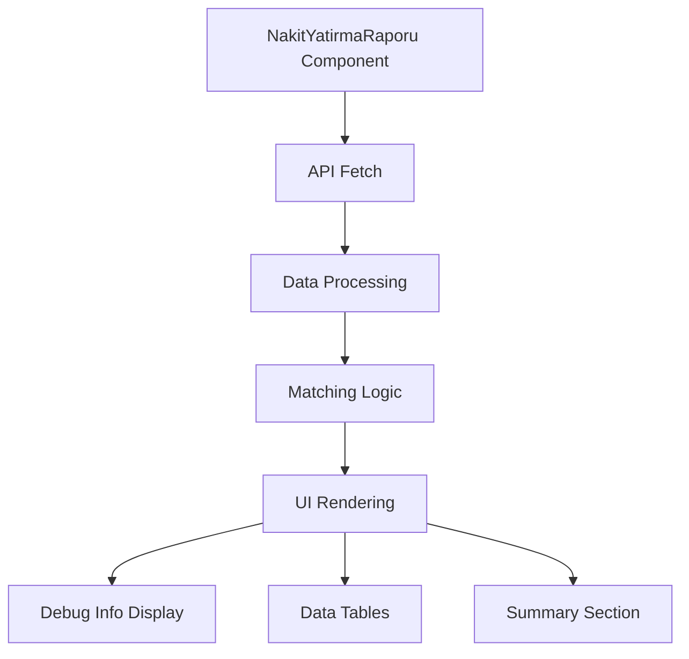
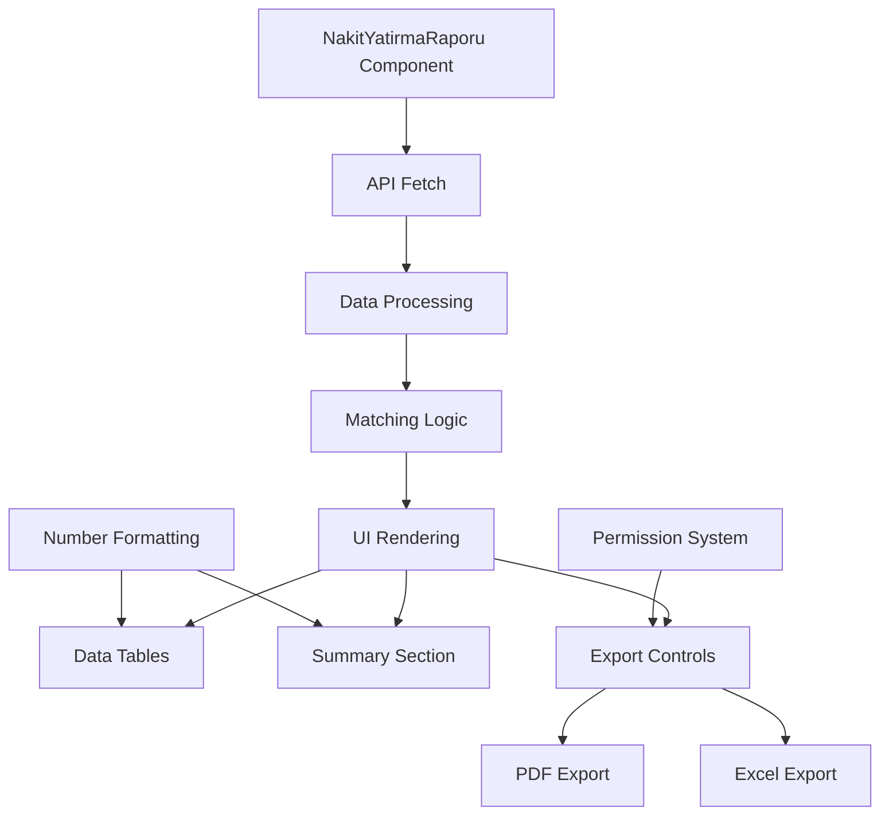
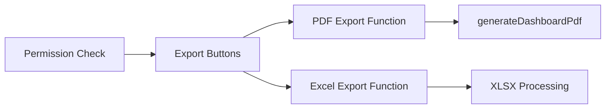
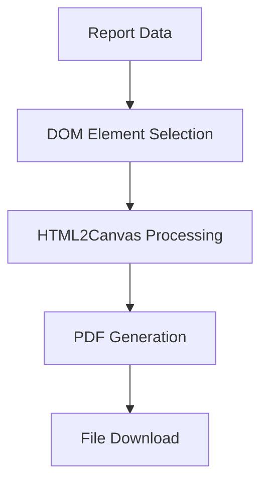
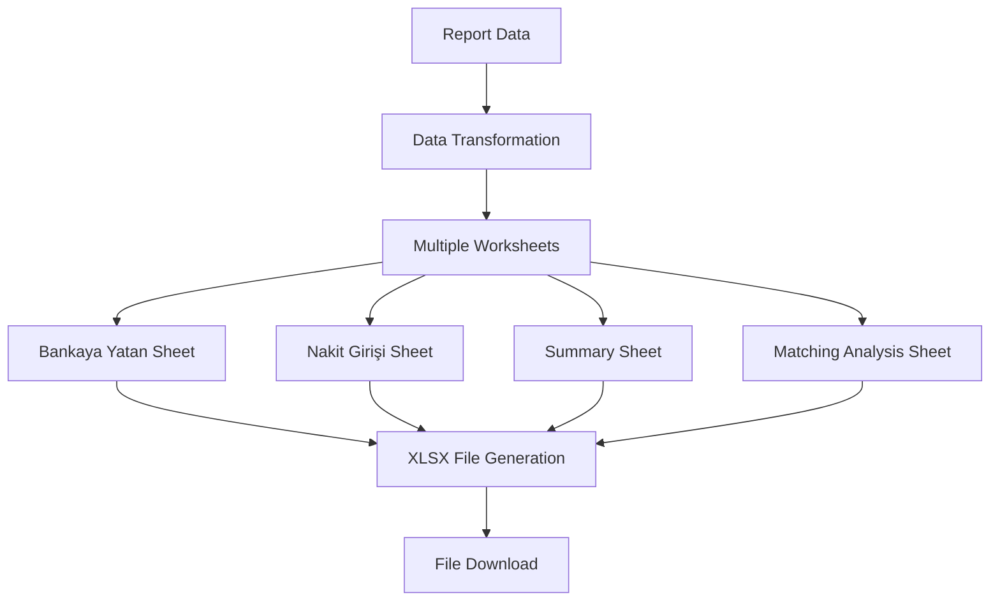
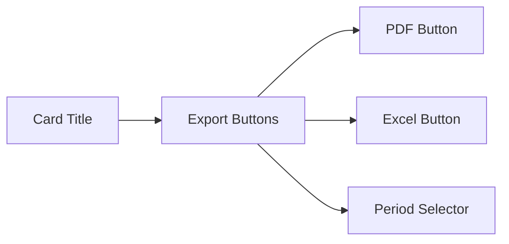

# Nakit Yatırma Kontrol Raporu Enhancement Design

## Overview

This design document outlines the enhancements required for the "Nakit Yatırma Kontrol Raporu" (Cash Deposit Control Report) page, focusing on removing debug information, improving number formatting, and implementing export functionality similar to the "Üst Kategori Yönetimi" screen.

## Architecture

The "Nakit Yatırma Kontrol Raporu" page is a React-based component that displays a comparative analysis of cash deposits between bank deposits ("Bankaya Yatan") and cash entries ("Nakit Girişi"). The enhancement will improve user experience by:

1. **Removing debug information** that is currently displayed to users
2. **Standardizing number formatting** to use thousand separators without decimals
3. **Adding export functionality** for PDF and Excel formats

### Current Architecture



### Enhanced Architecture



## Component Enhancement Design

### 1. Debug Information Removal

**Current Implementation:**
- Debug line displays: "Debug: Data loaded - Bankaya Yatan: 19 records, Nakit Girişi: 10 records"
- Located in the `setDebugInfo` function call within the `fetchReportData` useEffect

**Enhancement:**
- Remove the debug information display from the UI
- Keep console logging for development purposes
- Remove the `debugInfo` state and related UI rendering

### 2. Number Formatting Standardization

**Current Implementation:**
```typescript
const formatCurrency = (value: number) => {
    return new Intl.NumberFormat('tr-TR', { style: 'currency', currency: 'TRY' }).format(value);
};
```

**Enhanced Implementation:**
```typescript
const formatNumber = (value: number) => {
    return new Intl.NumberFormat('tr-TR', {
        minimumFractionDigits: 0,
        maximumFractionDigits: 0,
        useGrouping: true,
    }).format(value);
};

const formatCurrency = (value: number) => {
    return `₺${formatNumber(value)}`;
};
```

### 3. Export Functionality Integration

**Design Pattern from Üst Kategori Yönetimi:**



**Implementation Structure:**

#### Permission Integration
```typescript
const canPrint = hasPermission(YAZDIRMA_YETKISI_ADI);
const canExportExcel = hasPermission(EXCELE_AKTAR_YETKISI_ADI);
```

#### Export Button Layout
```typescript
actions={
    <div className="flex items-center space-x-2 hide-on-pdf">
        {canPrint && (
            <Button onClick={handleGeneratePdf} variant="ghost" size="sm" title="PDF Olarak İndir" className="print-button">
                <Icons.Print className="w-5 h-5" />
            </Button>
        )}
        {canExportExcel && (
            <Button onClick={handleExportToExcel} variant="ghost" size="sm" title="Excel'e Aktar">
                <Icons.Download className="w-5 h-5" />
            </Button>
        )}
        <Select value={selectedPeriod} onChange={(e) => setSelectedPeriod(e.target.value)}>
            {availablePeriods.map(p => <option key={p} value={p}>{p}</option>)}
        </Select>
    </div>
}
```

## Data Flow Design

### Export Data Structure

#### PDF Export


#### Excel Export


### Excel Export Data Structure

#### Sheet 1: Bankaya Yatan (Bank Deposits)
| Sıra | Tarih | Dönem | Tutar | Durum |
|------|-------|-------|-------|-------|
| 1 | 20.08.2025 | 2508 | 13.600 | Eşleşti |
| 2 | 19.08.2025 | 2508 | 5.600 | Eşleşti |

#### Sheet 2: Nakit Girişi (Cash Entries)
| Sıra | Tarih | Dönem | Tutar | Durum |
|------|-------|-------|-------|-------|
| 1 | 22.08.2025 | 2508 | 3.000 | Eşleşti |
| 2 | 21.08.2025 | 2508 | 9.400 | Eşleşti |

#### Sheet 3: Özet Rapor (Summary Report)
| Kategori | Toplam | Eşleşen | Eşleşmeyen |
|----------|---------|---------|------------|
| Bankaya Yatan | 125.000 | 15 | 4 |
| Nakit Girişi | 123.500 | 15 | 1 |
| Fark | 1.500 | - | - |

#### Sheet 4: Eşleşme Analizi (Matching Analysis)
| Bankaya Yatan Tutar | Nakit Girişi Tutar | Fark | Durum |
|---------------------|-------------------|------|-------|
| 13.600 | 13.600 | 0 | Tam Eşleşme |
| 5.600 | 5.600 | 0 | Tam Eşleşme |

## UI Component Design

### Enhanced Card Header


### Number Display Enhancement

**Before:**
- Currency format: "₺12,500.00"
- Displays decimals even for whole numbers

**After:**
- Currency format: "₺12,500"
- No decimal places
- Thousand separators maintained

### Export Button States

| State | PDF Button | Excel Button | Behavior |
|-------|------------|--------------|----------|
| No Permission | Hidden | Hidden | Not displayed |
| Loading | Disabled | Disabled | Shows loading state |
| No Data | Disabled | Disabled | Grayed out |
| Ready | Enabled | Enabled | Fully functional |

## Implementation Requirements

### 1. Import Dependencies
```typescript
import { generateDashboardPdf } from '../utils/pdfGenerator';
import * as XLSX from 'xlsx';
import { YAZDIRMA_YETKISI_ADI, EXCELE_AKTAR_YETKISI_ADI } from '../constants';
```

### 2. State Management
```typescript
// Remove debug state
// const [debugInfo, setDebugInfo] = useState<string>('');

// Add permission states
const canPrint = hasPermission(YAZDIRMA_YETKISI_ADI);
const canExportExcel = hasPermission(EXCELE_AKTAR_YETKISI_ADI);
```

### 3. Export Functions

#### PDF Export Function
```typescript
const handleGeneratePdf = () => {
    generateDashboardPdf(
        'nakit-yatirma-raporu-content',
        `Nakit_Yatirma_Kontrol_Raporu_${selectedBranch?.Sube_Adi}_${selectedPeriod}.pdf`
    );
};
```

#### Excel Export Function
```typescript
const handleExportToExcel = () => {
    if (!reportData || !selectedBranch) return;

    const wb = XLSX.utils.book_new();
    
    // Create Bankaya Yatan sheet
    const bankayaData = reportData.bankaya_yatan.map((item, index) => ({
        'Sıra': index + 1,
        'Tarih': new Date(item.Tarih).toLocaleDateString('tr-TR'),
        'Dönem': item.Donem,
        'Tutar': item.Tutar,
        'Durum': isMatched(index, 'bankaya') ? 'Eşleşti' : 'Eşleşmedi'
    }));
    
    // Create worksheets and set column widths
    const wsBankaya = XLSX.utils.json_to_sheet(bankayaData);
    wsBankaya['!cols'] = [
        { wch: 8 },  // Sıra
        { wch: 15 }, // Tarih
        { wch: 10 }, // Dönem
        { wch: 15 }, // Tutar
        { wch: 12 }  // Durum
    ];
    
    XLSX.utils.book_append_sheet(wb, wsBankaya, 'Bankaya Yatan');
    
    // Similar implementation for other sheets...
    
    XLSX.writeFile(wb, `Nakit_Yatirma_Kontrol_Raporu_${selectedBranch.Sube_Adi}_${selectedPeriod}.xlsx`);
};
```

### 4. UI Container Enhancement
```typescript
<div className="space-y-6" id="nakit-yatirma-raporu-content">
    <Card title={`Nakit Yatırma Kontrol Raporu (Şube: ${selectedBranch?.Sube_Adi})`} actions={
        <div className="flex items-center space-x-2 hide-on-pdf">
            {canPrint && (
                <Button onClick={handleGeneratePdf} variant="ghost" size="sm" title="PDF Olarak İndir" className="print-button">
                    <Icons.Print className="w-5 h-5" />
                </Button>
            )}
            {canExportExcel && (
                <Button onClick={handleExportToExcel} variant="ghost" size="sm" title="Excel'e Aktar">
                    <Icons.Download className="w-5 h-5" />
                </Button>
            )}
            <Select value={selectedPeriod} onChange={(e) => setSelectedPeriod(e.target.value)}>
                {availablePeriods.map(p => <option key={p} value={p}>{p}</option>)}
            </Select>
        </div>
    }>
        {/* Remove debug information display */}
        {/* Rest of the component content */}
    </Card>
</div>
```

## Testing Strategy

### Unit Testing Requirements

1. **Number Formatting Tests**
   - Test formatCurrency with various number inputs
   - Verify no decimal places are shown
   - Confirm thousand separators work correctly

2. **Export Function Tests**
   - Test PDF generation with mock data
   - Test Excel export with various data scenarios
   - Verify file naming conventions

3. **Permission Tests**
   - Test button visibility with different permission combinations
   - Verify button states based on permissions

### Integration Testing

1. **UI Integration**
   - Test export buttons are properly positioned
   - Verify responsive behavior
   - Test accessibility features

2. **Data Integration**
   - Test export functions with real API data
   - Verify data accuracy in exported files
   - Test edge cases (empty data, large datasets)

## Security Considerations

1. **Permission Enforcement**
   - Export buttons only visible with proper permissions
   - Server-side validation for sensitive operations

2. **Data Protection**
   - No sensitive data in exported file names
   - Proper sanitization of export data

3. **File Security**
   - Generated files do not contain executable content
   - Proper MIME type handling

## Performance Considerations

1. **Export Performance**
   - Optimize Excel generation for large datasets
   - Implement progress indicators for long operations

2. **Memory Management**
   - Proper cleanup of generated objects
   - Efficient data processing for exports

3. **User Experience**
   - Non-blocking export operations
   - Clear feedback during export processes

## Accessibility Requirements

1. **Button Accessibility**
   - Proper ARIA labels for export buttons
   - Keyboard navigation support
   - Screen reader compatibility

2. **Visual Accessibility**
   - High contrast for export buttons
   - Clear visual indicators for button states
   - Consistent with existing design system

## Error Handling

1. **Export Errors**
   - Graceful handling of PDF generation failures
   - User-friendly error messages for Excel export issues
   - Fallback options when exports fail

2. **Data Validation**
   - Validation before export operations
   - Proper error messages for invalid data states
   - Retry mechanisms for temporary failures

## Migration Strategy

1. **Backward Compatibility**
   - Maintain existing functionality during enhancement
   - No breaking changes to API contracts
   - Preserve existing user workflows

2. **Gradual Rollout**
   - Deploy debug removal first
   - Add number formatting improvements
   - Implement export functionality last

3. **User Training**
   - Document new export features
   - Provide usage guidelines
   - Update user documentation