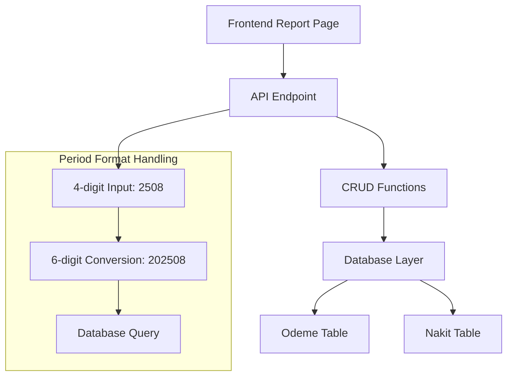
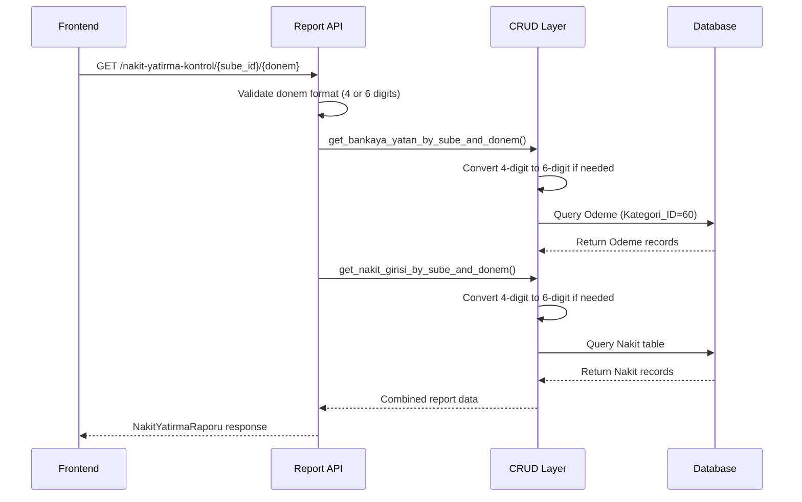
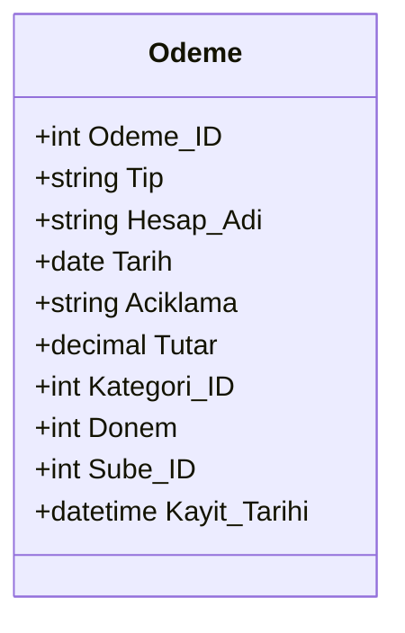
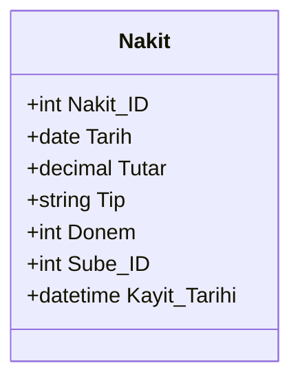
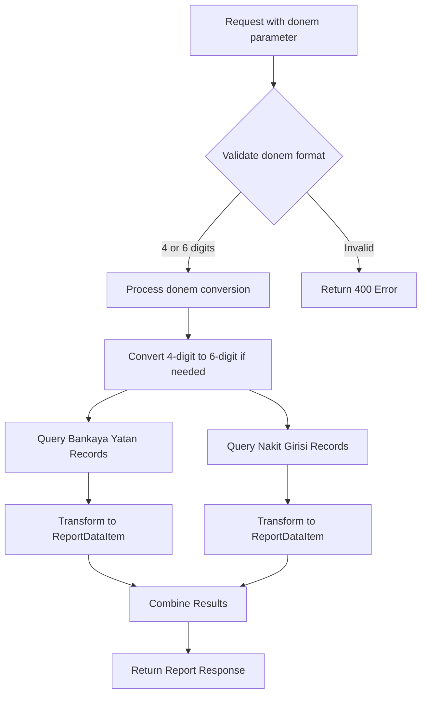

# Odeme Period Format Update Design

## Overview

The SilverCloud system has undergone a period format change from 6-digit (YYYYMM) to 4-digit (YYMM) format in the Odeme (Payment) table. This change affects the Cash Deposit Control Report (Nakit Yatırma Kontrol Raporu) functionality and requires updates to ensure compatibility between the new 4-digit format and existing 6-digit data.

### Problem Statement

- **Current Issue**: Reports are not working as expected after updating Odeme period digits from 6 to 4 digits
- **Database State**: 
  - `SELECT * FROM SilverCloud.Odeme where Kategori_ID=60 and Donem=2508` returns records (4-digit format)
  - `SELECT * FROM SilverCloud.Nakit where Donem=2508` returns 10 records (4-digit format)
- **Impact**: The reporting system may not properly correlate data between tables due to period format inconsistencies

## Architecture

### Current System Components



### Data Flow Architecture



## Data Models & Period Format Handling

### Current Implementation

#### Odeme (Payment) Model


#### Nakit (Cash) Model


### Period Format Conversion Logic

Current conversion mechanism in CRUD functions:

| Input Format | Example | Conversion Rule | Database Query |
|--------------|---------|-----------------|----------------|
| 4-digit | 2508 | `donem = 2000 + donem` → 202508 | Donem = 202508 |
| 6-digit | 202508 | No conversion needed | Donem = 202508 |

## API Endpoints Reference

### Report API Endpoint

**Endpoint**: `GET /api/v1/nakit-yatirma-kontrol/{sube_id}/{donem}`

**Parameters**:
- `sube_id`: Integer - Branch ID
- `donem`: Integer - Period in YYMM (4-digit) or YYYYMM (6-digit) format

**Validation Rules**:
```typescript
if (donem <= 0 || len(str(donem)) not in [4, 6]) {
    raise HTTPException(status_code=400, 
        detail="Invalid donem format. Expected YYMM or YYYYMM format")
}
```

**Response Schema**:
```typescript
interface NakitYatirmaRaporu {
    bankaya_yatan: ReportDataItem[];
    nakit_girisi: ReportDataItem[];
}

interface ReportDataItem {
    Tarih: string;      // YYYY-MM-DD format
    Donem: number;      // Original period value from database
    Tutar: number;      // Amount as float
}
```

## Business Logic Layer

### Report Generation Process



### Period Conversion Functions

#### Backend Conversion Logic
```python
def convert_period_to_6_digit(donem: int) -> int:
    """Convert 4-digit period to 6-digit format"""
    if len(str(donem)) == 4:
        return 2000 + donem  # 2508 → 202508
    return donem  # Already 6-digit
```

#### Frontend Period Generation
```typescript
function generatePeriod(date: Date): string {
    const year = date.getFullYear() % 100;  // Get YY
    const month = date.getMonth() + 1;      // Get MM
    return `${year.toString().padStart(2, '0')}${month.toString().padStart(2, '0')}`;
}
```

## Database Consistency Strategy

### Migration Considerations

#### Current State Analysis
- **Odeme Table**: Mixed format - some records use 4-digit, others may use 6-digit
- **Nakit Table**: Mixed format - some records use 4-digit, others may use 6-digit
- **Compatibility**: System must handle both formats during transition

#### Recommended Approach

1. **Maintain Backward Compatibility**: Keep existing conversion logic
2. **Standardize on 4-digit**: Update all new records to use 4-digit format
3. **Query Flexibility**: Support both formats in database queries

### Data Validation Rules

| Table | Field | Format | Validation Rule |
|-------|-------|--------|-----------------|
| Odeme | Donem | YYMM | Length = 4, Range: 2101-9912 |
| Nakit | Donem | YYMM | Length = 4, Range: 2101-9912 |
| EFatura | Donem | YYMM | Length = 4, Range: 2101-9912 |
| B2BEkstre | Donem | YYMM | Length = 4, Range: 2101-9912 |

## Testing Strategy

### Unit Testing Requirements

#### Backend CRUD Functions
```python
def test_period_conversion():
    # Test 4-digit input
    assert convert_period_to_6_digit(2508) == 202508
    
    # Test 6-digit input (no conversion)
    assert convert_period_to_6_digit(202508) == 202508
    
    # Test edge cases
    assert convert_period_to_6_digit(2101) == 202101  # January 2021
    assert convert_period_to_6_digit(2412) == 202412  # December 2024
```

#### API Endpoint Testing
```python
def test_nakit_yatirma_raporu_endpoint():
    # Test with 4-digit period
    response = client.get("/nakit-yatirma-kontrol/1/2508")
    assert response.status_code == 200
    
    # Test with 6-digit period  
    response = client.get("/nakit-yatirma-kontrol/1/202508")
    assert response.status_code == 200
    
    # Test invalid format
    response = client.get("/nakit-yatirma-kontrol/1/508")
    assert response.status_code == 400
```

### Integration Testing

#### Database Query Validation
```sql
-- Test data retrieval with 4-digit period
SELECT COUNT(*) FROM Odeme WHERE Kategori_ID=60 AND Donem=2508;

-- Test data retrieval with 6-digit period  
SELECT COUNT(*) FROM Odeme WHERE Kategori_ID=60 AND Donem=202508;

-- Verify data consistency
SELECT DISTINCT Donem FROM Odeme WHERE Kategori_ID=60 ORDER BY Donem;
SELECT DISTINCT Donem FROM Nakit ORDER BY Donem;
```

#### Frontend-Backend Integration
```typescript
describe('Period Format Integration', () => {
    test('Report loads with 4-digit period', async () => {
        const response = await fetchReportData(1, '2508');
        expect(response.bankaya_yatan).toBeDefined();
        expect(response.nakit_girisi).toBeDefined();
    });
    
    test('Period dropdown shows correct format', () => {
        const periods = generateAvailablePeriods();
        expect(periods[0]).toMatch(/^\d{4}$/); // YYMM format
    });
});
```

## Implementation Requirements

### Backend Updates

#### CRUD Function Enhancements
- **Current State**: ✅ Already implemented in `get_bankaya_yatan_by_sube_and_donem()`
- **Current State**: ✅ Already implemented in `get_nakit_girisi_by_sube_and_donem()`
- **Requirement**: Ensure consistent period conversion across all CRUD functions

#### API Validation Updates
- **Current State**: ✅ Already validates 4 and 6-digit formats
- **Enhancement**: Add specific error messages for period format validation
- **Enhancement**: Log period conversion operations for debugging

### Frontend Updates

#### Period Selection Component
- **Current State**: ✅ Generates 4-digit periods correctly
- **Enhancement**: Validate period format before API calls
- **Enhancement**: Display human-readable period labels (e.g., "2508 (Ağustos 2025)")

#### Error Handling Enhancements
```typescript
interface PeriodValidation {
    isValid: boolean;
    format: '4-digit' | '6-digit' | 'invalid';
    converted: string;
    displayText: string;
}

function validatePeriod(period: string): PeriodValidation {
    if (period.length === 4 && /^\d{4}$/.test(period)) {
        return {
            isValid: true,
            format: '4-digit',
            converted: period,
            displayText: formatPeriodDisplay(period)
        };
    }
    // Handle other cases...
}
```

### Data Seeding Updates

#### Test Data Generation
- **Update**: Modify seed scripts to use 4-digit format
- **Compatibility**: Ensure test data works with both old and new systems
- **Validation**: Add data consistency checks

```python
# Updated seed data format
test_odeme_data = [
    {
        "Tarih": date(2025, 8, 22),
        "Tutar": Decimal("3000.00"),
        "Donem": 2508,  # 4-digit format
        "Kategori_ID": 60,
        "Sube_ID": 1
    }
]
```

## Monitoring and Debugging

### Logging Enhancements

#### Backend Logging
```python
logger.info(f"Period conversion: {donem} -> {converted_donem} (format: {format_type})")
logger.info(f"Query execution: Found {record_count} records for donem {final_donem}")
```

#### Frontend Debug Information
```typescript
const debugInfo = {
    originalPeriod: selectedPeriod,
    apiUrl: constructedUrl,
    responseData: {
        bankayaYatanCount: data.bankaya_yatan.length,
        nakitGirisiCount: data.nakit_girisi.length
    }
};
```

### Performance Monitoring

#### Database Query Optimization
- **Index Usage**: Ensure proper indexing on `Donem` fields
- **Query Performance**: Monitor query execution times for period-based filters
- **Data Volume**: Track data growth and query performance impact

## Risk Mitigation

### Compatibility Risks

| Risk | Impact | Mitigation |
|------|--------|------------|
| Mixed period formats in database | High | Maintain conversion logic, validate data consistency |
| Frontend-backend format mismatch | Medium | Implement strict validation on both ends |
| Historical data access issues | Medium | Support both formats, implement fallback queries |
| Performance degradation | Low | Optimize queries, add appropriate indexes |

### Rollback Strategy

1. **Database Rollback**: Keep conversion logic active to support old format
2. **Code Rollback**: Version control allows reverting to 6-digit logic
3. **Data Integrity**: Backup critical data before major changes
4. **Testing**: Comprehensive testing in staging environment

## Success Criteria

### Functional Requirements
- ✅ Reports load correctly with 4-digit period input (2508)
- ✅ Data correlation works between Odeme and Nakit tables
- ✅ Period dropdown displays correct 4-digit format options
- ✅ API validation accepts both 4-digit and 6-digit formats
- ✅ Error handling provides clear feedback for invalid periods

### Performance Requirements
- Report loading time < 3 seconds for typical data volumes
- Database queries execute efficiently with period-based filters
- No memory leaks or performance degradation in frontend

### Data Integrity Requirements
- No data loss during period format transitions
- Consistent period format across all new records
- Accurate data correlation in reports

### User Experience Requirements
- Intuitive period selection interface
- Clear error messages for invalid periods
- Responsive design maintains usability across devices