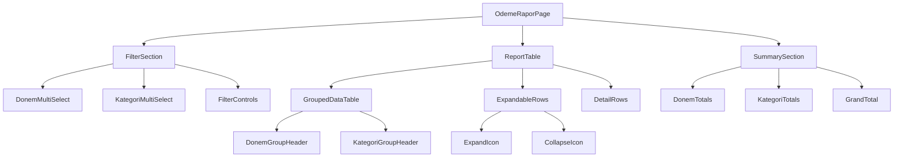
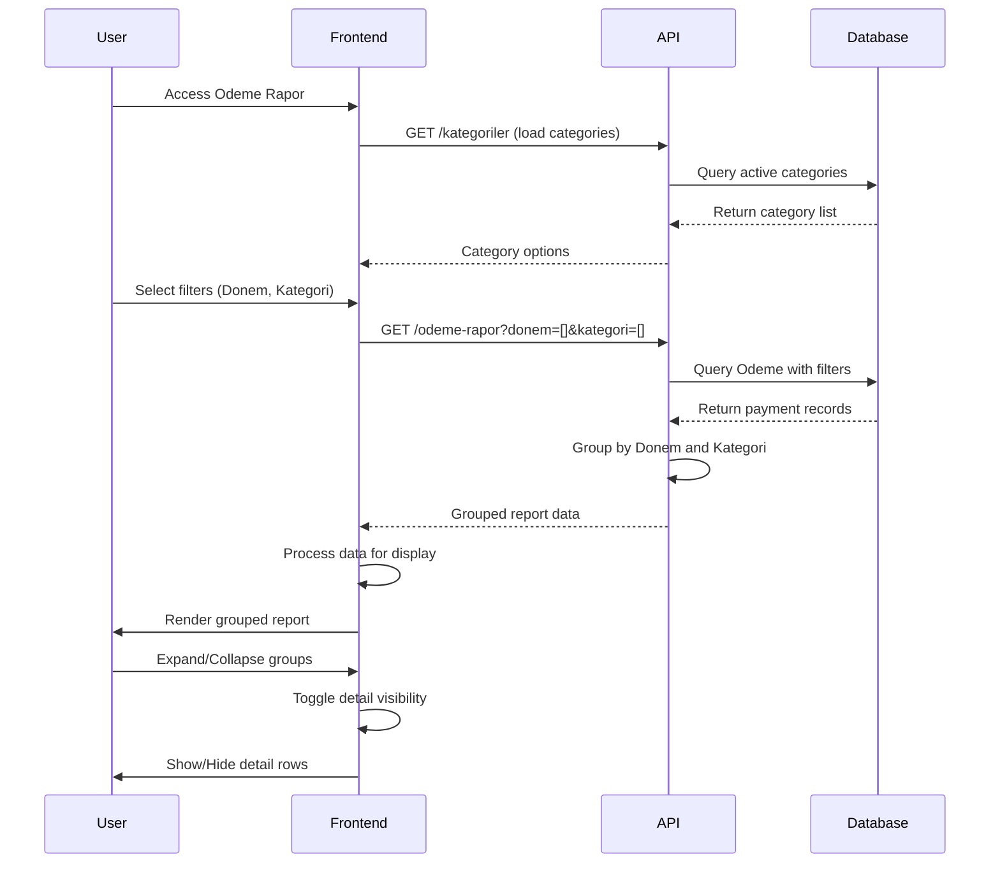
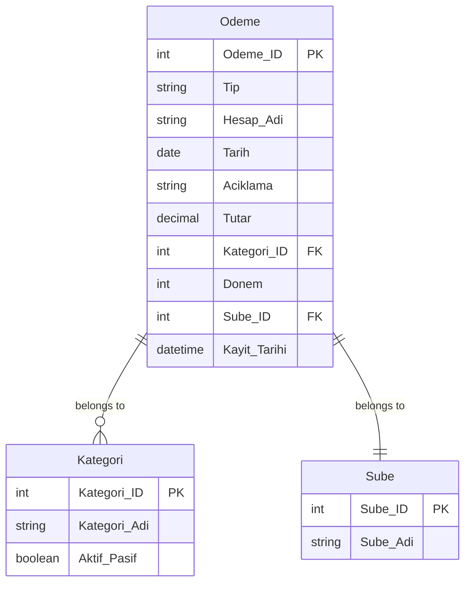
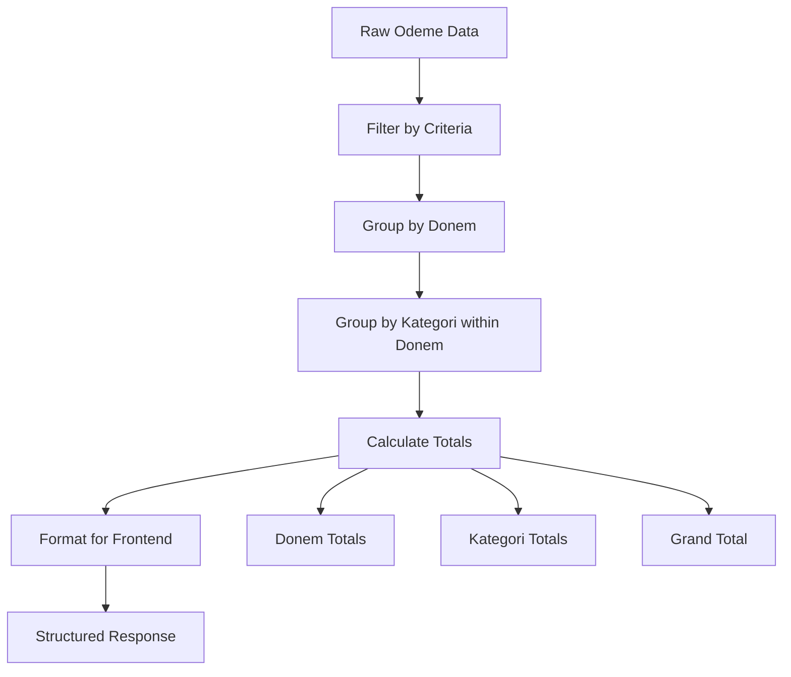
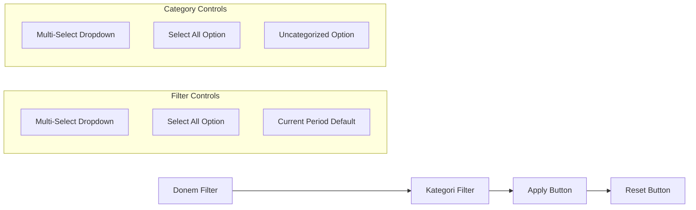
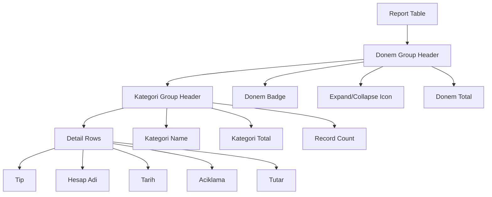
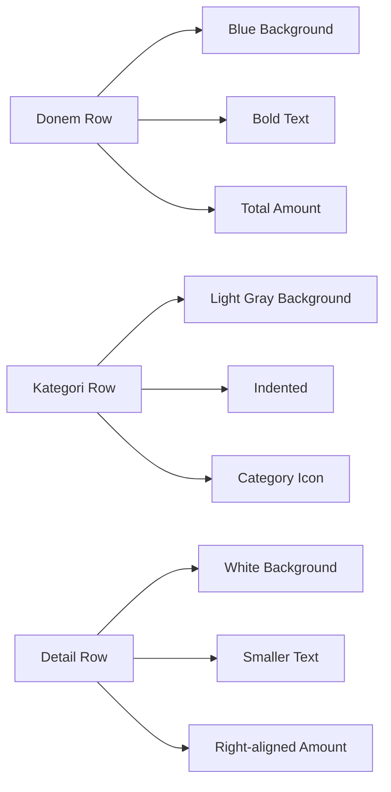

# Odeme Rapor Design Document

## Overview

The Odeme Rapor is a new reporting module that provides comprehensive analysis of payment data from the Odeme table. This report will be accessible under the Rapor menu and will feature multi-select filters for Donem (Period) and Kategori (Category), with data grouping and expandable detail views.

## Technology Stack & Dependencies

### Frontend Technologies
- **React 18+** with TypeScript
- **Tailwind CSS** for styling
- **Vite** as build tool
- **React Hooks** for state management

### Backend Technologies
- **FastAPI** for API endpoints
- **SQLAlchemy ORM** for database operations
- **Pydantic** for data validation

### Key Dependencies
- Existing Odeme API endpoints
- Category (Kategori) API for filter options
- Period-based data filtering
- Report permissions system

## Component Architecture

### Frontend Component Structure



### Data Flow Architecture



## API Endpoints Reference

### New Endpoint: GET /api/v1/odeme-rapor

#### Request Schema
```typescript
interface OdemeRaporRequest {
  donem?: number[];     // Optional array of periods (e.g., [2508, 2509])
  kategori?: number[];  // Optional array of category IDs
  sube_id?: number;     // Branch filter (from context)
}
```

#### Response Schema
```typescript
interface OdemeRaporResponse {
  data: DonemGroup[];
  totals: {
    donem_totals: { [donem: number]: number };
    kategori_totals: { [kategori_id: number]: number };
    grand_total: number;
  };
}

interface DonemGroup {
  donem: number;
  donem_total: number;
  kategoriler: KategoriGroup[];
}

interface KategoriGroup {
  kategori_id: number | null;
  kategori_adi: string;
  kategori_total: number;
  details: OdemeDetail[];
}

interface OdemeDetail {
  odeme_id: number;
  tip: string;
  hesap_adi: string;
  tarih: string;
  aciklama: string;
  tutar: number;
}
```

### Backend Implementation

#### API Endpoint
```python
@router.get("/odeme-rapor/", response_model=OdemeRaporResponse)
async def get_odeme_rapor(
    donem: Optional[List[int]] = Query(None),
    kategori: Optional[List[int]] = Query(None),
    sube_id: Optional[int] = None,
    current_user: User = Depends(get_current_user),
    db: Session = Depends(get_db)
):
    # Permission check
    if not has_permission(current_user, "ODEME_RAPOR_YETKI_ADI"):
        raise HTTPException(status_code=403, detail="Insufficient permissions")
    
    # Get report data
    report_data = crud.get_odeme_rapor(
        db=db,
        donem_list=donem,
        kategori_list=kategori,
        sube_id=sube_id or current_user.sube_id
    )
    
    return report_data
```

#### CRUD Operations
```python
def get_odeme_rapor(
    db: Session,
    donem_list: Optional[List[int]] = None,
    kategori_list: Optional[List[int]] = None,
    sube_id: Optional[int] = None
) -> OdemeRaporResponse:
    
    # Build query
    query = db.query(Odeme)
    
    if sube_id:
        query = query.filter(Odeme.Sube_ID == sube_id)
    
    if donem_list:
        query = query.filter(Odeme.Donem.in_(donem_list))
    
    if kategori_list:
        query = query.filter(Odeme.Kategori_ID.in_(kategori_list))
    
    # Include uncategorized if not filtered by category
    if not kategori_list:
        query = query.filter(
            or_(Odeme.Kategori_ID.in_(kategori_list), Odeme.Kategori_ID.is_(None))
        )
    
    # Join with Kategori for names
    query = query.outerjoin(Kategori, Odeme.Kategori_ID == Kategori.Kategori_ID)
    
    # Order by Donem, Kategori, Tarih
    query = query.order_by(Odeme.Donem, Odeme.Kategori_ID, Odeme.Tarih)
    
    records = query.all()
    
    # Group and calculate totals
    return _group_odeme_data(records)
```

## Data Models & ORM Mapping

### Extended Odeme Model Usage
The report utilizes the existing Odeme model with its relationships:



### Data Grouping Logic

```typescript
interface GroupedData {
  [donem: number]: {
    donem_total: number;
    kategoriler: {
      [kategori_id: string]: {
        kategori_adi: string;
        kategori_total: number;
        details: OdemeDetail[];
      }
    }
  }
}
```

## Business Logic Layer

### Data Processing Architecture



### Filtering Rules
1. **Period Filter (Donem)**:
   - Multi-select allows choosing multiple periods
   - "All" option includes all available periods
   - Default to current period if none selected

2. **Category Filter (Kategori)**:
   - Multi-select from active categories
   - "All" option includes categorized and uncategorized
   - Uncategorized items shown as "Kategorilendirilmemiş"

3. **Branch Filter**:
   - Automatically applied based on user's branch
   - Admin users can select different branches

### Grouping and Aggregation
1. **Primary Grouping**: By Donem (Period)
2. **Secondary Grouping**: By Kategori within each Donem
3. **Detail Level**: Individual Odeme records
4. **Totals Calculation**:
   - Sum by Kategori within Donem
   - Sum by Donem across all Kategoriler
   - Grand total across all records

## User Interface Design

### Filter Section Layout



### Table Structure



### Component Implementation

#### Filter Component
```typescript
interface FilterProps {
  selectedDonemler: number[];
  selectedKategoriler: number[];
  availableDonemler: number[];
  availableKategoriler: Kategori[];
  onDonemChange: (donemler: number[]) => void;
  onKategoriChange: (kategoriler: number[]) => void;
  onApplyFilters: () => void;
  onResetFilters: () => void;
}

const OdemeRaporFilters: React.FC<FilterProps> = ({ ... }) => {
  return (
    <div className="grid grid-cols-1 md:grid-cols-4 gap-4 p-4 bg-gray-50 rounded-lg">
      <DonemMultiSelect />
      <KategoriMultiSelect />
      <div className="flex gap-2">
        <Button onClick={onApplyFilters}>Filtrele</Button>
        <Button variant="outline" onClick={onResetFilters}>Temizle</Button>
      </div>
    </div>
  );
};
```

#### Expandable Table Component
```typescript
interface ExpandableTableProps {
  data: DonemGroup[];
  expandedDonemler: Set<number>;
  expandedKategoriler: Set<string>;
  onToggleDonem: (donem: number) => void;
  onToggleKategori: (key: string) => void;
}

const ExpandableReportTable: React.FC<ExpandableTableProps> = ({ ... }) => {
  return (
    <div className="overflow-x-auto">
      <table className="w-full border-collapse">
        {data.map(donemGroup => (
          <DonemGroupRow
            key={donemGroup.donem}
            donemGroup={donemGroup}
            isExpanded={expandedDonemler.has(donemGroup.donem)}
            onToggle={() => onToggleDonem(donemGroup.donem)}
          />
        ))}
      </table>
    </div>
  );
};
```

### Visual Design Patterns

#### Grouping Indicators


#### Responsive Design
- **Desktop**: 4-column filter layout, full table view
- **Tablet**: 2-column filter layout, horizontal scroll for table
- **Mobile**: Stacked filters, card-based detail view

## Menu Integration

### Menu Structure Update
Add "Odeme Rapor" under the existing "Rapor" menu:

```typescript
const MENU_GROUPS = {
  // ... existing menu items
  Rapor: {
    label: 'Rapor',
    items: [
      {
        key: 'nakit-yatirma-raporu',
        label: 'Nakit Yatırma Kontrol Raporu',
        path: '/nakit-yatirma-raporu',
        permission: 'NAKIT_YATIRMA_RAPORU_YETKI_ADI'
      },
      {
        key: 'odeme-rapor',
        label: 'Ödeme Rapor',
        path: '/odeme-rapor',
        permission: 'ODEME_RAPOR_YETKI_ADI'
      }
    ]
  }
};
```

### Permission Requirements
- **Permission Name**: `ODEME_RAPOR_YETKI_ADI`
- **Required Role**: Users with financial reporting access
- **Scope**: Branch-specific data access

## Testing Strategy

### Unit Testing
```typescript
describe('OdemeRapor', () => {
  test('should group data by donem and kategori', () => {
    const mockData = [
      { donem: 2508, kategori_id: 1, tutar: 1000 },
      { donem: 2508, kategori_id: 1, tutar: 500 },
      { donem: 2509, kategori_id: 2, tutar: 750 }
    ];
    
    const result = groupOdemeData(mockData);
    
    expect(result[2508].kategoriler[1].kategori_total).toBe(1500);
    expect(result[2509].kategoriler[2].kategori_total).toBe(750);
  });
  
  test('should handle uncategorized payments', () => {
    const mockData = [
      { donem: 2508, kategori_id: null, tutar: 200 }
    ];
    
    const result = groupOdemeData(mockData);
    
    expect(result[2508].kategoriler['uncategorized']).toBeDefined();
  });
});
```

### Integration Testing
- Test API endpoint with various filter combinations
- Verify data grouping and totals calculation
- Test permission-based access control
- Validate responsive design across devices

### Performance Testing
- Test with large datasets (1000+ records)
- Measure grouping performance
- Test filter response times
- Validate memory usage with expanded views