# Payment Category Assignment Data Missing - Design Document

## Overview

The "Ödeme Kategori Atama" screen is experiencing a critical data display issue where only 2 records are shown for period 2508, despite having 265 rows in the database. Additionally, the period filter ("Dönem Filtresi") needs to be relocated to the same row as other filters, consistent with the "Fatura Kategori Atama" implementation.

## Problem Analysis

### Root Cause Analysis

1. **Data Fetching Limitation**: The backend API endpoint `/Odeme/` uses pagination with a default limit of 100 records
2. **Frontend Filtering Logic**: Current filtering happens after data fetching, which means only a subset of total records are processed
3. **Period Filter Placement**: Missing period filter dropdown in the filter controls grid

### Current Implementation Issues

```mermaid
graph TD
    A[Frontend Request] --> B[Backend /Odeme/ API]
    B --> C[Returns Limited Records<br/>skip=0, limit=100]
    C --> D[Frontend Filtering<br/>265 records → 2 visible]
    D --> E[User sees 2 records<br/>instead of 265]
    
    F[Database] --> G[265 records<br/>for period 2508]
    G -.-> B
```



## Architecture Analysis

### Current Data Flow

| Component | Current Behavior | Issue |
|-----------|------------------|-------|
| API Endpoint | `/Odeme/` with skip/limit pagination | Only returns first 100 records |
| Frontend Context | Loads all data once at startup | Limited by API pagination |
| Period Filtering | Uses frontend-only filtering | Operates on limited dataset |
| UI Filter Layout | 4-column grid missing period filter | Inconsistent with Fatura Kategori Atama |

### Backend API Structure


## Solution Architecture

### Data Fetching Enhancement


### Enhanced Filtering System


## Implementation Strategy

### Backend API Enhancement

#### Option 1: Increase Default Limit
```python
# backend/api/v1/endpoints/odeme.py
@router.get("/Odeme/", response_model=List[odeme.OdemeInDB])
def read_odemeler(skip: int = 0, limit: int = 1000, db: Session = Depends(database.get_db)):
    odemeler = crud.get_odemeler(db, skip=skip, limit=limit)
    return odemeler
```

#### Option 2: Add Filtering Parameters
```python
@router.get("/Odeme/", response_model=List[odeme.OdemeInDB])
def read_odemeler(
    skip: int = 0, 
    limit: int = 1000, 
    sube_id: Optional[int] = None,
    donem: Optional[int] = None,
    db: Session = Depends(database.get_db)
):
    odemeler = crud.get_odemeler_filtered(db, skip=skip, limit=limit, sube_id=sube_id, donem=donem)
    return odemeler
```

### Frontend UI Enhancement

#### Period Filter Integration
```typescript
// Enhanced filter controls grid
<div className="grid grid-cols-1 md:grid-cols-4 gap-4 mb-6">
  <div>
    <label className="block text-sm font-medium text-gray-700 mb-1">Dönem Filtresi</label>
    <select
      value={viewedPeriod}
      onChange={(e) => setViewedPeriod(e.target.value)}
      className="w-full px-3 py-2 border border-gray-300 rounded-md"
    >
      {availablePeriods.map(period => (
        <option key={period} value={period}>{period}</option>
      ))}
    </select>
  </div>
  
  <div>
    <label className="block text-sm font-medium text-gray-700 mb-1">Arama</label>
    <Input placeholder="Tip, hesap adı, açıklama, tutar..." />
  </div>
  
  <div>
    <label className="block text-sm font-medium text-gray-700 mb-1">Toplu Kategori Ataması</label>
    <select className="w-full px-3 py-2 border border-gray-300 rounded-md">
      <option value="">Kategori seçin...</option>
    </select>
  </div>
  
  <div className="flex items-end">
    <label className="flex items-center">
      <input type="checkbox" className="mr-2" />
      <span className="text-sm">Sadece kategorisiz</span>
    </label>
  </div>
</div>
```

#### Data Context Enhancement
```typescript
// Enhanced data fetching with higher limits
const fetchAllData = async () => {
  const odemeler = await fetchData<Odeme[]>(`${API_BASE_URL}/Odeme/?limit=1000`);
  if (odemeler) setOdemeList(odemeler);
};

// Enhanced period calculation
const availablePeriods = useMemo(() => {
  const periods = new Set(odemeList.map(o => o.Donem?.toString() || ''));
  periods.add(currentPeriod);
  return Array.from(periods).filter(p => p).sort((a, b) => b.localeCompare(a));
}, [odemeList, currentPeriod]);
```

## Data Management Strategy

### Pagination vs Complete Loading

| Approach | Pros | Cons | Recommendation |
|----------|------|------|----------------|
| High Limit (1000) | Simple implementation, complete data | Higher memory usage | ✅ Recommended for short term |
| Server-side Filtering | Efficient queries, scalable | Backend changes required | 🔄 Future enhancement |
| Infinite Scroll | Good UX, memory efficient | Complex implementation | ❌ Not needed for this use case |

### Performance Considerations

```mermaid
graph TB
    A[Performance Analysis] --> B[Data Volume]
    A --> C[Network Transfer]
    A --> D[Memory Usage]
    A --> E[UI Responsiveness]
    
    B --> B1[Current: ~1000 records]
    B --> B2[Growth: ~5000 records/year]
    
    C --> C1[1000 records ≈ 200KB]
    C --> C2[Acceptable for modern web]
    
    D --> D1[Client-side filtering fast]
    D --> D2[React rendering optimized]
    
    E --> E1[Initial load: 2-3 seconds]
    E --> E2[Filtering: Real-time]
```



## Implementation Plan

### Phase 1: Data Availability Fix (High Priority)

#### Backend Changes
1. **Update API Endpoint**
   - Increase default limit from 100 to 1000 in `/Odeme/` endpoint
   - Add logging to track data volume

2. **CRUD Enhancement**
   ```python
   # backend/db/crud.py
   def get_odemeler(db: Session, skip: int = 0, limit: int = 1000):
       # Increased from default 100 to 1000
       return db.query(models.Odeme).offset(skip).limit(limit).all()
   ```

#### Frontend Changes
1. **Data Context Update**
   - Verify all payment data is loaded at application startup
   - Add error handling for data loading failures

2. **Filtering Logic Verification**
   - Ensure period filtering works with complete dataset
   - Validate branch and search filtering

### Phase 2: UI Enhancement (Medium Priority)

#### Period Filter Implementation
1. **Add Period Dropdown**
   - Move from card actions to filter controls grid
   - Implement dynamic period selection based on available data
   - Maintain navigation arrows for user convenience

2. **Filter Layout Consistency**
   - Align with "Fatura Kategori Atama" design pattern
   - 4-column responsive grid layout
   - Proper label and spacing alignment

#### Filter Controls Structure
```typescript
interface FilterState {
  searchTerm: string;
  selectedKategoriId: number | null;
  viewedPeriod: string;
  showOnlyUncategorized: boolean;
}

interface PeriodOption {
  value: string;
  label: string;
  isDefault?: boolean;
}
```

### Phase 3: Performance Optimization (Low Priority)

#### Server-side Filtering
1. **Enhanced API Endpoints**
   - Add query parameters for sube_id, donem filtering
   - Implement efficient database indexes
   - Add response caching where appropriate

2. **Progressive Loading**
   - Initial load with current period data
   - Background loading of historical periods
   - Smart prefetching based on user patterns

## Testing Strategy

### Data Integrity Verification

```mermaid
graph LR
    A[Test Plan] --> B[Database Query]
    A --> C[API Response]
    A --> D[Frontend Display]
    
    B --> B1[SELECT COUNT(*) FROM Odeme WHERE Donem=2508]
    C --> C1[GET /Odeme/ returns >100 records]
    D --> D1[UI shows all 265 records]
```

### Test Cases

| Test Case | Expected Result | Validation Method |
|-----------|-----------------|-------------------|
| Period 2508 Data | 265 records displayed | Count UI table rows |
| Period Filter | Dropdown shows available periods | Verify dropdown options |
| Search Functionality | Text search works across all records | Filter and count results |
| Category Assignment | Bulk operations work on full dataset | Assign category to uncategorized |

### Performance Testing
1. **Load Time Measurement**
   - Initial page load with 1000+ records
   - Filter operation response time
   - Memory usage monitoring

2. **User Experience Validation**
   - Filter responsiveness under load
   - UI rendering performance
   - Network request optimization

## Monitoring and Maintenance

### Key Metrics
- **Data Completeness**: Records displayed vs database count
- **Performance**: Page load time, filter response time
- **User Behavior**: Most used filters, common workflows
- **Error Rates**: Data loading failures, filter errors

### Maintenance Tasks
1. **Regular Data Volume Monitoring**
   - Track growth in Odeme table
   - Adjust limits proactively
   - Monitor API response times

2. **UI Consistency Checks**
   - Ensure filter layout matches other category assignment pages
   - Verify responsive design across devices
   - Maintain accessibility standards

## Risk Assessment

### Technical Risks

| Risk | Impact | Probability | Mitigation |
|------|--------|-------------|------------|
| High memory usage | Medium | Low | Monitor and implement pagination if needed |
| Slow initial load | Medium | Low | Add loading indicators, optimize API |
| Data synchronization | High | Low | Ensure real-time updates work correctly |

### User Experience Risks

| Risk | Impact | Probability | Mitigation |
|------|--------|-------------|------------|
| Confusion with new filter layout | Low | Medium | Maintain consistency with existing patterns |
| Performance degradation | Medium | Low | Implement proper loading states |
| Data accuracy concerns | High | Low | Add validation and error messages |

## Success Criteria

### Primary Objectives
1. ✅ **Data Completeness**: All 265 records for period 2508 are displayed
2. ✅ **Period Filter**: Dropdown filter available in same row as other filters
3. ✅ **UI Consistency**: Matches "Fatura Kategori Atama" design pattern
4. ✅ **Performance**: Page loads within 3 seconds for 1000+ records

### Secondary Objectives
1. 🔄 **Scalability**: Solution works with projected data growth
2. 🔄 **Maintainability**: Code is clean and well-documented
3. 🔄 **User Experience**: Intuitive and responsive interface
4. 🔄 **Error Handling**: Graceful degradation on failures
