# Payment Reference Management (Ödeme Referans Yönetimi) Design

## Overview

The Payment Reference Management screen enables users to create, read, update, and delete payment reference records from the `Odeme_Referans` table. This feature provides automated payment categorization by mapping reference text patterns found in payment descriptions to specific categories. The interface design will mirror the existing "e-Fatura Referans Yönetimi" screen for consistency.

## Architecture

### System Integration

The Payment Reference Management screen integrates with the existing SilverCloud system architecture using:
- **Backend API**: FastAPI with `/Odeme_Referans/` endpoints
- **Frontend Framework**: React with TypeScript
- **Database**: MySQL table `Odeme_Referans`
- **Authentication**: JWT-based with role-based permissions

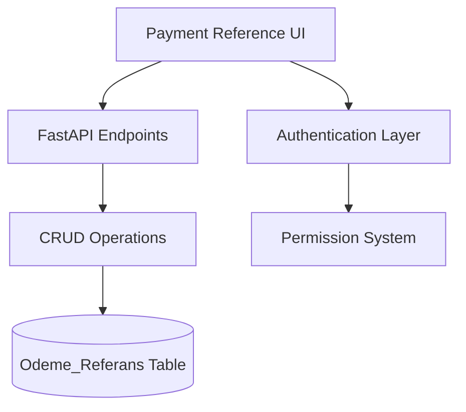

### Component Architecture

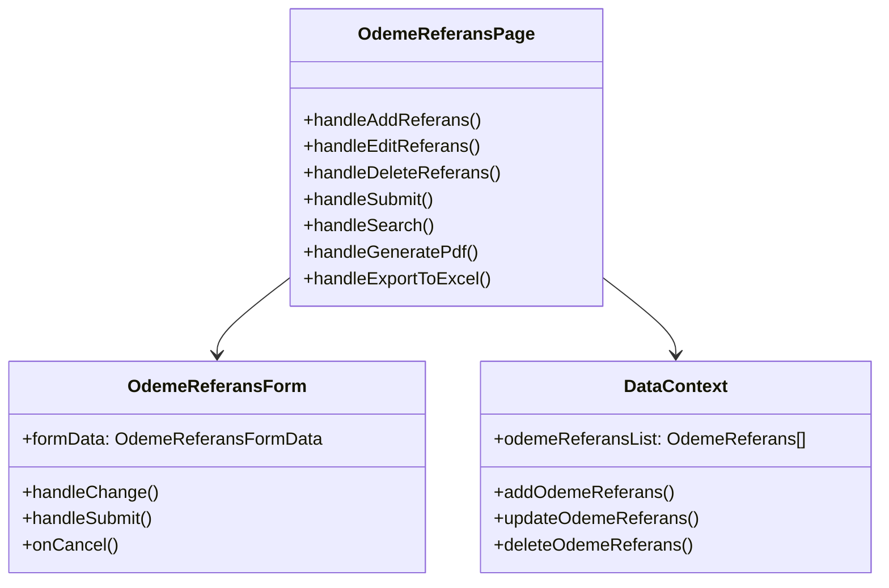

## Data Models & Database Schema

### Database Table Structure

The `Odeme_Referans` table structure:

```sql
CREATE TABLE "Odeme_Referans" (
  "Referans_ID" int NOT NULL AUTO_INCREMENT,
  "Referans_Metin" varchar(50) NOT NULL,
  "Kategori_ID" int NOT NULL,
  "Aktif_Pasif" tinyint(1) NOT NULL DEFAULT '1',
  "Kayit_Tarihi" datetime DEFAULT CURRENT_TIMESTAMP,
  PRIMARY KEY ("Referans_ID"),
  UNIQUE KEY "Referans_Metin_UNIQUE" ("Referans_Metin"),
  KEY "Odeme_Referans_ibfk_1" ("Kategori_ID"),
  CONSTRAINT "Odeme_Referans_ibfk_1" FOREIGN KEY ("Kategori_ID") REFERENCES "Kategori" ("Kategori_ID")
)
```

### Pydantic Schema Models

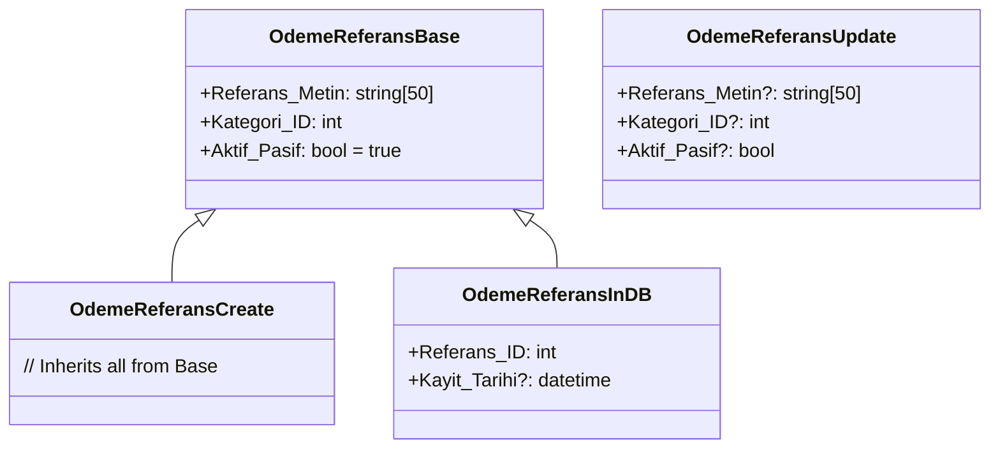

### TypeScript Interface

```typescript
interface OdemeReferans {
  Referans_ID: number;
  Referans_Metin: string;
  Kategori_ID: number;
  Aktif_Pasif: boolean;
  Kayit_Tarihi: string;
}

interface OdemeReferansFormData {
  Referans_Metin: string;
  Kategori_ID: number;
  Aktif_Pasif: boolean;
}
```

## API Endpoints Reference

### Payment Reference CRUD Operations

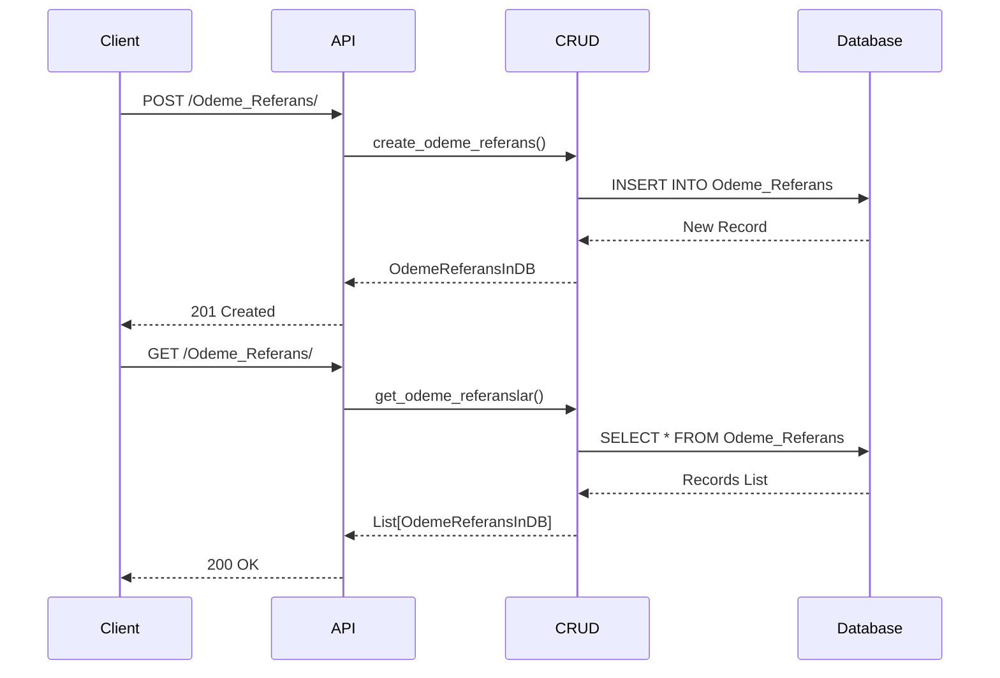

#### Endpoint Operations

| Method | Endpoint | Description | Request Body | Response |
|--------|----------|-------------|--------------|----------|
| GET | `/Odeme_Referans/` | List all payment references | - | `List[OdemeReferansInDB]` |
| POST | `/Odeme_Referans/` | Create new payment reference | `OdemeReferansCreate` | `OdemeReferansInDB` |
| GET | `/Odeme_Referans/{referans_id}` | Get payment reference by ID | - | `OdemeReferansInDB` |
| PUT | `/Odeme_Referans/{referans_id}` | Update payment reference | `OdemeReferansUpdate` | `OdemeReferansInDB` |
| DELETE | `/Odeme_Referans/{referans_id}` | Delete payment reference | - | `204 No Content` |

## User Interface Components

### Main Page Layout

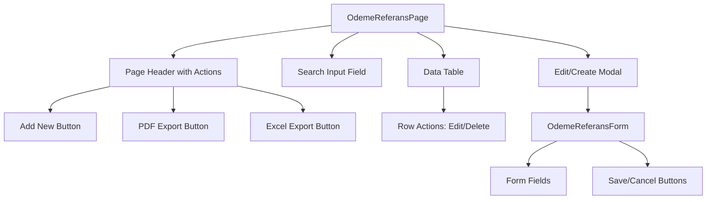

### Form Component Structure

The `OdemeReferansForm` component includes:

1. **Referans Metin Field**: Text input (max 50 characters)
2. **Kategori Selection**: Dropdown with available categories
3. **Aktif/Pasif Toggle**: Checkbox for active/inactive status
4. **Action Buttons**: Save and Cancel buttons

### Table Columns

| Column | Field | Type | Description |
|--------|-------|------|-------------|
| Referans Metin | `Referans_Metin` | String | Reference text pattern |
| Kategori | `Kategori_ID` | Select | Associated category name |
| Aktif | `Aktif_Pasif` | Boolean | Active/Inactive status |
| İşlemler | Actions | Component | Edit/Delete buttons |

## Business Logic Layer

### Form Validation Rules

```mermaid
flowchart TD
    Start[Form Submission] --> ValidateText{Referans_Metin Valid?}
    ValidateText -->|No| ErrorText[Show "Referans Metni boş olamaz"]
    ValidateText -->|Yes| ValidateCategory{Kategori_ID Valid?}
    ValidateCategory -->|No| ErrorCategory[Show "Kategori seçilmelidir"]
    ValidateCategory -->|Yes| CheckUnique{Text Unique?}
    CheckUnique -->|No| ErrorUnique[Show "Bu referans metni zaten mevcut"]
    CheckUnique -->|Yes| Submit[Submit Form]
    
    ErrorText --> End[Return to Form]
    ErrorCategory --> End
    ErrorUnique --> End
    Submit --> Success[Show Success Message]
    Success --> Refresh[Refresh Data List]
```

### Search Functionality

The search feature filters results based on:
- Reference text (`Referans_Metin`)
- Category name (resolved from `Kategori_ID`)
- Active/Inactive status

### Data Operations Flow

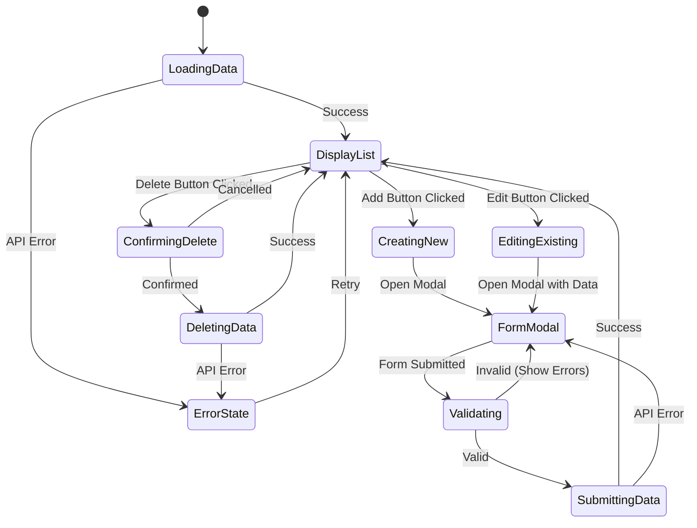

## Integration with Payment Processing

### Automated Categorization

The payment reference system enables automated categorization during payment CSV uploads:

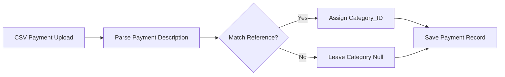

### Reference Matching Logic

During payment processing, the system:
1. Extracts the payment description (`Aciklama` field)
2. Searches for any `Referans_Metin` pattern within the description
3. If found, assigns the corresponding `Kategori_ID`
4. Only active references (`Aktif_Pasif = true`) are considered

## Styling Strategy

### Tailwind CSS Implementation

The component follows the existing design system:
- **Card Layout**: Using the `Card` component wrapper
- **Form Styling**: Consistent with other management screens
- **Table Design**: Matches the `TableLayout` component pattern
- **Button Styles**: Primary, secondary, and ghost variants
- **Modal Design**: Consistent with the existing `Modal` component

### Responsive Design

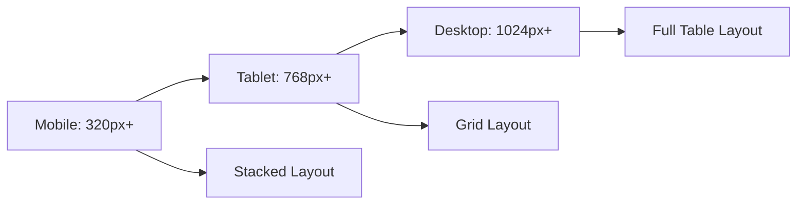

## State Management

### React Context Integration

The component integrates with the existing `DataContext` provider:

```typescript
interface DataContextType {
  odemeReferansList: OdemeReferans[];
  addOdemeReferans: (data: OdemeReferansFormData) => Promise<{success: boolean; message?: string}>;
  updateOdemeReferans: (referansId: number, data: Partial<OdemeReferansFormData>) => Promise<{success: boolean; message?: string}>;
  deleteOdemeReferans: (referansId: number) => Promise<{success: boolean; message?: string}>;
}
```

### Local Component State

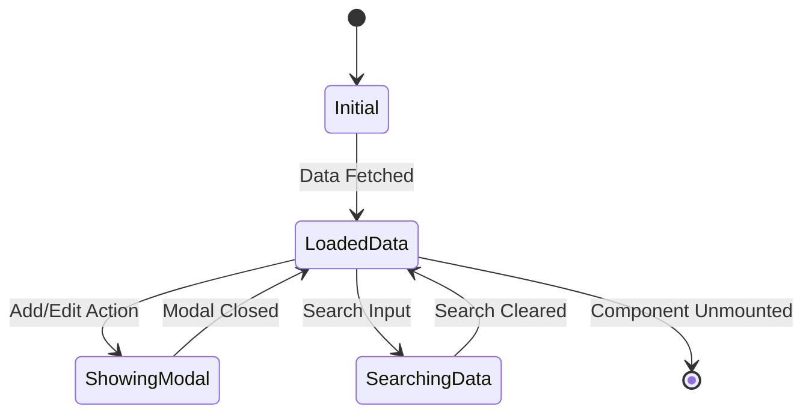

## Authentication and Authorization

### Permission Requirements

The screen requires the following permission:
- **Permission Name**: `ODEME_REFERANS_YONETIMI_EKRANI_YETKI_ADI`
- **Permission Label**: "Ödeme Referans Yönetimi Ekran Görüntüleme"

### Additional Feature Permissions

| Feature | Permission | Description |
|---------|------------|-------------|
| PDF Export | `YAZDIRMA_YETKISI_ADI` | Print/PDF generation |
| Excel Export | `EXCELE_AKTAR_YETKISI_ADI` | Excel file export |

### Access Control Flow

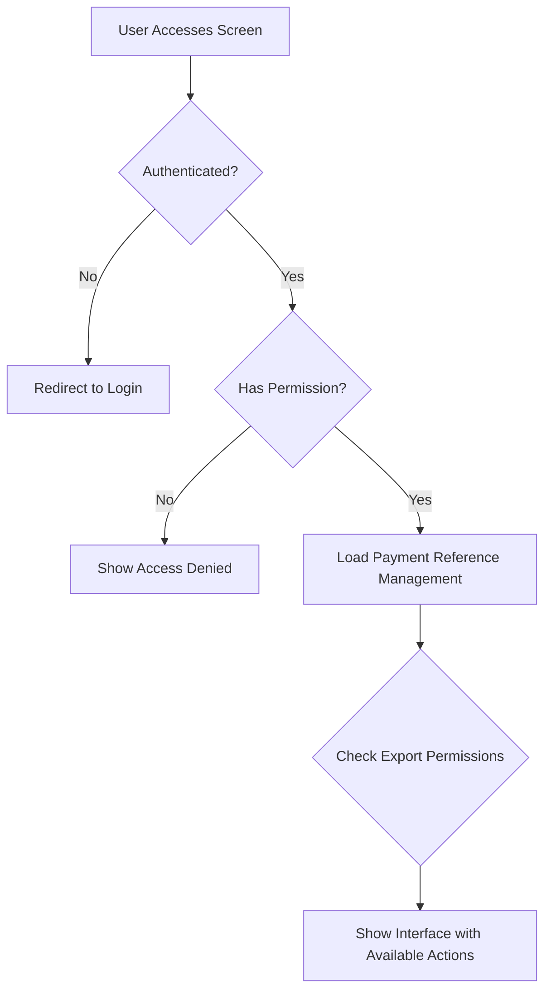

## Error Handling

### Form Validation Errors

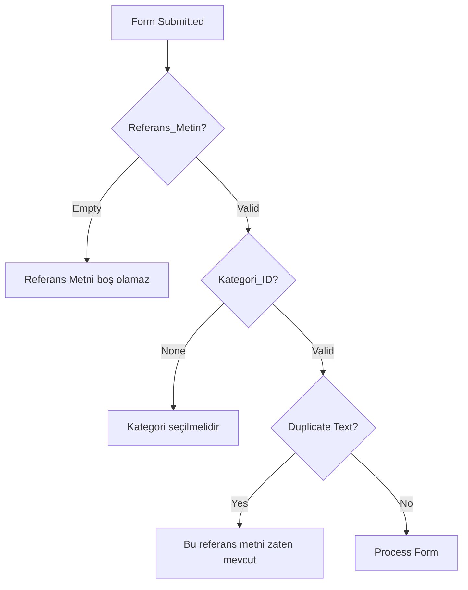

### API Error Handling

| Error Type | Status Code | User Message | Action |
|------------|-------------|--------------|---------|
| Validation Error | 400 | "Girilen veriler geçersiz" | Show form errors |
| Duplicate Entry | 400 | "Bu referans metni zaten mevcut" | Focus text field |
| Not Found | 404 | "Kayıt bulunamadı" | Refresh data |
| Server Error | 500 | "Sunucu hatası oluştu" | Show retry option |

## Export Functionality

### PDF Generation

The PDF export feature generates a formatted document containing:
- Page title: "Ödeme Referans Yönetimi"
- Current date and branch information
- Table with all visible reference records
- Footer with total record count

### Excel Export

Excel export creates a spreadsheet with columns:
- Referans Metin
- Kategori (resolved name)
- Aktif (Evet/Hayır)
- Kayıt Tarihi

File naming convention: `Odeme_Referans_Yonetimi_[YYYYMMDD].xlsx`

## Performance Considerations

### Data Loading Strategy

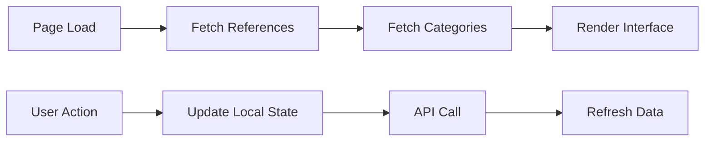

### Optimization Techniques

1. **Lazy Loading**: Categories loaded once and cached
2. **Debounced Search**: 300ms delay for search input
3. **Optimistic Updates**: Immediate UI updates with rollback on error
4. **Memoization**: Search results cached using `useMemo`

## Implementation Checklist

### Backend Requirements (Already Implemented)

- [x] API endpoints for CRUD operations
- [x] Database schema and models
- [x] Pydantic schemas for validation
- [x] CRUD functions in database layer

### Frontend Implementation Tasks

1. **Component Structure**
   - [ ] Create `OdemeReferansPage` component
   - [ ] Create `OdemeReferansForm` component
   - [ ] Add TypeScript interfaces

2. **Data Context Integration**
   - [ ] Add odeme referans state management
   - [ ] Implement API integration functions
   - [ ] Add error handling for API calls

3. **UI Implementation**
   - [ ] Design responsive table layout
   - [ ] Implement search functionality
   - [ ] Add form validation
   - [ ] Create modal dialogs

4. **Export Features**
   - [ ] Implement PDF generation
   - [ ] Add Excel export functionality
   - [ ] Apply conditional rendering based on permissions

5. **Navigation Integration**
   - [ ] Update routing configuration
   - [ ] Add menu item (already exists)
   - [ ] Apply permission-based access control