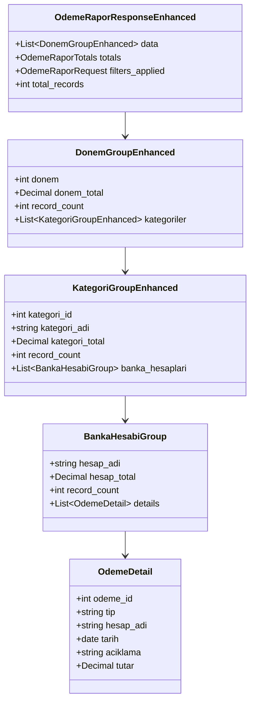

# Payment Report Bank Account Grouping Enhancement

## Overview

This document outlines the design for enhancing the "Ödeme Rapor" screen to add an additional grouping level by "Banka Hesabı" (Bank Account) after the existing category grouping. Additionally, the detail records will be displayed in a single line format instead of the current two-line format.

## Architecture

### Current Structure
The current payment report structure is organized as follows:
1. Period (Donem) grouping
2. Category (Kategori) grouping
3. Detail records displayed in two-line format

### Proposed Structure
The enhanced payment report structure will be organized as follows:
1. Period (Donem) grouping
2. Category (Kategori) grouping
3. Bank Account (Banka Hesabı) grouping (new)
4. Detail records displayed in single-line format (changed)

## Data Model Changes

### Backend Schema Updates
No database schema changes are required since the "Hesap_Adi" field already exists in the Odeme model. We will leverage this existing field for the new grouping.

### New Schema Definitions
New Pydantic models will be added to support the enhanced grouping structure:

```python
# In backend/schemas/odeme_rapor.py

class BankaHesabiGroup(BaseModel):
    """Bank account group within a category"""
    hesap_adi: str
    hesap_total: Decimal
    record_count: int
    details: List[OdemeDetail]

class KategoriGroupEnhanced(BaseModel):
    """Enhanced category group with bank account grouping"""
    kategori_id: Optional[int]
    kategori_adi: str
    kategori_total: Decimal
    record_count: int
    banka_hesaplari: List[BankaHesabiGroup]

class DonemGroupEnhanced(BaseModel):
    """Enhanced period group containing categories with bank account grouping"""
    donem: int
    donem_total: Decimal
    record_count: int
    kategoriler: List[KategoriGroupEnhanced]

# Update the response model to use the enhanced structure
class OdemeRaporResponseEnhanced(BaseModel):
    """Enhanced response schema for Odeme Report with bank account grouping"""
    data: List[DonemGroupEnhanced]
    totals: OdemeRaporTotals
    filters_applied: OdemeRaporRequest
    total_records: int
    
    class Config:
        from_attributes = True
```

### API Response Structure
The enhanced API response structure will include bank account grouping:



## Frontend Implementation

### Component Structure
The existing `OdemeRapor.tsx` component will be modified to support the new grouping level and single-line detail display.

### New TypeScript Interfaces
New interfaces will be added to support the enhanced data structure:

```typescript
// In CopyCat/types.ts

interface BankaHesabiGroup {
  hesap_adi: string;
  hesap_total: number;
  record_count: number;
  details: OdemeDetail[];
}

interface OdemeRaporKategoriGroupEnhanced {
  kategori_id: number | null;
  kategori_adi: string;
  kategori_total: number;
  record_count: number;
  banka_hesaplari: BankaHesabiGroup[];
}

interface OdemeRaporDonemGroupEnhanced {
  donem: number;
  donem_total: number;
  record_count: number;
  kategoriler: OdemeRaporKategoriGroupEnhanced[];
}

interface OdemeRaporResponseEnhanced {
  data: OdemeRaporDonemGroupEnhanced[];
  totals: {
    donem_totals: Record<number, number>;
    kategori_totals: Record<string, number>;
    grand_total: number;
  };
  filters_applied: {
    donem: number[] | null;
    kategori: number[] | null;
    sube_id: number | null;
  };
  total_records: number;
}
```

### New Expandable Components
1. `ExpandableKategoriRow`: Will be modified to include bank account grouping
2. `ExpandableBankaHesabiRow`: New component to handle bank account level grouping
3. `SingleLineDetailRow`: New component to display payment details in a single line

### UI Changes

#### Current Detail Display (Two Lines)
```
[Tip]
[Hesap Adı]
[Tarih]
[Açıklama...]
```

#### New Detail Display (Single Line)
```
[Tip] - [Hesap Adı] - [Tarih] - [Açıklama...]
```

#### Grouping Hierarchy
The report will now have 4 levels of expandable/collapsible sections:
1. Period (Dönem) - Top level
2. Category (Kategori) - Second level
3. Bank Account (Banka Hesabı) - Third level (new)
4. Payment Details - Fourth level

### State Management
Additional state will be added to track the expanded/collapsed status of bank account groups:

```typescript
// Current state
const [expandedDonemler, setExpandedDonemler] = useState<Set<number>>(new Set());
const [expandedKategoriler, setExpandedKategoriler] = useState<Set<string>>(new Set());

// New state for bank account grouping
const [expandedBankaHesaplari, setExpandedBankaHesaplari] = useState<Set<string>>(new Set());
```

### New Component: ExpandableBankaHesabiRow
A new component will be created to handle the bank account grouping level:

```tsx
interface ExpandableBankaHesabiRowProps {
  bankaHesabiGroup: BankaHesabiGroup;
  donem: number;
  kategoriId: number | null;
  isExpanded: boolean;
  onToggle: () => void;
}

const ExpandableBankaHesabiRow: React.FC<ExpandableBankaHesabiRowProps> = ({
  bankaHesabiGroup,
  donem,
  kategoriId,
  isExpanded,
  onToggle
}) => {
  return (
    <>
      {/* Bank Account Header Row */}
      <tr className="bg-gray-100 border-l-4 border-yellow-500">
        <td className="px-4 py-3">
          <button
            onClick={onToggle}
            className="flex items-center text-left w-full"
          >
            {isExpanded ? (
              <Icons.ChevronDown className="w-4 h-4 mr-2 text-yellow-600" />
            ) : (
              <Icons.ChevronRight className="w-4 h-4 mr-2 text-yellow-600" />
            )}
            <span className="font-medium text-gray-800">{bankaHesabiGroup.hesap_adi}</span>
          </button>
        </td>
        <td className="px-4 py-3 text-center">
          <span className="bg-yellow-100 text-yellow-800 px-2 py-1 rounded-full text-xs font-medium">
            {bankaHesabiGroup.record_count} kayıt
          </span>
        </td>
        <td className="px-4 py-3 text-right font-semibold text-yellow-700">
          {formatNumber(bankaHesabiGroup.hesap_total)}
        </td>
      </tr>

      {/* Detail Rows (shown when expanded) */}
      {isExpanded && bankaHesabiGroup.details.map((detail, index) => (
        <tr key={detail.odeme_id} className="bg-white border-l-4 border-gray-200">
          <td colSpan={3} className="px-6 py-2 text-sm">
            <div className="pl-8 flex justify-between items-center">
              <div className="font-medium text-gray-700">
                {detail.tip} - {detail.hesap_adi}
              </div>
              <div className="text-gray-500 text-xs">
                {new Date(detail.tarih).toLocaleDateString('tr-TR')} - {detail.aciklama.substring(0, 50)}...
              </div>
              <div className="text-gray-700 font-medium">
                {formatNumber(detail.tutar)}
              </div>
            </div>
          </td>
        </tr>
      ))}
    </>
  );
};
```

## Backend Implementation

### CRUD Function Updates
The `get_odeme_rapor` function in `backend/db/crud.py` will be modified to include bank account grouping:

1. Group payment records by "Hesap_Adi" within each category group
2. Calculate totals for each bank account group
3. Maintain the existing period and category grouping structure

### Data Processing Logic
The updated logic will process records in this order:
1. Group by Period (Donem)
2. Within each period, group by Category (Kategori)
3. Within each category, group by Bank Account (Hesap_Adi)
4. Within each bank account, collect individual payment details

### Implementation Steps

1. Modify the `get_odeme_rapor` function to create the new data structure:
   ```python
   # In backend/db/crud.py
   def get_odeme_rapor(db: Session, donem_list: Optional[List[int]] = None, 
                      kategori_list: Optional[List[int]] = None, 
                      sube_id: Optional[int] = None):
       # ... existing code ...
       
       # Group data by Donem, Kategori, and Banka Hesabi
       donem_groups = defaultdict(lambda: {
           'donem_total': Decimal('0'),
           'record_count': 0,
           'kategoriler': defaultdict(lambda: {
               'kategori_adi': 'Kategorilendirilmemiş',
               'kategori_total': Decimal('0'),
               'record_count': 0,
               'banka_hesaplari': defaultdict(lambda: {
                   'hesap_adi': '',
                   'hesap_total': Decimal('0'),
                   'record_count': 0,
                   'details': []
               })
           })
       })
       
       # Process records with new grouping
       for record in records:
           donem = record.Donem
           kategori_id = record.Kategori_ID or 'uncategorized'
           hesap_adi = record.Hesap_Adi or 'Belirtilmemiş'
           
           # ... existing code ...
           
           # Add to banka hesabi grouping
           donem_groups[donem]['kategoriler'][kategori_id]['banka_hesaplari'][hesap_adi]['details'].append(detail)
           donem_groups[donem]['kategoriler'][kategori_id]['banka_hesaplari'][hesap_adi]['hesap_total'] += record.Tutar
           donem_groups[donem]['kategoriler'][kategori_id]['banka_hesaplari'][hesap_adi]['record_count'] += 1
           
           # ... rest of processing ...
   ```

2. Update the response construction to use the new structure:
   ```python
   # Convert to enhanced response format
   result_data = []
   for donem in sorted(donem_groups.keys(), reverse=True):
       donem_data = donem_groups[donem]
       
       kategori_groups = []
       for kategori_id in sorted(donem_data['kategoriler'].keys(), 
                               key=lambda x: (x == 'uncategorized', x)):
           kategori_data = donem_data['kategoriler'][kategori_id]
           
           # Create banka hesabi groups
           banka_hesabi_groups = []
           for hesap_adi in sorted(kategori_data['banka_hesaplari'].keys()):
               hesap_data = kategori_data['banka_hesaplari'][hesap_adi]
               
               banka_hesabi_group = BankaHesabiGroup(
                   hesap_adi=hesap_adi,
                   hesap_total=hesap_data['hesap_total'],
                   record_count=hesap_data['record_count'],
                   details=sorted(hesap_data['details'], key=lambda x: x.tarih, reverse=True)
               )
               banka_hesabi_groups.append(banka_hesabi_group)
           
           # ... rest of code ...
   ```

## API Endpoint

The existing `/odeme-rapor/` endpoint will be updated to return the enhanced data structure. To maintain backward compatibility, we could either:
1. Update the existing endpoint and frontend together
2. Create a new endpoint `/odeme-rapor-enhanced/` and update the frontend to use it

Option 2 is recommended for a smoother transition.

## Testing

### Unit Tests
1. Test bank account grouping logic in CRUD function
2. Test correct calculation of bank account group totals
3. Test proper nesting of data structure
4. Test edge cases (empty bank accounts, null values)

### Integration Tests
1. Test API endpoint with new response structure
2. Test frontend component rendering with bank account groups
3. Test expand/collapse functionality for all grouping levels
4. Test filtering functionality with the new structure

### UI Tests
1. Verify single-line detail display format
2. Verify proper styling of new bank account grouping level
3. Verify responsive design with additional nesting
4. Test print and export functionality with new structure

## Migration Considerations

### Backward Compatibility
The API response structure will be updated to include the new bank account grouping. To maintain backward compatibility during deployment:
1. Deploy backend changes with new endpoint
2. Update frontend to use new endpoint
3. Remove old endpoint after successful deployment

### Performance Impact
Additional grouping may impact performance with large datasets. Consider:
1. Optimizing database queries with proper indexing
2. Implementing pagination if needed
3. Caching strategies for frequently accessed reports

### User Experience
1. Provide clear visual hierarchy with color coding for different grouping levels
2. Ensure smooth expand/collapse animations
3. Maintain consistent styling with rest of application
4. Update documentation and user guides

## Security Considerations

No additional security considerations are required for this enhancement as it only changes the data presentation layer and does not introduce new data access patterns or authentication requirements.

## Deployment Plan

### Phase 1: Backend Development
1. Create new Pydantic models for enhanced data structure
2. Implement bank account grouping logic in CRUD function
3. Create new API endpoint `/odeme-rapor-enhanced/`
4. Write unit tests for new functionality

### Phase 2: Frontend Development
1. Update TypeScript interfaces
2. Create new components for bank account grouping
3. Modify `OdemeRapor.tsx` to use new data structure
4. Implement single-line detail display
5. Update state management for new grouping level
6. Write component tests

### Phase 3: Integration and Testing
1. End-to-end testing of new functionality
2. Performance testing with large datasets
3. UI/UX validation
4. Update documentation

### Phase 4: Deployment
1. Deploy backend changes
2. Deploy frontend changes
3. Monitor for issues
4. Remove old endpoint after verification