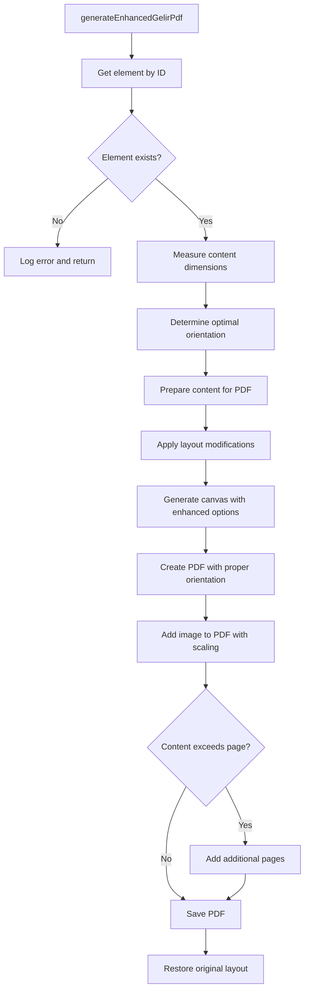

# PDF Export Enhancement for Gelir Girişi Screen

## 1. Overview

The "Gelir Girişi" screen in the SilverCloud System currently has issues with PDF export functionality where:
- Complete page data is not captured, especially content requiring horizontal or vertical scrolling
- Output quality is poor
- Wide content is not properly handled (the page might benefit from landscape orientation)

This design document outlines the solution to enhance the PDF export functionality to properly capture all content with high quality and appropriate orientation.

## 2. Current Implementation Analysis

### 2.1 Existing PDF Generation
The current implementation uses the `generateDashboardPdf` function from `utils/pdfGenerator.ts` which:
- Uses html2canvas with a scale factor of 2 for quality
- Captures content with basic overflow handling
- Uses portrait orientation by default
- Has limited handling for wide content

### 2.2 Gelir Girişi Screen Structure
The Gelir Girişi screen features:
- A wide table with daily columns that likely requires horizontal scrolling
- Sticky left column for row headers
- Complex data structure with grouped categories
- Dynamic content based on branch and period selection

### 2.3 Identified Issues
1. Content cutoff due to horizontal overflow not being properly handled
2. Poor quality output due to insufficient canvas configuration
3. Inappropriate orientation for wide content
4. Scrolling content not fully captured

## 3. Design Solution

### 3.1 Enhanced PDF Generation Function
Create a specialized PDF generation function for the Gelir Girişi screen that:

1. **Detect Content Dimensions**: Analyze the content width and height to determine optimal orientation
2. **Handle Overflow**: Properly expand overflow containers to capture all content
3. **Optimize Quality**: Use enhanced html2canvas options for better image quality
4. **Dynamic Orientation**: Automatically switch between portrait and landscape based on content dimensions

### 3.2 Implementation Approach

#### 3.2.1 New Enhanced Function
Create a new function `generateEnhancedGelirPdf` in `utils/pdfGenerator.ts` that:

```typescript
export const generateEnhancedGelirPdf = async (elementId: string, filename: string = 'gelir-report.pdf') => {
  // Implementation details in section 4
}
```

#### 3.2.2 Content Preparation
Before generating the PDF:
1. Expand all overflow containers
2. Adjust table layouts for better PDF rendering
3. Temporarily modify CSS for print-friendly display
4. Handle sticky positioning that might interfere with capture

#### 3.2.3 Canvas Generation
Enhance html2canvas options:
- Increase scale factor for better quality
- Properly calculate dimensions to capture all content
- Handle scrollable areas by making them visible
- Use appropriate backgroundColor

#### 3.2.4 Orientation Handling
Implement dynamic orientation:
- Measure content dimensions
- For content wider than A4 portrait, use landscape
- For very wide content, consider scaling options

#### 3.2.5 PDF Creation
Enhance jsPDF configuration:
- Use appropriate page orientation based on content
- Properly scale content to fit pages
- Handle multi-page documents with proper content splitting

## 4. Detailed Implementation

### 4.1 New Function Implementation



### 4.2 Content Preparation Steps

1. **Expand Overflow Containers**:
   ```javascript
   const overflowElements = container.querySelectorAll('.overflow-x-auto, .overflow-hidden');
   overflowElements.forEach(el => {
     el.style.overflow = 'visible';
     el.style.width = 'max-content';
   });
   ```

2. **Handle Sticky Positioning**:
   ```javascript
   const stickyElements = container.querySelectorAll('.sticky');
   stickyElements.forEach(el => {
     el.style.position = 'static';
   });
   ```

3. **Adjust Table Layouts**:
   ```javascript
   const tables = container.querySelectorAll('table');
   tables.forEach(table => {
     table.style.tableLayout = 'auto';
     table.style.width = '100%';
   });
   ```

### 4.3 Canvas Generation Enhancement

```javascript
const canvas = await html2canvas(input, { 
  scale: 3, // Higher scale for better quality
  useCORS: true,
  allowTaint: true,
  backgroundColor: '#ffffff',
  scrollX: 0,
  scrollY: 0,
  width: input.scrollWidth,
  height: input.scrollHeight,
  windowWidth: Math.max(input.scrollWidth, window.innerWidth),
  windowHeight: Math.max(input.scrollHeight, window.innerHeight)
});
```

### 4.4 Dynamic Orientation Logic

```javascript
// Determine if content is wider than A4 portrait
const isWideContent = canvas.width > canvas.height * 1.2;
const orientation = isWideContent ? 'landscape' : 'portrait';
const pdf = new jsPDF(orientation, 'mm', 'a4');
```

## 5. Specific Implementation for Gelir Girişi

### 5.1 Gelir Girişi Screen Characteristics

The Gelir Girişi screen has specific characteristics that require special handling:

1. **Wide Table Layout**: The screen displays a table with daily columns (typically 28-31 columns) which requires horizontal scrolling
2. **Sticky Header Column**: The first column with row labels is sticky to remain visible during horizontal scrolling
3. **Complex Data Structure**: Contains grouped categories with subcategories and summary rows
4. **Dynamic Content**: Content varies based on selected branch and period
5. **Interactive Elements**: Contains input fields for data entry that need special handling in PDF

### 5.2 Enhanced PDF Generator Function

Add the following function to `utils/pdfGenerator.ts`:

```typescript
export const generateEnhancedGelirPdf = async (elementId: string, filename: string = 'gelir-report.pdf') => {
  const input = document.getElementById(elementId);
  if (!input) {
    console.error(`Element with ID '${elementId}' not found.`);
    return;
  }

  // Store original styles for restoration
  const originalStyles: Array<{ element: HTMLElement; styles: Partial<CSSStyleDeclaration> }> = [];
  
  // Function to save original styles
  const saveOriginalStyles = (element: HTMLElement, properties: string[]) => {
    const styles: Partial<CSSStyleDeclaration> = {};
    properties.forEach(prop => {
      styles[prop] = element.style[prop as any];
    });
    originalStyles.push({ element, styles });
  };

  // Function to restore original styles
  const restoreOriginalStyles = () => {
    originalStyles.forEach(({ element, styles }) => {
      Object.entries(styles).forEach(([prop, value]) => {
        element.style[prop as any] = value as string;
      });
    });
    originalStyles.length = 0; // Clear the array
  };

  // Handle input fields by replacing them with their values for PDF
  const prepareInputsForPdf = (): Array<{ originalElement: HTMLElement; textElement: HTMLSpanElement }> => {
    const preparedInputs: Array<{ originalElement: HTMLElement; textElement: HTMLSpanElement }> = [];
    const inputs = input.querySelectorAll('input, select, textarea');

    inputs.forEach(inputElement => {
      const originalElement = inputElement as HTMLElement;
      let textContent = '';

      if (originalElement instanceof HTMLInputElement) {
        if (originalElement.type === 'checkbox') {
          textContent = originalElement.checked ? 'X' : '';
        } else {
          textContent = originalElement.value;
        }
      } else if (originalElement instanceof HTMLTextAreaElement) {
        textContent = originalElement.value;
      } else if (originalElement instanceof HTMLSelectElement) {
        const selectedOption = originalElement.options[originalElement.selectedIndex];
        textContent = selectedOption ? selectedOption.text : '';
      }

      const textElement = document.createElement('span');
      textElement.textContent = textContent;
      textElement.classList.add('print-only-text');
      textElement.style.display = 'none'; // Hidden by default on screen

      originalElement.classList.add('screen-only-input');
      originalElement.style.display = 'block'; // Ensure it's visible on screen by default

      originalElement.parentNode?.insertBefore(textElement, originalElement);
      preparedInputs.push({ originalElement, textElement });
    });

    return preparedInputs;
  };

  // Restore input fields after PDF generation
  const restoreInputsAfterPdf = (preparedInputs: Array<{ originalElement: HTMLElement; textElement: HTMLSpanElement }>) => {
    preparedInputs.forEach(({ originalElement, textElement }) => {
      originalElement.classList.remove('screen-only-input');
      originalElement.style.display = ''; // Restore original display
      textElement.parentNode?.removeChild(textElement); // Remove the temporary text element
    });
  };

  try {
    // Prepare input fields for PDF
    const preparedInputs = prepareInputsForPdf();

    // Prepare content for PDF generation
    
    // 1. Handle overflow containers
    const overflowElements = input.querySelectorAll('.overflow-x-auto, .overflow-hidden, .overflow-auto');
    overflowElements.forEach(el => {
      const element = el as HTMLElement;
      saveOriginalStyles(element, ['overflow', 'width', 'maxWidth']);
      element.style.overflow = 'visible';
      element.style.width = 'max-content';
      element.style.maxWidth = 'none';
    });

    // 2. Handle sticky positioning
    const stickyElements = input.querySelectorAll('.sticky');
    stickyElements.forEach(el => {
      const element = el as HTMLElement;
      saveOriginalStyles(element, ['position']);
      element.style.position = 'static';
    });

    // 3. Handle table layouts
    const tables = input.querySelectorAll('table');
    tables.forEach(table => {
      const element = table as HTMLElement;
      saveOriginalStyles(element, ['width', 'tableLayout']);
      element.style.width = '100%';
      element.style.tableLayout = 'auto';
    });

    // 4. Handle grid layouts
    const gridElements = input.querySelectorAll('.grid');
    gridElements.forEach(grid => {
      const element = grid as HTMLElement;
      saveOriginalStyles(element, ['display', 'gridTemplateColumns']);
      // Force single column layout for better PDF rendering
      element.style.display = 'block';
      element.style.gridTemplateColumns = 'none';
    });

    // 5. Handle flex layouts
    const flexContainers = input.querySelectorAll('.flex');
    flexContainers.forEach(flex => {
      const element = flex as HTMLElement;
      saveOriginalStyles(element, ['flexWrap']);
      // Prevent wrapping for better PDF layout
      element.style.flexWrap = 'nowrap';
    });

    // 6. Temporarily hide elements that shouldn't appear in PDF
    const elementsToHide = input.querySelectorAll('.hide-on-pdf, .print-button, .screen-only-input');
    elementsToHide.forEach(el => {
      const element = el as HTMLElement;
      saveOriginalStyles(element, ['display']);
      element.style.display = 'none';
    });

    // 7. Temporarily show elements that should only appear in the PDF
    const elementsToShow = input.querySelectorAll('.print-only-text');
    elementsToShow.forEach(el => {
      const element = el as HTMLElement;
      saveOriginalStyles(element, ['display']);
      element.style.display = 'block';
    });

    // Add a small delay to ensure layout changes are applied
    await new Promise(resolve => setTimeout(resolve, 100));
    
    // Calculate the full dimensions of the content
    const scrollWidth = Math.max(input.scrollWidth, window.innerWidth);
    const scrollHeight = Math.max(input.scrollHeight, window.innerHeight);
    
    // Add some padding to ensure all content is captured
    const padding = 20;
    const canvasWidth = scrollWidth + padding * 2;
    const canvasHeight = scrollHeight + padding * 2;

    // Enhanced canvas options for better quality and complete content capture
    const canvas = await html2canvas(input, { 
      scale: 2, // Good balance between quality and performance
      useCORS: true,
      allowTaint: true,
      backgroundColor: '#ffffff',
      scrollX: -padding,
      scrollY: -padding,
      width: canvasWidth,
      height: canvasHeight,
      windowWidth: canvasWidth,
      windowHeight: canvasHeight,
      logging: false, // Reduce console output
      onclone: (clonedDoc) => {
        // Additional adjustments in the cloned document
        const clonedElement = clonedDoc.getElementById(elementId);
        if (clonedElement) {
          clonedElement.style.padding = `${padding}px`;
        }
      }
    });

    // Create PDF with proper dimensions
    const imgData = canvas.toDataURL('image/png', 1.0);
    
    // Use landscape orientation for better width handling
    const pdf = new jsPDF('l', 'mm', 'a4');
    
    // If content is very wide, consider using portrait with smaller scale
    const isVeryWide = canvas.width > canvas.height * 1.5;
    if (isVeryWide) {
      // For very wide content, use portrait with adjusted scaling
      const portraitPdf = new jsPDF('p', 'mm', 'a4');
      portraitPdf.deletePage(1); // Remove default page
      pdf.deletePage(1); // Remove landscape page
      
      // Add pages with proper scaling
      const pageWidth = portraitPdf.internal.pageSize.getWidth();
      const pageHeight = portraitPdf.internal.pageSize.getHeight();
      const imgWidth = pageWidth - 20; // 10mm margin on each side
      const imgHeight = (canvas.height * imgWidth) / canvas.width;
      
      let position = 10; // 10mm top margin
      let heightLeft = imgHeight;
      
      // Add the first page
      portraitPdf.addPage();
      portraitPdf.addImage(imgData, 'PNG', 10, position, imgWidth, imgHeight);
      heightLeft -= (pageHeight - 20); // Account for top and bottom margins
      
      // Add additional pages if needed
      while (heightLeft > 0) {
        position = 10 - (imgHeight - heightLeft);
        portraitPdf.addPage();
        portraitPdf.addImage(imgData, 'PNG', 10, position, imgWidth, imgHeight);
        heightLeft -= (pageHeight - 20);
      }
      
      // Save the PDF
      portraitPdf.save(filename);
    } else {
      // Standard landscape handling
      const pdfWidth = pdf.internal.pageSize.getWidth();
      const pdfHeight = pdf.internal.pageSize.getHeight();
      const imgWidth = pdfWidth - 20; // 10mm margin on each side
      const imgHeight = (canvas.height * imgWidth) / canvas.width;
      
      let position = 10; // 10mm top margin
      let heightLeft = imgHeight;
      
      // Add the first page
      pdf.addImage(imgData, 'PNG', 10, position, imgWidth, imgHeight);
      heightLeft -= (pdfHeight - 20); // Account for top and bottom margins
      
      // Add additional pages if needed
      while (heightLeft > 0) {
        position = 10 - (imgHeight - heightLeft);
        pdf.addPage();
        pdf.addImage(imgData, 'PNG', 10, position, imgWidth, imgHeight);
        heightLeft -= (pdfHeight - 20);
      }
      
      // Save the PDF
      pdf.save(filename);
    }
  } catch (error) {
    console.error("Error generating enhanced PDF:", error);
    alert('PDF oluşturulurken bir hata oluştu. Lütfen tekrar deneyin.');
  } finally {
    // Restore all original styles
    restoreOriginalStyles();
  }
};
```

### 5.2 Update Gelir Girişi Screen

In `pages.tsx`, update the `handleGeneratePdf` function in the Gelir Girişi screen:

```typescript
const handleGeneratePdf = () => {
  generateEnhancedGelirPdf('gelir-content', `Gelir_Giris_${selectedBranch?.Sube_Adi}_${viewedPeriod}.pdf`);
};
```

### 5.3 Add Loading State

Add loading state to improve user experience:

```typescript
const [isGeneratingPdf, setIsGeneratingPdf] = useState(false);

const handleGeneratePdf = async () => {
  setIsGeneratingPdf(true);
  try {
    await generateEnhancedGelirPdf('gelir-content', `Gelir_Giris_${selectedBranch?.Sube_Adi}_${viewedPeriod}.pdf`);
  } finally {
    setIsGeneratingPdf(false);
  }
};
```

Update the button to show loading state:

```jsx
{canPrint && (
  <Button 
    onClick={handleGeneratePdf} 
    variant="ghost" 
    size="sm" 
    title="PDF Olarak İndir" 
    className="print-button"
    disabled={isGeneratingPdf}
  >
    {isGeneratingPdf ? (
      <Icons.Loading className="w-5 h-5 animate-spin" />
    ) : (
      <Icons.Print className="w-5 h-5" />
    )}
  </Button>
)}
```

## 6. Testing Strategy

### 6.1 Unit Tests
1. Test content dimension measurement functions
2. Test orientation determination logic
3. Test canvas generation with different content sizes
4. Test input field handling functionality

### 6.2 Integration Tests
1. Test PDF generation with various branch data
2. Test with wide content that requires landscape orientation
3. Test with narrow content that fits portrait orientation
4. Verify all content is captured without clipping
5. Test with different periods to ensure dynamic content is properly captured
6. Test input field values are correctly displayed in PDF

### 6.3 User Acceptance Tests
1. Verify PDF quality is acceptable
2. Confirm all data is visible in the exported PDF
3. Check that orientation is appropriate for content
4. Validate file naming convention
5. Verify input field values are properly displayed
6. Confirm loading indicator works correctly
7. Test error handling with invalid element IDs

## 7. Performance Considerations

1. **Memory Usage**: Large canvas generation can be memory-intensive
   - Consider progressive rendering for very large datasets
   - Implement proper cleanup of temporary elements

2. **Processing Time**: Higher scale factors increase processing time
   - Show loading indicators to improve UX
   - Consider web worker implementation for heavy processing
   - Optimize the delay time for layout changes

3. **File Size**: Higher quality images result in larger PDFs
   - Balance quality with file size
   - Consider compression options

4. **Optimization Techniques**:
   - Use efficient selectors for DOM manipulation
   - Minimize DOM reads and writes
   - Batch style changes to reduce reflows
   - Consider caching strategies for repeated operations

## 8. Error Handling

1. **Element Not Found**: Handle cases where the target element doesn't exist
2. **Canvas Generation Failures**: Catch and handle html2canvas errors
3. **PDF Creation Issues**: Handle jsPDF errors gracefully
4. **User Feedback**: Provide clear error messages in Turkish
5. **Cleanup on Errors**: Ensure proper cleanup of temporary elements even when errors occur
6. **Timeout Handling**: Implement timeout for long-running operations
7. **Memory Management**: Handle potential memory issues with large canvas generation

## 9. Backward Compatibility

The new implementation will:
- Not affect existing functionality
- Be contained in a new function
- Not modify the existing `generateDashboardPdf` function
- Allow for gradual migration of other screens if needed