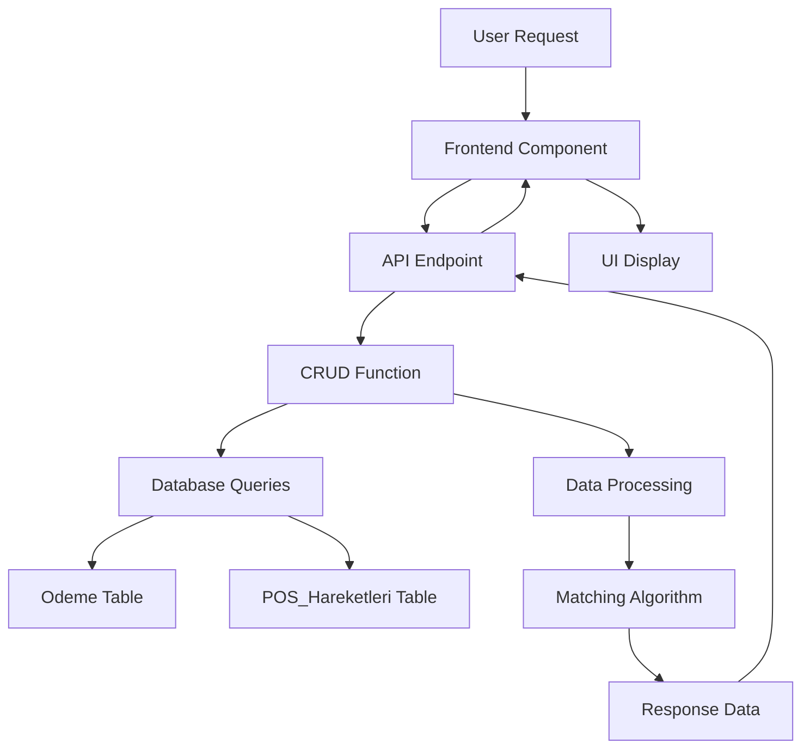

# POS Kontrol Dashboard Update Design Document

## 1. Overview

This document outlines the design for updating the POS Kontrol Dashboard to include new functionality for calculating and displaying "Ödeme" and "Ödeme Kesinti" values from the Odeme table. The implementation will match POS transactions with payment records based on specific criteria and display the results in the dashboard UI.

### 1.1 Current Functionality
The existing POS Kontrol Dashboard compares:
- Gelir POS data with POS_Hareketleri data
- Displays daily comparison with visual indicators
- Shows summary statistics

### 1.2 New Requirements
The updated dashboard will additionally:
- Calculate "Ödeme" values from Odeme records where Kategori = "Kredi Kartı Ödemesi" or "Kredi Kartı Komisyon ve BSMV Ödemesi"
- Calculate "Ödeme Kesinti" values from Odeme records with the same category filters
- Calculate "Ödeme Net" using the formula "Ödeme - Ödeme Kesinti" for each date
- Match POS transactions with payments based on specific date and amount criteria
- Display these new values in the dashboard UI with comparison indicators

## 2. Architecture

### 2.1 System Components
The POS Kontrol Dashboard consists of:
1. **Frontend**: React TypeScript component (POSKontrolDashboard.tsx)
2. **Backend API**: FastAPI endpoint (/pos-kontrol/{sube_id}/{donem})
3. **Database Layer**: PostgreSQL with SQLAlchemy ORM
4. **Business Logic**: CRUD functions for data processing

### 2.2 Data Flow


## 3. Backend Implementation

### 3.1 Database Models
The implementation will use the following existing models:
- `Odeme` model (from backend/db/models.py)
- `POSHareketleri` model (from backend/db/models.py)
- `Kategori` model (for category filtering)

### 3.2 API Endpoint
The existing endpoint `/pos-kontrol/{sube_id}/{donem}` in `backend/api/v1/endpoints/report.py` will be updated to include the new payment matching logic.

### 3.3 CRUD Function Enhancement
The `get_pos_kontrol_dashboard_data` function in `backend/db/crud.py` will be enhanced with the following logic:

#### 3.3.1 Payment Category Identification
```python
# Find payment categories
kredi_karti_odeme_kategori = db.query(models.Kategori).filter(
    models.Kategori.Kategori_Adi == "Kredi Kartı Ödemesi"
).first()

kredi_karti_komisyon_kategori = db.query(models.Kategori).filter(
    models.Kategori.Kategori_Adi == "Kredi Kartı Komisyon ve BSMV Ödemesi"
).first()
```

#### 3.3.2 Payment Data Query
```python
# Get Odeme data for specified categories
odeme_query = db.query(
    models.Odeme.Tarih,
    func.sum(models.Odeme.Tutar).label('total_tutar')
).filter(
    and_(
        models.Odeme.Sube_ID == sube_id,
        models.Odeme.Tarih >= first_day.date(),
        models.Odeme.Tarih <= last_day.date(),
        or_(
            models.Odeme.Kategori_ID == kredi_karti_odeme_kategori.Kategori_ID if kredi_karti_odeme_kategori else False,
            models.Odeme.Kategori_ID == kredi_karti_komisyon_kategori.Kategori_ID if kredi_karti_komisyon_kategori else False
        )
    )
).group_by(models.Odeme.Tarih)

odeme_records = odeme_query.all()
```

#### 3.3.3 Payment Matching Algorithm
The core matching algorithm will work as follows:

1. For each date in the period:
   - Find POS transactions where `Islem_Tarihi` equals the current date
   - For each POS transaction:
     - Check if there's a payment where `Hesaba_Gecis` of POS_Hareketleri equals `Tarih` of Odeme table
     - Check if `Islem_Tutari` of POS_Hareketleri equals `Tutar` of Odeme Table
     - If match found, sum `Tutar` of Odeme Table to Odeme values for each day

2. For Kesinti matching:
   - Check if `Kesinti_Tutari` of POS_Hareketleri is not zero
   - If not zero, check if there's a payment where `Hesaba_Gecis` of POS_Hareketleri equals `Tarih` of Odeme table
   - Check if `Kesinti_Tutari` of POS_Hareketleri equals `-1 * Tutar` of Odeme Table
   - If match found, sum `Kesinti_Tutari` of POS_Hareketleri Table to Odeme Kesinti values for each day

3. Calculate "Ödeme Net" as "Ödeme - Ödeme Kesinti" for each date

### 3.4 Data Schema Updates
The existing `POSKontrolDailyData` schema already includes the required fields:
- `Odeme: Optional[Decimal] = None`
- `Odeme_Kesinti: Optional[Decimal] = None`
- `Odeme_Net: Optional[Decimal] = None`
- `Kontrol_POS: Optional[str] = None`
- `Kontrol_Kesinti: Optional[str] = None`
- `Kontrol_Net: Optional[str] = None`

## 4. Frontend Implementation

### 4.1 Component Structure
The existing `POSKontrolDashboardPage` component in `CopyCat/pages/POSKontrolDashboard.tsx` will be updated to display the new columns.

### 4.2 UI Updates
The table structure will be enhanced to include new columns:
- Ödeme
- Ödeme Kesinti
- Ödeme Net
- Kontrol indicators for each new column

### 4.3 Data Interface
The existing TypeScript interface will be used:
```typescript
interface POSKontrolDailyData {
    Tarih: string;
    Gelir_POS: number | null;
    POS_Hareketleri: number | null;
    POS_Kesinti: number | null;
    POS_Net: number | null;
    Odeme: number | null;
    Odeme_Kesinti: number | null;
    Odeme_Net: number | null;
    Kontrol_POS: string | null;
    Kontrol_Kesinti: string | null;
    Kontrol_Net: string | null;
}
```

### 4.4 Display Logic
The frontend will display:
- Formatted currency values for all monetary fields
- Color-coded comparison indicators (green for OK, red for Not OK)
- Proper handling of null/undefined values

## 5. Data Models & ORM Mapping

### 5.1 Odeme Model
```python
class Odeme(Base):
    __tablename__ = "Odeme"

    Odeme_ID = Column(Integer, primary_key=True, index=True)
    Tip = Column(String(50), nullable=False)
    Hesap_Adi = Column(String(50), nullable=False)
    Tarih = Column(Date, nullable=False)
    Aciklama = Column(String(200), nullable=False)
    Tutar = Column(DECIMAL(15, 2), nullable=False, default=0.00)
    Kategori_ID = Column(Integer, ForeignKey("Kategori.Kategori_ID"), nullable=True)
    Donem = Column(Integer, nullable=True)
    Sube_ID = Column(Integer, ForeignKey("Sube.Sube_ID"), default=1)
    Kayit_Tarihi = Column(DateTime, default=func.now())
```

### 5.2 POSHareketleri Model
```python
class POSHareketleri(Base):
    __tablename__ = "POS_Hareketleri"

    ID = Column(Integer, primary_key=True, index=True, autoincrement=True)
    Islem_Tarihi = Column(Date, nullable=False)
    Hesaba_Gecis = Column(Date, nullable=False)
    Para_Birimi = Column(String(5), nullable=False)
    Islem_Tutari = Column(DECIMAL(15, 2), nullable=False)
    Kesinti_Tutari = Column(DECIMAL(15, 2), default=0.00)
    Net_Tutar = Column(DECIMAL(15, 2), nullable=True)
    Kayit_Tarihi = Column(DateTime, default=func.now())
    Sube_ID = Column(Integer, ForeignKey("Sube.Sube_ID"), nullable=True)
```

## 6. Business Logic Layer

### 6.1 Matching Algorithm Details
The payment matching algorithm will implement the following logic:

1. **Payment Collection Phase**:
   - Query Odeme records with specified categories for the selected period
   - Group payments by date for efficient lookup

2. **POS Transaction Matching**:
   - For each POS transaction:
     - Find matching payments based on date and amount criteria
     - Aggregate matched values by date

3. **Validation Logic**:
   - Compare calculated values with expected values
   - Set appropriate Kontrol indicators (OK/Not OK)

### 6.2 Error Handling
- Handle cases where payment categories don't exist
- Gracefully handle missing or incomplete data
- Log errors for debugging purposes

## 7. Testing Strategy

### 7.1 Unit Tests
- Test payment matching algorithm with various scenarios
- Test edge cases (null values, mismatched dates, etc.)
- Test calculation accuracy for Ödeme Net values

### 7.2 Integration Tests
- Test complete data flow from database to UI
- Test API endpoint with different parameter combinations
- Test error conditions and edge cases

### 7.3 Test Data Requirements
- Sample Odeme records with "Kredi Kartı Ödemesi" category
- Sample Odeme records with "Kredi Kartı Komisyon ve BSMV Ödemesi" category
- POS_Hareketleri records with matching and non-matching dates/amounts

## 8. Performance Considerations

### 8.1 Database Query Optimization
- Use indexed columns for filtering (Tarih, Sube_ID, Kategori_ID)
- Limit query results to the selected period
- Use efficient aggregation functions

### 8.2 Caching Strategy
- Consider caching frequently accessed category data
- Implement appropriate cache invalidation

### 8.3 Memory Usage
- Process data in chunks for large datasets
- Optimize data structures for efficient lookup