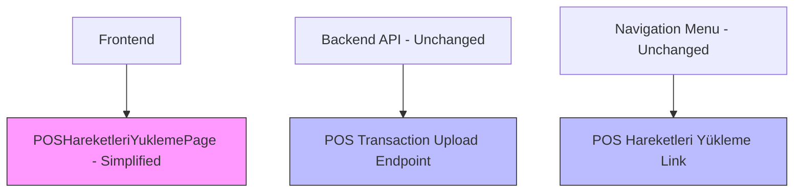

# POS Transaction Loading Screen Rework

## Overview

The current "POS Hareketleri Yükleme" screen has functionality issues and needs to be completely redeveloped. As part of this rework:

1. Remove all existing frontend components for the "POS Hareketleri Yükleme" screen
2. Preserve the backend API functionality for POS transaction uploads
3. Keep the menu item for the screen in the navigation
4. Display a "Yapım Aşamasında" (Under Construction) message on the screen

This approach will maintain access to the feature in the menu while clearly indicating that it's under development, without losing the existing backend functionality.

## Architecture

### Current Implementation

The current POS Hareketleri Yükleme screen consists of:
- Frontend: `POSHareketleriYukleme.tsx` component with file upload functionality
- Backend: `/api/v1/pos-hareketleri/upload/` endpoint for processing Excel uploads
- Navigation: Menu item in the "Finansal İşlemler" section

### Proposed Changes



## Frontend Component Changes

### Component to Modify
- `CopyCat/pages/POSHareketleriYukleme.tsx` - Replace with simplified version

### New Component Structure
The new component will:
1. Display "Yapım Aşamasında" message
2. Maintain the same route (`/pos-hareketleri-yukleme`)
3. Keep the same title and icon in the UI

### Implementation Plan

```tsx
// Simplified POSHareketleriYuklemePage component
import React from 'react';
import { useAppContext } from '../App';
import { Card } from '../components';
import { Icons } from '../constants';

const POSHareketleriYuklemePage: React.FC = () => {
  const { hasPermission } = useAppContext();
  
  // Check if user has permission to view this page
  if (!hasPermission('POS Hareketleri Yükleme Ekranı Görüntüleme')) {
    return (
      <Card title="POS Hareketleri Yükleme" icon={Icons.Upload}>
        <div className="text-center py-10">
          <h3 className="text-xl font-bold text-red-600">Erişim Reddedildi</h3>
          <p className="text-gray-600 mt-2">Bu sayfayı görüntüleme yetkiniz bulunmamaktadır.</p>
        </div>
      </Card>
    );
  }

  return (
    <div className="max-w-4xl mx-auto p-4">
      <Card title="POS Hareketleri Yükleme" icon={Icons.Upload}>
        <div className="text-center py-10">
          <div className="flex justify-center mb-6">
            <Icons.Construction className="h-16 w-16 text-blue-500" />
          </div>
          <h3 className="text-2xl font-bold text-blue-600 mb-2">Yapım Aşamasında</h3>
          <p className="text-gray-600 mt-2 max-w-md mx-auto">
            POS hareketleri yükleme ekranı şu anda yeniden yapılandırılıyor. 
            Kısa bir süre sonra tekrar deneyiniz.
          </p>
        </div>
      </Card>
    </div>
  );
};

export default POSHareketleriYuklemePage;
```

## Backend Architecture

The backend will remain unchanged, preserving:
- Excel file upload endpoint (`/api/v1/pos-hareketleri/upload/`)
- Data model for POS transactions
- Duplicate detection logic
- Database CRUD operations

This ensures that when the frontend is fully reimplemented, all backend functionality will be readily available.

### API Endpoints (Unchanged)
| Method | Endpoint | Description |
|--------|----------|-------------|
| POST | `/api/v1/pos-hareketleri/upload/` | Upload POS transactions from Excel |
| POST | `/api/v1/pos-hareketleri/` | Create single POS transaction |
| POST | `/api/v1/pos-hareketleri/bulk/` | Create multiple POS transactions |
| GET | `/api/v1/pos-hareketleri/` | Retrieve POS transactions |
| GET | `/api/v1/pos-hareketleri/{pos_id}` | Retrieve specific POS transaction |
| PUT | `/api/v1/pos-hareketleri/{pos_id}` | Update specific POS transaction |
| DELETE | `/api/v1/pos-hareketleri/{pos_id}` | Delete specific POS transaction |
| GET | `/api/v1/pos-hareketleri/export/` | Export POS transactions to Excel |

## Navigation Menu

The menu item will remain in the "Finansal İşlemler" section:
- Label: "POS Hareketleri Yükleme"
- Path: `/pos-hareketleri-yukleme`
- Icon: Upload icon
- Permission: `POS_HAREKETLERI_YUKLEME_EKRANI_YETKI_ADI`

## Data Model

The POS_Hareketleri data model will remain unchanged:

| Column | Type | Required | Description |
|--------|------|----------|-------------|
| ID | Integer | Auto | Primary key |
| Islem_Tarihi | Date | Yes | Transaction date |
| Hesaba_Gecis | Date | Yes | Account transfer date |
| Para_Birimi | String(5) | Yes | Currency code |
| Islem_Tutari | DECIMAL(15,2) | Yes | Transaction amount |
| Kesinti_Tutari | DECIMAL(15,2) | No | Deduction amount |
| Net_Tutar | DECIMAL(15,2) | No | Net amount |
| Sube_ID | Integer | Yes | Branch ID (Foreign Key) |
| Kayit_Tarihi | DateTime | No | Record creation timestamp |

## Implementation Steps

### Phase 1: Frontend Simplification
1. Replace content of `POSHareketleriYukleme.tsx` with under construction message
2. Remove all file upload related state and functions
3. Maintain the same route and component name for compatibility
4. Preserve permission checking functionality

### Phase 2: Backend Preservation
1. Verify all POS transaction endpoints are functional
2. Test existing Excel upload functionality with sample data
3. Document API for future frontend reimplementation

### Phase 3: Menu Integration
1. Confirm menu item remains visible
2. Verify permission checking works correctly
3. Test navigation to the simplified screen

## Testing

### Frontend Testing
- Verify "Yapım Aşamasında" message displays correctly
- Confirm navigation to the page works from menu
- Check that page title and icon are preserved
- Validate responsive design
- Test permission-based access control

### Backend Testing
- Test existing Excel upload functionality with sample files
- Verify duplicate detection logic works correctly
- Confirm all CRUD operations function properly
- Validate data integrity in database

### Integration Testing
- Verify menu item links to the correct route
- Confirm permission-based access control works
- Test error handling for invalid navigation attempts