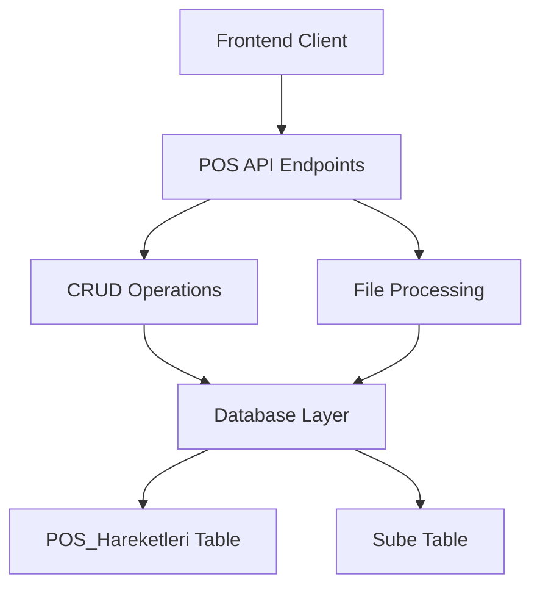

# POS Transaction Management Design Document

## 1. Overview

This document outlines the design for implementing backend functionality to pull and push data for the `POS_Hareketleri` table in the SilverCloud system. The implementation enables full CRUD operations for POS transaction records, allowing both manual entry and bulk import/export capabilities.

The `POS_Hareketleri` table stores point-of-sale transaction data with fields for transaction date, account transfer date, currency, transaction amount, deduction amount, net amount, and branch information.

## 2. Architecture

### 2.1 System Context

The POS transaction management feature is part of the SilverCloud financial management system. It integrates with the existing branch management system and follows the same architectural patterns used throughout the application.



### 2.2 Technology Stack

- **Backend Framework**: FastAPI (Python)
- **Database**: SQLAlchemy ORM
- **Data Validation**: Pydantic
- **File Processing**: Pandas (for Excel import/export)

## 3. Data Model

### 3.1 Database Schema

Based on the provided SQL schema, the `POS_Hareketleri` table has the following structure:

| Column Name | Data Type | Constraints | Description |
|-------------|-----------|-------------|-------------|
| ID | INT | PRIMARY KEY, AUTO_INCREMENT | Unique identifier |
| Islem_Tarihi | DATE | NOT NULL | Transaction date |
| Hesaba_Gecis | DATE | NOT NULL | Account transfer date |
| Para_Birimi | VARCHAR(5) | NOT NULL | Currency code |
| Islem_Tutari | DECIMAL(15,2) | NOT NULL | Transaction amount |
| Kesinti_Tutari | DECIMAL(15,2) | DEFAULT 0.00 | Deduction amount |
| Net_Tutar | DECIMAL(15,2) | NULL | Net amount (calculated) |
| Kayit_Tarihi | DATETIME | DEFAULT NOW() | Record creation timestamp |
| Sube_ID | INT | FOREIGN KEY | Branch identifier |

### 3.2 ORM Model

The SQLAlchemy model needs to be implemented in `backend/db/models.py`:

```python
class POSHareketleri(Base):
    __tablename__ = "POS_Hareketleri"

    ID = Column(Integer, primary_key=True, index=True, autoincrement=True)
    Islem_Tarihi = Column(Date, nullable=False)
    Hesaba_Gecis = Column(Date, nullable=False)
    Para_Birimi = Column(String(5), nullable=False)
    Islem_Tutari = Column(DECIMAL(15, 2), nullable=False)
    Kesinti_Tutari = Column(DECIMAL(15, 2), default=0.00)
    Net_Tutar = Column(DECIMAL(15, 2), nullable=True)
    Kayit_Tarihi = Column(DateTime, default=func.now())
    Sube_ID = Column(Integer, ForeignKey("Sube.Sube_ID"), nullable=True)

    sube = relationship("Sube", back_populates="pos_hareketleri")
```

Additionally, the `Sube` model in `backend/db/models.py` needs to be updated to include the relationship:

```python
# Add this to the Sube class relationships
pos_hareketleri = relationship("POSHareketleri", back_populates="sube")
```

## 4. API Endpoints

### 4.1 REST API Design

All endpoints are implemented under `/api/v1/pos-hareketleri`:

| Method | Endpoint | Description |
|--------|----------|-------------|
| POST | `/pos-hareketleri/` | Create a new POS transaction |
| GET | `/pos-hareketleri/` | Retrieve all POS transactions (with pagination) |
| GET | `/pos-hareketleri/{id}` | Retrieve a specific POS transaction |
| PUT | `/pos-hareketleri/{id}` | Update a specific POS transaction |
| DELETE | `/pos-hareketleri/{id}` | Delete a specific POS transaction |
| POST | `/pos-hareketleri/upload/` | Bulk import POS transactions from Excel |
| GET | `/pos-hareketleri/export/` | Export POS transactions to Excel |
| POST | `/pos-hareketleri/bulk/` | Create multiple POS transactions |

### 4.2 Request/Response Schemas

Pydantic models are defined in `backend/schemas/pos_hareketleri.py`:

#### Base Schema
```python
class POSHareketleriBase(BaseModel):
    Islem_Tarihi: date
    Hesaba_Gecis: date
    Para_Birimi: str = Field(..., max_length=5)
    Islem_Tutari: Decimal = Field(..., ge=0, decimal_places=2)
    Kesinti_Tutari: Decimal = Field(0.00, ge=0, decimal_places=2)
    Net_Tutar: Optional[Decimal] = Field(None, ge=0, decimal_places=2)
    Sube_ID: int
```

#### Create Schema
```python
class POSHareketleriCreate(POSHareketleriBase):
    pass
```

#### Update Schema
```python
class POSHareketleriUpdate(POSHareketleriBase):
    Islem_Tarihi: Optional[date] = None
    Hesaba_Gecis: Optional[date] = None
    Para_Birimi: Optional[str] = Field(None, max_length=5)
    Islem_Tutari: Optional[Decimal] = Field(None, ge=0, decimal_places=2)
    Kesinti_Tutari: Optional[Decimal] = Field(None, ge=0, decimal_places=2)
    Net_Tutar: Optional[Decimal] = Field(None, ge=0, decimal_places=2)
    Sube_ID: Optional[int] = None
```

#### Database Schema
```python
class POSHareketleriInDB(POSHareketleriBase):
    ID: int
    Kayit_Tarihi: datetime

    class Config:
        from_attributes = True
```

## 5. Business Logic Layer

### 5.1 CRUD Operations

Implementation in `backend/db/crud.py`:

#### Create Operations
- `create_pos_hareket(db: Session, pos_hareket: POSHareketleriCreate)` - Create single POS transaction
- `create_pos_hareketleri_bulk(db: Session, pos_hareketleri: List[POSHareketleriCreate])` - Create multiple POS transactions

#### Read Operations
- `get_pos_hareket(db: Session, pos_id: int)` - Retrieve single POS transaction
- `get_pos_hareketleri(db: Session, skip: int = 0, limit: int = 100)` - Retrieve multiple POS transactions with pagination

#### Update Operations
- `update_pos_hareket(db: Session, pos_id: int, pos_hareket: POSHareketleriUpdate)` - Update single POS transaction

#### Delete Operations
- `delete_pos_hareket(db: Session, pos_id: int)` - Delete single POS transaction

### 5.2 Data Processing Logic

#### Net Amount Calculation
When creating or updating a POS transaction, if `Net_Tutar` is not provided, it will be calculated as:
```
Net_Tutar = Islem_Tutari - Kesinti_Tutari
```

#### Data Validation
- Validate date formats
- Ensure `Islem_Tutari` >= `Kesinti_Tutari`
- Validate currency codes
- Check branch existence

### 5.3 File Processing

#### Excel Import
- Parse Excel files with required columns: Islem_Tarihi, Hesaba_Gecis, Para_Birimi, Islem_Tutari, Kesinti_Tutari
- Validate data types and formats
- Handle missing values appropriately
- Log import statistics (records added, skipped, errors)

#### Excel Export
- Generate Excel files with all POS transaction data
- Format date and decimal fields appropriately
- Include column headers

## 6. Middleware & Security

### 6.1 Authentication
All endpoints require JWT authentication using the existing authentication system.

### 6.2 Authorization
Role-based access control is implemented:
- `pos_read`: View POS transactions
- `pos_write`: Create/update/delete POS transactions
- `pos_import`: Import POS transactions from files
- `pos_export`: Export POS transactions to files

### 6.3 Input Validation
- Server-side validation of all input data
- Protection against SQL injection
- File type validation for uploads

## 7. Testing Strategy

### 7.1 Unit Tests
Unit tests are implemented in `backend/tests/`:

#### Model Tests
- Test POS_Hareketleri model creation
- Test relationship with Sube model
- Test default values and constraints

#### Schema Tests
- Test Pydantic schema validation
- Test required field validation
- Test data type validation

#### CRUD Tests
- Test create operations
- Test read operations with pagination
- Test update operations
- Test delete operations
- Test bulk create operations

### 7.2 Integration Tests
- Test API endpoints
- Test authentication and authorization
- Test file upload and processing
- Test error handling

### 7.3 Test Data
- Sample POS transaction data
- Test Excel files with valid and invalid data
- Test edge cases (empty files, missing columns, etc.)