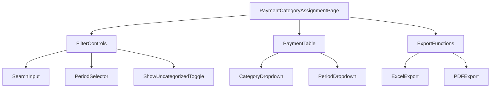
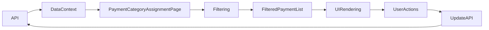

# Payment Category Assignment Screen Design Document

## 1. Overview

The Payment Category Assignment screen is a crucial component of the SilverCloud financial management system that allows users to categorize payment records by assigning appropriate categories and periods. This screen replaces the POS Kontrol Dashboard that was incorrectly implemented in the mockup HTML file.

The screen provides functionality for:
- Viewing payment records filtered by branch and period
- Assigning categories to uncategorized payment records
- Updating period information for payment records
- Filtering and searching payment records
- Exporting data to Excel and PDF formats

## 2. Frontend Architecture

### 2.1 Component Architecture



### 2.2 State Management

The component manages the following state:
- `searchTerm`: Text filter for searching payment records
- `viewedPeriod`: Current period being viewed (YYMM format)
- `showOnlyUncategorized`: Boolean flag to show only uncategorized records
- `availablePeriods`: List of periods with payment data

### 2.3 Data Flow



## 3. Component Specification

### 3.1 PaymentCategoryAssignmentPage

**Props**: None (uses context hooks)

**Key Functions**:
- `handleKategoriChange`: Updates the category of a payment record
- `handleDonemChange`: Updates the period of a payment record
- `handleExportToExcel`: Exports filtered data to Excel format
- `handleGeneratePdf`: Generates PDF report of the current view

**UI Elements**:
1. **Filter Controls Section**
   - Search input field
   - Period selector dropdown
   - "Show only uncategorized" checkbox

2. **Payment Table**
   - Columns: TIP, HESAP ADI, TARİH, AÇIKLAMA, TUTAR, KATEGORİ, DÖNEM
   - Category dropdown for each row
   - Period dropdown for each row

3. **Action Buttons**
   - PDF export button
   - Excel export button

### 3.2 Filter Controls

**Components**:
- Search input with placeholder "Tip, hesap adı, açıklama, tutar..."
- Period selector with available periods
- Toggle switch for showing only uncategorized records

### 3.3 Payment Table

**Columns**:
| Column | Description | Data Type |
|--------|-------------|-----------|
| TIP | Payment type | String |
| HESAP ADI | Account name | String |
| TARİH | Payment date | Date |
| AÇIKLAMA | Payment description | String |
| TUTAR | Payment amount | Decimal |
| KATEGORİ | Category assignment dropdown | Select |
| DÖNEM | Period assignment dropdown | Select |

## 4. Backend API Integration

### 4.1 Endpoints Used

1. **GET /odeme/**
   - Retrieves all payment records
   - Used to populate the payment list

2. **PUT /odeme/{odeme_id}**
   - Updates a specific payment record
   - Used when changing category or period

3. **GET /kategori/**
   - Retrieves all categories
   - Used to populate category dropdown options

4. **GET /ust-kategori/**
   - Retrieves all parent categories
   - Used to filter payment-related categories

### 4.2 Data Models

#### 4.2.1 Payment (Odeme)
```typescript
interface Odeme {
  Odeme_ID: number;
  Tip: string;
  Hesap_Adi: string;
  Tarih: string; // DATE (YYYY-MM-DD)
  Aciklama: string;
  Tutar: number; // DECIMAL(15,2)
  Kategori_ID: number | null;
  Donem: number | null;
  Sube_ID: number;
  Kayit_Tarihi: string; // TIMESTAMP
}
```

#### 4.2.2 Category (Kategori)
```typescript
type KategoriTip = 'Gelir' | 'Gider' | 'Bilgi' | 'Ödeme' | 'Giden Fatura';

interface Kategori {
  Kategori_ID: number;
  Kategori_Adi: string;
  Ust_Kategori_ID: number;
  Tip: KategoriTip;
  Aktif_Pasif: boolean;
  Gizli: boolean;
}
```

#### 4.2.3 Parent Category (UstKategori)
```typescript
interface UstKategori {
  UstKategori_ID: number;
  UstKategori_Adi: string;
  Aktif_Pasif: boolean;
}
```

## 5. Business Logic

### 5.1 Category Filtering

The system filters categories to show only those belonging to specific parent categories:
- "Ödeme Sistemleri" (Payment Systems)
- "Bilgi" (Information)

Categories are sorted alphabetically using Turkish locale settings.

### 5.2 Period Management

- Available periods are dynamically calculated based on existing payment data
- Users can navigate between periods using previous/next controls
- Default period is set to the current application period

### 5.3 Data Filtering

Payment records are filtered based on:
1. Selected branch (from context)
2. Viewed period
3. Search term (applied to tip, account name, description, and amount)
4. Category filter (show all or only uncategorized records)

## 6. UI/UX Design

### 6.1 Layout

The screen follows a standard layout with:
- Header showing branch and period information
- Filter controls in a 4-column responsive grid
- Main content area with payment table
- Action buttons for export functionality

### 6.2 Responsive Design

The layout adapts to different screen sizes:
- Desktop: 4-column filter grid
- Tablet: 2-column filter grid
- Mobile: 1-column filter grid

### 6.3 Visual Design

- Clean, professional interface with consistent spacing
- Color-coded category dropdowns
- Clear visual hierarchy with appropriate typography
- Intuitive form controls with proper labeling
- Responsive feedback for user actions

## 7. Export Functionality

### 7.1 Excel Export

Exports the filtered payment data to Excel with the following columns:
- TIP
- HESAP ADI
- TARİH
- AÇIKLAMA
- TUTAR (formatted as number)
- KATEGORİ
- DÖNEM

### 7.2 PDF Export

Generates a PDF report of the current view using the pdfGenerator utility.

## 8. Security & Permissions

### 8.1 Required Permissions

- `Ödeme Kategori Atama Ekranı Görüntüleme`: Required to access the screen
- `Yazdırma Yetkisi`: Required to export PDF
- `Excel'e Aktar Yetkisi`: Required to export Excel

### 8.2 Data Access Controls

- Users can only view and modify payment records for their selected branch
- Category assignments are restricted to active categories only
- Inactive parent categories are excluded from the category list

## 9. Error Handling

### 9.1 Validation

- Required fields are clearly marked
- Input validation for period format (YYMM)
- Dropdown options are filtered to show only valid choices

### 9.2 Error States

- Connection errors are displayed with retry option
- Data loading states show appropriate spinners
- Empty states provide clear messaging

## 10. Performance Considerations

### 10.1 Data Optimization

- Payment records are filtered on the client side for better responsiveness
- Category lists are memoized to prevent unnecessary re-renders
- Period calculations are optimized with useMemo hooks

### 10.2 Rendering Optimization

- Virtualized lists for large datasets
- Efficient filtering algorithms
- Proper component memoization