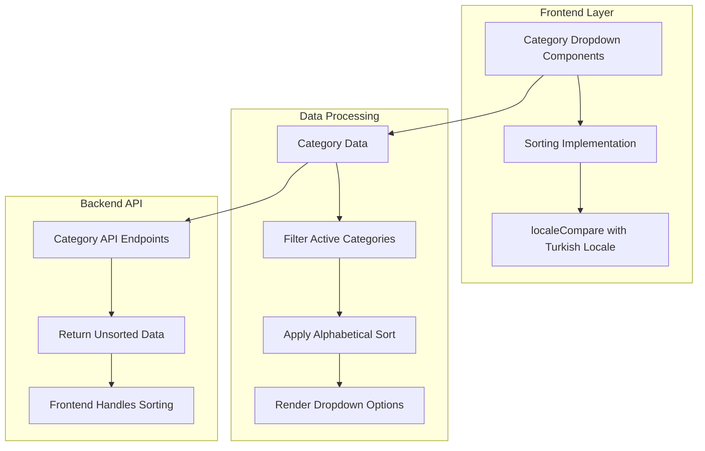
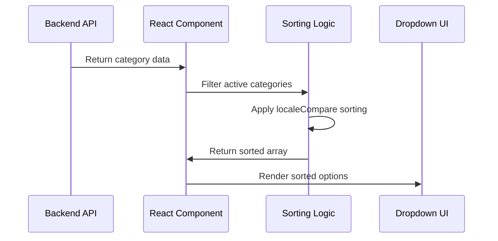

# Category Dropdown Sorting Implementation Design

## Overview

This design document outlines the implementation of consistent alphabetical sorting for all category (kategori) dropdown menus across the SilverCloud application. The goal is to ensure all category data is presented in a standardized, user-friendly sorted order throughout the system.

## Architecture

### Current State Analysis

The SilverCloud system currently has inconsistent sorting implementation across category dropdowns:

**Areas with Proper Sorting:**
- Category Form (KategoriForm) - UstKategori dropdown
- E-Fatura Reference Form - Category dropdown  
- B2B Reference Form - Category dropdown
- Payment Category Assignment - paymentKategoriler dropdown
- E-Fatura Category Assignment - activeKategoriler dropdown
- Other Expenses Category Assignment - giderKategoriler dropdown
- Category Management Page - filter dropdowns

**Areas Requiring Sorting Implementation:**
- OdemeRapor component - availableKategoriler array
- Any dynamically loaded category dropdowns without explicit sorting

### System Architecture



## Component Architecture

### Sorting Pattern Implementation

All category dropdowns follow this standardized sorting pattern:

```typescript
const sortedKategoriler = useMemo(() => {
  return kategoriler
    .filter(k => k.Aktif_Pasif) // Filter active categories
    .sort((a, b) => a.Kategori_Adi.localeCompare(b.Kategori_Adi, 'tr', { 
      sensitivity: 'base' 
    }));
}, [kategoriler]);
```

### Component-Specific Implementations

#### 1. OdemeRapor Component Enhancement

**Current Implementation:**
- Fetches categories via API without sorting
- Creates kategoriOptions for MultiSelect without alphabetical order

**Required Changes:**
- Apply sorting after fetching availableKategoriler
- Maintain consistent sort order in kategoriOptions generation

#### 2. Standard Category Dropdown Pattern

**Consistent Implementation Structure:**
1. **Data Filtering**: Remove inactive categories (`Aktif_Pasif === false`)
2. **Locale-Aware Sorting**: Use Turkish locale with base sensitivity
3. **Memoization**: Implement useMemo for performance optimization
4. **Option Generation**: Create sorted dropdown options

## Data Flow

### Category Data Processing Pipeline



## Technical Implementation

### Sorting Configuration

**Locale Settings:**
- **Locale**: 'tr' (Turkish)
- **Sensitivity**: 'base' (case-insensitive, accent-insensitive)
- **Method**: String.prototype.localeCompare()

**Performance Considerations:**
- Use React.useMemo() to prevent unnecessary re-sorting
- Dependency arrays include only relevant data sources
- Sort operations occur client-side to reduce server load

### Implementation Requirements

1. **Consistency**: All category dropdowns must use identical sorting logic
2. **Performance**: Sorting should be memoized to prevent re-computation
3. **Localization**: Turkish-specific sorting rules must be applied
4. **Accessibility**: Sorted order improves user experience and findability

### Code Standards

**Required Sorting Function:**
```typescript
const sortKategoriler = (kategoriler: Kategori[]) => {
  return kategoriler.sort((a, b) => 
    a.Kategori_Adi.localeCompare(b.Kategori_Adi, 'tr', { 
      sensitivity: 'base' 
    })
  );
};
```

**Implementation Pattern:**
```typescript
const sortedActiveKategoriler = useMemo(() => {
  return kategoriler
    .filter(k => k.Aktif_Pasif)
    .sort((a, b) => a.Kategori_Adi.localeCompare(b.Kategori_Adi, 'tr', { 
      sensitivity: 'base' 
    }));
}, [kategoriler]);
```

## Validation and Testing

### Testing Requirements

1. **Unit Tests**: Verify sorting logic with Turkish characters (ç, ğ, ı, ö, ş, ü)
2. **Integration Tests**: Ensure consistent sorting across all dropdown components
3. **User Acceptance Tests**: Validate improved user experience with sorted categories

### Quality Assurance

**Verification Checklist:**
- [ ] All category dropdowns display options in alphabetical order
- [ ] Turkish characters sort correctly according to Turkish collation rules
- [ ] Performance remains optimal with memoized sorting
- [ ] Inactive categories are properly excluded from sorted lists
- [ ] Sort order is maintained during component re-renders

## Business Rules

### Category Display Rules

1. **Active Categories Only**: Only categories with `Aktif_Pasif = true` appear in dropdowns
2. **Alphabetical Order**: All category names sorted using Turkish locale
3. **Consistent UX**: Same sorting behavior across all application modules
4. **Performance**: Sorting implemented client-side with memoization

### User Experience Requirements

- **Findability**: Users can quickly locate categories in alphabetical order
- **Consistency**: Identical sorting behavior throughout the application
- **Accessibility**: Predictable dropdown order improves accessibility
- **Efficiency**: Reduced cognitive load when selecting categories