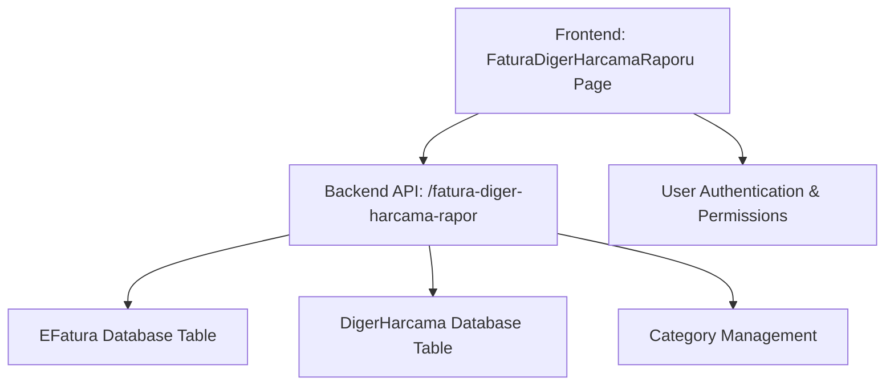
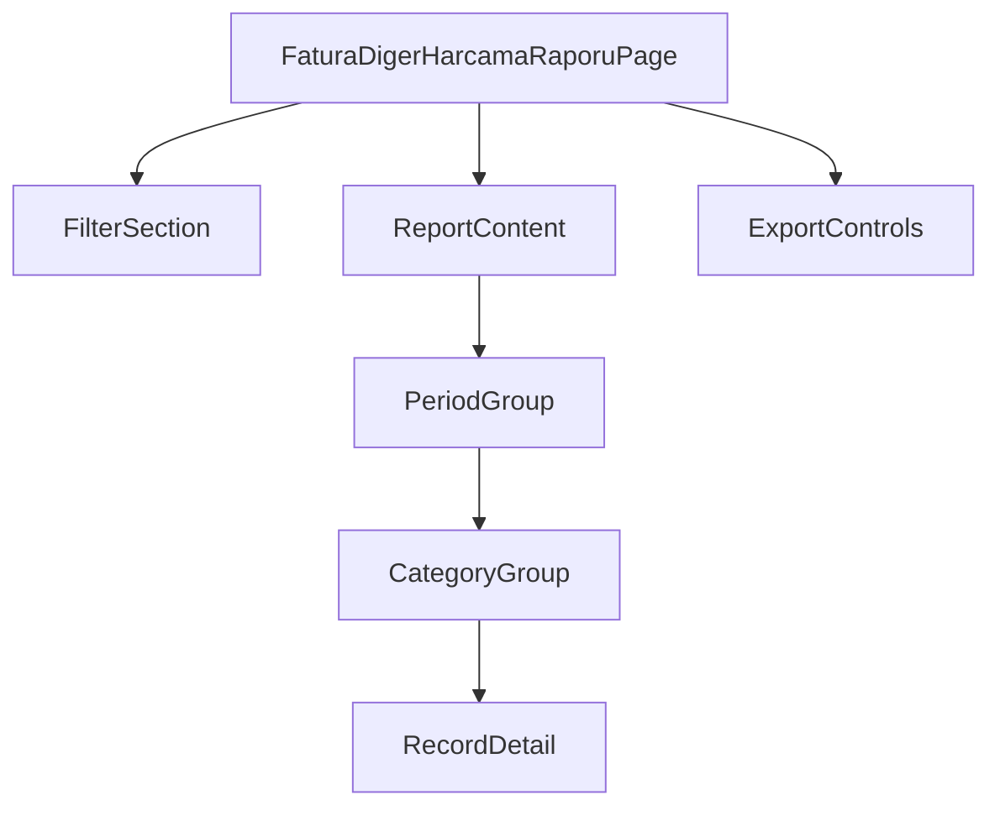

# Fatura & Diğer Harcama Raporu Design Document

## 1. Overview

This document outlines the design for a new report feature called "Fatura & Diğer Harcama Raporu" which combines the existing "Fatura Raporu" with records from the "Diger_Harcama" table. The new report will display both e-Fatura records and other expense records in the same format and grouping structure, with appropriate tagging to distinguish between the two types of records.

### 1.1 Purpose
- Create a unified report that displays both e-Fatura and DigerHarcama records
- Maintain the same UI structure and functionality as the existing Fatura Raporu
- Tag records appropriately: "Gelen Fatura", "Giden Fatura" for invoices and "Diğer Harcama" for expense records

### 1.2 Scope
- Backend: New API endpoint to fetch combined data
- Frontend: New page component based on existing FaturaRaporu.tsx
- Database: No schema changes required, utilizing existing tables

## 2. Architecture

### 2.1 System Context
The SilverCloud system is a comprehensive web-based application with a React frontend and Python/FastAPI backend. The new report will integrate with the existing reporting module and follow the same architectural patterns as other reports in the system.

### 2.2 Component Interaction


## 3. API Endpoints Reference

### 3.1 New Endpoint: GET /fatura-diger-harcama-rapor
Fetches combined report data for both e-Fatura and DigerHarcama records

#### Request Parameters
| Parameter | Type | Required | Description |
|-----------|------|----------|-------------|
| donem | array of integers | Optional | List of periods (e.g., [2508, 2509]) |
| kategori | array of integers | Optional | List of category IDs |
| sube_id | integer | Required | Branch ID filter |

#### Response Schema
```json
{
  "data": [
    {
      "donem": 2508,
      "donem_total": 15000.00,
      "record_count": 45,
      "kategoriler": [
        {
          "kategori_id": 10,
          "kategori_adi": "Kira Gideri",
          "kategori_total": 5000.00,
          "record_count": 15,
          "kayitlar": [
            {
              "id": 123,
              "tarih": "2025-08-15",
              "belge_numarasi": "INV2025001",
              "karsi_taraf_adi": "Tech Solutions Ltd.",
              "tutar": 1500.75,
              "aciklama": "Ağustos kira ödemesi",
              "etiket": "Gelen Fatura",
              "gunluk_harcama": false,
              "ozel": false
            }
          ]
        }
      ]
    }
  ],
  "totals": {
    "donem_totals": {
      "2508": 15000.00,
      "2509": 12500.00
    },
    "kategori_totals": {
      "Kira Gideri": 5000.00,
      "Elektrik Faturası": 2000.00
    },
    "grand_total": 27500.00
  },
  "filters_applied": {
    "donem": [2508, 2509],
    "kategori": [10, 15],
    "sube_id": 1
  },
  "total_records": 85
}
```

### 3.2 Authentication Requirements
- JWT token required in Authorization header
- User must have "Fatura & Diğer Harcama Raporu Görüntüleme" permission

### 3.3 Implementation Details
The endpoint will be implemented in `backend/api/v1/endpoints/report.py` and will follow the same pattern as existing report endpoints:

```python
@router.get("/fatura-diger-harcama-rapor/", response_model=FaturaDigerHarcamaRaporResponse)
def get_fatura_diger_harcama_rapor(
    donem: Optional[List[int]] = Query(None),
    kategori: Optional[List[int]] = Query(None),
    sube_id: Optional[int] = None,
    db: Session = Depends(get_db)
):
    """
    Fatura & Diğer Harcama Rapor endpoint - combined report with grouping
    
    Args:
        donem: Optional list of periods (e.g., [2508, 2509])
        kategori: Optional list of category IDs
        sube_id: Branch ID filter
        
    Returns:
        FaturaDigerHarcamaRaporResponse: Grouped report data with totals
    """
    logger.info(f"Getting Fatura & Diğer Harcama Rapor for Sube_ID: {sube_id}, Donem: {donem}, Kategori: {kategori}")
    
    try:
        # Validate inputs
        if sube_id and sube_id <= 0:
            raise HTTPException(status_code=400, detail="Invalid sube_id")
        
        # Validate period format if provided
        if donem:
            for d in donem:
                donem_str = str(d)
                if d <= 0 or len(donem_str) not in [4, 6]:
                    raise HTTPException(
                        status_code=400, 
                        detail=f"Invalid donem format. Expected YYMM (4-digit) or YYYYMM (6-digit) format, got: {d}"
                    )
        
        # Get report data using the comprehensive CRUD function
        report_data = crud.get_fatura_diger_harcama_rapor(
            db=db,
            donem_list=donem,
            kategori_list=kategori,
            sube_id=sube_id
        )
        
        logger.info(f"Successfully generated Fatura & Diğer Harcama report with {len(report_data.data)} period groups, {report_data.total_records} total records")
        return report_data
        
    except HTTPException:
        raise
    except Exception as e:
        logger.error(f"Error in get_fatura_diger_harcama_rapor: {e}")
        raise HTTPException(status_code=500, detail=f"Internal server error: {str(e)}")
```

## 4. Data Models & ORM Mapping

### 4.1 Unified Record Model
The report will use a unified data model that combines data from both the `e_fatura` and `diger_harcama` tables:

| Field | Type | Source | Description |
|-------|------|--------|-------------|
| id | integer | Both | Primary key from source table |
| tarih | date | Both | Document date |
| belge_numarasi | string | Both | Document number |
| karsi_taraf_adi | string | Both | Counterparty name |
| tutar | decimal | Both | Amount |
| aciklama | string (optional) | Both | Description |
| etiket | string | Both | "Gelen Fatura", "Giden Fatura", or "Diğer Harcama" |
| gunluk_harcama | boolean (optional) | e_fatura only | Daily expense flag |
| ozel | boolean (optional) | e_fatura only | Special/private flag |

### 4.2 Database Queries
The backend will execute two separate queries and combine the results:

1. EFatura query:
```sql
SELECT 
    Fatura_ID as id,
    Fatura_Tarihi as tarih,
    Fatura_Numarasi as belge_numarasi,
    Alici_Unvani as karsi_taraf_adi,
    Tutar as tutar,
    Aciklama as aciklama,
    CASE 
        WHEN Giden_Fatura = 1 THEN 'Giden Fatura'
        ELSE 'Gelen Fatura'
    END as etiket,
    Gunluk_Harcama as gunluk_harcama,
    Ozel as ozel
FROM e_fatura
WHERE Sube_ID = :sube_id
AND (:donem_list IS NULL OR Donem IN :donem_list)
AND (:kategori_list IS NULL OR Kategori_ID IN :kategori_list)
```

2. DigerHarcama query:
```sql
SELECT 
    Harcama_ID as id,
    Belge_Tarihi as tarih,
    Belge_Numarasi as belge_numarasi,
    Alici_Adi as karsi_taraf_adi,
    Tutar as tutar,
    Açıklama as aciklama,
    'Diğer Harcama' as etiket,
    Gunluk_Harcama as gunluk_harcama,
    NULL as ozel
FROM diger_harcama
WHERE Sube_ID = :sube_id
AND (:donem_list IS NULL OR Donem IN :donem_list)
AND (:kategori_list IS NULL OR Kategori_ID IN :kategori_list)
```

### 4.3 CRUD Function Implementation
A new CRUD function will be implemented in `backend/db/crud.py`:

```python
def get_fatura_diger_harcama_rapor(
    db: Session, 
    donem_list: Optional[List[int]] = None,
    kategori_list: Optional[List[int]] = None,
    sube_id: Optional[int] = None
) -> FaturaDigerHarcamaRaporResponse:
    """
    Get combined report data for both EFatura and DigerHarcama records
    """
    # Get EFatura records
    efatura_records = get_efatura_for_report(
        db=db,
        donem_list=donem_list,
        kategori_list=kategori_list,
        sube_id=sube_id
    )
    
    # Get DigerHarcama records
    diger_harcama_records = get_diger_harcama_for_report(
        db=db,
        donem_list=donem_list,
        kategori_list=kategori_list,
        sube_id=sube_id
    )
    
    # Combine and process records
    all_records = efatura_records + diger_harcama_records
    
    # Group by period and category
    grouped_data = group_records_by_period_and_category(all_records)
    
    # Calculate totals
    totals = calculate_report_totals(grouped_data)
    
    # Create response
    return FaturaDigerHarcamaRaporResponse(
        data=grouped_data,
        totals=totals,
        filters_applied=FaturaRaporRequest(
            donem=donem_list,
            kategori=kategori_list,
            sube_id=sube_id
        ),
        total_records=len(all_records)
    )
```

## 5. Business Logic Layer

### 5.1 Data Aggregation
The backend service will:
1. Fetch data from both e_fatura and diger_harcama tables
2. Combine and sort the records by period and category
3. Calculate totals at period, category, and grand total levels
4. Apply filtering based on user selections

### 5.2 Record Tagging Logic
- Records from `e_fatura` table:
  - If `Giden_Fatura` = 1 → Tag as "Giden Fatura"
  - If `Giden_Fatura` = 0 → Tag as "Gelen Fatura"
- Records from `diger_harcama` table → Tag as "Diğer Harcama"

### 5.3 Grouping Logic
1. Group by period (Donem)
2. Within each period, group by category (Kategori_ID)
3. Within each category, list individual records

### 5.4 Data Processing Functions
The following helper functions will be implemented in the CRUD layer:

```python
def group_records_by_period_and_category(records: List[KayitDetail]) -> List[DonemGroup]:
    """Group records by period and category"""
    # Implementation will group records by Donem and then by Kategori_ID
    # Return structured data according to DonemGroup and KategoriGroup models
    pass

def calculate_report_totals(grouped_data: List[DonemGroup]) -> FaturaDigerHarcamaRaporTotals:
    """Calculate report totals at different levels"""
    # Calculate:
    # 1. Period totals (donem_totals)
    # 2. Category totals (kategori_totals)
    # 3. Grand total (grand_total)
    pass

def get_efatura_for_report(
    db: Session,
    donem_list: Optional[List[int]] = None,
    kategori_list: Optional[List[int]] = None,
    sube_id: Optional[int] = None
) -> List[KayitDetail]:
    """Get EFatura records formatted for the combined report"""
    # Query e_fatura table with appropriate filters
    # Transform records to KayitDetail format
    # Apply "Gelen Fatura" or "Giden Fatura" tagging
    pass

def get_diger_harcama_for_report(
    db: Session,
    donem_list: Optional[List[int]] = None,
    kategori_list: Optional[List[int]] = None,
    sube_id: Optional[int] = None
) -> List[KayitDetail]:
    """Get DigerHarcama records formatted for the combined report"""
    # Query diger_harcama table with appropriate filters
    # Transform records to KayitDetail format
    # Apply "Diğer Harcama" tagging
    pass
```

## 6. Frontend Component Architecture

### 6.1 Component Definition
The frontend will be based on the existing `FaturaRaporu.tsx` component with modifications to handle the combined data structure. The component will be located at `CopyCat/pages/FaturaDigerHarcamaRaporu.tsx`.

### 6.2 Component Hierarchy


### 6.3 Props/State Management
```typescript
interface FaturaDigerHarcamaRaporProps {
  // State
  reportData: FaturaDigerHarcamaRaporResponse | null;
  loading: boolean;
  error: string | null;
  selectedDonemler: number[];
  selectedKategoriler: number[];
  expandedDonemler: Set<number>;
  expandedKategoriler: Set<string>;
  
  // Functions
  fetchReportData: () => void;
  toggleDonem: (donem: number) => void;
  toggleKategori: (donem: number, kategoriId: number | null) => void;
}
```

### 6.4 Key Features
1. Multi-select filters for periods and categories
2. Expandable/collapsible period and category groups
3. Record tagging with appropriate labels ("Gelen Fatura", "Giden Fatura", "Diğer Harcama")
4. PDF and Excel export functionality
5. Permission-based access control

### 6.5 Component Implementation Details
The component will follow the same structure as the existing FaturaRaporu.tsx but with modifications to handle the combined data model:

```typescript
// Main component
export const FaturaDigerHarcamaRaporuPage: React.FC = () => {
    const { selectedBranch, currentPeriod, hasPermission } = useAppContext();
    
    // Permission check
    const hasAccess = hasPermission(FATURA_DIGER_HARCAMA_RAPOR_YETKI_ADI);
    
    // State
    const [reportData, setReportData] = useState<FaturaDigerHarcamaRaporResponse | null>(null);
    const [loading, setLoading] = useState<boolean>(false);
    const [error, setError] = useState<string | null>(null);
    
    // Filter states
    const [selectedDonemler, setSelectedDonemler] = useState<number[]>([]);
    const [selectedKategoriler, setSelectedKategoriler] = useState<number[]>([]);
    const [availableKategoriler, setAvailableKategoriler] = useState<Kategori[]>([]);
    
    // Expanded state for groups
    const [expandedDonemler, setExpandedDonemler] = useState<Set<number>>(new Set());
    const [expandedKategoriler, setExpandedKategoriler] = useState<Set<string>>(new Set());
    
    // Fetch report data
    const fetchReportData = async () => {
        if (!selectedBranch) return;

        setLoading(true);
        setError(null);

        try {
            const params = new URLSearchParams();
            
            // Add period filters
            selectedDonemler.forEach(donem => {
                params.append('donem', donem.toString());
            });
            
            // Add category filters
            selectedKategoriler.forEach(kategori => {
                params.append('kategori', kategori.toString());
            });
            
            // Add branch filter
            params.append('sube_id', selectedBranch.Sube_ID.toString());

            const url = `${API_BASE_URL}/fatura-diger-harcama-rapor/?${params.toString()`;
            const response = await fetch(url);
            
            if (response.ok) {
                const data = await response.json();
                setReportData(data);
            } else {
                const errorText = await response.text();
                setError(`Veri alınırken hata oluştu: ${response.status} - ${errorText}`);
            }
        } catch (error) {
            setError(`Bağlantı hatası: ${error instanceof Error ? error.message : 'Bilinmeyen hata'}`);
        }

        setLoading(false);
    };
    
    // ... rest of component implementation
};
```

## 7. State Management

### 7.1 Context API Usage
The component will use the existing AppContext for:
- Branch selection
- Current period
- User permissions

### 7.2 Local State
- Report data and loading states
- Filter selections
- Expanded/collapsed groups

## 8. API Integration Layer

### 8.1 Data Fetching
```typescript
const fetchReportData = async () => {
  if (!selectedBranch) return;

  setLoading(true);
  setError(null);

  try {
    const params = new URLSearchParams();
    
    // Add period filters
    selectedDonemler.forEach(donem => {
      params.append('donem', donem.toString());
    });
    
    // Add category filters
    selectedKategoriler.forEach(kategori => {
      params.append('kategori', kategori.toString());
    });
    
    // Add branch filter
    params.append('sube_id', selectedBranch.Sube_ID.toString());

    const url = `${API_BASE_URL}/fatura-diger-harcama-rapor/?${params.toString()}`;
    const response = await fetch(url);
    
    if (response.ok) {
      const data = await response.json();
      setReportData(data);
    } else {
      const errorText = await response.text();
      setError(`Veri alınırken hata oluştu: ${response.status} - ${errorText}`);
    }
  } catch (error) {
    setError(`Bağlantı hatası: ${error instanceof Error ? error.message : 'Bilinmeyen hata'}`);
  }

  setLoading(false);
};
```

## 9. Menu Integration

The new report will be added to the "Rapor" section of the menu structure. The following changes will be made:

1. Add a new permission constant in `CopyCat/constants.tsx`:
```typescript
export const FATURA_DIGER_HARCAMA_RAPOR_YETKI_ADI = 'Fatura & Diğer Harcama Raporu Görüntüleme';
```

2. Add the menu item to the "Rapor" section in `CopyCat/constants.tsx`:
```typescript
{
    title: 'Rapor',
    items: [
        { label: 'Nakit Yatırma Kontrol Raporu', path: '/nakit-yatirma-raporu', icon: Icons.Report, permission: NAKIT_YATIRMA_RAPORU_YETKI_ADI },
        { label: 'Ödeme Rapor', path: '/odeme-rapor', icon: Icons.Report, permission: ODEME_RAPOR_YETKI_ADI },
        { label: 'Fatura Rapor', path: '/fatura-rapor', icon: Icons.Report, permission: FATURA_RAPOR_YETKI_ADI },
        { label: 'Fatura & Diğer Harcama Raporu', path: '/fatura-diger-harcama-raporu', icon: Icons.Report, permission: FATURA_DIGER_HARCAMA_RAPOR_YETKI_ADI },
    ]
}
```

3. Add route definition in `CopyCat/pages.tsx`:
```typescript
{ path: '/fatura-diger-harcama-raporu', element: <FaturaDigerHarcamaRaporuPage /> },
```

## 10. Testing Strategy

### 10.1 Unit Tests
1. Test data aggregation logic
2. Test record tagging functionality
3. Test grouping and sorting algorithms
4. Test edge cases (empty data, missing categories, etc.)

### 10.2 Integration Tests
1. Test API endpoint with various filter combinations
2. Test permission-based access control
3. Test data consistency between frontend and backend

### 10.3 UI Tests
1. Test filter functionality
2. Test expand/collapse behavior
3. Test export functionality (PDF, Excel)
4. Test responsive design