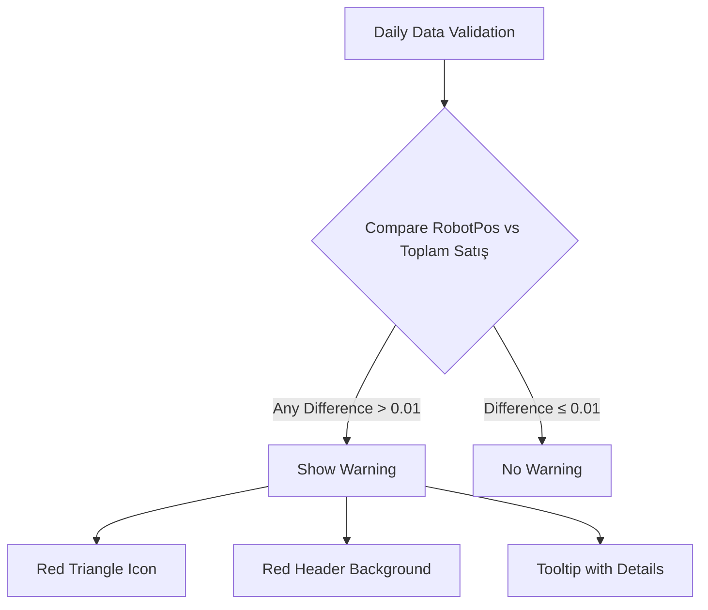
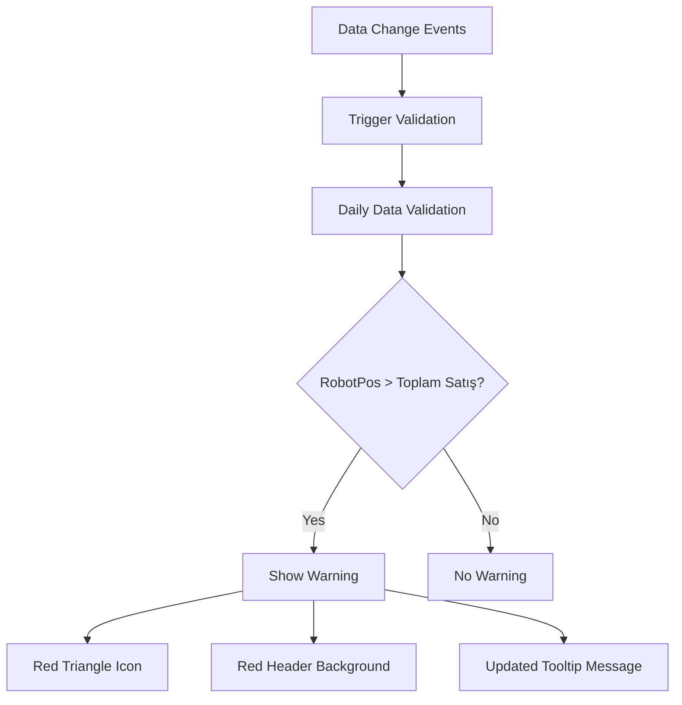
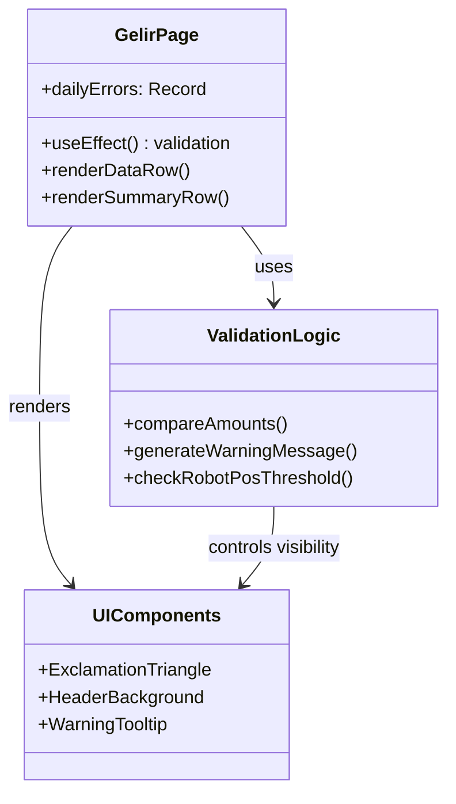
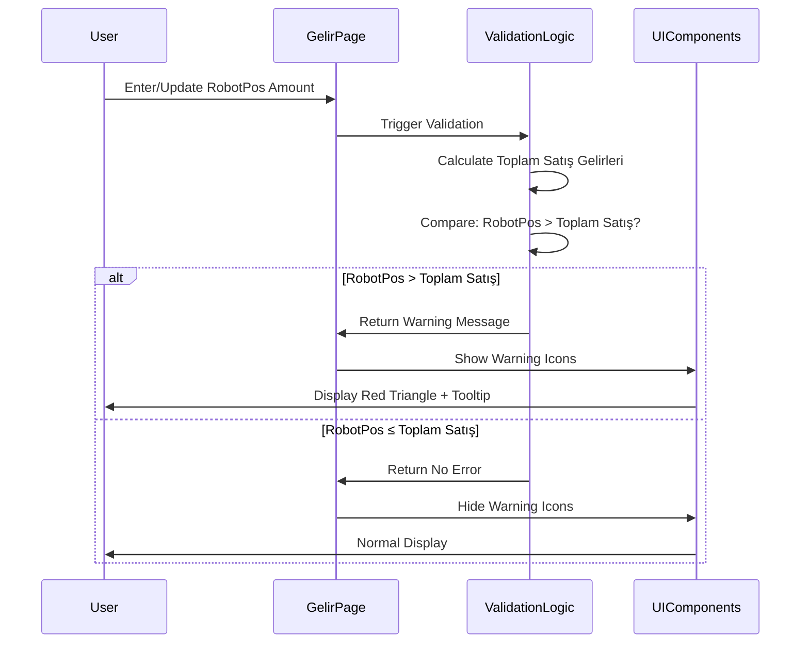
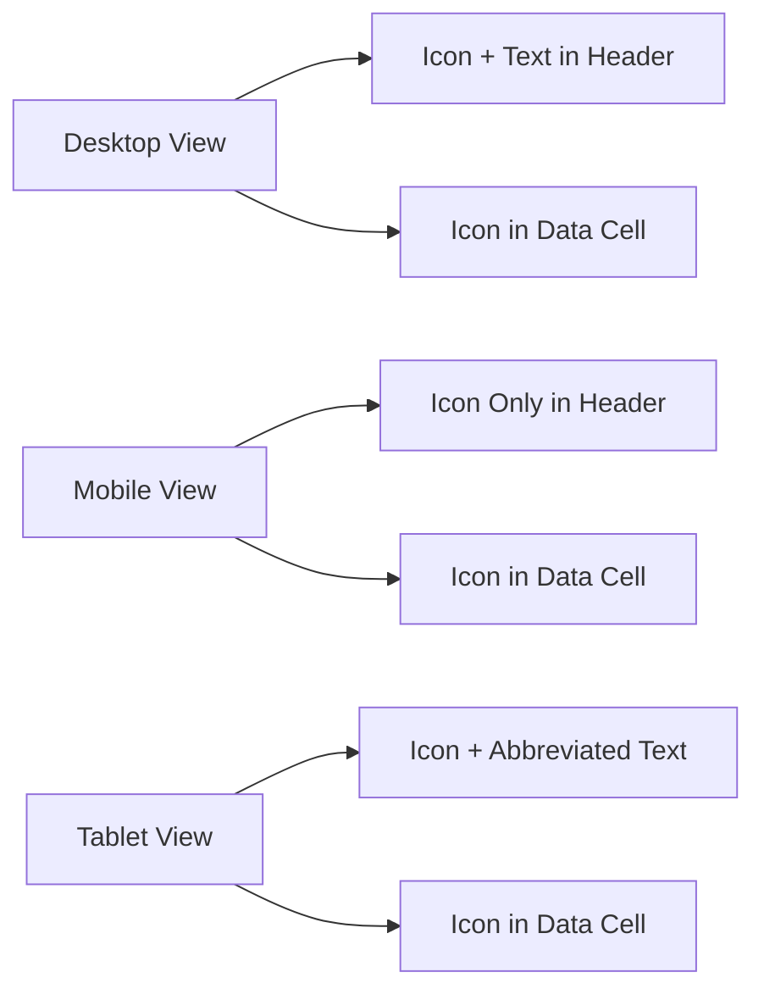

# Warning Sign Display Enhancement - Gelir Girişi Screen

## Overview

This design document outlines the enhancement of the warning sign display functionality on the Gelir Girişi (Income Entry) screen. The current warning system shows alerts when RobotPos Tutar and Toplam Satış Gelirleri amounts do not match exactly. This enhancement modifies the validation logic to display warnings specifically when RobotPos Tutar is greater than Toplam Satış Gelirleri, providing more targeted financial control alerts.

**Key Changes:**
- Modify validation logic from "not equal" to "greater than" comparison
- Maintain existing warning display components (exclamation triangle icons)
- Update warning message text to reflect the new validation rule
- Preserve existing UI/UX patterns for consistency

## Architecture

### Current Warning System

The existing warning system implements a comprehensive validation framework:



### Enhanced Warning System

The new validation logic implements targeted financial oversight:



### Component Architecture

The warning system integrates with multiple UI components:



## Business Logic Enhancement

### Current Validation Logic

```javascript
// Current implementation - shows warning for ANY difference
if (Math.abs(robotPosTutar - toplamSatisGelirleri) > 0.01) {
    newErrors[dateString] = `Uyuşmazlık: RobotPos (${formatNumberForDisplay(robotPosTutar,2)}) ≠ Toplam Satış (${formatNumberForDisplay(toplamSatisGelirleri,2)})`;
}
```

### Enhanced Validation Logic

```javascript
// Enhanced implementation - shows warning only when RobotPos > Toplam Satış
if (robotPosTutar > toplamSatisGelirleri && (robotPosTutar - toplamSatisGelirleri) > 0.01) {
    newErrors[dateString] = `Uyarı: RobotPos (${formatNumberForDisplay(robotPosTutar,2)}) > Toplam Satış (${formatNumberForDisplay(toplamSatisGelirleri,2)})`;
}
```

### Validation Rules

| Scenario | RobotPos | Toplam Satış | Warning Display | Message |
|----------|----------|--------------|-----------------|---------|
| Normal Case | 1000.00 | 1000.00 | ❌ No Warning | - |
| Acceptable Variance | 1000.00 | 999.99 | ❌ No Warning | - |
| **New Warning Case** | 1000.00 | 900.00 | ✅ Warning | "Uyarı: RobotPos (₺1,000.00) > Toplam Satış (₺900.00)" |
| Reverse Case | 900.00 | 1000.00 | ❌ No Warning | - |

### Data Flow Enhancement



## UI/UX Design Specifications

### Visual Warning Indicators

The warning system maintains existing visual patterns for consistency:

#### 1. Day Column Header Warning
- **Background Color**: `bg-red-200` (existing)
- **Icon**: Red exclamation triangle (`Icons.ExclamationTriangle`)
- **Position**: Next to day number in header
- **Tooltip**: Enhanced warning message

#### 2. RobotPos Tutar Row Warning
- **Row Background**: `bg-blue-100` (maintained)
- **Cell Warning Icon**: Red exclamation triangle in input field
- **Icon Position**: Right side of input field with `ml-1` margin
- **Icon Size**: `w-4 h-4`

#### 3. Tooltip Enhancement
- **Previous Message**: "Uyuşmazlık: RobotPos (₺X) ≠ Toplam Satış (₺Y)"
- **New Message**: "Uyarı: RobotPos (₺X) > Toplam Satış (₺Y)"
- **Styling**: Maintains existing tooltip styling

### Responsive Design Considerations



## Technical Implementation

### Validation Function Enhancement

```typescript
interface ValidationConfig {
  tolerance: number; // 0.01 for floating point precision
  comparisonType: 'greater_than' | 'not_equal';
  warningPrefix: string;
}

const validateDailyAmounts = (
  robotPosTutar: number,
  toplamSatisGelirleri: number,
  config: ValidationConfig
): string | null => {
  const difference = robotPosTutar - toplamSatisGelirleri;
  
  if (difference > config.tolerance) {
    return `${config.warningPrefix}: RobotPos (${formatNumberForDisplay(robotPosTutar, 2)}) > Toplam Satış (${formatNumberForDisplay(toplamSatisGelirleri, 2)})`;
  }
  
  return null;
};
```

### React useEffect Enhancement

```typescript
useEffect(() => {
  if (!selectedBranch) {
    setDailyErrors({});
    return;
  }

  const newErrors: Record<string, string | null> = {};
  const allGelirKategoriler = kategoriList.filter(
    k => k.Tip === 'Gelir' && k.Aktif_Pasif && (canViewGizliKategoriler || !k.Gizli)
  );

  daysInViewedMonth.forEach(({ dateString }) => {
    const robotPosTutar = getGelirEkstraEntry(dateString, selectedBranch.Sube_ID)?.RobotPos_Tutar || 0;
    
    const toplamSatisGelirleri = allGelirKategoriler.reduce((sum, cat) => {
      return sum + (getGelirEntry(cat.Kategori_ID, dateString, selectedBranch.Sube_ID)?.Tutar || 0);
    }, 0);

    // ENHANCED VALIDATION: Only warn when RobotPos > Toplam Satış
    if (robotPosTutar > toplamSatisGelirleri && (robotPosTutar - toplamSatisGelirleri) > 0.01) {
      newErrors[dateString] = `Uyarı: RobotPos (${formatNumberForDisplay(robotPosTutar, 2)}) > Toplam Satış (${formatNumberForDisplay(toplamSatisGelirleri, 2)})`;
    } else {
      newErrors[dateString] = null;
    }
  });

  setDailyErrors(newErrors);
}, [
  gelirList,
  gelirEkstraList,
  daysInViewedMonth,
  selectedBranch,
  kategoriList,
  canViewGizliKategoriler,
  getGelirEkstraEntry,
  getGelirEntry
]);
```

### Component Integration

The enhanced validation integrates seamlessly with existing components:

```typescript
// renderDataRow function (no changes needed)
const renderDataRow = (
  key: string,
  label: string,
  dataGetter: (dateString: string) => number | undefined,
  onDataChange: (dateString: string, value: number | undefined) => void,
  rowStyle: string,
  showErrorIcon: boolean = false
) => {
  // Implementation remains the same
  // Warning logic is controlled by dailyErrors state
};
```

## Business Impact

### Financial Control Enhancement

The modified validation provides more targeted financial oversight:

**Before Enhancement:**
- Warned about any discrepancy between RobotPos and Toplam Satış
- Could generate false positives when Toplam Satış > RobotPos
- Required manual verification of all warnings

**After Enhancement:**
- Warns specifically when RobotPos exceeds Toplam Satış
- Focuses attention on potential over-reporting scenarios
- Reduces noise from acceptable variances

### Use Cases

1. **Revenue Reconciliation**: Quickly identify days when POS system reports higher sales than recorded income categories
2. **Data Quality Control**: Detect potential data entry errors or missing income categories
3. **Audit Trail**: Provide clear visual indicators for financial discrepancies requiring investigation

## Testing Strategy

### Unit Testing Requirements

```typescript
describe('Warning Sign Display Enhancement', () => {
  test('should show warning when RobotPos > Toplam Satış', () => {
    const robotPos = 1000.00;
    const toplamSatis = 900.00;
    const result = validateDailyAmounts(robotPos, toplamSatis, config);
    expect(result).toContain('Uyarı');
  });

  test('should not show warning when RobotPos <= Toplam Satış', () => {
    const robotPos = 900.00;
    const toplamSatis = 1000.00;
    const result = validateDailyAmounts(robotPos, toplamSatis, config);
    expect(result).toBeNull();
  });

  test('should handle floating point precision', () => {
    const robotPos = 1000.01;
    const toplamSatis = 1000.00;
    const result = validateDailyAmounts(robotPos, toplamSatis, config);
    expect(result).toContain('Uyarı');
  });
});
```

### Integration Testing

- Verify warning display in table headers
- Test warning icons in RobotPos Tutar row
- Validate tooltip functionality
- Confirm responsive behavior across devices

### User Acceptance Testing

- Financial users validate warning logic matches business requirements
- Test various scenarios with different amount combinations
- Verify warning messages are clear and actionable

## Migration and Deployment

### Implementation Steps

1. **Code Changes**: Update validation logic in GelirPage component
2. **Message Updates**: Modify warning text to reflect new logic
3. **Testing**: Execute comprehensive test suite
4. **User Training**: Brief financial users on new warning behavior
5. **Deployment**: Deploy during maintenance window with rollback plan

### Backward Compatibility

- No database schema changes required
- Existing UI components remain unchanged
- Warning display patterns maintained for consistency
- User permissions and roles unaffected

### Rollback Strategy

- Simple code revert to previous validation logic
- No data migration required
- Immediate rollback capability if issues arise